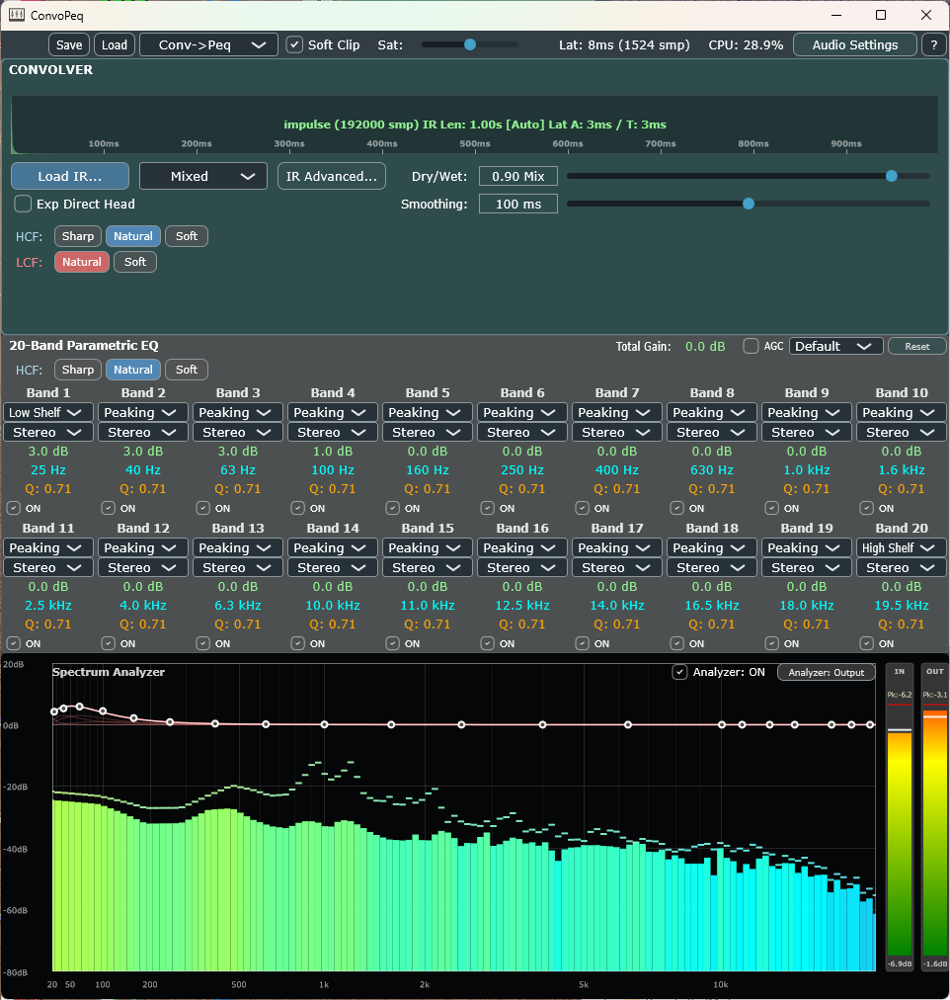

# ConvoPeq

---

## New in v0.5.9

### Main Changes from v0.5.8 to v0.5.9

This section summarizes the main changes between commit 794631b and 37fee3b, focusing on major enhancements and refactoring in Convolver/AudioEngine/EQ/MKL, as well as large-scale EQ/UI improvements.

---

## 1. Major Updates in Convolver/AudioEngine/MKL

- **Significant expansion of ConvolverProcessor (convolution engine):**
  - Integrated Intel oneMKL-based Non-Uniform Partitioned Convolution (NUC) engine for fast, high-precision convolution with large IRs and heavy processing loads.
  - Asynchronous IR (impulse response) loading on the Message Thread, with atomic RCU handoff for seamless, glitch-free operation during background loads.
  - Thread-safe atomic control of numerous parameters: PhaseMode (AsIs/Mixed/Minimum), Dry/Wet Mix, Smoothing, IR length, tail rolloff, and more.
  - Added APIs for parameter change notification (Listener/ChangeBroadcaster), state save/restore, and waveform/spectrum retrieval.
  - Enhanced integration with AudioEngine/EQProcessor (processing order switching, parameter sync).

- **AudioEngine enhancements:**
  - New APIs for managing multiple ConvolverProcessor/EQProcessor instances, bypass/parameter sync, and preset loading.
  - Thorough thread-safe state management using atomics and LockFreeRingBuffer.

- **MKL/AlignedAllocation improvements:**
  - Enforced 64-byte alignment for MKL allocators, strict memory leak prevention, and explicit resource release.

---

## 2. Large-Scale EQ Refactor & UI Enhancements

- **EQProcessor refactor and feature expansion:**
  - 20-band parametric EQ implemented with lock-free (RCU) pattern. All band parameters (frequency, gain, Q, enable/disable) are managed atomically for instant UI-thread updates.
  - Adopted TPT SVF (Topology-Preserving Transform State Variable Filter) for high-quality, low-noise coefficient modulation.
  - Added AGC (auto-gain control), total gain, bypass, state save/restore, and response curve calculation APIs.
  - Band/global change notification via Listener/ChangeBroadcaster.

- **EQControlPanel UI expansion:**
  - Dynamic generation of UI controls (gain, frequency, Q, enable/disable) for all 20 bands, with full two-way sync to AudioEngine/EQProcessor.
  - Enhanced event handling for all labels, sliders, and buttons.

---

## 3. Other

- **Similar UI/DSP control enhancements for ConvolverControlPanel, MKLNonUniformConvolver, etc.**
- **Strict adherence to JUCE 8.0.12 API and design guidelines**
- **Coding standards, documentation updates**
- **Major additions to manuals (Japanese/English)**

---

### Summary

- **Major expansion and refactor for real-time safety, high performance, flexible parameter control, and robust UI integration**
- **Significant acceleration for large IR/high-load processing via Intel MKL**
- **Strict separation of UI/logic, thread safety, and extensibility**
- **Substantial improvements to documentation and manuals**

These changes represent a major evolution in DSP core, UI, and overall design quality during this period.

ConvoPeq is a high-fidelity standalone audio processor for Windows 11 x64, combining IR convolution and a 20-band parametric EQ with a real-time analyzer.

## Overview

ConvoPeq is built with JUCE 8.0.12 and is designed for low-latency, real-time-safe operation on Windows.

- Platform: **Windows-only**
- Framework: **JUCE 8.0.12**
- Precision: **64-bit double** on the main DSP path
- Performance focus: **AVX2 + Intel oneMKL**

---

## Documentation

- [README.md](README.md): User-facing overview, features, audio processing summary, and build entry points
- [ARCHITECTURE.md](ARCHITECTURE.md): Developer-facing architecture, threading, state flow, and subsystem design details
- [SOUND_PROCESSING.md](SOUND_PROCESSING.md): **In-depth, code-referenced technical documentation of the entire audio signal processing flow.**
  - Covers all DSP stages (input, conditioning, oversampling, main DSP chain, output, dither, etc.)
  - Includes mathematical formulas, buffer/parameter management, SIMD/real-time safety, and code path examples
  - Intended for international contributors and advanced users seeking a rigorous technical reference
- [BUILD_GUIDE_WINDOWS.md](BUILD_GUIDE_WINDOWS.md): Windows build instructions and troubleshooting
- [HOW_TO_USE.md](HOW_TO_USE.md): Practical usage guide — room correction via IR convolution with REW, and headphone EQ correction via AutoEq

### Manuals ([manual/](manual/))

**English Manuals:**

- [manual/MAIN_WINDOW_EN.md](manual/MAIN_WINDOW_EN.md): Main window usage (English)
- [manual/AUDIO_SETTINGS_WINDOW_EN.md](manual/AUDIO_SETTINGS_WINDOW_EN.md): Audio settings window (English)
- [manual/IR_ADVANCED_WINDOW_EN.md](manual/IR_ADVANCED_WINDOW_EN.md): IR advanced window (English)
- [manual/ADAPTIVE_NOISE_SHAPER_LEARNING_WINDOW_EN.md](manual/ADAPTIVE_NOISE_SHAPER_LEARNING_WINDOW_EN.md): Adaptive Noise Shaper Learning (English)

**Japanese Manuals (in Japanese):**

- [manual/MAIN_WINDOW_JP.md](manual/MAIN_WINDOW_JP.md): Main window usage (Japanese)
- [manual/AUDIO_SETTINGS_WINDOW_JP.md](manual/AUDIO_SETTINGS_WINDOW_JP.md): Audio settings window (Japanese)
- [manual/IR_ADVANCED_WINDOW_JP.md](manual/IR_ADVANCED_WINDOW_JP.md): IR advanced window (Japanese)
- [manual/ADAPTIVE_NOISE_SHAPER_LEARNING_WINDOW_JP.md](manual/ADAPTIVE_NOISE_SHAPER_LEARNING_WINDOW_JP.md): Adaptive Noise Shaper Learning (Japanese)

---

## Key Features

- 20-band parametric EQ (`EQProcessor`)
- IR convolution with MKL-backed non-uniform partitioning (`ConvolverProcessor`, `MKLNonUniformConvolver`)
- Runtime-selectable processing order (**EQ -> Convolver** or **Convolver -> EQ**)
- Convolver phase modes: **As-Is / Mixed / Minimum** with persisted Mixed tuning (`f1`, `f2`, `tau`)
- IR workflow with **Auto/Manual IR Length** state persistence in manual preset XML
- Input oversampling and output conditioning (`CustomInputOversampler`, `OutputFilter`)
- Optional soft clipping and final dither stage
- Real-time spectrum analyzer with EQ overlay (`SpectrumAnalyzerComponent`)
- ASIO/WASAPI-oriented standalone runtime with device settings persistence

---

## Audio Processing Method

This section is a user-facing summary of the current block processing strategy. For subsystem-level details, see `ARCHITECTURE.md`.

### 1) Quality-Oriented Design Principles

ConvoPeq is designed to preserve fidelity under real-time conditions.

- **64-bit double-precision DSP** is used on the main processing path to reduce cumulative rounding error.
- **Heavy preparation is moved off the audio thread** so high-quality processing can be used without callback-time stalls.
- **SIMD + Intel oneMKL acceleration** are used where throughput matters, allowing more expensive processing strategies while keeping the app responsive.
- **Transition-safe state changes** are used to avoid clicks, zipper noise, and abrupt latency jumps.

### 2) Block Entry and State Snapshot

For each callback block, the engine snapshots current runtime flags (bypass/order/analyzer source/quality options) from atomics and processes the block without blocking operations.

### 3) Main DSP Chain

Typical logical flow:

`Input -> input conditioning -> oversampling (optional) -> [EQ <-> Convolver] -> output filter -> soft clipping (optional) -> dither -> Output`

Notes:

- **Order is runtime-selectable** between EQ and convolver.
- Oversampling factor depends on runtime configuration.
- Main processing uses double precision.

### 4) Convolution Strategy

`ConvolverProcessor` uses asynchronous IR preparation and a safe handoff model:

- IR load/rebuild is handled off the audio thread.
- Rebuild requests are debounced to reduce burst load.
- Old/new states are transitioned with crossfade-aware paths.
- Latency retargeting is hysteresis-controlled to avoid frequent retriggers.

User-facing controls for expensive convolver updates are also debounced to avoid unnecessary rebuild pressure while dragging.

Convolution quality notes:

- The convolution backend uses a **non-uniform partitioned convolution** strategy, which is a practical way to keep long IR processing efficient while maintaining low real-time cost.
- IR preparation can include **resampling** and **phase-mode dependent preprocessing**, allowing the runtime path to use already-prepared data.
- Transition management is designed to keep IR changes smooth rather than abruptly swapping processing state.

Convolver control notes:

- Phase mode supports **As-Is / Mixed / Minimum**.
- Mixed mode exposes tunable transition controls (`f1`, `f2`, `tau`).
- IR length supports both Auto and Manual operation; manual preset XML now stores both the target length and Auto/Manual intent.

### 5) EQ Strategy

`EQProcessor` applies per-band parametric filtering in real time. EQ response visualization is computed on the UI side and does not run as heavy work inside the callback path.

EQ quality notes:

- The EQ is implemented as a **20-band parametric stage**, intended for precise tonal shaping.
- Display computation is separated from audio computation so the audible path remains focused on deterministic DSP work.
- Processing order with the convolver is selectable, which makes the EQ usable either as a corrective stage before convolution or as a tonal finishing stage after convolution.

### 6) Oversampling, Output Conditioning, and Finalization

Additional quality-oriented stages are applied around the core EQ/convolution chain:

- **Input oversampling** can be used to improve the behavior of nonlinear or high-frequency-sensitive stages.
- **Output filtering** provides controlled final conditioning.
- **Optional soft clipping** is used as a controlled output-stage protection/tone-shaping step.
- **Final dither/noise shaping** is available to make the final output stage more robust when reducing effective resolution.

These stages are part of the overall sound-quality strategy, not just utility add-ons.

Gain-staging notes:

- Input headroom and output makeup are mode-aware and clamped by processing topology.
- Convolver input trim is applied only when processing order is **EQ -> Convolver** and both processors are active.
- Output makeup is applied before optional soft clipping.

### 7) Analyzer Path

Analyzer data is decoupled from output audio:

- Audio thread pushes analyzer source data to FIFO.
- UI timer reads FIFO and runs FFT visualization.
- Analyzer update rate is adaptive by state (active/disabled/hidden) to limit UI-thread load.

This separation ensures that visualization quality does not compromise audio-thread safety.

### 8) Latency Reporting

Latency display is sourced from a unified breakdown model:

- Oversampling latency (base-rate estimated)
- Convolver algorithm latency
- Convolver IR peak latency

The main window renders both `ms` and `samples` from the same `totalLatencyBaseRateSamples` source to keep display values numerically consistent.

### 9) State Persistence (Auto Save vs Manual Preset)

ConvoPeq currently uses two persistence paths:

- **Auto-save (`device_settings.xml`)**
  - Device state plus a compact set of runtime settings (`ditherBitDepth`, oversampling factor/type, input headroom, output makeup).
- **Manual preset XML (Save/Load Preset in main window)**
  - Full `AudioEngine` state plus `EQ` and `Convolver` child states.
  - Includes convolver phase/mixed parameters and Auto/Manual IR-length state.

### 10) Real-Time Safety Rules

The callback path avoids:

- file I/O,
- blocking locks/waits,
- heavy runtime allocations,
- UI thread interactions.

Buffers and heavy state are prepared outside the callback whenever possible.

In practice, this means ConvoPeq aims for both:

- **high sound quality**, through double-precision DSP, long-form convolution support, oversampling, and careful output conditioning, and
- **stable real-time behavior**, through asynchronous preparation, debounce, staged activation, and callback-safe processing boundaries.

---

## Project Scope

- Standalone desktop application
- Windows-only runtime target
- Real-time audio processing with separate UI/analyzer pipeline

## Build Requirements

1. **Visual Studio 2022** with Desktop C++ workload
2. **CMake 3.22+**
3. **Ninja**
4. **Intel oneAPI Base Toolkit** (MKL)
5. Local `JUCE/` directory (JUCE 8.0.12 expected)

---

## Quick Build

From the project root, run the following commands to build:

```cmd
call "C:\Program Files\Microsoft Visual Studio\2022\Community\VC\Auxiliary\Build\vcvarsall.bat" x64
call "C:\Program Files (x86)\Intel\oneAPI\setvars.bat" intel64
cmake -S . -B build -G "Ninja Multi-Config" -DCMAKE_C_COMPILER=cl -DCMAKE_CXX_COMPILER=cl
cmake --build build --config Debug
```

**Output binaries:**

- Debug: `build\ConvoPeq_artefacts\Debug\ConvoPeq.exe`
- Release: `build\ConvoPeq_artefacts\Release\ConvoPeq.exe`

**PowerShell (to ensure environment variables are passed in the same process, use `cmd.exe /d /c` to run all commands together):**

```powershell
cmd.exe /d /c "call `"%ProgramFiles%\Microsoft Visual Studio\2022\Community\VC\Auxiliary\Build\vcvarsall.bat`" x64 && call `"%ProgramFiles(x86)%\Intel\oneAPI\setvars.bat`" intel64 && cmake -S . -B build -G `"Ninja Multi-Config`" -DCMAKE_C_COMPILER=cl -DCMAKE_CXX_COMPILER=cl && cmake --build build --config Debug"
```

For more details, see `BUILD_GUIDE_WINDOWS.md`.

## Notes

- Standalone app target (not a plugin target)
- Do not modify external dependency trees directly:
  - `JUCE/`
  - `r8brain-free-src/`

## License

- **ConvoPeq**: Copyright (c) lonewolf-jp (CC BY-NC 4.0)
- **JUCE**: GPLv3 / Commercial
- **r8brain-free-src**: MIT
- **Intel oneMKL**: Intel Simplified Software License


