Here is the English translation of the document detailing the primary class responsibilities and inheritance relationships for ConvoPeq.

---

## 1. Class Hierarchy Overview

```mermaid
classDiagram
    %% JUCE Base Classes
    class ChangeBroadcaster
    class ChangeListener
    class AudioSource
    class Timer
    class Component
    class Thread
    
    %% Audio Engine Core
    class AudioEngine {
        +prepareToPlay()
        +getNextAudioBlock()
        +releaseResources()
    }
    AudioEngine --|> AudioSource
    AudioEngine --|> ChangeBroadcaster
    AudioEngine --|> ChangeListener
    AudioEngine --|> Timer
    
    class AudioEngineProcessor {
        +processBlock()
    }
    AudioEngineProcessor --|> AudioProcessor
    
    %% Convolution Processor
    class ConvolverProcessor {
        +loadImpulseResponse()
        +process()
        +prepareToPlay()
    }
    ConvolverProcessor --|> ChangeBroadcaster
    ConvolverProcessor --|> Timer
    
    %% EQ Processor
    class EQProcessor {
        +process()
        +setBandGain()
        +prepareToPlay()
    }
    EQProcessor --|> ChangeBroadcaster
    
    class EQEditProcessor {
        +setBandGain()
    }
    EQEditProcessor --|> EQProcessor
    EQEditProcessor --|> Timer
    
    %% MKL NUC Engine
    class MKLNonUniformConvolver {
        +SetImpulse()
        +Add()
        +Get()
        +Reset()
    }
    
    %% Snapshot Management
    class SnapshotCoordinator {
        +startFade()
        +getCurrent()
        +advanceFade()
    }
    
    class GlobalSnapshot {
        +convState
        +eqParams
        +nsCoeffs
        +generation
    }
    
    class SnapshotFactory {
        +create()
        -destroy()
    }
    
    class WorkerThread {
        +start()
        +run()
    }
    
    %% RCU Infrastructure
    class SafeStateSwapper {
        +swap()
        +enterReader()
        +exitReader()
        +tryReclaim()
    }
    
    class DeletionQueue {
        +enqueue()
        +reclaim()
    }
    
    class DeferredFreeThread {
        +run()
    }
    
    %% UI Components
    class MainWindow
    MainWindow --|> DocumentWindow
    MainWindow --|> Timer
    MainWindow --|> ChangeListener
    
    class ConvolverControlPanel
    ConvolverControlPanel --|> Component
    ConvolverControlPanel --|> Button~Listener~
    ConvolverControlPanel --|> Slider~Listener~
    ConvolverControlPanel --|> Timer
    ConvolverControlPanel --|> ConvolverProcessor~Listener~
    
    class EQControlPanel
    EQControlPanel --|> Component
    EQControlPanel --|> Label~Listener~
    EQControlPanel --|> Button~Listener~
    EQControlPanel --|> ComboBox~Listener~
    
    class SpectrumAnalyzerComponent
    SpectrumAnalyzerComponent --|> Component
    SpectrumAnalyzerComponent --|> Timer
    SpectrumAnalyzerComponent --|> ChangeListener
    
    class DeviceSettings
    DeviceSettings --|> Component
    DeviceSettings --|> ChangeListener
    DeviceSettings --|> Timer
    
    %% Noise Shaper Learning
    class NoiseShaperLearner {
        +startLearning()
        +stopLearning()
        +workerThreadMain()
    }
    
    class CmaEsOptimizer {
        +sample()
        +update()
        +initFromParcor()
    }
    
    class CmaEsOptimizerDynamic {
        +sample()
        +update()
    }
    
    %% Allpass Designer
    class AllpassDesigner {
        +design()
        +designWithCMAES()
        +applyAllpassToIR()
    }
    
    %% Relationships
    AudioEngine --> ConvolverProcessor : uiConvolverProcessor
    AudioEngine --> EQEditProcessor : uiEqEditor
    AudioEngine --> SnapshotCoordinator : m_coordinator
    AudioEngine --> WorkerThread : m_workerThread
    AudioEngine --> NoiseShaperLearner : noiseShaperLearner
    AudioEngine *-- DSPCore
    DSPCore *-- ConvolverProcessor : convolver
    DSPCore *-- EQProcessor : eq
    DSPCore *-- MKLNonUniformConvolver
    DSPCore *-- PsychoacousticDither
    ConvolverProcessor *-- MKLNonUniformConvolver : m_activeEngine
    ConvolverProcessor --> SafeStateSwapper : rcuSwapper
    ConvolverProcessor --> CacheManager : cacheManager
    ConvolverProcessor --> LoaderThread : activeLoader
    MainWindow *-- AudioEngine
    MainWindow *-- ConvolverControlPanel
    MainWindow *-- EQControlPanel
    MainWindow *-- SpectrumAnalyzerComponent
    MainWindow *-- DeviceSettings
    NoiseShaperLearner --> CmaEsOptimizer
    NoiseShaperLearner --> MklFftEvaluator
    NoiseShaperLearner --> LatticeNoiseShaper
```

## 2. Primary Class Responsibilities

### 2.1 Audio Engine Core

| Class Name | Base Class(es) | Primary Responsibility |
| :--- | :--- | :--- |
| **AudioEngine** | `juce::AudioSource`, `juce::ChangeBroadcaster`, `juce::ChangeListener`, `juce::Timer` | Oversees all audio processing for the application. Manages device I/O, DSP graph switching, snapshot management, and worker thread control. |
| **AudioEngineProcessor** | `juce::AudioProcessor` | Wraps `AudioEngine` with the JUCE `AudioProcessor` interface. A thin adapter enabling use in host environments like DAWs. |
| **DSPCore** | `RefCountedDeferred<DSPCore>` | Internal core structure within `AudioEngine` that holds and executes the actual DSP chain. `process()` / `processDouble()` are called from the audio thread. |

### 2.2 Convolution

| Class Name | Base Class(es) | Primary Responsibility |
| :--- | :--- | :--- |
| **ConvolverProcessor** | `juce::ChangeBroadcaster`, `juce::Timer` | Handles IR file loading, phase conversion, lifecycle management of the NUC engine, dry/wet mixing, and latency compensation. State is protected via RCU. |
| **MKLNonUniformConvolver** | (None) | The core Non-Uniform Partitioned Convolution (NUC) engine using Intel IPP. Configures IR via `SetImpulse()` and processes audio via `Add()` / `Get()`. |
| **ConvolverState** | (None) | Manages IR frequency domain data and FFT work buffers used by NUC with RAII. The protected object for RCU. |
| **LoaderThread** | `juce::Thread` | Performs background tasks: IR file reading, resampling, phase conversion, and cache saving. |
| **CacheManager** | (None) | Manages the disk cache for IR conversion results. Implements integrity checks via CRC64 and LRU eviction. |

### 2.3 Parametric EQ

| Class Name | Base Class(es) | Primary Responsibility |
| :--- | :--- | :--- |
| **EQProcessor** | `juce::ChangeBroadcaster` | Executes audio processing for the 20-band TPT SVF filters. Includes coefficient calculation, AGC, and bypass control. |
| **EQEditProcessor** | `EQProcessor`, `juce::Timer` | A wrapper that debounces parameter changes from the UI and issues them as snapshot commands. |
| **EQCoeffCache** | `RefCountedDeferred<EQCoeffCache>` | Holds cached coefficients and parallel-mode work buffers calculated from EQ parameters. Shared across snapshots. |

### 2.4 Snapshot & Parameter Synchronization

| Class Name | Base Class(es) | Primary Responsibility |
| :--- | :--- | :--- |
| **SnapshotCoordinator** | (None) | Atomically manages the current `GlobalSnapshot`. Controls crossfading during snapshot transitions and handles delayed deletion of old snapshots. |
| **GlobalSnapshot** | (None) | An immutable container holding the complete set of DSP parameters as value types. Copy is prohibited. Created by `SnapshotFactory`. |
| **SnapshotFactory** | (None) | The sole physical layer responsible for creating and destroying `GlobalSnapshot`. Only `DeletionQueue` / `SnapshotCoordinator` may destroy. |
| **SnapshotAssembler** | (None) | A pure builder that assembles `SnapshotParams` from various parameters. Memory allocation is forbidden. |
| **WorkerThread** | (None) | A dedicated thread that debounces commands from `CommandBuffer` and requests snapshot creation via `SnapshotCreatorCallback`. |

### 2.5 RCU Infrastructure

| Class Name | Base Class(es) | Primary Responsibility |
| :--- | :--- | :--- |
| **SafeStateSwapper** | (None) | The core epoch-based RCU implementation. Publishes state via `swap()`, tracks readers via `enterReader()`/`exitReader()`, and returns reclaimable objects via `tryReclaim()`. |
| **DeletionQueue** | (None) | Holds deletion entries tagged with an epoch and executes `reclaim()` once the grace period has passed. |
| **DeferredFreeThread** | (None) | A dedicated background thread that monitors the `SafeStateSwapper` retired queue and deletes `ConvolverState` objects when safe. |
| **GenerationManager** | (None) | A simple monotonically increasing counter used to detect staleness of asynchronous task results. |

### 2.6 Noise Shaper Learning

| Class Name | Base Class(es) | Primary Responsibility |
| :--- | :--- | :--- |
| **NoiseShaperLearner** | (None) | Constructs training segments from audio capture and optimizes 9th-order lattice noise shaper coefficients using CMA-ES. Saves and restores learning state. |
| **CmaEsOptimizer** | (None) | A fixed-dimension (9-D) CMA-ES optimizer. Implements sampling via Cholesky decomposition and covariance matrix updates. |
| **CmaEsOptimizerDynamic** | (None) | A variable-dimension CMA-ES optimizer used by `AllpassDesigner`. |
| **MklFftEvaluator** | (None) | Calculates a psychoacoustic model-based cost function for noise shaper evaluation. Uses Intel IPP FFT. |
| **LatticeNoiseShaper** | (None) | Implementation of a 9th-order lattice error-feedback noise shaper. Coefficients optimized by `NoiseShaperLearner` are applied. |
| **PsychoacousticDither** | (None) | 12th-order noise shaper with TPDF dither. Uses MKL VSL random number generators and a dedicated RNG producer thread. |

### 2.7 User Interface

| Class Name | Base Class(es) | Primary Responsibility |
| :--- | :--- | :--- |
| **MainWindow** | `juce::DocumentWindow`, `juce::Timer`, `juce::ChangeListener` | The main application window. Manages layout of all UI components and audio device management. |
| **ConvolverControlPanel** | `juce::Component`, `juce::Button::Listener`, `juce::Slider::Listener`, `juce::Timer`, `ConvolverProcessor::Listener` | UI for convolver settings. Controls IR loading, mix, phase mode, and filter modes. |
| **EQControlPanel** | `juce::Component`, `juce::Label::Listener`, `juce::Button::Listener`, `juce::ComboBox::Listener` | UI for 20-band EQ settings. Allows direct editing of gain, frequency, Q, and filter type. |
| **SpectrumAnalyzerComponent** | `juce::Component`, `juce::Timer`, `juce::ChangeListener` | Real-time spectrum analyzer. Also renders the EQ response curve and level meters. |
| **DeviceSettings** | `juce::Component`, `juce::ChangeListener`, `juce::Timer` | UI for audio device selection and global settings (oversampling, dither, headroom). |

### 2.8 Utilities & Algorithms

| Class Name | Base Class(es) | Primary Responsibility |
| :--- | :--- | :--- |
| **AllpassDesigner** | (None) | Designs allpass filters approximating a target group delay. Optimized using CMA-ES or Greedy+AdaGrad. Used in Mixed Phase conversion. |
| **CustomInputOversampler** | (None) | High-quality multi-stage FIR oversampling/downsampling. Optimized with AVX2. |
| **OutputFilter** | (None) | Output stage high-cut/low-cut/high-pass/low-pass filters. Stereo biquad processing optimized with SSE2/FMA. |
| **UltraHighRateDCBlocker** | (None) | High-precision DC blocker using a 2-stage cascaded 1st-order IIR. |
| **IRConverter** | (None) | Utility for loading IR files and converting them into partitioned formats for FFT. |

## 3. Key Classes in the `convo` Namespace

| Class Name | Responsibility |
| :--- | :--- |
| **`convo::SnapshotParams`** | Value-type structure for passing snapshot creation parameters. |
| **`convo::EQParameters`** | Structure holding all parameters for the 20-band EQ as value types. |
| **`convo::ParameterCommand`** | Value type representing a parameter update command. Used with `CommandBuffer`. |
| **`convo::SPSCRingBuffer`** | Lock-free SPSC ring buffer template. The underlying implementation of `CommandBuffer`. |
| **`convo::FilterSpec`** | Specification for output filters passed to `MKLNonUniformConvolver::SetImpulse()`. |
| **`convo::ScopedAlignedPtr`** | RAII smart pointer using `mkl_malloc` / `mkl_free`. |
| **`convo::MKLAllocator`** | STL allocator guaranteeing 64-byte alignment, compatible with MKL. |