以下は、ConvoPeq の主要クラス責務と継承関係をまとめたドキュメントです。

## 1. クラス階層図 (Class Hierarchy Overview)

```mermaid
classDiagram
    %% JUCE 基底クラス
    class ChangeBroadcaster
    class ChangeListener
    class AudioSource
    class Timer
    class Component
    class Thread
    
    %% オーディオエンジンコア
    class AudioEngine {
        +prepareToPlay()
        +getNextAudioBlock()
        +releaseResources()
    }
    AudioEngine --|> AudioSource
    AudioEngine --|> ChangeBroadcaster
    AudioEngine --|> ChangeListener
    AudioEngine --|> Timer
    
    class AudioEngineProcessor {
        +processBlock()
    }
    AudioEngineProcessor --|> AudioProcessor
    
    %% コンボリューションプロセッサ
    class ConvolverProcessor {
        +loadImpulseResponse()
        +process()
        +prepareToPlay()
    }
    ConvolverProcessor --|> ChangeBroadcaster
    ConvolverProcessor --|> Timer
    
    %% EQ プロセッサ
    class EQProcessor {
        +process()
        +setBandGain()
        +prepareToPlay()
    }
    EQProcessor --|> ChangeBroadcaster
    
    class EQEditProcessor {
        +setBandGain()
    }
    EQEditProcessor --|> EQProcessor
    EQEditProcessor --|> Timer
    
    %% MKL NUC エンジン
    class MKLNonUniformConvolver {
        +SetImpulse()
        +Add()
        +Get()
        +Reset()
    }
    
    %% スナップショット管理
    class SnapshotCoordinator {
        +startFade()
        +getCurrent()
        +advanceFade()
    }
    
    class GlobalSnapshot {
        +convState
        +eqParams
        +nsCoeffs
        +generation
    }
    
    class SnapshotFactory {
        +create()
        -destroy()
    }
    
    class WorkerThread {
        +start()
        +run()
    }
    
    %% RCU 基盤
    class SafeStateSwapper {
        +swap()
        +enterReader()
        +exitReader()
        +tryReclaim()
    }
    
    class DeletionQueue {
        +enqueue()
        +reclaim()
    }
    
    class DeferredFreeThread {
        +run()
    }
    
    %% UI コンポーネント
    class MainWindow
    MainWindow --|> DocumentWindow
    MainWindow --|> Timer
    MainWindow --|> ChangeListener
    
    class ConvolverControlPanel
    ConvolverControlPanel --|> Component
    ConvolverControlPanel --|> Button~Listener~
    ConvolverControlPanel --|> Slider~Listener~
    ConvolverControlPanel --|> Timer
    ConvolverControlPanel --|> ConvolverProcessor~Listener~
    
    class EQControlPanel
    EQControlPanel --|> Component
    EQControlPanel --|> Label~Listener~
    EQControlPanel --|> Button~Listener~
    EQControlPanel --|> ComboBox~Listener~
    
    class SpectrumAnalyzerComponent
    SpectrumAnalyzerComponent --|> Component
    SpectrumAnalyzerComponent --|> Timer
    SpectrumAnalyzerComponent --|> ChangeListener
    
    class DeviceSettings
    DeviceSettings --|> Component
    DeviceSettings --|> ChangeListener
    DeviceSettings --|> Timer
    
    %% ノイズシェーパー学習
    class NoiseShaperLearner {
        +startLearning()
        +stopLearning()
        +workerThreadMain()
    }
    
    class CmaEsOptimizer {
        +sample()
        +update()
        +initFromParcor()
    }
    
    class CmaEsOptimizerDynamic {
        +sample()
        +update()
    }
    
    %% Allpass Designer
    class AllpassDesigner {
        +design()
        +designWithCMAES()
        +applyAllpassToIR()
    }
    
    %% リレーション
    AudioEngine --> ConvolverProcessor : uiConvolverProcessor
    AudioEngine --> EQEditProcessor : uiEqEditor
    AudioEngine --> SnapshotCoordinator : m_coordinator
    AudioEngine --> WorkerThread : m_workerThread
    AudioEngine --> NoiseShaperLearner : noiseShaperLearner
    AudioEngine *-- DSPCore
    DSPCore *-- ConvolverProcessor : convolver
    DSPCore *-- EQProcessor : eq
    DSPCore *-- MKLNonUniformConvolver
    DSPCore *-- PsychoacousticDither
    ConvolverProcessor *-- MKLNonUniformConvolver : m_activeEngine
    ConvolverProcessor --> SafeStateSwapper : rcuSwapper
    ConvolverProcessor --> CacheManager : cacheManager
    ConvolverProcessor --> LoaderThread : activeLoader
    MainWindow *-- AudioEngine
    MainWindow *-- ConvolverControlPanel
    MainWindow *-- EQControlPanel
    MainWindow *-- SpectrumAnalyzerComponent
    MainWindow *-- DeviceSettings
    NoiseShaperLearner --> CmaEsOptimizer
    NoiseShaperLearner --> MklFftEvaluator
    NoiseShaperLearner --> LatticeNoiseShaper
```

## 2. 主要クラス責務一覧 (Class Responsibilities)

### 2.1 オーディオエンジンコア (Audio Engine Core)

| クラス名 | 基底クラス | 主要責務 |
| :--- | :--- | :--- |
| **AudioEngine** | `juce::AudioSource`, `juce::ChangeBroadcaster`, `juce::ChangeListener`, `juce::Timer` | アプリケーション全体のオーディオ処理を統括。デバイス I/O、DSP グラフ切り替え、スナップショット管理、ワーカースレッド制御を担当。 |
| **AudioEngineProcessor** | `juce::AudioProcessor` | `AudioEngine` を JUCE の `AudioProcessor` インターフェースでラップ。DAW などのホスト環境で利用可能にするための薄いアダプター。 |
| **DSPCore** | `RefCountedDeferred<DSPCore>` | AudioEngine 内部で実際の DSP チェーンを保持・実行するコア構造体。`process()` / `processDouble()` がオーディオスレッドから呼ばれる。 |

### 2.2 コンボリューション (Convolution)

| クラス名 | 基底クラス | 主要責務 |
| :--- | :--- | :--- |
| **ConvolverProcessor** | `juce::ChangeBroadcaster`, `juce::Timer` | IR ファイルの読み込み、位相変換、NUC エンジンのライフサイクル管理、Dry/Wet ミックス、レイテンシ補正を担当。RCU で状態を保護。 |
| **MKLNonUniformConvolver** | (なし) | Intel IPP を使用した非均一パーティション畳み込み (NUC) エンジン本体。`SetImpulse()` で IR を設定、`Add()` / `Get()` でオーディオ処理。 |
| **ConvolverState** | (なし) | NUC が使用する IR 周波数領域データと FFT 作業バッファを RAII で管理。RCU の保護対象。 |
| **LoaderThread** | `juce::Thread` | IR ファイル読み込み、リサンプリング、位相変換、キャッシュ保存をバックグラウンドで実行。 |
| **CacheManager** | (なし) | IR 変換結果のディスクキャッシュを管理。CRC64 による整合性チェックと LRU エビクションを実装。 |

### 2.3 パラメトリック EQ (Parametric EQ)

| クラス名 | 基底クラス | 主要責務 |
| :--- | :--- | :--- |
| **EQProcessor** | `juce::ChangeBroadcaster` | 20 バンド TPT SVF フィルタのオーディオ処理を実行。係数計算、AGC、バイパス制御を含む。 |
| **EQEditProcessor** | `EQProcessor`, `juce::Timer` | UI からのパラメータ変更をデバウンスし、スナップショットコマンドとして発行するラッパー。 |
| **EQCoeffCache** | `RefCountedDeferred<EQCoeffCache>` | EQ パラメータから計算された係数と Parallel モード用作業バッファを保持するキャッシュ。スナップショット間で共有される。 |

### 2.4 スナップショットとパラメータ同期 (Snapshot & Parameter Sync)

| クラス名 | 基底クラス | 主要責務 |
| :--- | :--- | :--- |
| **SnapshotCoordinator** | (なし) | 現在の `GlobalSnapshot` をアトミックに管理。スナップショット切り替え時のクロスフェード制御と、古いスナップショットの遅延解放を担当。 |
| **GlobalSnapshot** | (なし) | DSP 全体の不変なパラメータセットを値型で保持するコンテナ。コピー禁止。`SnapshotFactory` が生成を担当。 |
| **SnapshotFactory** | (なし) | `GlobalSnapshot` の生成と破棄を担当する唯一の物理層。`DeletionQueue` / `SnapshotCoordinator` のみが破棄可能。 |
| **SnapshotAssembler** | (なし) | 各種パラメータから `SnapshotParams` を組み立てる純粋ビルダ。メモリ確保禁止。 |
| **WorkerThread** | (なし) | `CommandBuffer` からのコマンドをデバウンスし、`SnapshotCreatorCallback` 経由でスナップショット生成を要求する専用スレッド。 |

### 2.5 RCU 基盤 (RCU Infrastructure)

| クラス名 | 基底クラス | 主要責務 |
| :--- | :--- | :--- |
| **SafeStateSwapper** | (なし) | エポックベースの RCU コア。`swap()` で状態を公開し、`enterReader()`/`exitReader()` でリーダーを追跡。`tryReclaim()` で解放可能オブジェクトを返す。 |
| **DeletionQueue** | (なし) | エポックを記録した削除エントリを保持し、安全になった時点で `reclaim()` を実行するキュー。 |
| **DeferredFreeThread** | (なし) | `SafeStateSwapper` の retired キューを監視し、解放可能な `ConvolverState` をバックグラウンドで削除する専用スレッド。 |
| **GenerationManager** | (なし) | タスクの世代番号を単調増加させ、非同期タスク結果の陳腐化を検出するシンプルなカウンタ。 |

### 2.6 ノイズシェーパー学習 (Noise Shaper Learning)

| クラス名 | 基底クラス | 主要責務 |
| :--- | :--- | :--- |
| **NoiseShaperLearner** | (なし) | オーディオキャプチャからトレーニングセグメントを構築し、CMA-ES で 9 次格子型ノイズシェーパー係数を最適化。学習状態を保存・復元。 |
| **CmaEsOptimizer** | (なし) | 固定次元 (9 次元) の CMA-ES オプティマイザ。コレスキー分解によるサンプリングと共分散行列更新を実装。 |
| **CmaEsOptimizerDynamic** | (なし) | 可変次元対応の CMA-ES オプティマイザ。`AllpassDesigner` で使用。 |
| **MklFftEvaluator** | (なし) | ノイズシェーパー評価のための心理音響モデルベースのコスト関数計算。Intel IPP FFT を使用。 |
| **LatticeNoiseShaper** | (なし) | 9 次格子型エラーフィードバックノイズシェーパーの実装。`NoiseShaperLearner` が最適化した係数を適用。 |
| **PsychoacousticDither** | (なし) | 12 次ノイズシェーパー + TPDF ディザ。MKL VSL 乱数生成器と専用の乱数生成スレッドを持つ。 |

### 2.7 UI コンポーネント (User Interface)

| クラス名 | 基底クラス | 主要責務 |
| :--- | :--- | :--- |
| **MainWindow** | `juce::DocumentWindow`, `juce::Timer`, `juce::ChangeListener` | メインアプリケーションウィンドウ。全 UI コンポーネントの配置と、オーディオデバイス管理を統括。 |
| **ConvolverControlPanel** | `juce::Component`, `juce::Button::Listener`, `juce::Slider::Listener`, `juce::Timer`, `ConvolverProcessor::Listener` | コンボルバー設定 UI。IR ロード、ミックス、位相モード、フィルターモードを制御。 |
| **EQControlPanel** | `juce::Component`, `juce::Label::Listener`, `juce::Button::Listener`, `juce::ComboBox::Listener` | 20 バンド EQ の設定 UI。ゲイン、周波数、Q 値、フィルタタイプを直接編集可能。 |
| **SpectrumAnalyzerComponent** | `juce::Component`, `juce::Timer`, `juce::ChangeListener` | リアルタイムスペクトラムアナライザー。EQ 応答曲線とレベルメーターも描画。 |
| **DeviceSettings** | `juce::Component`, `juce::ChangeListener`, `juce::Timer` | オーディオデバイス選択と各種グローバル設定（オーバーサンプリング、ディザ、ヘッドルーム）UI。 |

### 2.8 ユーティリティとアルゴリズム (Utilities & Algorithms)

| クラス名 | 基底クラス | 主要責務 |
| :--- | :--- | :--- |
| **AllpassDesigner** | (なし) | 目標群遅延を近似する全通過フィルタを設計。CMA-ES または Greedy+AdaGrad で最適化。Mixed Phase 変換で使用。 |
| **CustomInputOversampler** | (なし) | 多段 FIR による高品質オーバーサンプリング/ダウンサンプリング。AVX2 で最適化。 |
| **OutputFilter** | (なし) | 出力段のハイカット/ローカット/ハイパス/ローパスフィルタ。SSE2/FMA でステレオ Biquad 処理。 |
| **UltraHighRateDCBlocker** | (なし) | 2 段カスケード 1 次 IIR による高精度 DC ブロッカー。 |
| **IRConverter** | (なし) | IR ファイルを読み込み、FFT 用のパーティション形式に変換するユーティリティ。 |

## 3. 名前空間 `convo` 内の主要クラス

| クラス名 | 役割 |
| :--- | :--- |
| **`convo::SnapshotParams`** | スナップショット生成パラメータ受け渡し用の値構造体。 |
| **`convo::EQParameters`** | 20 バンド EQ の全パラメータを値型で保持する構造体。 |
| **`convo::ParameterCommand`** | パラメータ更新コマンドを表す値型。`CommandBuffer` で使用。 |
| **`convo::SPSCRingBuffer`** | ロックフリー SPSC リングバッファテンプレート。`CommandBuffer` の実体。 |
| **`convo::FilterSpec`** | `MKLNonUniformConvolver::SetImpulse()` に渡す出力フィルタ仕様。 |
| **`convo::ScopedAlignedPtr`** | `mkl_malloc` / `mkl_free` を使用する RAII スマートポインタ。 |
| **`convo::MKLAllocator`** | MKL 互換の 64 バイトアラインメントを保証する STL アロケータ。 |