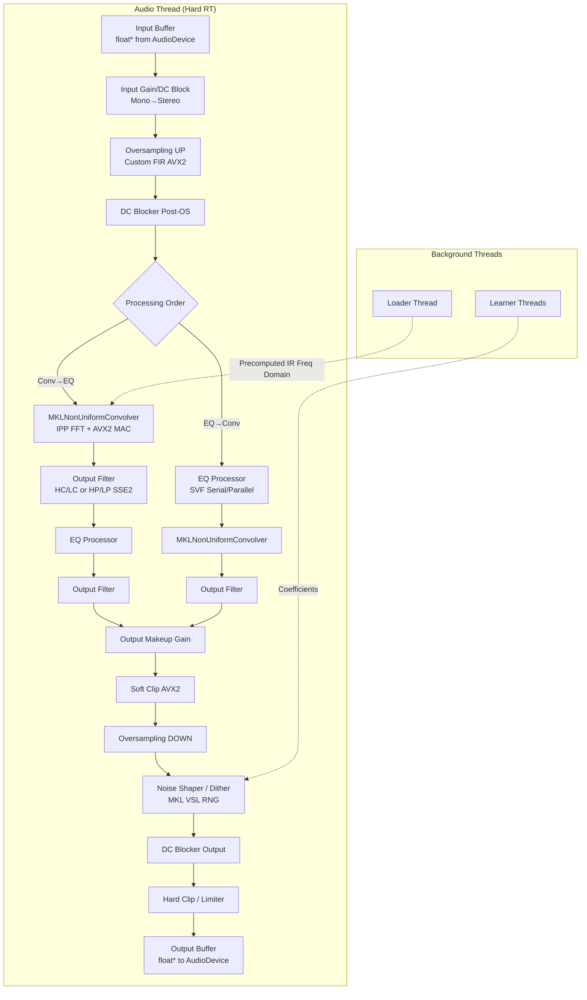

Here is the English translation of the detailed audio signal processing pipeline documentation for ConvoPeq.

---

## Audio Signal Processing Pipeline

## Detailed Description of Each Processing Stage

### 1. Input Stage — `DSPCore::processInput()`
- **Processing**:
    - Converts the input buffer (`float*`) to internal `double` buffers (`alignedL`/`alignedR`).
    - For mono input, copies the L channel to the R channel to create a stereo signal.
    - Applies **input headroom gain** (`inputHeadroomGain`).
    - Removes DC offset using a **high-precision DC blocker** (`UltraHighRateDCBlocker`).
    - **Analyzer Tap**: If the spectrum analyzer is in `Input` mode, pushes raw pre-gain data to a FIFO.
- **Library Used**: AVX2 intrinsics (e.g., `_mm256_loadu_pd`).
- **Thread**: Audio Thread only.

### 2. Oversampling (Upsampling) — `CustomInputOversampler::processUp()`
- **Processing**:
    - Applies multi-stage FIR interpolation filters based on user settings (1x, 2x, 4x, 8x).
    - **Filter Types**:
        - **IIR-like**: Short latency, slight phase distortion.
        - **Linear Phase**: Linear phase, high precision.
    - Each stage uses symmetric FIR filters (`taps=511/127/31` or `1023/255/63`).
- **Library Used**: Manually optimized dot product using AVX2 / FMA (`dotProductAvx2`).
- **Thread**: Audio Thread only.
- **Memory**: Uses pre-allocated aligned history buffers from `prepare()`.

### 3. Processing Order Branch
- `ProcessingOrder::ConvolverThenEQ`: **Conv → OutputFilter → EQ → OutputFilter**
- `ProcessingOrder::EQThenConvolver`: **EQ → Conv → OutputFilter**
- Each path processes the full stereo signal sequentially.

### 4. Convolution Engine — `MKLNonUniformConvolver`
- **Processing**:
    - **Non-Uniform Partitioned Convolution**:
        - Layer 0 (Immediate): Small `partSize` (e.g., 512) → low latency.
        - Layer 1/2 (Deferred/Distributed): Large `partSize` (e.g., 4096, 32768) → CPU load distributed across multiple blocks.
    - **Direct Head Path** (Optional): Convolves the first 32 taps in direct form for zero latency.
    - **Baked-in Output Filters**: High-cut/low-cut filters are applied to the IR frequency domain during `SetImpulse()`.
- **Libraries Used**:
    - **Intel IPP**: Forward/inverse FFT (`ippsFFTFwd_RToCCS_64f` / `ippsFFTInv_CCSToR_64f`).
    - **AVX2 / FMA**: Complex multiply-accumulate (`_mm256_fmadd_pd`).
- **Threads**:
    - **Add()/Get()**: Audio Thread only.
    - **SetImpulse()**: Message Thread (via `LoaderThread`).

### 5. EQ Processor — `EQProcessor::process()`
- **Processing**:
    - **20-Band Parametric EQ**.
    - **Filter Structures**:
        - **Serial**: Bands connected in series (default).
        - **Parallel**: Bands processed in parallel; dry signal plus accumulated difference.
    - **Filter Types**: Uses TPT SVF (Topology-Preserving Transform State Variable Filter). Supports LowShelf, Peaking, HighShelf, LowPass, HighPass.
    - **Nonlinear Saturation**: Vacuum tube simulation via `fastTanh`.
    - **AGC (Auto Gain Control)**: Automatic gain correction based on input/output RMS comparison.
- **Libraries Used**:
    - **SSE2 / AVX2**: Simultaneous stereo processing using packed `__m128d` operations.
- **Thread**: Audio Thread only.
- **Coefficient Updates**: Lock-free retrieval of the latest coefficients via `EQCoeffCache` (RCU).

### 6. Output Frequency Filter — `OutputFilter::process()`
- **Processing**:
    - **① Convolver Last Stage**: High-cut (Sharp/Natural/Soft) + Low-cut (Natural/Soft).
    - **② EQ Last Stage**: High-pass (fixed 20Hz) + Low-pass (Sharp/Natural/Soft).
    - **Implementation**: Up to 3 cascaded biquad stages (Direct Form II Transposed).
- **Libraries Used**: **SSE2 / FMA** for stereo biquad processing (`biquadStep128_FMA`).
- **Thread**: Audio Thread only.

### 7. Output Makeup Gain & Soft Clip
- **Makeup Gain**: Multiplies all samples by `outputMakeupGain`.
- **Soft Clip**: Applies tube-like saturation via `softClipBlockAVX2()`, with pre-gain correction based on inter-sample peak detection.

### 8. Downsampling — `CustomInputOversampler::processDown()`
- **Processing**: Symmetric multi-stage FIR decimation filter corresponding to the upsampling stage.
- **Libraries Used**: AVX2 / FMA.

### 9. Noise Shaper / Dither — `DSPCore::processOutput()`
- **Processing**:
    - Quantization to user-specified bit depth (16/24/32 bit).
    - **Noise Shaper Types**:
        - **Psychoacoustic**: 12th-order noise shaper + TPDF dither.
        - **Fixed 4-Tap / 15-Tap**: Fixed error feedback.
        - **Adaptive 9th-Order**: Lattice filter with CMA-ES learned coefficients.
    - **Headroom**: Ensures -1dB headroom just before output.
- **Libraries Used**:
    - **MKL VSL**: High-quality random number generation (`vdRngUniform`), prefetched by a background thread.
    - **SSE4.1**: Rounding operations (`_mm_round_pd`).
- **Threads**: Audio Thread executes processing; dedicated thread (`RNG Producer Thread`) assists with random number generation.

### 10. Final Output Stage
- **DC Blocker**: Final removal of DC offset from the output signal.
- **Hard Clip**: Limits output to [-1.0, 1.0] using `juce::jlimit`.
- **Type Conversion**: Converts `double` to `float` and writes to the device output buffer.

## Background Thread Integration Summary

| Processing Stage | Pre-computation Thread | Handoff Mechanism |
| :--- | :--- | :--- |
| IR Frequency Domain Data | Loader Thread | `PreparedIRState` → `ConvolverState` (RCU) |
| EQ Coefficient Cache | Worker Thread (during Snapshot creation) | `EQCoeffCache` (RCU) |
| Noise Shaper Coefficients | Learner Main Thread | `CoeffSet` (RCU) |
| Dither Random Numbers | RNG Producer Thread | `LockFreeRingBuffer` (SPSC) |