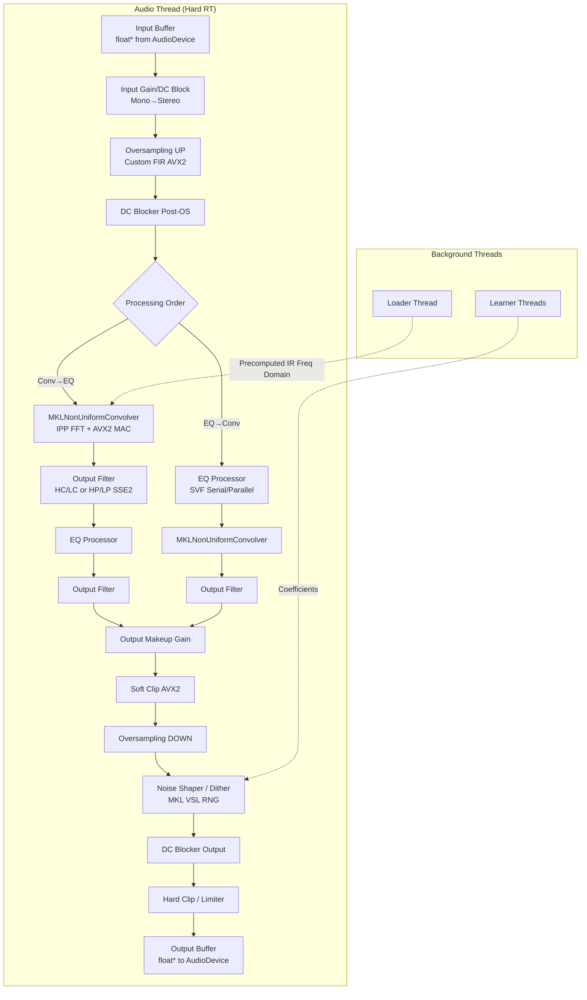

以下は、ConvoPeq における音声信号が入力されてから出力されるまでの完全なデータフロー図と、各処理段階の詳細説明です。

## 音声信号処理パイプライン (Audio Signal Processing Pipeline)

## 各処理段階の詳細

### 1. 入力段 (Input Stage) — `DSPCore::processInput()`
- **処理内容**:
    - 入力バッファ (`float*`) を内部 `double` バッファ (`alignedL`/`alignedR`) に変換。
    - モノラル入力の場合、L チャンネルを R にコピーしてステレオ化。
    - **入力ヘッドルームゲイン** (`inputHeadroomGain`) を適用。
    - **高精度 DC ブロッカー** (`UltraHighRateDCBlocker`) で直流成分を除去。
    - **アナライザータップ**: スペアナが `Input` モードの場合、ゲイン適用前の生データを FIFO へプッシュ。
- **使用ライブラリ**: AVX2 組み込み関数 (`_mm256_loadu_pd` 等)。
- **スレッド**: Audio Thread のみ。

### 2. オーバーサンプリング (Upsampling) — `CustomInputOversampler::processUp()`
- **処理内容**:
    - ユーザー設定 (1x, 2x, 4x, 8x) に応じて多段 FIR 補間フィルタを適用。
    - **フィルタタイプ**:
        - **IIR-like**: 短い遅延、わずかな位相歪み。
        - **Linear Phase**: 線形位相、高精度。
    - 各段は対称 FIR フィルタ (`taps=511/127/31` または `1023/255/63`)。
- **使用ライブラリ**: AVX2 / FMA による手動最適化ドット積 (`dotProductAvx2`)。
- **スレッド**: Audio Thread のみ。
- **メモリ**: 事前に `prepare()` で確保されたアライメント済み履歴バッファを使用。

### 3. 処理順序分岐 (Processing Order)
- `ProcessingOrder::ConvolverThenEQ`: **Conv → OutputFilter → EQ → OutputFilter**
- `ProcessingOrder::EQThenConvolver`: **EQ → Conv → OutputFilter**
- 各分岐は完全なステレオ信号を順次処理する。

### 4. コンボリューションエンジン — `MKLNonUniformConvolver`
- **処理内容**:
    - **非均一パーティション畳み込み (Non-Uniform Partitioned Convolution)**:
        - Layer 0 (即時): `partSize` 小 (例: 512) → 低レイテンシ。
        - Layer 1/2 (遅延分散): `partSize` 大 (例: 4096, 32768) → CPU 負荷を複数ブロックに分散。
    - **Direct Head Path** (オプション): 先頭 32 タップを直接形式で畳み込み、ゼロレイテンシを実現。
    - **出力フィルター焼き込み**: `SetImpulse()` 時に IR 周波数領域へハイカット/ローカットを適用済み。
- **使用ライブラリ**:
    - **Intel IPP**: 順/逆 FFT (`ippsFFTFwd_RToCCS_64f` / `ippsFFTInv_CCSToR_64f`)。
    - **AVX2 / FMA**: 複素乗算積算 (`_mm256_fmadd_pd`)。
- **スレッド**:
    - **Add()/Get()**: Audio Thread のみ。
    - **SetImpulse()**: Message Thread (`LoaderThread` 経由)。

### 5. EQ プロセッサ — `EQProcessor::process()`
- **処理内容**:
    - **20 バンドパラメトリック EQ**。
    - **フィルタ構造**:
        - **Serial**: バンドを直列接続 (デフォルト)。
        - **Parallel**: 各バンドを並列処理し、原音と差分を加算。
    - **フィルタタイプ**: TPT SVF (Topology-Preserving Transform State Variable Filter) を使用。LowShelf, Peaking, HighShelf, LowPass, HighPass。
    - **非線形飽和**: `fastTanh` による真空管シミュレーション。
    - **AGC (Auto Gain Control)**: 入出力 RMS 比較による自動ゲイン補正。
- **使用ライブラリ**:
    - **SSE2 / AVX2**: ステレオ同時処理 (`__m128d` パック演算)。
- **スレッド**: Audio Thread のみ。
- **係数更新**: `EQCoeffCache` (RCU) 経由でロックフリーに最新係数を取得。

### 6. 出力周波数フィルター — `OutputFilter::process()`
- **処理内容**:
    - **① Convolver 最終段**: ハイカット (Sharp/Natural/Soft) + ローカット (Natural/Soft)。
    - **② EQ 最終段**: ハイパス (固定 20Hz) + ローパス (Sharp/Natural/Soft)。
    - **実装**: 最大 3 段の Biquad カスケード (Direct Form II Transposed)。
- **使用ライブラリ**: **SSE2 / FMA** によるステレオ Biquad 処理 (`biquadStep128_FMA`)。
- **スレッド**: Audio Thread のみ。

### 7. 出力メイクアップゲイン & ソフトクリップ
- **メイクアップゲイン**: `outputMakeupGain` を全サンプルに乗算。
- **ソフトクリップ**: `softClipBlockAVX2()` により、真空管風の飽和特性を付与。インターサンプルピーク検出によるプリゲイン補正付き。

### 8. ダウンサンプリング (Downsampling) — `CustomInputOversampler::processDown()`
- **処理内容**: アップサンプリングと対称の多段 FIR デシメーションフィルタ。
- **使用ライブラリ**: AVX2 / FMA。

### 9. ノイズシェーパー / ディザ — `DSPCore::processOutput()`
- **処理内容**:
    - ユーザー指定ビット深度 (16/24/32 bit) への量子化。
    - **ノイズシェーパータイプ**:
        - **Psychoacoustic**: 12 次ノイズシェーパー + TPDF ディザ。
        - **Fixed 4-Tap / 15-Tap**: 固定エラーフィードバック。
        - **Adaptive 9th-Order**: 格子型フィルタ + CMA-ES 学習済み係数。
    - **ヘッドルーム**: 出力直前に -1dB のヘッドルームを確保。
- **使用ライブラリ**:
    - **MKL VSL**: 高品質乱数生成 (`vdRngUniform`) をバックグラウンドスレッドでプリフェッチ。
    - **SSE4.1**: 丸め処理 (`_mm_round_pd`)。
- **スレッド**: Audio Thread が処理を実行。乱数生成は専用スレッド (`RNG Producer Thread`) が補助。

### 10. 最終出力段
- **DC ブロッカー**: 出力信号の直流成分を最終除去。
- **ハードクリップ**: `juce::jlimit` により [-1.0, 1.0] に制限。
- **型変換**: `double` → `float` に変換し、デバイス出力バッファへ書き込み。

## 補足: 背景スレッドとの連携

| 処理段階 | 事前計算スレッド | 受け渡し機構 |
| :--- | :--- | :--- |
| IR 周波数領域データ | Loader Thread | `PreparedIRState` → `ConvolverState` (RCU) |
| EQ 係数キャッシュ | Worker Thread (Snapshot 生成時) | `EQCoeffCache` (RCU) |
| ノイズシェーパー係数 | Learner Main Thread | `CoeffSet` (RCU) |
| ディザ用乱数 | RNG Producer Thread | `LockFreeRingBuffer` (SPSC) |