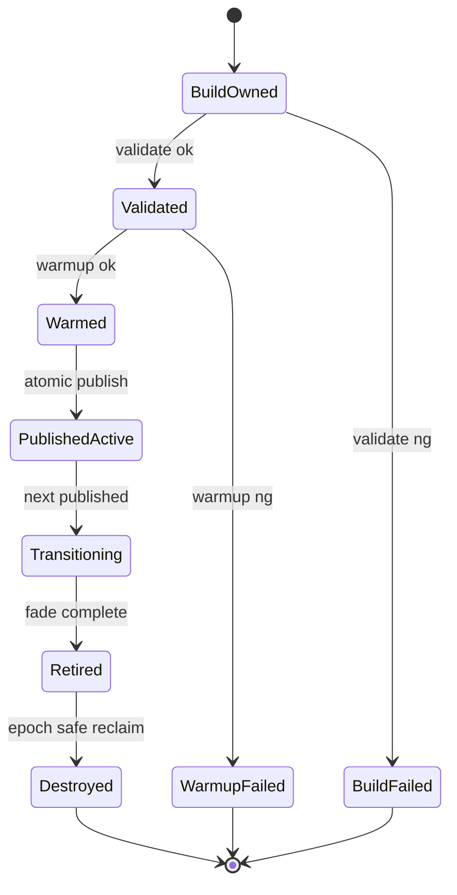

# ConvoPeq 次世代アーキテクチャ詳細設計

## 目的

本資料は、Layered Transactional Runtime Architecture への移行において、以下 4 成果物を運用可能な形で固定する。

1. Ownership Diagram
2. Runtime Lifecycle Diagram
3. Thread Access Matrix
4. Transition Matrix

本資料の上位原則は basic_rule.md および terms.md に従う。

## 非交渉 Invariant

- Audio thread は pure reader（lock, allocation, delete, graph mutation, rebuild, I/O, logging を禁止）
- publish 後 runtime は immutable
- mutable state の変更権限は builder thread のみ
- runtime lifetime は single ownership + RCU retire
- transition は transaction（build, validate, warmup, publish, crossfade, retire）

## 1. Ownership Diagram

```mermaid
flowchart LR
    UI[UI/Host/Async Loader] -->|enqueue command| CQ[Command Queue]
    CQ -->|dequeue| BLD[Builder Thread]
    BLD -->|build/validate/warmup| NEXT[Next EngineRuntime]
    NEXT -->|atomic publish| ACT[Active Runtime]
    ACT -->|transition start| TR[Transition Engine]
    TR -->|fade complete| RET[Retire Queue]
    RET -->|epoch safe| RCL[Reclaimer Thread]
    RCL -->|destroy| END[Destroyed]
```



### 所有権ルール

- Command は Command Queue が所有し、dequeue 時に Builder へ移譲する。
- Next EngineRuntime は Builder の一時単独所有とする。
- Publish 成功時に Active Runtime 所有権を Runtime Registry へ移譲する。
- 旧 Runtime は Transition Engine が一時保持し、fade 完了時に retire へ移譲する。
- Destroy は Reclaimer Thread のみが実行する。

### 禁止事項

- shared_ptr, weak_ptr, 多重 refcount ベースの runtime 寿命管理
- Audio thread での destroy

## 2. Runtime Lifecycle Diagram



### ライフサイクル制約

- Validate または Warmup に失敗した runtime は publish 禁止。
- Transition 中は old/next の 2 runtime を read-only 実行し、policy に従って mix する。
- Retire から Destroy は reader epoch が安全条件を満たした場合のみ実行する。

## 3. Thread Access Matrix

| Object | UI Thread | Builder Thread | Audio Thread | Reclaimer Thread |
| --- | --- | --- | --- | --- |
| ParameterModel | Write（生成のみ） | Read | No Access | No Access |
| Command Queue | Enqueue | Dequeue | No Access | No Access |
| RuntimeBuilder Working Set | No Access | Read/Write | No Access | No Access |
| Active EngineRuntime | No Access | Publish pointer only | Read only | No Access |
| Transition State | No Access | Initialize | Read only | No Access |
| Retire Queue | No Access | Push retire request | No Access | Pop/reclaim |
| Epoch Core | No Access | Publish epoch | Reader epoch update only | Reclaim判定 |

### アクセス規約

- Audio thread は Active EngineRuntime と Transition State を read-only 参照する。
- Builder thread は mutable state を RuntimeBuilder Working Set に隔離する。
- UI は command 発行のみを担い、runtime への直接変更を禁止する。

## 4. Transition Matrix

| Change Type | Policy | Build Required | Crossfade | Reset Scope | Notes |
| --- | --- | --- | --- | --- | --- |
| PEQ gain/Q/freq | SmoothOnly | No（係数更新のみ） | No | Stage-local | coefficient smoothing を適用 |
| FIR IR Replace | Crossfade | Yes | Yes | Convolver stage | 推奨 fade 5-50 ms |
| Sample Rate Change | HardReset Transaction | Yes | 条件付き（通常無し） | Full runtime | suspend -> flush -> rebuild -> short mute ramp |
| Oversampling Change | HardReset | Yes | No | Full runtime | continuity より deterministic transition を優先 |
| Topology Change | Crossfade | Yes | Yes | Affected stages | dual runtime 実行で click/pop を抑制 |
| Suspend/Resume Processing | HardReset or SmoothOnly | Optional | Optional | Runtime global | host 要件優先で policy を選択 |

### 遷移の共通フロー

1. Build
2. Validate
3. Warmup
4. Atomic Publish
5. Crossfade or Smooth Apply
6. Retire Old Runtime
7. Epoch-safe Destroy

## 設計レビュー観点（運用チェック）

- UAF risk
- RT violation
- ownership ambiguity
- transition artifact risk
- SR-change safety
- automation burst safety
- shutdown safety
- deterministic destruction

## 備考

本資料は、architecture consistency を最優先し、local optimization より deterministic runtime transition を優先するための基準資料とする。

## 5. Phase 0 成果物（現行構造への具体化）

本章は、basic_rule.md の Phase 0（現状整理）の成果物を、ConvoPeq 現行実装に対応づけた確定版として記録する。

### 5.1 Rebuild Flag 一覧（現行）

| 区分 | シンボル | 役割 | 主な更新スレッド | 参照先 |
| --- | --- | --- | --- | --- |
| AudioEngine 再構築要求 | pendingRebuildMask_ | RebuildKind を OR 集約するコアマスク | Message Thread | src/audioengine/AudioEngine.h, src/audioengine/AudioEngine.RebuildDispatch.cpp |
| AudioEngine 再構築優先制御 | lastIRContentRebuildTicks_ | IRContent の最短間隔を制御（200ms） | Message Thread | src/audioengine/AudioEngine.RebuildDispatch.cpp |
| AudioEngine 非同期処理入口 | triggerAsyncUpdate | commit 実行と rebuild request drain を起動 | Message Thread | src/audioengine/AudioEngine.RebuildDispatch.cpp, src/audioengine/AudioEngine.Commit.cpp |
| Convolver 再構築デバウンス | rebuildDebounceToken | 最新要求のみ有効化するトークン | Message Thread | src/ConvolverProcessor.h, src/convolver/ConvolverProcessor.Rebuild.cpp |
| Convolver 変更通知集約 | changeNotificationPending | UI 通知の多重投稿を抑制 | Message Thread | src/ConvolverProcessor.h, src/convolver/ConvolverProcessor.Rebuild.cpp |
| Convolver ロード後再構築予約 | rebuildPendingAfterLoad | IR ロード未完了時の遅延 rebuild 要求 | Message/Loader/Audio relay | src/ConvolverProcessor.h, src/convolver/ConvolverProcessor.Rebuild.cpp |
| Convolver オーバーフロー連携 | overflowRequested | Audio path の overflow 要求を非RTへ転送 | Audio Thread store, 非RT consume | src/ConvolverProcessor.h |
| Convolver デバウンス設定 | rebuildDebounceMs | rebuild 遅延時間（min-max 範囲） | Message Thread | src/ConvolverProcessor.h, src/convolver/ConvolverProcessor.Rebuild.cpp |

### 5.2 Ownership Graph（現行）

```mermaid
flowchart TD
     UI[UI Parameter Change] --> A1[AudioEngine requestRebuild(kind)]
     A1 --> A2[pendingRebuildMask_]
     A2 --> A3[handleAsyncUpdate]
     A3 --> A4[requestRebuild(sampleRate, block)]
     A4 --> A5[prepareCommit(newDSP)]
     A5 --> A6[executeCommit]
     A6 --> A7[commitNewDSP]
     A7 --> A8[retireObject old DSPCore]

     UIC[UI Convolver Change] --> C1[requestDebouncedRebuild]
     C1 --> C2[loadImpulseResponse]
     C2 --> C3[commitNewConvolver]
     C3 --> C4[m_activeEngine exchange]
     C4 --> C5[retireStereoConvolver]
     C5 --> C6[EBRQueue or DeferredFreeThread reclaim]

     S0[Snapshot createImpl] --> S1[startFade or switchImmediate]
     S1 --> S2[SnapshotCoordinator current/target]
     S2 --> S3[DeletionQueue enqueue]
     S3 --> S4[SnapshotFactory destroy]
```

現行の単一所有ルール（主要オブジェクト）

- DSPCore: activeDSP から世代遷移時に retireObject へ移譲し、破棄は retire 経路のみ。
- StereoConvolver: m_activeEngine 交換後は retireStereoConvolver で retire 経路へ移譲。
- Snapshot: current/target は SnapshotCoordinator が保持し、旧世代は DeletionQueue へ積んで破棄。
- IRState: currentIRState は exchange 後に非RTで明示破棄（releaseResources 経路）。

### 5.3 Transition Path 列挙（現行）

#### A) Snapshot Transition（AudioEngine）

1. createSnapshotFromCurrentState が新 Snapshot を生成。
2. fadeSamples > 0 なら startFade、0 以下なら switchImmediate。
3. Audio Thread process で advanceFade と updateFade を毎ブロック評価。
4. フェード完了時は completeFade で current を更新し旧 Snapshot を DeletionQueue へ retire。

主要実装:

- src/audioengine/AudioEngine.Snapshot.cpp
- src/audioengine/AudioEngine.Processing.AudioBlock.cpp
- src/core/SnapshotCoordinator.cpp

#### B) DSPCore Transition（AudioEngine）

1. requestRebuild(kind) が mask を集約。
2. handleAsyncUpdate が executeCommit と processRebuildRequestsInternal を実行。
3. requestRebuild(sampleRate, block) が newDSP を構築して prepareCommit。
4. executeCommit が commitNewDSP を呼び、旧 active/fading/queued DSP を retire。

主要実装:

- src/audioengine/AudioEngine.RebuildDispatch.cpp
- src/audioengine/AudioEngine.Commit.cpp
- src/audioengine/AudioEngine.Processing.ReleaseResources.cpp

#### C) Convolver Engine Transition

1. requestDebouncedRebuild が debounce token を発行。
2. callAfterDelay 経由で loadImpulseResponse を起動。
3. commitNewConvolver と m_activeEngine exchange で新 engine を publish。
4. 旧 engine は retireStereoConvolver で retire queue 側へ移譲。

主要実装:

- src/convolver/ConvolverProcessor.Rebuild.cpp
- src/convolver/ConvolverProcessor.Lifecycle.cpp
- src/ConvolverProcessor.h

### 5.4 DSP Reset Path 整理（現行）

| Reset 種別 | 入口 | 実行内容 | 備考 |
| --- | --- | --- | --- |
| デバイス開始・再構成 | AudioEngine::prepareToPlay | rebuild thread 再起動、バッファ再確保、UI processor prepareToPlay、必要時 requestRebuild | Audio Thread 停止中前提 |
| デバイス停止 | AudioEngine::releaseResources | shutdown フラグ設定、pending commit 廃棄、active/fading/queued DSP retire、uiConvolver/uiEq release | retire/destroy を非RTで集約 |
| Convolver 全体準備 | ConvolverProcessor::prepareToPlay | active engine 再初期化、遅延系バッファ再確保、DeferredFreeThread 準備 | rate/block 変化時に再構築分岐 |
| Convolver 全体解放 | ConvolverProcessor::releaseResources | active engine exchange nullptr + retire、IRState 解放、swapper reclaim drain | releaseResources で deterministic cleanup |
| Convolver 実行状態リセット | ConvolverProcessor::reset | active engine reset、delay/dry/smoothing クリア、smoother reset pending 設定 | process 連続性維持のため状態クリア限定 |

主要実装:

- src/audioengine/AudioEngine.Processing.PrepareToPlay.cpp
- src/audioengine/AudioEngine.Processing.ReleaseResources.cpp
- src/convolver/ConvolverProcessor.Lifecycle.cpp

### 5.5 Phase 0 成果物まとめ

本章により、Phase 0 の要求成果物は以下として固定される。

1. Runtime lifecycle diagram:
    - 本資料 2 章（抽象） + 5.3/5.4（実装経路）
2. Ownership graph:
    - 本資料 5.2
3. rebuild flag 一覧:
    - 本資料 5.1
4. transition/reset path 一覧:
    - 本資料 5.3 と 5.4

今後の Phase 1 以降は、本章の現行シンボルを差分基準として、削除対象と移行対象を明示すること。

## 6. Phase 1 差分表（5.1 フラグの Keep/Delete 分類）

本章は、5.1 で列挙した現行フラグ群を、次世代アーキテクチャ導入時にどう扱うかを固定する。

### 6.1 分類ポリシー

- Keep: 次世代でも意味が不変で、実装位置のみ調整するもの。
- Migrate: 機能は維持するが、命名/責務/層を移すもの。
- Delete: Command Queue + Builder 方式により不要化するもの。

### 6.2 シンボル別差分表

| 現行シンボル | 区分 | 次世代での扱い | 置換先/移行先 | 根拠 |
| --- | --- | --- | --- | --- |
| pendingRebuildMask_ | Delete | 段階的廃止 | CommandQueue<EngineCommand> | bit mask 集約を queue 直列化へ置換するため |
| lastIRContentRebuildTicks_ | Migrate | 層移動して継続 | Builder 側 DebouncePolicy | IR更新の抑制自体は必要だが AudioEngine 所有は不要 |
| triggerAsyncUpdate | Migrate | 役割縮退 | Queue notify/event wakeup | commit/rebuild 併用起点から queue 駆動へ移行 |
| rebuildDebounceToken | Migrate | Convolver 局所で維持 | ConvolverCommand coalescer | 同一種別の再投入抑制は有効 |
| changeNotificationPending | Keep | UI通知専用として維持 | 変更なし（UI layer） | UI change broadcast の多重抑制は依然必要 |
| rebuildPendingAfterLoad | Migrate | 汎用化して継続 | Loader -> CommandQueue bridge | ロード完了後の遅延実行要件は残る |
| overflowRequested | Keep | RT->非RT通知として維持 | 変更なし（Convolver runtime telemetry） | Audio path での遅延通知要件は不変 |
| rebuildDebounceMs | Keep | 設定値として維持 | DebouncePolicy parameter | 運用チューニング値として利用継続 |

### 6.3 削除順序（安全移行）

1. CommandQueue と Builder Thread を先に導入し、二重経路（mask + queue）を短期間併存させる。
2. pendingRebuildMask_ の書き込み元を queue enqueue に段階置換する。
3. processRebuildRequestsInternal を縮退し、最終的に削除する。
4. triggerAsyncUpdate の rebuild 依存を除去し、commit 関連のみへ責務限定する。

## 7. Ownership 詳細（型単位 + destroy 条件）

本章は 5.2 を型単位で分解し、destroy 条件を明示する。

### 7.1 オブジェクト別所有・破棄規約

| 型 | 所有者（通常時） | 公開方式 | retire 条件 | destroy 実行条件 | destroy 実行主体 |
| --- | --- | --- | --- | --- | --- |
| AudioEngine::DSPCore | AudioEngine activeDSP | commitNewDSP で世代交換 | 新DSP publish、または releaseResources | EBR で reader 安全 epoch 到達 | retireObject 経路（非RT） |
| ConvolverProcessor::StereoConvolver | ConvolverProcessor m_activeEngine | atomic exchange | 新engine publish、または releaseResources | retireStereoConvolver 後 reclaim 可能 | EBRQueue / DeferredFreeThread |
| convo::GlobalSnapshot | SnapshotCoordinator current/target | startFade/switchImmediate | fade 完了または即時切替で旧世代化 | DeletionQueue reclaim で epoch safe | SnapshotFactory::destroy |
| ConvolverProcessor::IRState | currentIRState atomic | exchange | 新IR state publish、または releaseResources | 参照終了後（release 経路） | 非RT で明示破棄 |
| EQCoeffCache / CacheMap | AudioEngine cache atomics | pointer swap | 新キャッシュ publish | EBR retire 後 reclaim 可 | retireObject 経路 |

### 7.2 追加禁止事項（Ownership 一貫性維持）

- Audio path 上で shared_ptr/weak_ptr を導入しない。
- retain/release 相当の参照カウント寿命を runtime 主経路へ混在させない。
- retire を bypass して直接 delete しない。

### 7.3 destroy 条件チェックリスト

1. 旧世代ポインタが publish 後に参照されないことを epoch で保証しているか。
2. releaseResources で pending キュー/一時所有をすべて drain しているか。
3. shutdown 経路で active/fading/queued の三系統を同時に解放対象へ回収しているか。
4. DeletionQueue/EBRQueue の reclaim は Audio Thread 外でのみ実行されるか。

## 8. トランザクション境界テスト項目（実装前固定版）

本章は、5.3/5.4 の遷移・reset 経路を将来実装で壊さないための境界テスト仕様を定義する。

### 8.1 テストカテゴリ

- Build/Validate/Warmup 境界
- Publish/Crossfade/Retire 境界
- SR 変更境界
- Automation burst 境界
- Shutdown/releaseResources 境界

### 8.2 テストケース一覧

| ID | 変更イベント | 事前条件 | 期待されるトランザクション境界 | 合格条件 |
| --- | --- | --- | --- | --- |
| TX-01 | PEQ gain 連続変更 | 再生中、IR固定 | Build不要、SmoothOnly のみ | click/pop 無し、rebuild 発火なし |
| TX-02 | IR Replace 単発 | 再生中、IR finalized | Build -> Validate -> Warmup -> Publish -> Crossfade -> Retire | フェード中断なし、旧engineが retire 経路へ入る |
| TX-03 | IR Replace 連打 | 再生中、短時間に複数IR更新 | debounce/coalescing 後に最新要求のみ処理 | 中間要求が抑制され、最終状態のみ反映 |
| TX-04 | SR 変更 | 再生中、active runtime 存在 | suspend/flush -> rebuild -> short mute ramp -> activate | 破綻ノイズ無し、再生復帰後に遅延整合 |
| TX-05 | Oversampling 変更 | 再生中 | HardReset transaction | 旧runtime が deterministic に retire |
| TX-06 | Topology 変更 | 再生中 | dual runtime crossfade | 途切れ/破裂音なし、切替後に old runtime 未参照 |
| TX-07 | releaseResources 実行 | 再生停止遷移中 | pending commit drain -> retire -> processor release | リークなし、ダングリング参照なし |
| TX-08 | shutdown 中に rebuild 要求 | shutdownInProgress=true | 要求拒否または安全廃棄 | 新規 publish が発生しない |
| TX-09 | Snapshot fade 中断系 | fade 中に次 snapshot 発行 | old target retire -> 最新 target 継続 | current/target の整合崩壊なし |
| TX-10 | automation burst 100件 | 同一窓で大量更新 | coalescing により rebuild 回数圧縮 | CPU スパイク許容範囲、最終値一致 |

### 8.3 RT-Safety 検証観点（各TX共通）

1. Audio Thread で lock/allocation/delete/logging が発生しない。
2. Audio Thread が mutable graph 更新を行わない。
3. retire/reclaim は非RT側でのみ実行される。
4. トランザクション失敗時に current runtime 継続が保証される。

### 8.4 自動化に向けた最小計測項目

- publish 回数
- retire 完了件数
- reclaim 遅延時間（epoch 到達まで）
- debounce により抑制された要求件数
- releaseResources 後の残留オブジェクト件数

## 9. 参照運用（AI向け）

本資料の AI 参照順序は以下を推奨する。

1. 6章: Phase 1 で削除/移行するフラグの判断
2. 7章: 型単位の所有権と destroy 条件
3. 8章: 実装前後で必ず満たすべき境界テスト条件

実装提案時は、各変更が 6/7/8 章のどの項目を満たすかを明示すること。

## 10. TX-01〜TX-10 実行手順（運用版）

本章は 8 章のテスト項目を実施可能な手順へ落とし込む。

### 10.1 共通前提

1. Debug ビルドで実行し、診断ログを有効化する。
2. Audio device は 48kHz / 512 samples を基準とし、SR 変更ケースのみ別設定を使う。
3. 変更前後で同一入力素材を使用し、比較可能な再現条件を維持する。
4. Audio thread 側で lock/allocation/logging が増えていないことを確認する。

### 10.2 ケース別手順

#### TX-01: PEQ gain 連続変更

1. 再生開始後、同一バンド gain を短時間で連続変更する。
2. rebuild 要求の有無と出力波形の連続性を確認する。
3. click/pop がないこと、rebuild 発火がないことを合格とする。

#### TX-02: IR Replace 単発

1. IR finalized 状態で 1 回だけ IR を差し替える。
2. Build -> Validate -> Warmup -> Publish -> Crossfade -> Retire の順をログで確認する。
3. 旧 engine が retire 経路に入り reclaim されることを確認する。

#### TX-03: IR Replace 連打

1. 短時間に複数 IR を連続投入する。
2. debounce/coalescing により最終要求のみ反映されることを確認する。
3. 中間要求の publish が行われないことを合格とする。

#### TX-04: SR 変更

1. 再生中に SR を 48kHz から 96kHz へ変更する。
2. suspend/flush/rebuild/short mute ramp/activate を順次確認する。
3. 復帰後に遅延整合が取れ、破綻ノイズがないことを確認する。

#### TX-05: Oversampling 変更

1. 再生中に Oversampling 設定を切り替える。
2. HardReset transaction が成立し、旧 runtime が deterministic に retire されることを確認する。

#### TX-06: Topology 変更

1. 処理順または stage 構成に相当する設定を変更する。
2. dual runtime crossfade が実施されることを確認する。
3. 切替後に old runtime が参照されないことを確認する。

#### TX-07: releaseResources 実行

1. 再生停止遷移で releaseResources を呼ぶ。
2. pending commit drain -> retire -> processor release の順を確認する。
3. ダングリング参照とリークがないことを確認する。

#### TX-08: shutdown 中 rebuild 要求

1. shutdownInProgress を true にした状態で rebuild を要求する。
2. 要求が拒否または安全廃棄されることを確認する。
3. 新規 publish が発生しないことを合格とする。

#### TX-09: Snapshot fade 中断系

1. fade 実行中に次 snapshot を投入する。
2. old target retire -> 最新 target 継続の整合性を確認する。
3. current/target 崩壊がないことを確認する。

#### TX-10: automation burst

1. 同一窓で 100 件規模の連続更新を投入する。
2. coalescing による rebuild 回数圧縮を計測する。
3. 最終パラメータ一致と CPU スパイク許容範囲を確認する。

### 10.3 記録フォーマット

各 TX は以下を最低限記録する。

- 実行条件（SR, block, IR 状態）
- 発火した transaction 段階
- publish 件数 / retire 件数 / reclaim 完了有無
- 合否と不一致理由

## 11. Phase 1 実装タスク分解（設計固定）

### 11.1 目的

pendingRebuildMask_ 中心の再構築起点を、Command Queue + Builder Thread へ段階移行する。

### 11.2 タスク一覧

1. EngineCommand 型の導入
    - UpdateParameters, ReplaceIR, ChangeSampleRate, ChangeOversampling, SuspendProcessing を定義。
2. MPSC CommandQueue の導入
    - UI/Host/Loader から enqueue、Builder が単独 dequeue。
3. BuilderThread Loop の導入
    - dequeue -> coalesce -> build -> validate -> warmup -> publish を単一ループへ集約。
4. Rebuild Dispatcher のブリッジ化
    - 既存 requestRebuild は queue enqueue へ変換し、直接 rebuild 実行を縮退。
5. publish 経路の統一
    - commit 相当の公開点を 1 箇所に固定し、旧 runtime は retire API のみ通過。
6. フラグ削除段階の確定
    - 6章の Delete/Migrate 方針に沿って pendingRebuildMask_ 依存を段階削除。

### 11.3 完了判定

1. rebuild 要求は queue 経路のみで成立する。
2. 旧 mask 経路は read-only 互換層を経て完全撤去できる。
3. TX-02/TX-03/TX-10 が回帰なしで通る。

## 12. 失敗復旧とフォールバック方針

### 12.1 Build 失敗時

1. current runtime を継続使用する。
2. 失敗した next runtime は publish せず破棄する。
3. 失敗イベントを non-RT へ通知し、再試行間隔を適用する。

### 12.2 Validate 失敗時

1. publish を中止する。
2. 失敗理由を分類（構成不整合、資源不足、未初期化データ）する。
3. 同種要求の burst は coalescing で抑制する。

### 12.3 Warmup 失敗時

1. 原則 publish 中止とする。
2. 許可された限定ケースのみ HardReset fallback を適用する。
3. fallback 発動時は必ずイベントログを残す。

### 12.4 Shutdown 優先規則

1. shutdownInProgress 以降は新規 build を受理しない。
2. pending queue は安全廃棄または retire 回収へ振り分ける。
3. reclaim 完了を確認してから最終終了とする。

## 13. 変更提案テンプレート（AI実装時必須）

今後 AI がコード変更提案を出す際は、次のテンプレートを必須とする。

1. 対象 TX
    - どの TX-ID を満たす変更か。
2. 6章適合
    - Keep/Migrate/Delete のどれを変更するか。
3. 7章適合
    - どの型の所有権と destroy 条件に影響するか。
4. RT-Safety
    - Audio thread で lock/allocation/delete/logging が増えない証跡。
5. 失敗時挙動
    - build/validate/warmup 失敗時の継続性。
6. 検証結果
    - 最低 TX-02, TX-07, TX-10 の結果。

本テンプレートを満たさない変更提案は、architecture consistency 観点で差し戻す。

## 14. 実装ブループリント（ファイル別）

本章は、実際のコーディング作業単位に分解した着手順序を定義する。

### 14.1 変更対象ファイル（Phase 1 最小セット）

| 区分 | ファイル | 追加/変更内容 | 目的 |
| --- | --- | --- | --- |
| 新規 | src/audioengine/RuntimeCommand.h | EngineCommand, CommandType, CommandMeta を定義 | queue 入力の標準化 |
| 新規 | src/audioengine/RuntimeCommandQueue.h | MPSC queue API（enqueue/dequeue/drain）を定義 | 再構築要求の直列化 |
| 新規 | src/audioengine/RuntimeBuilder.h | BuildInput/BuildResult/BuildError を定義 | build/validate/warmup の一元化 |
| 新規 | src/audioengine/RuntimeBuilder.cpp | build 実体と検証ロジック | mutable world 隔離 |
| 新規 | src/audioengine/RuntimeTransition.h | TransitionPolicy/TransitionState を定義 | publish/crossfade 制御 |
| 変更 | src/audioengine/AudioEngine.h | queue, builder, transition のメンバ追加 | 既存制御との接続 |
| 変更 | src/audioengine/AudioEngine.RebuildDispatch.cpp | requestRebuild を enqueue 化 | mask 依存縮退 |
| 変更 | src/audioengine/AudioEngine.Commit.cpp | publish 点を transition API 経由に統一 | 所有権遷移の明示化 |
| 変更 | src/audioengine/AudioEngine.Processing.AudioBlock.cpp | transition read-only 実行統合 | Audio thread pure reader 化 |
| 変更 | src/audioengine/AudioEngine.Processing.ReleaseResources.cpp | queue drain と builder 停止処理追加 | shutdown 決定性向上 |

注記

- 既存 split 構成を前提に、AudioEngine 配下で完結する最小導入とする。
- JUCE 配下と r8brain 配下は編集禁止。

### 14.2 変更順序

1. データ構造導入（RuntimeCommand, Queue, Builder 入力型）
2. Builder 実装（build/validate/warmup の戻り値規約を確立）
3. RebuildDispatch の enqueue 化（旧経路を互換モードで併存）
4. Commit の publish 統一（TransitionState 管理へ寄せる）
5. AudioBlock の read-only 実行統合
6. ReleaseResources の停止・drain 強化
7. 旧 mask 依存の撤去

## 15. 新規 API / 型シグネチャ案

本章は実装時にそのまま使える最小インターフェース案を示す。

### 15.1 RuntimeCommand

```cpp
enum class CommandType
{
    UpdateParameters,
    ReplaceIR,
    ChangeSampleRate,
    ChangeOversampling,
    SuspendProcessing,
    ResumeProcessing,
    Shutdown
};

struct CommandMeta
{
    uint64_t revision = 0;
    uint64_t issuedTick = 0;
    bool highPriority = false;
};

struct EngineCommand
{
    CommandType type = CommandType::UpdateParameters;
    CommandMeta meta;
    ParameterModel params;
};
```

### 15.2 RuntimeBuilder

```cpp
enum class BuildError
{
    None,
    InvalidInput,
    ResourceUnavailable,
    WarmupFailed,
    InternalError
};

struct BuildInput
{
    ParameterModel params;
    double sampleRate = 0.0;
    int blockSize = 0;
};

struct BuildResult
{
    AudioEngine::DSPCore* runtime = nullptr;
    TransitionPolicy policy = TransitionPolicy::SmoothOnly;
    BuildError error = BuildError::None;
};

class RuntimeBuilder
{
public:
    BuildResult build(const BuildInput& in) noexcept;
};
```

### 15.3 RuntimeCommandQueue

```cpp
class RuntimeCommandQueue
{
public:
    bool enqueue(const EngineCommand& cmd) noexcept;
    bool tryDequeue(EngineCommand& out) noexcept;
    int drainCoalesced(EngineCommand* outBuffer, int capacity) noexcept;
    void clear() noexcept;
};
```

### 15.4 TransitionState

```cpp
struct TransitionState
{
    AudioEngine::DSPCore* current = nullptr;
    AudioEngine::DSPCore* next = nullptr;
    TransitionPolicy policy = TransitionPolicy::SmoothOnly;
    double fadeTimeSec = 0.0;
    bool active = false;
};
```

## 16. 実装チケット分割（そのまま作業可能）

### T1: Queue 基盤導入

- 成果物: RuntimeCommand.h, RuntimeCommandQueue.h
- 変更: AudioEngine.h に queue メンバ追加
- 完了条件: enqueue/dequeue 単体テスト通過

### T2: Builder 雛形導入

- 成果物: RuntimeBuilder.h/.cpp
- 変更: BuildInput から BuildResult を返す最小 build 実装
- 完了条件: InvalidInput/ResourceUnavailable を返せる

### T3: RebuildDispatch ブリッジ

- 変更: requestRebuild(kind) を queue enqueue 中心へ変更
- 完了条件: pendingRebuildMask_ に依存しなくても再構築要求が成立

### T4: Commit/Publish 統一

- 変更: commitNewDSP 経路を TransitionState API 経由へ寄せる
- 完了条件: 旧 runtime が retire API 以外で解放されない

### T5: AudioBlock 統合

- 変更: transition read-only 実行の一本化
- 完了条件: Audio thread で mutable 更新が増えない

### T6: Shutdown 強化

- 変更: releaseResources で queue drain, builder 停止, pending 廃棄
- 完了条件: TX-07/TX-08 合格

## 17. DoD（Definition of Done）

本改修を「コーディング完了」と判断する条件を固定する。

### 17.1 設計適合

1. 6章の Delete/Migrate/Keep が実装差分に反映されている。
2. 7章の所有権規約に反する直接 delete が追加されていない。
3. 12章の失敗復旧規約がコードパスに実装されている。

### 17.2 実装適合

1. rebuild 要求は queue 経路で処理される。
2. builder が single writer として動作する。
3. publish 点が 1 箇所へ統一される。
4. retire/reclaim が非RT経路に限定される。

### 17.3 検証適合

1. TX-02, TX-03, TX-07, TX-10 を必須合格とする。
2. Debug で assertion 増加がない。
3. releaseResources 後に残留 runtime がない。

## 18. ロールバック条件

次のいずれかを満たした場合、当該チケットの変更を即時ロールバックする。

1. Audio thread で lock/allocation/delete/logging の増加が確認された場合。
2. publish 後 runtime への mutable 書き込みが発生した場合。
3. shutdown 中に新規 publish が発生した場合。
4. TX-02/TX-07 のいずれかで fail した場合。

ロールバック後は、失敗した境界条件を 8章と10章へ追記して再発防止する。

## 19. パラメーター責務境界（SoT: Source of Truth）

本章は、主要パラメーターの正本（SoT）と伝播経路を固定する。

| パラメーター群 | SoT | 反映先 | 永続化ドメイン | 備考 |
| --- | --- | --- | --- | --- |
| 入力 SR / block | AudioDeviceManager + AudioEngine currentSampleRate / maxSamplesPerBlock | DSPCore build input, SnapshotParams.sampleRate/maxBlockSize | DeviceSettings + Runtime | SR/block はデバイス状態の結果値であり、プリセット値で上書きしない |
| 入出力ゲイン（headroom/makeup/trim） | AudioEngine atomics + m_current* mirror | SnapshotParams -> GlobalSnapshot | Preset + DeviceSettings + Snapshot | 復元順序依存あり（mode/bypass 復元後に適用） |
| OS 設定（factor/type） | AudioEngine manualOversamplingFactor / oversamplingType | rebuild task + DSPCore prepare + Snapshot | Preset + DeviceSettings + Snapshot | 内部 OS レートは派生値（直接保存しない） |
| dither bit depth / noise shaper type | AudioEngine ditherBitDepth / noiseShaperType | DSPCore prepare + Snapshot | Preset + DeviceSettings + Snapshot | 出力量子化戦略として扱う |
| EQ/Convolver 子状態 | EQProcessor/ConvolverProcessor state | rebuild/snapshot で反映 | Preset + DeviceSettings(Convolver) | 子 state は親 state の配下で管理 |
| analyzer source/enabled | AudioEngine currentAnalyzerSource / analyzerEnabled | process path analyzer tap | Preset(source のみ) / Runtime(enabled) | enabled は UI runtime ノブとして扱う |

### 19.1 正本の原則

1. 同一意味の値を複数箇所で永続化しない。
2. 派生値（例: processing sample rate）は復元せず再計算する。
3. Audio Thread が参照する値は、必ず non-RT 側の SoT から lock-free に publish する。

## 20. 永続化ドメイン行列（保存すべきもの / しないもの）

| 項目 | Preset | DeviceSettings | Snapshot | Runtime only | 方針 |
| --- | --- | --- | --- | --- | --- |
| processingOrder / bypass | Yes | No | Yes | No | 音作り構成なのでプリセット所属 |
| inputHeadroomDb / outputMakeupDb / convolverInputTrimDb | Yes | Yes | Yes | No | ユーザー期待上、両ドメイン整合を許容 |
| oversamplingFactor / oversamplingType | Yes | Yes | Yes | No | 品質・負荷バランス設定 |
| ditherBitDepth / noiseShaperType | Yes | Yes | Yes | No | 出力品質設定 |
| sampleRate / maxBlockSize | No direct | Yes (device state) | Yes | No | デバイス状態を正とし Snapshot は観測値保持 |
| processing sample rate (内部 OS レート) | No | No | No direct | Derived | SR × factor の再計算で一意化 |
| analyzerEnabled | No | No | No | Yes | セッション一時UI状態 |
| analyzerSource | Yes | No | No | Yes | プリセット互換のため保存 |

### 20.1 禁止パターン

1. 同一項目を Preset と DeviceSettings で矛盾値にする変更。
2. Derived 値を保存し、復元時に SoT を逆流させる変更。
3. Runtime only 項目を Preset に混入させる変更。

## 21. 復元順序の厳密仕様（Parameter Restore Pipeline）

復元は次の順序を必須とする。

1. Topology 層:
processingOrder, eqBypassed, convBypassed を先に適用する。
2. Gain/Quality 層:
headroom/makeup/trim, ditherBitDepth, noiseShaperType, oversampling を適用する。
3. Child state 層:
EQ, Convolver の ValueTree state を適用する。
4. Rebuild 層:
SR 有効時のみ requestRebuild を発行する。
5. Notify 層:
UI へ change message を送る。

### 21.1 復元中の保護

1. m_isRestoringState=true の間は applyDefaultsForCurrentMode による暗黙上書きを抑止する。
2. restore guard を RAII で管理し、途中失敗でもフラグ取り残しを禁止する。
3. 復元シーケンス中は partial rebuild を避け、終端で 1 回だけ rebuild 判定を行う。

## 22. パラメーター網羅性テスト拡張（TX-11〜TX-15）

| ID | テスト名 | 目的 | 手順要点 | 合格条件 |
| --- | --- | --- | --- | --- |
| TX-11 | Preset Roundtrip | Preset 保存/読込の対称性確認 | 保存 -> 初期化 -> 読込 -> 差分比較 | 保存キー集合と復元後値が一致 |
| TX-12 | DeviceSettings Roundtrip | デバイス依存設定の再現確認 | saveSettings -> 再起動相当 -> loadSettings | bit depth / OS / headroom 等が復元 |
| TX-13 | Snapshot Hash Sensitivity | sampleRate/maxBlockSize 反映確認 | SR/block 変更で snapshot createImpl を観測 | 等価判定が false になり新 snapshot 生成 |
| TX-14 | Derived Rate Integrity | 内部 OS レート導出の整合確認 | SR と factor を複数組み合わせ | getProcessingSampleRate が期待式と一致 |
| TX-15 | Restore Order Safety | 復元順序依存バグ検出 | bypass/order を含む preset を読込 | headroom clamp 破綻・二重 rebuild が発生しない |

### 22.1 実行記録テンプレート（追記）

1. 入力条件:
SR, block, preset/device file version, IR finalized 状態。
2. 期待値:
対象パラメーターの SoT 値と derived 値。
3. 観測値:
restore 後の getter 値、snapshot hash、rebuild 発火回数。
4. 判定:
pass/fail と差分理由。

## 23. 実装着手ガード（次フェーズ用）

次フェーズでコード変更に入る前に、以下を必須チェックとする。

1. 変更対象パラメーターが 19章で定義した SoT と一致している。
2. 20章の永続化ドメイン行列で Yes/No が説明可能である。
3. 21章の復元順序に反する呼び出し順を導入していない。
4. 22章の TX-11〜TX-15 のうち該当ケースを最低 1 件以上実施する。

本ガードを満たせない差分は、実装レビューで差し戻す。
