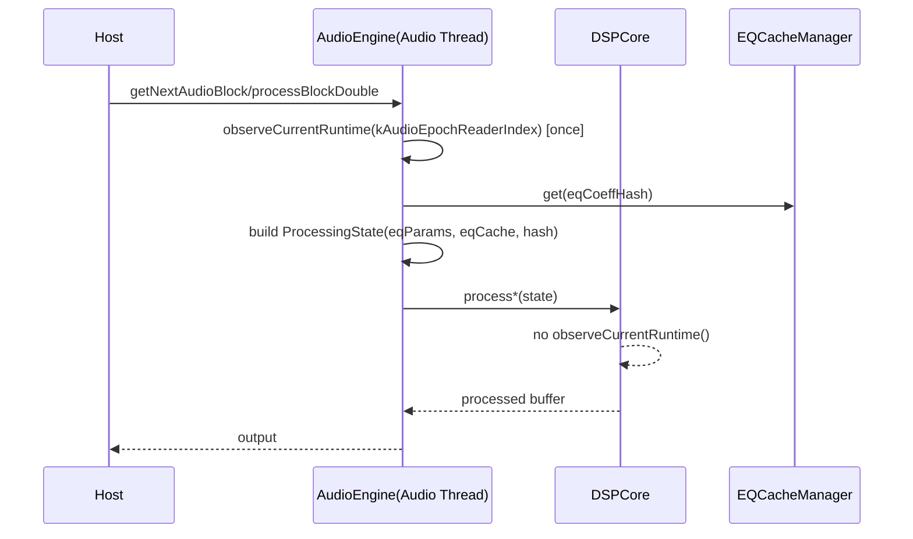

# ISR 実装修正 詳細設計（ファイル別・順序付き実装対応）

作成日: 2026-05-23
対象計画: `doc/work/ISR_バグ精査結果_実装修正タスク分解_2026-05-23.md`

---

## 0. 目的とスコープ

本設計は、監査で成立した不具合群（Phase 0〜4）を、**Immutable Snapshot Runtime（ISR）不変条件を崩さず**実装できるように、
以下を定義する。

- フェーズ別の設計責務
- 変更対象ファイルごとの具体変更点
- データ/制御フロー（Audio Thread中心）
- API/構造体変更案（最小差分）
- 受入判定（DoD）と検証観点

非スコープ:

- `JUCE/`, `r8brain-free-src/` の変更
- Phase 4 前提仕様（完全skip/prewarm）の未承認状態での実装

---

## 1. 設計原則（ISR準拠）

### 1.1 不変条件（必須）

1. 同一Audio block内で snapshot は**1回のみ取得**し、再取得しない。
2. Audio Thread 経路は `kAudioEpochReaderIndex` のみ使用。
3. `DSPCore::process*` から runtime snapshot を再取得しない。
4. snapshot fade の old/new DSP 実体は同一禁止。
5. 異常系（0ch/null/非正samples）で未定義動作に進まない。
6. Audio Thread で libm / lock / 動的確保 / blocking を導入しない。

### 1.2 変更戦略

- 「機能追加」より「参照源統一」を優先。
- float/double の差異は機能差ではなく実装差として解消。
- 各Phaseは前Phaseの不変条件を前提にし、後戻り禁止。

---

## 2. 現状課題と設計対応マッピング

| 課題 | 根本原因 | 設計対応 |
| --- | --- | --- |
| 1ブロック内 snapshot世代混在 | DSPCore内再取得 | ProcessingStateへ注入し再取得廃止 |
| double経路の非対称 | float経路の安全/遷移処理未移植 | callback入口・snapshot fade・bypass合成を対称化 |
| snapshot経路の寿命整合差 | activeNode直参照 | resolverベース参照へ統一 |
| 0ch/nullクラッシュ | dataL/dstL 前提アクセス | 早期return + null-safe処理 |
| EQ遷移停止 | dryCopy有無に進行が依存 | 状態機械進行をデータ有無から分離 |
| RT libm使用 | Convolver内 `std::floor` | no-libm正規化へ置換 |

---

## 3. フェーズ別詳細設計

## Phase 0: Snapshot整合性の一本化

### 3.0.1 目的

- `ProcessingState` と EQ係数参照の世代一致を保証。
- Audio Thread の reader index 運用を一本化。

### 3.0.2 変更対象

- `src/audioengine/AudioEngine.h`
- `src/audioengine/AudioEngine.Processing.AudioBlock.cpp`
- `src/audioengine/AudioEngine.Processing.DSPCoreFloat.cpp`
- `src/audioengine/AudioEngine.Processing.DSPCoreDouble.cpp`
- `src/audioengine/AudioEngine.Processing.Snapshot.cpp`

### 3.0.3 設計変更

#### A) `ProcessingState` 拡張（注入方式）

`DSPCore::ProcessingState` に以下を追加する。

- `const convo::EQParameters* eqParams`
- `const EQCoeffCache* eqCache`
- `uint64_t eqCoeffHash`
- （必要なら）`bool eqFromSnapshot`

> 目的: DSPCore内の runtime観測を廃止し、呼び出し元で確定した値のみ使用。

#### B) 呼び出し元責務の明確化

`getNextAudioBlock` / `processBlockDouble` で snapshot を1回取得し、以下を決定して注入:

- パラメータスナップショット（既存）
- EQ参照（params/hash/cache）

#### C) DSPCore内再取得廃止

`DSPCore::process` / `processDouble` の `ownerEngine->observeCurrentRuntime()` を削除。

#### D) snapshot経路の参照統一

`processWithSnapshot` で active/fading 取得を resolver方針に合わせる。
old==new 検出時は assert + safe fallback。

### 3.0.4 受入条件

- Audio Thread 経路の `kControlEpochReaderIndex` 使用ゼロ。
- 1ブロック内 hash一致（state生成時 vs EQ参照時）

---

## Phase 1: double経路の安全対称化

### 3.1.1 目的

- double経路を float経路と同等の安全性・遷移品質へ。

### 3.1.2 変更対象

- `src/audioengine/AudioEngine.Processing.BlockDouble.cpp`
- `src/audioengine/AudioEngine.Processing.Snapshot.cpp`
- `src/audioengine/AudioEngine.Processing.DSPCoreDouble.cpp`
- （必要時）`src/audioengine/AudioEngine.h`

### 3.1.3 設計変更

#### A) callback入口ガードの対称化

`processBlockDouble` に float側相当の scope 導入:

- shutdown check
- lifecycle enter/leave
- firewall enter/leave
- RT context mark

#### B) snapshot fade 実反映

`updateAudioThreadSnapshotFade(...)` の返却値を実際の old/new処理へ接続。
doubleバッファで old/new を処理し `snapshotAlpha` で合成。

#### C) snapshot専用経路 rate guard

`processWithSnapshot` 内で sample-rate 一致を確認し、不整合時 clear + return。

#### D) OS>1 bypass合成対称化

processDown 後にも Dry/Wet 合成を適用し、OS=1 と同特性化。

### 3.1.4 受入条件

- doubleで snapshot fade が実音声へ反映。
- OS on/off でバイパス遷移レベル特性が一致。

---

## Phase 2: 異常系防御

### 3.2.1 目的

- null逆参照/U.B. 排除。
- EQバイパス遷移停止を防止。

### 3.2.2 変更対象

- `src/audioengine/AudioEngine.Processing.DSPCoreIO.cpp`
- `src/audioengine/AudioEngine.Processing.DSPCoreDouble.cpp`
- `src/eqprocessor/EQProcessor.Processing.cpp`

### 3.2.3 設計変更

#### A) 0ch/nullの早期防御

- `numChannels <= 0` は即return。
- `dataL == nullptr` 前提で到達するループを封鎖。
- `dc.output*` 呼び出しは null-safe 化。

#### B) EQ遷移の進行独立化

- ramp消費と `rtBypassedShadow` 更新を dryCopy有無から分離。
- dryCopy不足時は明示フォールバックで状態前進を保証。

#### C) 非正samples防御

- `numSamples < 1` は clearせず return。
- clear呼び出しは `numSamples > 0` 前提に限定。

### 3.2.4 受入条件

- 0ch/非正samples/dryCopy未確保の各ケースでクラッシュ・遷移停止なし。

---

## Phase 3: RT規約適合（libm排除）

### 3.3.1 目的

- Convolver runtime から libm依存を除去。

### 3.3.2 変更対象

- `src/convolver/ConvolverProcessor.Runtime.cpp`

### 3.3.3 設計変更

`std::floor` ベースの正規化を no-libm 手法へ置換。
境界ケース:

- wrap
- 負値
- frac 0/1近傍

で連続性悪化を起こさない。

### 3.3.4 受入条件

- Audio Thread 経路に `std::floor` 残存なし。
- クリック/段差悪化なし。

---

## Phase 4: 仕様FIX後最適化（条件付き）

### 3.4.1 目的

- Dry-only で不要畳み込みを抑制し RT余裕を改善。

### 3.4.2 変更対象

- `src/convolver/ConvolverProcessor.Runtime.cpp`

### 3.4.3 着手条件（仕様FIX）

- `完全skip` / `軽量prewarm` 方針の承認済み
- 再mix連続性の定量要件が承認済み

### 3.4.4 設計変更

- `needsConvolution` 判定と `conv->process` 呼び出し条件を整合化。
- 方針に沿って Dry-only 時の処理分岐を定義。

### 3.4.5 受入条件

- CPU負荷改善の計測値あり。
- 再mix連続性が仕様閾値内。

---

## 4. 変更インターフェース設計（最小差分）

## 4.1 `AudioEngine::DSPCore::ProcessingState`（案）

追加フィールド（概念）:

- `const convo::EQParameters* eqParams = nullptr;`
- `const EQCoeffCache* eqCache = nullptr;`
- `uint64_t eqCoeffHash = 0;`
- `bool eqFromSnapshot = false;`

方針:

- ポインタ所有権は呼び出し元保持（借用参照）
- Audio block処理中に有効であることを契約化

## 4.2 呼び出し順序契約

1. 入口で snapshot観測
2. ProcessingState構築（EQ参照含む）
3. `DSPCore::process*` 呼び出し
4. DSPCore内で snapshot再取得禁止

---

## 5. シーケンス設計（Audio Thread）

---

## 6. テスト設計

## 6.1 機能テスト

- snapshot世代一致テスト（1 block hash一致）
- double snapshot fade 実反映テスト
- OS on/off bypass遷移一致テスト

## 6.2 異常系テスト

- `numChannels=0`
- `numSamples<=0`
- dryCopy未確保
- shutdown進行中 callback

## 6.3 回帰テスト

- Phase 0〜3 不変条件チェック
- Build Debug/Release
- Strict Atomic Dot-Call Scan

---

## 7. リスクと緩和

| リスク | 影響 | 緩和策 |
| --- | --- | --- |
| ProcessingState拡張で呼出し漏れ | 未初期化参照 | コンストラクタ初期値 + assert |
| snapshot old/newフォールバック変更 | 遷移音質差 | A/B比較 + クリック検証 |
| libm置換で境界誤差 | 連続性悪化 | wrap/負値/frac近傍の専用検証 |
| Phase横断の混在実装 | 影響切り分け不能 | 1PR1Phase を厳守 |

---

## 8. 実装順とPR分割方針

1. PR-0: Phase 0（snapshot整合）
2. PR-1: Phase 1（double対称化）
3. PR-2: Phase 2（異常系防御）
4. PR-3: Phase 3（libm排除）
5. PR-4: Phase 4（仕様FIX後）

各PRは対応する `ISR_PhaseX_実装PRレビュー項目テンプレ_2026-05-23.md` を必須添付。

---

## 9. 完了判定（設計完了条件）

- タスク分解版の全Taskに対し、設計責務・変更点・DoD・検証方法を定義済み
- ISR不変条件がフェーズ横断で矛盾なく適用される
- 仕様FIX前提（Phase 4）が分離され、先行実装されない運用が明記される
