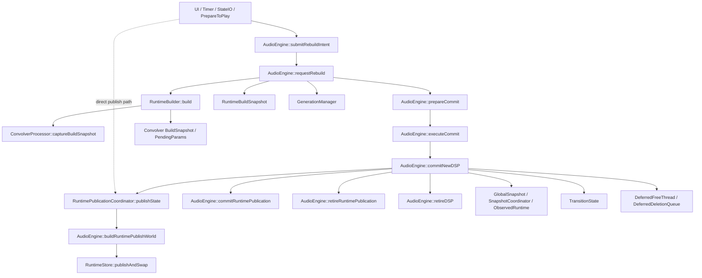

# Authorityトポロジー検証レポート（work12）

作成日: 2026-05-31
対象: ConvoPeq Runtime Authority Topology

---

## 1. レビューの検証結果

### 結論

レビュー主張

> 「ISRコンポーネント群は実装されたが、Runtime全体の権威構造（Authority Topology）はまだ完全収束していない」

は **妥当（Supported）**。

### 根拠（機械抽出）

- `publishState(` 呼び出しが複数経路に分散（grep: 16 hit）
  - 例: `src/audioengine/AudioEngine.Commit.cpp`
  - 例: `src/audioengine/AudioEngine.Processing.PrepareToPlay.cpp`
  - 例: `src/audioengine/AudioEngine.Processing.ReleaseResources.cpp`
  - 例: `src/audioengine/AudioEngine.Timer.cpp`
- commit/publish/retire の中核が `AudioEngine` 側に厚く残存
  - `commitNewDSP`, `prepareCommit`, `executeCommit`, `retireDSP`, `commitRuntimePublication`, `retireRuntimePublication`
- snapshot/build/transition 系が並行して有効
  - `GlobalSnapshot`, `SnapshotCoordinator`, `ObservedRuntime`
  - `RuntimeBuildSnapshot`, `ConvolverProcessor::BuildSnapshot`, `PendingParams`
  - `TransitionState`

### 補足

ISR semantic schema による禁止型・検証テーブルは整備済みだが、実行時の authority 経路としては依然 multi-path が残っている。

---

## 2. Authorityトポロジー依存グラフ

> 出典: grep + Serena + CodeGraph（Full Index 済み）

---

## 3. 単一路化を阻害しているシンボル一覧（優先度付き）

### P0（最優先）

1. `AudioEngine::commitNewDSP`
2. `AudioEngine::prepareCommit`
3. `AudioEngine::executeCommit`
4. `RuntimePublicationCoordinator::publishState`（呼び出し点が複数）
5. `AudioEngine::buildRuntimePublishWorld`
6. `AudioEngine::commitRuntimePublication`
7. `AudioEngine::retireRuntimePublication`
8. `AudioEngine::retireDSP`

**理由**: publish/commit/retire の authority が AudioEngine に集中し、かつ publish 呼び出し経路が複数。

### P1（高）

1. `GlobalSnapshot` / `SnapshotCoordinator` / `ObservedRuntime`
2. `TransitionState`
3. `RuntimeBuildSnapshot`（capture/finalize/seal 系を含む）

**理由**: Runtime world と並行する準権威経路を形成。

### P2（中）

1. `ConvolverProcessor::BuildSnapshot`
2. `ConvolverProcessor::PendingParams`
3. `ConvolverProcessor::captureBuildSnapshot`
4. `ConvolverProcessor::applyBuildSnapshot`
5. `GenerationManager`
6. `DeferredFreeThread`
7. `DeferredDeletionQueue`

**理由**: Build/Retire/GC サブシステムで authority が分散し、単一路設計の境界を曖昧化。

---

## 4. 証跡メモ（抽出サマリ）

- CodeGraph Full Index: 完了（Entities 168713 / Files Indexed 11135）
- CodeGraph Stats: 利用可能（module/class/method/function 抽出可）
- grep
  - `requestRebuild(`: 10 hit
  - `publishState(`: 16 hit
  - `commitRuntimePublication|retireRuntimePublication|buildRuntimePublishWorld|submitRebuildIntent`: 30 hit
  - `GlobalSnapshot|TransitionState|RuntimeBuildSnapshot|BuildSnapshot|PendingParams`: 198 hit
- Serena
  - `src/audioengine/AudioEngine.Commit.cpp`
  - `src/audioengine/AudioEngine.h`
  - `src/ConvolverProcessor.h`
  から対象シンボルを行付き抽出

---

## 5. 判定

現状の Authority Topology は **収束途中**。
単一路化の最短経路は **P0群（commit/publish/retire クラスタ）を1本化** すること。
