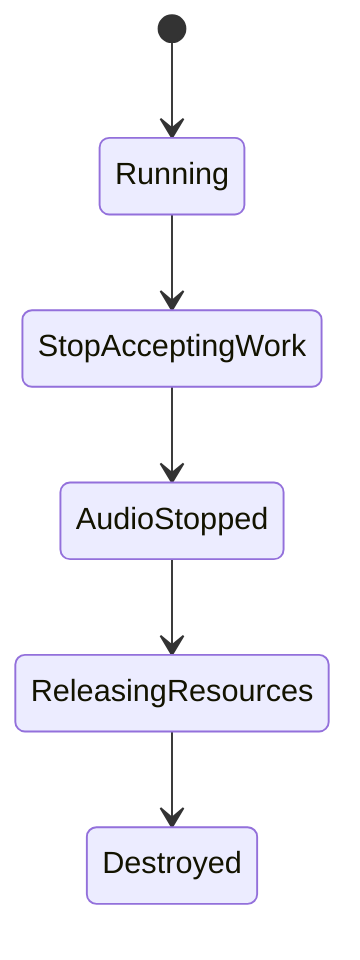

# ConvoPeq ISR Bridge Runtime v5.5 詳細設計（FINAL）

- Project: ConvoPeq
- Date: 2026-05-28
- Source Baseline:
  - `doc/work2/ISR_Bridge_Runtime_v5.5_FINAL_FREEZE_2026-05-28.md`
  - `doc/work2/ConvoPeq_ISR_Bridge_Runtime_v5.5_AI_実装統制規約_FINAL_2026-05-28_LINT.md`
- Design Status: **Detailed Design Freeze Candidate**
- Priority: **DAW実運用耐性 > 理論純度**

---

## 0. 本書の目的

本書は、v5.5 FINAL FREEZE を実装可能な粒度に分解し、AI実装統制規約（Rule-0〜Rule-32）に適合する**実装前提の詳細設計**を定義する。

本書が固定するのは次の3点：

1. 変更対象の責務境界
2. 実装順序（段階導入・ロールバック可能性）
3. 受入判定（shutdown determinism / rebuild determinism / RT boundedness）

---

## 1. 非目的（明示）

以下は本詳細設計で行わない。

- RuntimeGraph の全面再設計
- lock-free 全面化
- immutable purity の強制
- DSPトポロジ全面改変
- 音響仕様の変更（behavior-preserving前提）

---

## 2. Failure Mode と封じ込め方針

対象 failure mode（FREEZE準拠）：

- rebuild storm
- retire saturation
- shutdown race
- stale runtime reuse
- crossfade authority drift
- publication race

封じ込めの優先軸：

1. deterministic shutdown
2. rebuild causality isolation
3. retire backpressure
4. RT visibility separation
5. execution-local mutability

---

## 3. 設計対象と責務境界

## 3.1 対象コンポーネント

- `AudioEngine`（admission / publication / shutdown / rebuild dispatch）
- `RuntimePublicationCoordinator`（intent / prepare / execute / drained）
- `RebuildWorker`（snapshot入力での構築）
- `Crossfade Execution Path`（prepare-activate分離）
- `Retire/Reclaim Path`（queue/fallback/quarantine drain）

## 3.2 スレッド責務（固定）

- Audio Thread: consume-only（可視化済み状態を使用）
- Message Thread: admission / publish / telemetry / lifecycle遷移
- Rebuild Worker: snapshotベース再構築（runtime pointer非参照）

---

## 4. 不変条件（Implementation Invariants）

## 4.1 Admission Invariants

- `acceptsRuntimePublication()` を publication経路の全入口で適用
- shutdown受理フェーズ以降は publication intent を受け付けない

## 4.2 Snapshot Invariants

- `capture -> finalize -> seal -> handoff` の順序固定
- finalize後 mutate禁止
- 同一 semantic input は同一 fingerprint に正規化

## 4.3 Shutdown Invariants

drained 完了条件は以下全成立を必須とする。

- retireQueue empty
- fallbackQueue empty
- quarantine empty
- publicationCoordinator drained
- rebuildWorker stopped

drained後は resurrection を禁止。

## 4.4 RT Invariants

RT pathでは以下禁止：

- lock / wait / heap alloc / filesystem / shared_ptr churn / verbose logging
- runtime authority mutation
- publish意思決定

---

## 5. 詳細設計

## 5.1 Unified Admission Gate 設計

### 5.1.1 API

- `bool acceptsRuntimePublication() const noexcept;`

### 5.1.2 Gate適用ポイント（固定）

- `requestRebuild`
- `appendPublicationIntent`
- `prepareCommit`
- `executeCommit`
- `enqueuePublication` 相当経路

### 5.1.3 振る舞い

Gate不許可時は副作用なしで即 return。

---

## 5.2 RuntimeBuildSnapshot 契約設計

### 5.2.1 主要構成

- `RuntimeBuildFingerprint`
  - `fingerprintVersion`
  - `irIdentityHash`
  - `convolutionConfigHash`
  - `dspParameterHash`
  - `sampleRate`
  - `blockSize`
- `RuntimeBuildSnapshot`
  - generation / sampleRate / blockSize / oversamplingFactor
  - convolver snapshot / parameter block / flags
  - rebuildFingerprint

### 5.2.2 finalize determinism 要件

finalizeは純粋正規化段階であり、以下依存は禁止。

- wall clock
- thread-order
- allocation order
- pointer identity
- environment-derived mutation

### 5.2.3 versioning

fingerprint構成の変更時は `fingerprintVersion` を必ず加算。

---

## 5.3 Rebuild Worker 設計

### 5.3.1 入力契約

worker入力は sealed snapshot のみ。

### 5.3.2 禁止事項

- active/fading runtime pointer参照
- old runtime traversal
- runtime pointer由来の補正

### 5.3.3 許可事項

- readonly snapshotアクセス
- execution-local scratch生成
- deterministic cache materialization

---

## 5.4 Rebuild Collapse 設計

### 5.4.1 deterministic collapse

- latest-generation-wins を強制
- collapse対象は safe-to-collapse rebuild のみ

### 5.4.2 safe-to-collapse 条件（全成立）

- non-committed
- externally invisible
- same rebuild class
- same rebuildFingerprint
- newer equivalent rebuild が存在

### 5.4.3 collapse禁止

- prepareToPlay rebuild
- topology migration rebuild
- shutdown transition rebuild
- runtime recovery / safety rebuild
- cross-class collapse

---

## 5.5 Retire Backpressure 設計

### 5.5.1 しきい値

- `HWM = 3072`
- `LWM = 1024`
- `HWM > LWM` を常に保証

### 5.5.2 scaling clamp

全scaleを $0.75 \le scale \le 1.50$ に強制。

対象：

- sampleRateScale
- irComplexityScale
- oversamplingScale
- memoryPressureScale

### 5.5.3 memoryPressureScale の入力源（許可）

- retire queue depth
- fallback queue depth
- rebuild backlog
- quarantine resident count
- reclaim latency
- publication backlog
- allocation retry count

禁止：OS global memory / DAW process memory / allocator opaque heuristics。

### 5.5.4 saturation semantics

saturation中は stabilization direction only：

- しきい値緩和禁止
- queue拡張志向禁止
- reject/coalescing/obsolete discard は強化方向のみ

### 5.5.5 recovery

- `queueDepth < LWM` で解除判定
- stepwise conservative（例: HWM/LWM を128刻みで緩和）

---

## 5.6 Crossfade Authority Isolation 設計

### 5.6.1 分離方針

- Crossfade初期化は Message Thread の prepare段で確定
- Audio Thread は activate と progression のみ

### 5.6.2 状態モデル

`CrossfadePreparedState`（immutable handoff）:

- preparedGeneration
- fadeSec
- startDelayBlocks
- old/new delay params
- useDryAsOld

### 5.6.3 禁止

- publish後topology mutation
- cross-runtime mutable progression共有

---

## 5.7 Publication / Drain 完了設計

`publicationCoordinator drained` の意味を明確化：

- pending intent なし
- active prepare なし
- pending execute なし
- scheduled retry なし

drained後禁止：

- enqueue resurrection
- deferred retry restart
- publication revival
- rebuild relaunch

---

## 6. 状態機械設計

## 6.1 Lifecycle（単一路線）

独立admission state machineの追加は禁止し、以下に統合：

- `lifecycleState`
- `shutdownPhase`
- `shutdownRuntime_`

## 6.2 Admission 判定

- Running: accept
- それ以外: reject

---

## 7. Telemetry 設計（Telemetry First）

最低限の観測項目（Rule-27）：

- retireQueueDepth
- fallbackQueueDepth
- quarantineResident
- publicationBacklog
- rebuildBacklog
- saturationEnterCount / saturationExitCount
- publicationRejectCount
- rebuildCollapseCount
- reclaimLatency

運用要件：

- RT pathに重い文字列整形ログを入れない
- 集計は非RT側で実施

---

## 8. 実装シーケンス（段階導入）

## 8.1 フェーズ順序（FREEZE固定順）

1. Unified Admission Gate
2. RuntimeBuildSnapshot 完全移行
3. Retire Backpressure Hardening
4. DSP Execution State 分離
5. Crossfade Authority Isolation

## 8.2 コミット粒度

- 1 commit = 1責務
- 各フェーズでコンパイル可能状態を維持
- 各フェーズに rollback point を置く

---

## 9. 検証設計

## 9.1 静的検証

- Gate未適用入口の検出
- worker側 runtime pointer参照の検出
- drained後 resurrection経路の検出
- RT path禁則（mutex/alloc/wait等）検出

## 9.2 挙動検証

- shutdown反復（start/stop連続）
- rebuild burst（UI連続変更）
- saturation誘発（retire backlog負荷）
- crossfade連続遷移

## 9.3 受入判定（DoD）

以下10条件を全満足で完了判定：

1. workerがruntime objectを直接参照しない
2. shutdown中publication不可能
3. saturation policy実装済み
4. rebuild collapse deterministic
5. stale runtime reuse不可能
6. crossfade authority shared mutable state不在
7. RT path mutex/allocation不在
8. deterministic shutdown成立
9. fallback含めdrain deterministic
10. finalize deterministic

---

## 10. Rule トレーサビリティ（要約）

- Rule-0/1: 非rewrite・段階hardening
- Rule-2/31: RT禁則・RT汚染禁止
- Rule-4/5/6/7: snapshot契約・determinism・versioning
- Rule-8/9/10/11: 単一路線admission・publication gate・shutdown封止
- Rule-12/13/14/15: saturation/recovery/clamp/metrics限定
- Rule-16/17/18: collapse determinism・must-execute保護
- Rule-19/20: crossfade authority分離・RuntimeGraphの責務限定
- Rule-21/22/23: retire hardening・drained strict・resurrection禁止
- Rule-24/25/26/27: 小粒度実装・責務維持・telemetry first
- Rule-28/29/30/32: 推測実装禁止・暗黙契約保護・実装前後invariants確認

---

## 11. 実装統制チェックリスト（着手前）

- [ ] 影響範囲（関数単位）列挙済み
- [ ] 変更対象のthread affinity確認済み
- [ ] RT path禁則チェック済み
- [ ] rollback手順定義済み
- [ ] telemetry追加点を先行定義済み
- [ ] フェーズ完了条件を明文化済み
- [ ] drained/resurrectionの否定テスト観点定義済み

---

## 12. 最終判断基準

判断に迷う場合は常に次を優先する：

「DAW 実運用で長時間破綻しないか」

理論的な美しさより、運用上の破綻回避を優先する。

---

## 13. v5.5.1 文書追補（監査是正反映）

本節は `ConvoPeq_ISR_Bridge_Runtime_v5.5_詳細設計_妥当性監査_2026-05-28.md` の是正提案を、最小差分で反映する追補である。

### 13.1 用語統一（publication 経路）

- 正規名: `appendPublicationIntent`
- 旧称: `enqueuePublication`（legacy alias）
- v5.5.1 以降の設計記述では、原則として `appendPublicationIntent` を使用する。

### 13.2 safe-to-collapse 条件の統一

`safe-to-collapse` は以下全成立時のみ許可する。

- UI-driven transient rebuild
- non-committed
- runtime publication not started
- externally invisible（no externally-visible state committed）
- same rebuild class
- same rebuildFingerprint
- newer equivalent rebuild exists

### 13.3 参照型と定義元の事前確定（着手前必須）

実装着手前に、以下の定義元ファイルを確定し、設計レビューで固定する。

| 参照型/識別子 | 定義元 | 備考 |
| --- | --- | --- |
| `RuntimeGeneration` | 実装前に確定（必須） | generation比較の一貫性要件あり |
| `ConvolverBuildSnapshot` | 実装前に確定（必須） | snapshot seal対象 |
| `ParameterBlock` | 実装前に確定（必須） | normalize/finalize入力 |
| `RuntimeFlags` | 実装前に確定（必須） | visibility用途限定 |
| `rebuildClass` | 実装前に確定（必須） | collapse判定キー |

### 13.4 挙動検証の定量化（DoD評価に必須）

9.2 の挙動検証に、以下の最小定量条件を追加する。

- shutdown反復: 500回以上（start/stop）
- rebuild burst: 30 ops/sec を 60 sec 継続
- saturation試験: retire/fallback backlog を意図的に増加させ、`saturationEnterCount` と `saturationExitCount` の整合を確認
- behavior-preserving: null test residual 目標値を事前合意（暫定目安: $\le -120\,\mathrm{dBFS}$）

### 13.5 Rule トレーサビリティ追補（FREEZE Rule-O〜Z）

10章の要約に加えて、FREEZE Rule-O〜Z との対応を明示する。

| FREEZE Rule | DESIGN 対応節 |
| --- | --- |
| Rule-O（scaling clamp） | 5.5.2 |
| Rule-P（monotonic stabilization） | 5.5.4 |
| Rule-Q（runtime-local metrics） | 5.5.3 |
| Rule-R（latest-generation-wins） | 5.4.1 |
| Rule-S（drained resurrection prohibited） | 4.3 / 5.7 |
| Rule-T（finalize determinism） | 4.2 / 5.2.2 |
| Rule-U（stepwise conservative recovery） | 5.5.5 |
| Rule-V（cross-class collapse prohibited） | 5.4.3 |
| Rule-W（finalize timing/environment 非依存） | 5.2.2 |
| Rule-X（saturation 安定化方向のみ） | 5.5.4 |
| Rule-Y（publication drained 定義） | 5.7 |
| Rule-Z（safe-to-collapse 限定） | 5.4.2 |
