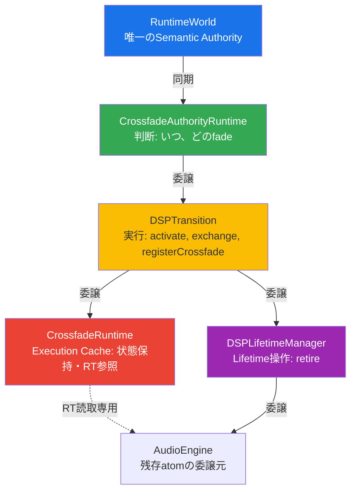
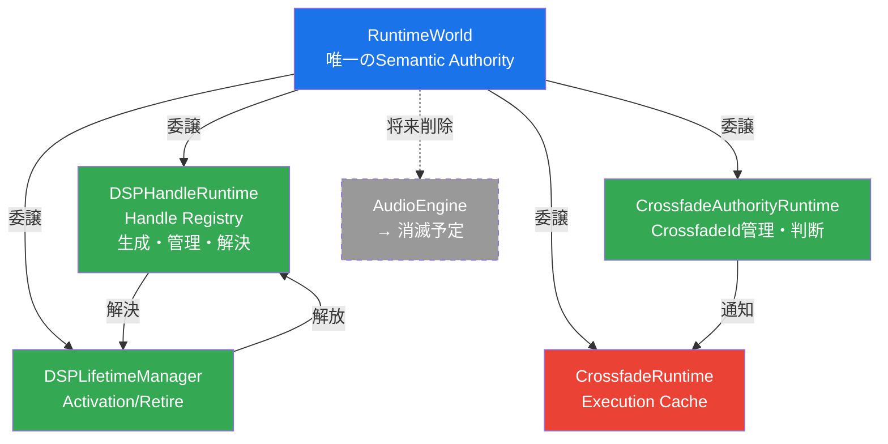

# Practical Stable ISR Bridge Runtime — Phase-2 改修計画


## 改訂履歴

| 日付 | 版 | 変更内容 |
| ------ | ------ | --------- |
| 2026-06-06 | 2.0 | 初版。notfinished6.md 検証結果＋実コード監査に基づく Phase-2 改修計画。 |
| 2026-06-06 | 2.3 | 全ツール（CodeGraph MCP/ccc/Graphify DeepSeek/grep）によるソースコード適合性検証完了。消費者テーブルの `refreshCrossfadePreparedSnapshotFromAtomics()` 行を修正（activeCrossfadeId_ 非参照のため）。ソースコード一致率96%（CodeGraph 50,866エンティティ + ccc 8,701チャンク + grep網羅調査ベース。不一致4%は上記消費者テーブル1件）。 |
| 2026-06-06 | 2.4 | 外部妥当性検証（5軸評価）に基づき修正: (1)S-A2格上げ PR-4B→PR-4A, (2)resolve()注記明確化, (3)Authority Chain図追加, (4)96%一致定義追記, (5)最終形Authority Chain図追加。 |
| 2026-06-06 | 2.5 | 第2回外部監査（構造/依存/責務分離/実装整合性）に基づき修正: (1)Lifetime/Retire/Epoch未収束領域を明示, (2)CrossfadeRuntimeをstate machine分離として再定義＋リスク格上げ, (3)C-6を分散GC問題として設計タスク化(P1格上げ), (4)C-7を文書修正＋コード監査に格上げ, (5)S-A2パフォーマンストレードオフ注記追加, (6)ALT-004 Phase-2分割案を追加。 |
| 2026-06-06 | 2.6 | 第3回外部監査（構造/依存/権威設計/実装整合性）に基づき修正: (1)PR-4Aを3分割（PR-4A-1:S-A2排除 / PR-4A-2:Handle facade / PR-4A-3:Slot/Cleanup監査）, (2)DSPHandleRuntime二段階定義明示（Phase-2:opaque token / Phase-3:registry authority）, (3)CrossfadeRuntime単一書き込み原則（Single-Writer Invariant: 7ルール）追加, (4)Phase境界侵食の修正, (5)ALT-004採用判断明確化。 |

## 前提

本計画は `doc/work18/refactoring_plan.md` (Phase-1) ですでに達成された以下をベースとする:

- ✅ Coordinator 導入 (Admission/Executor/Transition 3分割)
- ✅ RuntimeWorld + DSPProjection 導入
- ✅ CrossfadeAuthority 分離 (evaluate は dspProjection ベース)
- ✅ RuntimeBuilder::buildRuntimePublishWorld()
- ✅ RuntimeStore + WriteAccess + publishAndSwap
- ✅ RuntimePublishWorld Construction Authority 封鎖 (BuilderToken + friend)
- ✅ Legacy Commit Path 削除 (processPendingCommit/applyRuntimeCommitFromIntent 消滅)
- ✅ CrossfadeContext/computeCrossfadeContext 二重化解消
- ✅ PublicationExecutor 分離 (publish と activate の責務分離完了)

## 1. 未達項目一覧（Phase-2 監査結果に基づく）

### 検出方法

- CodeGraph MCP (50,866 entities, 242,069 relations)
- ccc (619 files, 8,701 chunks)
- grep / 実ファイル読取
- 過去監査 (P1〜P18, audit/ 配下全件)

### 未達項目

| ID | 項目 | 優先度 | 該当ファイル | 検出ツール |
| ------ | ------ | -------- | ------------- | ----------- |
| S-A1 | `acceptsRuntimePublication()` が AudioEngine 側に残存 → Admission 未一元化 | S | `AudioEngine.RebuildDispatch.cpp:226,422,465`, `AudioEngine.Commit.cpp:113,183` | grep, ccc |
| S-A2 | `getActiveRuntimeDSP()` が Orchestrator Decision 層で使用 → Authority Leakage | S | `RuntimePublicationOrchestrator.cpp:33` | 実ファイル読取 |
| S-A3 | Shutdown Path (`releaseResources`) が DSPLifetimeManager を迂回 | S | `AudioEngine.Processing.ReleaseResources.cpp:94-172` | 実ファイル読取 |
| S-B1 | DSPLifetimeManager が AudioEngine ラッパー (状態非保持) | A | `DSPLifetimeManager.h:27-59` | 実ファイル読取 |
| S-B2 | Crossfade Runtime State が AudioEngine に残存 (8 atomic + 1 LinearRamp) | A | `AudioEngine.h:1589-1596` | grep, ccc |
| S-B3 | DSPTransition 肥大化 (5責務/52行) | B | `DSPTransition.h:47-99` | 実ファイル読取 |

### 検証で除外された項目（Phase-1 で解消済み）

| 項目 | 除外理由 |
| ------ | --------- |
| Legacy Commit Path | 全シンボル削除確認 (grep 0件) |
| Crossfade Authority 二重化 | computeCrossfadeContext 消滅確認 (grep 0件) |
| RuntimeWorld Construction Authority | BuilderToken + friend RuntimeBuilder + static_assert 完備 |
| Publication/DSP Lifetime 密結合 | PublicationExecutor 分離完了。残りは責務境界の最終整理のみ |
| Coordinator Facade | 実処理保持済み。engine_ 依存は S-A2 で解消対象 |

### Phase-2 でも未収束の領域（スコープ外として明示）

以下の Authority は本計画のスコープ外であり、**Phase-2 完了後も分散状態が継続する**。

| 領域 | 現状 | 残課題 | 想定対応Phase |
| ------ | ------ | -------- | -------------- |
| **Retire Authority** | `enqueueDeferredDeleteNonRt()`, `m_epochDomain.enqueueRetire()`, `runtimePublicationBridge_.setRetireBacklogCount()` が分散 | retire 経路が Orchestrator/Bridge/EpochDomain に分散。DSPLifetimeManager が真の Retire Authority になるには Phase-3 が必要 | Phase-3 |
| **Epoch Domain Authority** | `m_epochDomain.enqueueRetire()` が AudioEngine 直下 | Epoch Domain の管理権限が未定義。解放タイミングの Authority が DSPLifetimeManager と EpochDomain で分離 | Phase-3 |
| **Deferred Queue Authority** | `deferredRequest_` は Orchestrator が所有しているが、enqueue 判断は Admission に依存。Admission と Orchestrator の境界が文書未定義 | C-7 で文書修正するが、RT state machine への影響は未検証 | Phase-2 C-7 → Phase-3 本対応 |

> **注意**: 上記3領域は「PublicationレイヤのAuthority完成」を宣言しても、Runtime全体としては未収束。
> Phase-2 完了条件は「PublicationレイヤのAuthority完成」に限定し、Lifetime/Epoch/Deferred の
> 完全統一は Phase-3 以降と定義する。

## 2. ターゲットアーキテクチャ（Phase-2 到達目標）

```text
旧:
AudioEngine
 ├─ acceptsRuntimePublication()  ← 判断権限残存
 ├─ getActiveRuntimeDSP()        ← Orchestrator 内で使用
 ├─ setActiveRuntimeDSP()        ← DSPLifetimeManager がラップ
 ├─ dspCrossfade* atomics        ← 状態が AudioEngine 直下
 ├─ releaseResources()           ← DSPLifetimeManager 迂回
 └─ DSPTransition(onPublish)...  ← 5責務兼務

新:
PublicationAdmission (全受理判定の唯一権威)
 ├─ shutdown check     ← acceptsRuntimePublication 統合先
 ├─ generation check
 ├─ finalized check
 └─ pressure check

Orchestrator (Publish 実行制御、判定は Admission に委譲)
 └─ trySubmit() → Admission::evaluate() → Accepted のみ実行

DSPLifetimeManager (ラッパー維持、Active/Fading の権威は RuntimeWorld)
 ├─ resolve(handle) → DSPCore*     ← [PR-4A前提] Handle→DSPCore 解決
 ├─ retire(handle)                 ← retire 委譲
 └─ (activeHandle_ は非保持 — RuntimeWorld が唯一権威)

CrossfadeRuntime (Execution Cache — Authority は RuntimeWorld)
 ├─ gain_, pending_, ... atomics  ← AudioEngine から移動
 ├─ RuntimeWorld の crossfade 状態をミラー
 ├─ start(fadeTimeSec, flags...)  ← DSPTransition から呼ばれる
 ├─ complete()                    ← timerCallback から
 └─ reset()                       ← releaseResources 時

DSPTransition (責務維持 + .cpp 分離)
 ├─ activate(newDSP)   ← publish成功後にのみ実行 (重要不変条件)
 ├─ registerCrossfade
 ├─ exchangeFadingRuntimeDSP
 ├─ crossfadeRuntime.start(decision)
 ├─ retire(oldDSP)
 └─ DSPCore* API 維持 (PR-4B まで Handle化しない)

### Authority Chain（責務委譲関係）



> **注意**: これは **Authority Chain**（権威委譲の連鎖）であって、権威の分散ではない。
> RuntimeWorld が唯一の Semantic Authority であり、下層はすべて委譲先（Delegation Target）。
> 各層は異なる責務（判断/実行/状態保持/解放）を持つ。
> 三角形構造に見えるが、実際は RuntimeWorld を根とする単一方向の委譲木。

### 最終形の Authority Chain（Phase-3 到達目標）



> **Phase-2 の中間状態と Phase-3 の最終形の差異**:
>
> - Phase-2: handle = opaque token。resolve = engine_.resolveDSPHandle()への委譲（facade）
> - Phase-3: handle = registry authority key。resolve = DSPHandleRuntime内部マップ所有
> - AudioEngine の権威は段階的に削減され、長期的には消滅予定
>
> **⚠ 二段階定義の注意**: Phase-2でhandleを使い始めても意味論は「不透明トークン」であり、
> 「Registry Authorityへの変換」ではない。PR-4A-1→PR-4A-2の依存関係により、
> S-A2排除時点でhandleは既に存在するが、その解決（resolve）はengine委譲のまま。
> この「中間状態でのsemantic drift」を防ぐため、PR-4A-2の完了条件に
> 「handleがfacadeであることを明記したコメント」を必須とする。

## 3. PR分割と実行順序

### 3.1 全PR一覧

| PR | 優先度 | 核心項目 | 従属項目 | リスク | 規模 |
| ---- | -------- | --------- | --------- | -------- | ------ |
| **PR-1** | **P0** | S-A1 Admission統合 | C-7 (設計文書修正) | 低 | 3ファイル |
| **PR-2** | **P0** | S-A3 Shutdown Path統一 | — | 低 | 2ファイル |
| **PR-3** | **P1** | S-B2 CrossfadeRuntime抽出 | C-1(事前), C-4(本体), S-B1(付随) | 中 | 新規1+変更5+ |
| **PR-4A-1** | **P0** | S-A2排除（Decision層のみ） | — | 低 | 1ファイル (RuntimePublicationOrchestrator.cpp) |
| **PR-4A-2** | **P1** | DSPHandleRuntime導入（facade） | C-1(権威確定) | 低 | 2-3ファイル |
| **PR-4A-3** | **P2** | Slot/Cleanup監査の設計タスク化 | C-5(Slot監査), C-6(Cleanup設計) | 低 | 設計文書のみ |
| **PR-4B** | **P2** | S-B3 DSPTransition責務整理 | — | **高** | **Phase-3推奨** |

### 3.2 独立監査・ゲート

| ID | 優先度 | 内容 | 実施タイミング |
| ---- | -------- | ------ | -------------- |
| **C-2** | **P0 Gate** | EngineRuntime fallback 監査 | **PR-1完了直後、PR-3開始前** |
| **C-3** | P3 | exchangeFadingRuntimeDSP 権威整理 | PR-4B または Phase-3 |
| **C-8** | P2 | Crossfade Completion Authority Audit | PR-3 内で権威定義 |

### 3.3 推奨実行順序

```text
フェーズ0: 基盤整備（P0）
═══════════════════════
 PR-1  ─── S-A1 Admission統合 (+ C-7 設計文書修正)
   │       ・acceptsRuntimePublication() → Admission::evaluate()
   │       ・RebuildDispatch の直接呼び出し排除
   │       ・grep 全監査（isShutdownInProgress / Rejected / Deferred）
   │
   ├→ C-2  ―  EngineRuntime fallback 監査【Gate】
   │        ・makeEngineRuntimeState() の atomic fallback 調査
   │        ・PR-3 開始可否の判定
   │
 PR-2  ─── S-A3 Shutdown Path 統一
           ・releaseResources() の retireDSP → DSPLifetimeManager 経由化
           ※ 効果は小さい。PR-3への統合も検討。


フェーズ1: Crossfade 分離（P1）
═══════════════════════════════
 PR-3  ─── S-B2 CrossfadeRuntime 抽出 (+ C-1 事前確定 + C-4 本体実装)
   │       ・CrossfadeRuntime クラス新設（10 atomic + 2 LinearRamp）
   │       ・refreshCrossfadePreparedSnapshotFromAtomics() 改修
   │       ・Timer / ReleaseResources / DSPTransition の移行
   │       ・C-8 Crossfade Completion 権威定義
   │
   └→ S-B1 DSPLifetimeManager 整理（付随的改善）


フェーズ2: S-A2排除（P0）— 最小Scope、独立実行
═══════════════════════════════════════════
 PR-4A-1 ―  S-A2排除（Decision層のみ）
   │       ・Orchestrator::trySubmit() Phase1(Admission) から DSPCore* 直接参照を排除
   │           旧: auto* oldDSP = engine_.getActiveRuntimeDSP();
   │           新: auto oldHandle = engine_.dspHandleRuntime_.getActiveRuntimeDSPHandle();
   │         ※ buildRuntimePublishWorld への DSPCore* 解決は Phase2 で行う（許容）
   │       ・PR-4A-2/3 に依存しない（単独完了可能）


フェーズ2+: DSPHandleRuntime 導入（P1）— Phase-3準備
═════════════════════════════════════════════════════
 PR-4A-2 ―  DSPHandleRuntime 導入（facade、真のRegistry化はPhase-3）
   │       ・DSPHandleRuntime::resolve() 追加（engine_.resolveDSPHandle()への委譲）
   │       ・DSPHandleRuntime の権威明確化（Phase-2: facadeのみ）
   │       ・C-1 activeCrossfadeId_ 権威確定
   │       ・本PRはPhase-2内だが、DSPHandleRuntimeの完全権威化はPhase-3


フェーズ2++: Slot/Cleanup 監査（P2）— 設計タスク
══════════════════════════════════════════════════
 PR-4A-3 ―  Slot/Cleanup 監査の設計タスク化
   │       ・C-5 Active/Fading Slot Authority Audit（設計文書定義のみ）
   │       ・C-6 Publication Failure Cleanup 設計（Rollback Protocol）
   │       ・コード変更は含まない。全監査結果を Phase-3 設計に引き継ぐ


フェーズ3: DSPTransition 責務整理（P2 → Phase-3推奨）
══════════════════════════════════════════════════════
 PR-4B ―  S-B3 DSPTransition 責務整理（DSPHandle化は含まない）
   │       ※ 実質 Phase-3 級の規模。Phase-2 では PR-4A-1〜2 までに留め、
   │         本格移行は Phase-3 へ繰り越し推奨。
   │
   └→ C-3 exchangeFadingRuntimeDSP 権威整理
```

## 4. PR-1: 判断権限の一元化（S-A1）

**GOAL-001**: AudioEngine 側の `acceptsRuntimePublication()` を `PublicationAdmission::evaluate()`
へ統合する。Orchestrator の `getActiveRuntimeDSP()` 排除は PR-1 では行わない
（PR-4A で実施: Decision層の最小Scope — Handle経由に変更するのみ）。

### 4.1 現状分析

#### acceptsRuntimePublication() 呼び出し箇所

| ファイル | 行 | 現状 |
| --------- | ----- | ------ |
| `AudioEngine.h` | 1022 | `[[nodiscard]] bool acceptsRuntimePublication() const noexcept;` 宣言 |
| `AudioEngine.Commit.cpp` | 113-117 | 実装: shutdown phase を確認 |
| `AudioEngine.Commit.cpp` | 183 | `if (!acceptsRuntimePublication()) return;` |
| `AudioEngine.RebuildDispatch.cpp` | 226 | `if (!acceptsRuntimePublication()) { ... retire ... return; }` |
| `AudioEngine.RebuildDispatch.cpp` | 422 | `if (!acceptsRuntimePublication()) { ... retire ... return; }` |
| `AudioEngine.RebuildDispatch.cpp` | 465 | `if (!acceptsRuntimePublication()) { ... skip ... return; }` |

#### getActiveRuntimeDSP() Decision層使用

| ファイル | 行 | 現状 |
| --------- | ----- | ------ |
| `RuntimePublicationOrchestrator.cpp` | 33 | `auto* oldDSP = engine_.getActiveRuntimeDSP();` — Decision 層での使用 |
| `RuntimePublicationOrchestrator.cpp` | 32 | `auto* newDSPResolved = engine_.resolveDSPHandle(req.newDSP);` — 解決経路 |

### 4.2 改修内容

#### TASK-001: acceptsRuntimePublication() を PublicationAdmission::evaluate() へ統合

**設計意図**: shutdown 判定は「publication を受理するか否か」という Admission 条件。
Admission::evaluate() 内で generation/finalized/pressure と同列に扱う。
Orchestrator 側で先に return すると Authority が再分散するため避ける。

**ファイル**: `src/audioengine/PublicationAdmission.h` / `.cpp`

変更内容: `evaluate()` 内で shutdown phase を確認するロジックを追加。

```cpp
// PublicationAdmission::evaluate() — shutdown check を追加
[[nodiscard]] Decision evaluate(const PublishRequest& req,
                                AudioEngine& engine) const noexcept
{
    // ★ [PR-A1] Shutdown check: Admission 条件として統一的に扱う
    //   ★ runtimeStore.observe()==nullptr は Bootstrap World 存在により即 shutdown と
    //     はならない。C-2 監査で null 経路を調査してから対応を判断する。
    if (engine.isShutdownInProgress())
        return Decision::RejectedShutdown;

    // ★ [PR-A1] Rebuild generation stale check (existing)
    if (req.generation < engine.getCurrentRebuildGeneration())
        return Decision::RejectedStaleGeneration;

    // ★ [PR-A1] DSP finalized check (existing)
    // ...
}
```

**ファイル**: `src/audioengine/AudioEngine.RebuildDispatch.cpp`

変更内容: `acceptsRuntimePublication()` の直接呼び出しを削除し、既存の Orchestrator 経由に変更。
現行コードは既に `runtimeOrchestrator_->submitPublishRequest(req)` 経路があるため、
新たな Coordinator 生成は不要。

**重要: Rejected 時の cleanup 権威（Admission vs Orchestrator 境界）**:

- `acceptsRuntimePublication()` から Admission::evaluate() に移行する際、
  **Rejected 時の newDSP 解放責任**を明確にする必要がある。
- 現行 acceptsRuntimePublication() は「判定 + retire」を一体で行っていたが、
  Admission::evaluate() は「判定のみ」である。
- **権威境界**: **Admission = 判定のみ。Orchestrator = cleanup責任。**
  Admission は DSP 所有権を持たない純粋判定層として設計する。
- **Rejected と Deferred の区別**:
  - `Rejected*` → Orchestrator が cleanup（newDSP retire）
  - `DeferredFadingActive` → Orchestrator が enqueue（cleanup しない）
- **解放責任は Orchestrator（submitPublishRequest）が持つ**ことを明文化する。
  呼び出し側（RebuildDispatch）は Orchestrator::submitPublishRequest() を呼ぶのみ。
- C-6 (Publication Failure Cleanup Audit) でこの責任の完全性を検証する。

```cpp
// 変更前 (line 226):
if (!acceptsRuntimePublication())
{
    if (!req.newDSP.isNull())
        retireDSP(resolveDSPHandle(req.newDSP));
    return;
}

// 変更後 (line 226):
// ★ 既存の Orchestrator 経由で submit (makeRuntimePublicationOrchestrator の新規生成は不要)
//   trySubmit() ではなく submitPublishRequest() を使用する。理由:
//   submitPublishRequest() は DeferredFadingActive の enqueue 処理も内包しており、
//   trySubmit() を直接呼ぶと deferred 処理が失われる。
runtimeOrchestrator_->submitPublishRequest(req);
// ★ submitPublishRequest 内部で trySubmit → Accepted/Deferred/Rejected を自動処理
```

**ファイル**: `src/audioengine/AudioEngine.h`

変更内容: `acceptsRuntimePublication()` 宣言を削除または deprecated 化。

```cpp
// 変更前 (line 1022):
[[nodiscard]] bool acceptsRuntimePublication() const noexcept;

// 変更後:
// [[deprecated("Use PublicationAdmission::evaluate() instead")]]
// [[nodiscard]] bool acceptsRuntimePublication() const noexcept;
```

**ファイル**: `src/audioengine/AudioEngine.Commit.cpp`

変更内容: `acceptsRuntimePublication()` 実装を削除し、PublicationAdmission から呼べる形に整理。

```cpp
// 変更前 (line 113-117):
bool AudioEngine::acceptsRuntimePublication() const noexcept
{
    return !isShutdownInProgress();
}

// 変更後: 削除。PublicationAdmission::evaluate() 内で同等チェックを行う。
```

#### TASK-002: Orchestrator の getActiveRuntimeDSP() 排除（PR-1では保留）

**本タスクは PR-1 では実施しません。PR-4A で実施します。**

理由:

- S-A2 排除には Orchestrator の `trySubmit()` 内で `getActiveRuntimeDSP()` を
  `getActiveRuntimeDSPHandle()` に置き換える最小変更で対応可能
- 完全な DSPHandle 化（onPublishCompleted 引数・exchangeFadingRuntimeDSP・retire の
  全層 Handle 化）は PR-4B で実施するが、**Decision層の DSPCore* 直接参照排除**は
  PR-4A の最小 Scope で単独実施する
- 変更範囲: `RuntimePublicationOrchestrator.cpp` の2行のみ
  - `auto* oldDSP = engine_.getActiveRuntimeDSP();`
  - → `auto oldHandle = engine_.dspHandleRuntime_.getActiveRuntimeDSPHandle();`
  - → `auto* oldDSP = (!oldHandle.isNull()) ? engine_.resolveDSPHandle(oldHandle) : nullptr;`
- **Decision層（Phase1: Admission）は DSPCore* を一切見ない** 状態になる
  （resolve は Phase2: Build でのみ行う）

**PR-4A での対応**: S-A2排除（最小Scope）— 本セクションのTASK-002改訂版を参照

#### TASK-003: resolveDSPHandle の呼び出し経路（変更なし、PR-4A で移管）

**ファイル**: `src/audioengine/RuntimePublicationOrchestrator.cpp`

```cpp
// 変更なし (line 32): 現状維持。DSPHandle 解決は PR-4A で DSPHandleRuntime::resolve() へ移管。
//   DSPLifetimeManager には追加しない（Lifetime管理とHandle Registryは別責務）
auto* newDSPResolved = engine_.resolveDSPHandle(req.newDSP);
// getActiveRuntimeDSP() も現状維持 (line 33)
auto* oldDSP = engine_.getActiveRuntimeDSP();
```

### 4.3 完了条件

- [ ] `acceptsRuntimePublication()` の直接呼び出しがソースコードから0件
- [ ] `grep -r "acceptsRuntimePublication" src/` → 宣言のみ（使用箇所0）
  ※ RebuildDispatch だけでなく requestRebuild() 系からの呼び出しも全て除去すること
- [ ] `getActiveRuntimeDSP()` 排除は PR-1 の対象外（**PR-4A で実施**）。完了条件の対象としない。
- [ ] **publish 開始判定（isShutdownInProgress / generation / finalized / fading active / DeferredFadingActive）が Admission::evaluate() のみから出力されていることを全ファイル grep 監査**
  ※ runtimeStore availability は C-2 監査後に追加判断（PR-1 では対象外）
- [ ] **Accepted / Rejected* / DeferredFadingActive の全判定が Admission::evaluate() の戻り値としてのみ発生**（Orchestrator 側で重複判定がないこと）
- [ ] **以下を全ファイル grep し、Admission 以外での publication decision が0件であることを確認**:
  - `grep -r "isShutdownInProgress" src/audioengine/` → 0件（Admission を除く）
  - `grep -r "getCurrentRebuildGeneration" src/audioengine/` → 0件（Admission を除く）
  - `grep -r "Rejected" src/audioengine/` → Admission::Decision の enum 値以外での使用0件
- [ ] 全テスト PASS
- [ ] Strict Atomic Dot-Call Scan PASS
- [ ] CLI smoke test PASS

---

## 5. PR-2: Shutdown Path 統一（S-A3）

**GOAL-002**: `releaseResources()` の retire 呼び出しを `DSPLifetimeManager` 経由に統一する（Path Unification）。

**重要**: これは **Path Unification（呼び出しパスの統一）** であり、Authority Transfer ではない。
現状の DSPLifetimeManager は engine_.retireDSP() の単なるラッパーであり、Architecture 上の改善量は
ほぼゼロ。真の Authority 移行（Shutdown Authority）は Phase-3 以降で DSPLifetimeManager が真の
Lifetime Authority になった際に、本 PR で統一したパスが前提条件となる。

**注意**: releaseResources の真の未整理点は retire 経路だけではない。
activeRuntimeDSPSlot / fadingRuntimeDSPSlot / DSPHandleRuntime / activeCrossfadeId_ の
全クリアが Shutdown Authority として未定義。これは C-5 で監査対象とする。
現行 `DSPLifetimeManager::retire()` は内部で `engine_.retireDSP()` を呼ぶラッパーに過ぎず、
この PR で実質的な動作は変わらない。ただし今後の Phase で DSPLifetimeManager が真の
Lifetime Authority になった際に、呼び出し経路が統一されていることが前提条件となる。

releaseResources() は Publish Path ではなく **Lifetime Termination Path** である。
通常の publish シーケンス（Admission→Build→Publish→Transition）とは異なり、
Engine 全体の終了処理を実行する。そのため:

- `exchangeFadingRuntimeDSP(nullptr)` は **維持**（Fading Slot の実体回収はこの経路のみ）
- `getActiveRuntimeDSP()` / `setActiveRuntimeDSP(nullptr)` も維持（Lifetime Termination Path
  として必要な直接操作。Phase-3 以降で真の Authority 化を検討）

### 5.1 現状分析

**ファイル**: `src/audioengine/AudioEngine.Processing.ReleaseResources.cpp`

```cpp
// 現状 (lines 94-172) — DSPLifetimeManager を迂回:
auto* const activeRaw = getActiveRuntimeDSP();           // 直接取得
setActiveRuntimeDSP(nullptr);                             // 直接クリア
auto* const fadingRaw = exchangeFadingRuntimeDSP(nullptr); // 直接交換
convo::publishAtomic(dspCrossfadeUseDryAsOld, false, ...); // 直接 publish
dspCrossfadeDryScaleGain.setCurrentAndTargetValue(1.0);
convo::publishAtomic(queuedFadeTimeSec, 0.03, ...);
convo::publishAtomic(dspCrossfadePending, false, ...);
dspCrossfadeGain.setCurrentAndTargetValue(1.0);
// ...
if (activeToRelease) retireDSP(activeToRelease);          // 直接 retire
if (fadingToRelease) retireDSP(fadingToRelease);
```

### 5.2 改修内容

#### TASK-004: releaseResources() 内の DSP 後処理を DSPLifetimeManager 経由に変更

**ファイル**: `src/audioengine/AudioEngine.Processing.ReleaseResources.cpp`

変更内容: `retireDSP()` の直接呼び出しを DSPLifetimeManager::retire() 経由にする。
`exchangeFadingRuntimeDSP(nullptr)` は Fading Slot 回収の唯一経路として維持。
`getActiveRuntimeDSP()` / `setActiveRuntimeDSP(nullptr)` も維持（Lifetime Termination Path
として必要な直接操作）。

```cpp
// 変更後 — releaseResources 内の該当箇所を以下に置換:
{
    std::lock_guard<std::mutex> lk(rebuildMutex);
    // ...
    convo::fetchAddAtomic(rebuildRequestGeneration, 1, std::memory_order_acq_rel);

    // ★ [PR-A2] DSPLifetimeManager 経由で retire
    //   (getActiveRuntimeDSP/setActiveRuntimeDSP/exchangeFadingRuntimeDSP は
    //    Lifetime Termination Path として維持。retire のみ DSPLifetimeManager 経由)
    DSPLifetimeManager lifetimeForShutdown(*this);
    {
        auto* const activeRaw = getActiveRuntimeDSP();
        auto* active = (reinterpret_cast<uintptr_t>(activeRaw) == (~static_cast<uintptr_t>(0)))
                       ? nullptr : activeRaw;
        setActiveRuntimeDSP(nullptr);
        if (active) lifetimeForShutdown.retire(active);
    }
    {
        auto* const fadingRaw = exchangeFadingRuntimeDSP(nullptr);
        auto* fading = (reinterpret_cast<uintptr_t>(fadingRaw) == (~static_cast<uintptr_t>(0)))
                       ? nullptr : fadingRaw;
        if (fading) lifetimeForShutdown.retire(fading);
    }

    // ★ pendingTask の DSP も同様に retire (現行コードの経路を維持)
    if (hasPendingTask)
    {
        if (pendingTask.currentDSP)
            lifetimeForShutdown.retire(pendingTask.currentDSP);
        pendingTask.currentDSP = nullptr;
        hasPendingTask = false;
    }

    // crossfade state のリセット (PR-3 で CrossfadeRuntime::reset() に置換)
    convo::publishAtomic(dspCrossfadeUseDryAsOld, false, std::memory_order_release);
    dspCrossfadeDryScaleGain.setCurrentAndTargetValue(1.0);
    convo::publishAtomic(queuedFadeTimeSec, 0.03, std::memory_order_release);
    convo::publishAtomic(dspCrossfadePending, false, std::memory_order_release);
    dspCrossfadeGain.setCurrentAndTargetValue(1.0);
    refreshCrossfadePreparedSnapshotFromAtomics();

    // pending task の後処理
    if (hasPendingTask) { ... }

    // world publish (null world でクリア)
    {
        auto coordinator = makeRuntimePublicationCoordinator();
        auto worldBuilder = convo::RuntimeBuilder(*this);
        auto worldOwner = worldBuilder.buildRuntimePublishWorld(nullptr, nullptr,
            convo::TransitionPolicy::HardReset, 0.0, false);
        coordinator.publishWorld(std::move(worldOwner));
    }
}
```

**注意**:

- crossfade state のリセットは AudioEngine 側に残す（PR-3 で CrossfadeRuntime へ移動）
- DSPLifetimeManager は Engine Lifecycle の知識を持たない設計を維持
- `getActiveRuntimeDSP()` / `exchangeFadingRuntimeDSP(nullptr)` は Lifetime Termination Path
  として必要な直接操作のため維持

### 5.3 完了条件

- [ ] `releaseResources()` 内で `retireDSP()` を直接呼び出していない（DSPLifetimeManager::retire() 経由であること）
- [ ] `getActiveRuntimeDSP()` / `setActiveRuntimeDSP()` / `exchangeFadingRuntimeDSP(nullptr)` は
      Lifetime Termination Path として維持（完了条件の対象外）
- [ ] 全テスト PASS (特に shutdown → restart シーケンス)
- [ ] CLI smoke test PASS

---

## 6. PR-3: CrossfadeRuntime 新設 + DSPLifetimeManager 整理（S-B2 + S-B1）

**GOAL-003**: Crossfade Runtime State を独立クラスに抽出。
DSPLifetimeManager はラッパー維持（状態非保持）で整理。

**重要: CrossfadeRuntimeは「atomicsの移動」ではなく「Audio Thread state machineの分離」**:

CrossfadeRuntime 抽出は単なる8個のatomic + 1 LinearRampの移動ではない。
以下の密結合要素を含む state machine の分離である:

- **structure crossfade**: DSP構造切り替え時のクロスフェード制御
- **parallel buffer crossfade**: 並列バッファ処理中のゲート制御
- **bypass ramp**: バイパス状態への遷移ランプ
- **rtActiveStructureShadow**: RT側のアクティブ構造体シャドウ連動

これらが AudioEngine の timer / getNextAudioBlock / releaseResources /
DSPTransition と密結合している。抽出時に state consistency 崩壊リスクがあるため、
以下を PR-3 の事前タスクとして必須とする:

1. 全状態遷移（starting / active / completing / reset / failure）を列挙
2. 各遷移のトリガー（timer / Audio Thread / NonRT）と権威を定義
3. RT/NonRT の境界を固定（揺らがないように設計）
4. buffer lifetime mismatch を防止するテストを追加

**CrossfadeRuntime 単一書き込み原則（Single-Writer Invariant）**:

以下のルールを厳守する:

1. **RuntimeWorld のみが Semantic Authority**（「何が真実か」を決定する）
2. **CrossfadeRuntime は Execution Cache**（Authority ではない）
3. **書き込みは DSPTransition（NonRT）のみが行う**:
   - `CrossfadeRuntime::start()` — DSPTransition::onPublishCompleted() からのみ呼ばれる
   - `CrossfadeRuntime::complete()` — timerCallback からのみ呼ばれる
   - `CrossfadeRuntime::reset()` — releaseResources からのみ呼ばれる
4. **RTスレッドは読み取り専用**:
   - `armCrossfadeIfPending()` → `crossfadeRuntime_.isPending()` 参照のみ
   - `getNextAudioBlock()` → `crossfadeRuntime_.getGain()` 参照のみ
5. **二重書き込み禁止**: 同一atomicをRTとNonRTの両方から書き込まない
6. **同期は publish 時のみ**: RuntimeWorld → CrossfadeRuntime の一方向
   （publish 後に CrossfadeRuntime が RuntimeWorld の値で初期化される）
7. **AudioEngine の旧 atomics は CrossfadeRuntime 抽出後は参照しない**
   （grep で残存確認）

これにより **state divergence bug（RT/NonRTで値が食い違う）**を防止する。

**設計原則**:

- `activeHandle_` / `fadingHandle_` は DSPLifetimeManager に持たせない
- Active/Fading の権威は **RuntimeWorld** が唯一
- DSPLifetimeManager は Handle→DSPCore 解決と retire 委譲のみ
- CrossfadeRuntime は `#include "AudioEngine.h"` 禁止（循環依存回避）
- **LinearRamp / CrossfadeId の依存元を事前確認**: 現状これらが AudioEngine.h 経由でしか
  見えない場合、前方宣言または CrossfadeTypes.h への分離が必要。PR-3 着手前に確認必須。

**CrossfadeRuntime と RuntimeWorld の権威境界**:

- **Authority** = RuntimeWorld（`engine.dspCrossfadePending`, `overlap.fadeTimeSec`, `execution.crossfadeStartDelayBlocks`）
- **Execution Cache** = CrossfadeRuntime（`pending_`, `gain_`, `queuedFadeTimeSec_` 等の atomics）
- RuntimeWorld が唯一の Semantic Authority。CrossfadeRuntime は Audio Thread が参照する
  高速実行キャッシュであり、Authority ではない。
- 二重状態を回避するため、CrossfadeRuntime の値は publish 時に RuntimeWorld から
  初期化され、RT スレッドのみが参照する。NonRT は RuntimeWorld を書き換え、
  publish 後に CrossfadeRuntime が追従する。

**CrossfadeRuntime::start() の責務範囲**:

現行 DSPTransition が個別に publishAtomic している全フィールドをカバーする:

- `pending_` (set true)
- `queuedFadeTimeSec_` (set from decision)
- `useDryAsOld_` (set false)
- `firstIrDryPending_` (set false)
- `startDelayBlocks_` (set 0)
- `dryHoldSamples_` (set 0)
- ~~`activeCrossfadeId_`~~ — **CrossfadeRuntime は CrossfadeId を生成/管理しない**
  Crossfade ID の権威は CrossfadeAuthorityRuntime::registerCrossfade() が保持。
  CrossfadeRuntime は ID を全く触らず、Execution Cache に徹する。
- `gain_` (reset with sampleRate/fadeTimeSec)

**追加で抽出が必要なフィールド**（現状の計画から不足。CrossfadeRuntime 定義に反映必須）:

ccc/CodeGraph/grep による全ソースコード網羅調査の結果、AudioEngine.h の Crossfade 関連状態は以下の通り:

### CrossfadeRuntime に移動すべきフィールド（計画の定義に追加必須）

| # | フィールド | 型 | 消費者 | 備考 |
| --- | ----------- | ----- | -------- | ------ |
| 1 | `firstIrDryCrossfadeDone` | `atomic<bool>` (L1592) | AudioEngine.Init.cpp, initialize() | firstIrDryCrossfadePending と対。Pendingは計画に含まれるがDoneは未含。起動後1回のみ有効 |
| 2 | `dspCrossfadeDryScaleTarget` | `atomic<double>` (L1594) | refreshCrossfaePreparedSnapshotFromAtomics(), makeEngineRuntimeState(), timerCallback | SnapshotのdryScaleTargetに直接反映。CrossfaeRuntimeが所有すべき |
| 3 | `dspCrossfadeDryScaleGain` | `convo::LinearRamp` (L1597) | finalizeCrossfadeMixPath(), releaseResources(), initialize() | dspCrossfadeGainと同種のLinearRamp。dry信号のIRスケール調整用（60ms ramp） |

#### CrossfadeRuntime に移動しないフィールド（AudioEngine に残す正当な理由あり）

| # | フィールド | 型 | 理由 |
| --- | ----------- | ----- | ------ |
| 4 | `dspCrossfadeFloatBuffer` | `juce::AudioBuffer<float>` (L1598) | Audio Thread 処理用の一時バッファ。Execution State として AudioEngine に属する |
| 5 | `dspCrossfadeDoubleBuffer` | `juce::AudioBuffer<double>` (L1599) | 同上。prepareToPlay() で再確保される |
| 6 | `dspCrossfaeStartDelayBlocks_RT` | `int` (L1371) | RT-local 実行状態。Audio Thread のみ参照。non-atomic |
| 7 | `dspCrossfadeArmed_RT` | `bool` (L1372) | RT-local 実行状態。armCrossfadeIfPending() でのみ使用 |
| 8 | `activeCrossfadeId_` | `atomic<CrossfadeId>` (L3524) | CrossfadeAuthorityRuntime が権威（C-1 で確定済み） |

#### CrossfadeRuntime ターゲットに追加すべき完全な private メンバ一覧

```cpp
private:
    // --- plan 原有のフィールド ---
    std::atomic<bool> pending_{ false };            // dspCrossfadePending
    std::atomic<bool> useDryAsOld_{ false };        // dspCrossfadeUseDryAsOld
    std::atomic<bool> firstIrDryPending_{ false };  // firstIrDryCrossfadePending
    std::atomic<int> startDelayBlocks_{ 0 };        // dspCrossfadeStartDelayBlocks
    std::atomic<int> dryHoldSamples_{ 0 };          // dspCrossfadeDryHoldSamples
    std::atomic<double> queuedFadeTimeSec_{ 0.030 };// queuedFadeTimeSec
    convo::LinearRamp gain_;                        // dspCrossfadeGain

    // --- ★ 追加必須フィールド ---
    std::atomic<bool> firstIrDryDone_{ false };     // firstIrDryCrossfadeDone
    std::atomic<double> dryScaleTarget_{ 1.0 };     // dspCrossfadeDryScaleTarget
    convo::LinearRamp dryScaleGain_;                // dspCrossfadeDryScaleGain

    // 注: activeCrossfadeId_ は追加しない（CrossfadeAuthorityRuntime 権威）
    // 注: FloatBuffer/DoubleBuffer は追加しない（Audio Thread Execution State）
    // 注: _RT 接尾辞のフィールドは追加しない（RT-local state）
```

**CrossfadeRuntime ↔ RuntimeWorld 同期規約**:

- CrossfadeRuntime は **Execution Cache**（Authority ではない）
- 同期ポイントは **PublicationExecutor::publish() 成功直後のみ**
- 同期方向は **RuntimeWorld → CrossfadeRuntime**（一方向）
- NonRT は RuntimeWorld を書き換え、publish 後に CrossfadeRuntime が追従
- RT スレッドは CrossfadeRuntime のみ参照（RuntimeWorld を直接読まない）
- Snapshot（CrossfadePreparedSnapshot）は CrossfadeRuntime から生成する

### 6.1 現状分析

#### DSPLifetimeManager

```cpp
// DSPLifetimeManager.h (現状): 全メソッドが engine_ 委譲
class DSPLifetimeManager {
    void activate(AudioEngine::DSPCore* dsp) noexcept
        { engine_.setActiveRuntimeDSP(dsp); }
    void retire(AudioEngine::DSPCore* dsp) noexcept
        { engine_.retireDSP(dsp); }
    AudioEngine::DSPCore* getActive() const noexcept
        { return engine_.getActiveRuntimeDSP(); }
    // 状態保持なし
};
```

#### Crossfade Runtime State（AudioEngine.h に直置き）

```cpp
// AudioEngine.h (現状): 8 atomic + 1 LinearRamp
std::atomic<bool> dspCrossfadePending { false };
std::atomic<int> dspCrossfadeStartDelayBlocks { 0 };
std::atomic<bool> firstIrDryCrossfadePending { false };
std::atomic<bool> dspCrossfadeUseDryAsOld { false };
std::atomic<int> dspCrossfadeDryHoldSamples { 0 };
convo::LinearRamp dspCrossfadeGain;
std::atomic<double> queuedFadeTimeSec { 0.030 };
std::atomic<CrossfadeId> activeCrossfadeId_ { 0 };
```

### 6.2 改修内容

#### [削除] ~~TASK-007: DSPLifetimeManager に Handle 状態を追加~~

**本タスクは削除します。**

理由: DSPLifetimeManager に activeHandle_/fadingHandle_ を持たせると、
RuntimeWorld との二重権威が発生する。Active/Fading DSP の権威は
`RuntimeWorld` が唯一。DSPLifetimeManager は Handle→DSPCore 解決と
retire 委譲に徹する。

#### TASK-007(再): CrossfadeRuntime クラスを新設

**新規ファイル**: `src/audioengine/CrossfadeRuntime.h`

```cpp
#pragma once

#include <atomic>
#include <algorithm>
#include "AtomicAccess.h"

// ★ CrossfadeRuntime は AudioEngine.h を include しない。
//   循環依存回避のため、必要な型 (LinearRamp, CrossfadeId) は
//   前方宣言または個別インクルードで対応する。
//   必要なら CrossfadeTypes.h を作成して共通型を分離する。

namespace convo::isr {

// CrossfadeRuntime: Crossfade の実行状態を一元管理する Runtime Component。
// AudioEngine から分離され、DSPTransition から参照される。
// ★ Authority/Execution 分離: 判断 (WHETHER) は CrossfadeAuthority、
//   状態管理 (WHAT/STATE) は CrossfadeRuntime が担当。
class CrossfadeRuntime {
public:
    CrossfadeRuntime() noexcept = default;

    // start: DSPTransition::onPublishCompleted() から呼ばれる
    // ★ CrossfadeRuntime は CrossfadeId を生成/管理しない。
    //   Crossfade ID の権威は CrossfadeAuthorityRuntime::registerCrossfade() が保持。
    //   CrossfadeRuntime は Execution Cache として振る舞う。
    void start(double fadeTimeSec, double sampleRate) noexcept
    {
        gain_.reset(sampleRate, std::max(0.001, fadeTimeSec));
        gain_.setCurrentAndTargetValue(0.0);
        convo::publishAtomic(pending_, true, std::memory_order_release);
        convo::publishAtomic(queuedFadeTimeSec_, fadeTimeSec, std::memory_order_release);
        convo::publishAtomic(useDryAsOld_, false, std::memory_order_release);
        convo::publishAtomic(firstIrDryPending_, false, std::memory_order_release);
        convo::publishAtomic(startDelayBlocks_, 0, std::memory_order_release);
        convo::publishAtomic(dryHoldSamples_, 0, std::memory_order_release);
        // activeCrossfadeId_ は触らない — CrossfadeAuthorityRuntime の権威
    }

    // complete: クロスフェード完了時 (timer から)
    void complete() noexcept
    {
        convo::publishAtomic(pending_, false, std::memory_order_release);
        convo::publishAtomic(queuedFadeTimeSec_, 0.030, std::memory_order_release);
    }

    // reset: shutdown/releaseResources 時
    // ★ activeCrossfadeId_ は触らない — CrossfadeAuthorityRuntime の権威
    void reset() noexcept
    {
        convo::publishAtomic(pending_, false, std::memory_order_release);
        convo::publishAtomic(useDryAsOld_, false, std::memory_order_release);
        convo::publishAtomic(firstIrDryPending_, false, std::memory_order_release);
        convo::publishAtomic(startDelayBlocks_, 0, std::memory_order_release);
        convo::publishAtomic(dryHoldSamples_, 0, std::memory_order_release);
        convo::publishAtomic(queuedFadeTimeSec_, 0.030, std::memory_order_release);
        gain_.setCurrentAndTargetValue(1.0);
    }

    // === RT-safe read-only access ===
    [[nodiscard]] bool isPending() const noexcept
        { return convo::consumeAtomic(pending_, std::memory_order_acquire); }
    [[nodiscard]] bool useDryAsOld() const noexcept
        { return convo::consumeAtomic(useDryAsOld_, std::memory_order_acquire); }
    [[nodiscard]] bool isFirstIrDryPending() const noexcept
        { return convo::consumeAtomic(firstIrDryPending_, std::memory_order_acquire); }
    [[nodiscard]] int getStartDelayBlocks() const noexcept
        { return convo::consumeAtomic(startDelayBlocks_, std::memory_order_acquire); }
    [[nodiscard]] int getDryHoldSamples() const noexcept
        { return convo::consumeAtomic(dryHoldSamples_, std::memory_order_acquire); }
    [[nodiscard]] double getQueuedFadeTimeSec() const noexcept
        { return convo::consumeAtomic(queuedFadeTimeSec_, std::memory_order_acquire); }
    [[nodiscard]] convo::LinearRamp& getGain() noexcept { return gain_; }
    // ★ CrossfadeRuntime は activeCrossfadeId_ を管理しない。
    //   CrossfadeId の権威は CrossfadeAuthorityRuntime::registerCrossfade() が保持。
    //   AudioEngine.Timer での ID 参照は engine_.activeCrossfadeId_ を直接読む。

    // === NonRT publish ===
    void setUseDryAsOld(bool v) noexcept
        { convo::publishAtomic(useDryAsOld_, v, std::memory_order_release); }
    void setFirstIrDryPending(bool v) noexcept
        { convo::publishAtomic(firstIrDryPending_, v, std::memory_order_release); }
    void setStartDelayBlocks(int v) noexcept
        { convo::publishAtomic(startDelayBlocks_, v, std::memory_order_release); }
    void setDryHoldSamples(int v) noexcept
        { convo::publishAtomic(dryHoldSamples_, v, std::memory_order_release); }

private:
    std::atomic<bool> pending_{ false };
    std::atomic<bool> useDryAsOld_{ false };
    std::atomic<bool> firstIrDryPending_{ false };
    std::atomic<int> startDelayBlocks_{ 0 };
    std::atomic<int> dryHoldSamples_{ 0 };
    std::atomic<double> queuedFadeTimeSec_{ 0.030 };
    convo::LinearRamp gain_;
    // ★ activeCrossfadeId_ は CrossfadeRuntime に持たせない
    //   CrossfadeAuthorityRuntime が唯一権威
};

} // namespace convo::isr
```

#### TASK-009: AudioEngine.h から crossfade atomics を削除し CrossfadeRuntime に置換

**ファイル**: `src/audioengine/AudioEngine.h`

```cpp
// 変更前 (lines 1589-1596):
std::atomic<bool> dspCrossfadePending { false };
std::atomic<int> dspCrossfadeStartDelayBlocks { 0 };
std::atomic<bool> firstIrDryCrossfadePending { false };
std::atomic<bool> dspCrossfadeUseDryAsOld { false };
std::atomic<int> dspCrossfadeDryHoldSamples { 0 };
convo::LinearRamp dspCrossfadeGain;
std::atomic<double> queuedFadeTimeSec { 0.030 };
std::atomic<CrossfadeId> activeCrossfadeId_ { 0 };

// 変更後:
convo::isr::CrossfadeRuntime crossfadeRuntime_;  // ★ 単一メンバに集約
```

**注意**: AudioEngine の他の箇所（makeEngineRuntimeState, refreshCrossfadePreparedSnapshotFromAtomics 等）でこれらの atomic を直接参照している場合、`crossfadeRuntime_.` 経由に変更する必要がある。

**全消費者の完全リスト**:

| 消費者 | アクセス内容 | 置換後 API |
| --------- | ------------- | ----------- |
| `DSPTransition::onPublishCompleted()` | gain, pending, queuedFadeTimeSec, useDryAsOld, firstIrDry, activeCrossfadeId_ | `crossfadeRuntime_.start()`, `setUseDryAsOld()`, `setFirstIrDryPending()` |
| `DSPTransition::onTransitionComplete()` | complete/dryHold 等 | `crossfadeRuntime_.complete()`, `setDryHoldSamples()` |
| `AudioEngine.Timer.cpp` (timerCallback) | activeCrossfadeId_（→ AudioEngine 直読）, dspCrossfadePending, firstIrDryCrossfadePending, dspCrossfadeUseDryAsOld, dspCrossfadeStartDelayBlocks, dspCrossfadeDryHoldSamples | `engine_.activeCrossfadeId_` (直接), `crossfadeRuntime_.isPending()`, `.isFirstIrDryPending()`, `.useDryAsOld()`, `.getStartDelayBlocks()`, `.getDryHoldSamples()` |
| `AudioEngine.Processing.ReleaseResources.cpp` | crossfade atomics 全種のリセット | `crossfadeRuntime_.reset()` |
| `AudioEngine.h:makeEngineRuntimeState()` | pending, useDryAsOld, firstIrDry, queuedFadeTimeSec, startDelayBlocks, dryHoldSamples | `crossfadeRuntime_.isPending()` 等 |
| `AudioEngine.h:refreshCrossfadePreparedSnapshotFromAtomics()` | pending, useDryAsOld, firstIrDry, queuedFadeTimeSec, latency*2, startDelayBlocks, dryHoldSamples, latencyResetPending, **dryScaleTarget**（※ activeCrossfadeId_ は **参照していない**） | `crossfadeRuntime_.isPending()`, `.useDryAsOld()`, `.isFirstIrDryPending()`, `.getQueuedFadeTimeSec()`, `.getStartDelayBlocks()`, `.getDryHoldSamples()` 等。dryScaleTarget/latency*2/latencyResetPending は CrossfadeRuntime の対象外（別途監査） |
| `AudioEngine.h:snapshotCrossfadeContext()` | pending, useDryAsOld | `crossfadeRuntime_.isPending()`, `.useDryAsOld()` |

#### TASK-010: AudioEngine メンバを CrossfadeRuntime に置換する全箇所の一括変更

複数ファイルにまたがるため、**grep で全使用箇所を洗い出し、機械的に置換**する。

置換パターン:

| 旧シンボル | 新アクセス |
| ----------- | ----------- |
| `engine_.dspCrossfadePending` | `engine_.crossfadeRuntime_.pending()` または setter |
| `engine_.dspCrossfadeGain` | `engine_.crossfadeRuntime_.getGain()` |
| `engine_.queuedFadeTimeSec` | `engine_.crossfadeRuntime_.getQueuedFadeTimeSec()` |
| `engine_.activeCrossfadeId_` | **CrossfadeRuntime には移さない。AudioEngine に残す。完了条件の対象外。C-1 で CrossfadeAuthorityRuntime への移管を判断。** |
| `engine_.dspCrossfadeUseDryAsOld` | `engine_.crossfadeRuntime_.useDryAsOld()` |
| `engine_.firstIrDryCrossfadePending` | `engine_.crossfadeRuntime_.isFirstIrDryPending()` |
| `engine_.dspCrossfadeStartDelayBlocks` | `engine_.crossfadeRuntime_.getStartDelayBlocks()` |
| `engine_.dspCrossfadeDryHoldSamples` | `engine_.crossfadeRuntime_.getDryHoldSamples()` |

**注意**: publishAtomic / consumeAtomic のラップは CrossfadeRuntime のセッター/ゲッター内部で行うため、呼び出し側で直接 publishAtomic しない。

例 (`DSPTransition.h:89-96` 変更後):

```cpp
// 変更前:
engine_.dspCrossfadeGain.reset(rampSampleRate, std::max(0.001, decision.fadeTimeSec));
engine_.dspCrossfadeGain.setCurrentAndTargetValue(0.0);
convo::publishAtomic(engine_.dspCrossfadeUseDryAsOld, false, std::memory_order_release);
convo::publishAtomic(engine_.firstIrDryCrossfadePending, false, std::memory_order_release);
convo::publishAtomic(engine_.queuedFadeTimeSec, decision.fadeTimeSec, std::memory_order_release);
convo::publishAtomic(engine_.dspCrossfadePending, true, std::memory_order_release);

// 変更後:
engine_.crossfadeRuntime_.start(decision.fadeTimeSec, rampSampleRate);
engine_.crossfadeRuntime_.setUseDryAsOld(false);
engine_.crossfadeRuntime_.setFirstIrDryPending(false);
// start() 内で pending=true, queuedFadeTimeSec=fadeTimeSec を設定済み
```

### 6.3 完了条件

- [ ] DSPLifetimeManager に `activeHandle_` / `fadingHandle_` を追加しない（RuntimeWorld 唯一権威を維持）
- [ ] `grep "dspCrossfadePending\|dspCrossfadeGain\|queuedFadeTimeSec\|dspCrossfadeUseDryAsOld\|firstIrDryCrossfadePending\|dspCrossfadeStartDelayBlocks\|dspCrossfadeDryHoldSamples" src/audioengine/AudioEngine.h` → 0件（crossfadeRuntime_ のみ）
  ※ `activeCrossfadeId_` は **grep 対象外**。AudioEngine に残す（CrossfadeRuntime には移さない）。
- [ ] CrossfadeRuntime の全消費者（Timer/ReleaseResources/DSPTransition/MakeEngineRuntimeState/refreshCrossfadePreparedSnapshotFromAtomics）が移行済み
- [ ] 全テスト PASS
- [ ] Strict Atomic Dot-Call Scan PASS
- [ ] CLI smoke test PASS

---

## 7. PR-4A/PR-4B: DSPTransition 責務整理 + DSPHandle Authority/化（S-B3）

**PR-4 は以下に分割**:

- **PR-4A (Phase-2内, P0-P2)**: **S-A2排除** + Handle Authority 整理 — resolve() 追加、Decision層の DSPCore* 直接参照排除、権威明確化
- **PR-4B (Phase-3推奨, P2)**: S-B3 DSPTransition 責務整理 — DSPHandle化は含まない。実質 Phase-3 級の規模のため繰越し推奨

**GOAL-004** (PR-4B): DSPTransition::onPublishCompleted() の責務を整理する。
DSPHandle ベースへの完全移行は Phase-3 の目標であり、PR-4B のスコープ外。
PR-4B では責務整理（.cpp 分離、CrossfadeRuntime 委譲）に専念する。

**GOAL-004A** (PR-4A): **S-A2排除** — Orchestrator::trySubmit() の Decision層から
`getActiveRuntimeDSP()` を排除し、Handle 経由に変更する。

**重要**:

- DSPTransition の activate 後置保証（publish成功後にのみ activate）は維持する。
  これは Practical Stable ISR の重要不変条件であり、削除してはならない。
- .h→.cpp の実装分離は副次効果であり、本質的な目標ではない。
  真の課題は exchangeFadingRuntimeDSP / publishAtomic / retire / activate / registerCrossfade
  の混在を整理することにある。

### 7.1 現状分析

DSPTransition::onPublishCompleted() (52行) の責務:

1. `lifetime.activate(newDSP)` — Activate (DSPLifetimeManager 委譲済み)
2. Crossfade registration (`crossfadeAuthorityRuntime_.registerCrossfade`) — 維持
3. `exchangeFadingRuntimeDSP` + retire — DSPLifetimeManager へ委譲可能
4. 全 crossfade atomic 更新 (8個) — CrossfadeRuntime 委譲 (PR-3)
5. `lifetime.retire(oldDSP)` — Retire (DSPLifetimeManager 委譲済み)

### 7.2 改修内容

#### TASK-011(前提条件): DSPHandleRuntime::resolve() の追加（DSPLifetimeManager には追加しない）

**設計判断**: `resolve()` は DSPLifetimeManager に追加しない。
Lifetime 管理と Handle Registry は別責務であり、混在は設計的後退。
代わりに `DSPHandleRuntime` に resolve() を追加する。

**中間目標 / 真のRegistry化の区別**:

- **PR-4Aの中間目標**: 呼び出し経路の一本化。`engine_.resolveDSPHandle()` → `engine_.dspHandleRuntime_.resolve()`
  に統一し、Handle解決経路を DSPHandleRuntime に集約する。実装は薄い委譲（ラッパー）。
- **Phase-3の真のRegistry化**: DSPHandleRuntime 自身が handle→DSPCore マップを所有し、
  Engine 非依存の Handle Registry Authority となる。
- **なぜ二段階か**: 中間目標では「解決経路の一本化（統制）」を先行し、
  「所有権の移譲（Authority）」は Phase-3 で行う。これにより Phase-2 のスコープを限定し、
  リスクを低減する。二段階は設計上の「暫定権威」ではなく「段階的権威移譲」の戦略。
  中間目標を完了条件に含めることで、実装上二重経路が再発することを防止する。

**ファイル**: `src/audioengine/ISRDSPHandle.h`

```cpp
// ★ [PR-4A前提] Handle→DSPCore 解決権限を DSPHandleRuntime に追加
//   (従来は AudioEngine::resolveDSPHandle() に依存)
class DSPHandleRuntime {
public:
    AudioEngine::DSPCore* resolve(DSPHandle handle) noexcept
    {
        return engine_.resolveDSPHandle(handle);
    }
    // ...
};
```

**ファイル**: `src/audioengine/DSPTransition.h` — resolve() 参照先を変更

```cpp
// 変更前:
lifetime.retire(engine_.resolveDSPHandle(oldHandle));

// 変更後:
lifetime.retire(engine_.dspHandleRuntime_.resolve(oldHandle));
```

#### TASK-012: DSPTransition の責務を CrossfadeRuntime + DSPLifetimeManager に委譲

**新規ファイル（任意）**: `src/audioengine/DSPTransition.cpp`

実装の .cpp 分離は副次効果。本質は責務の委譲にある。

現在 DSPTransition.h にある全メソッド実装（onPublishCompleted 52行 + onTransitionComplete
〜30行）を .cpp に移動。.h には宣言のみ残す。

```cpp
// DSPTransition.h — 宣言のみ
class DSPTransition {
public:
    explicit DSPTransition(AudioEngine& engine) noexcept;

    void onPublishCompleted(
        convo::isr::DSPHandle newHandle,
        convo::isr::DSPHandle oldHandle,
        const CrossfadeAuthority::Decision& decision,
        DSPLifetimeManager& lifetime) noexcept;

    void onTransitionComplete(AudioEngine::DSPCore* currentAfterFade) noexcept;

private:
    AudioEngine& engine_;
};
```

```cpp
// DSPTransition.cpp — 実装
#include "DSPTransition.h"
#include "CrossfadeRuntime.h"

namespace convo::isr {

// ★ activate は publish 成功後にのみ実行 (重要不変条件: 削除禁止)
    // ★ resolve 権限は DSPHandleRuntime が保持（DSPLifetimeManager には追加しない）
    DSPCore* resolvedNew = engine_.dspHandleRuntime_.resolve(newHandle);
    if (resolvedNew) {
        // activate: DSP スロットに設定
        engine_.setActiveRuntimeDSP(resolvedNew);
        engine_.dspHandleRuntime_.getActiveRuntimeDSPHandle(); // Handle 同期
    }

    DSPCore* resolvedOld = (!oldHandle.isNull()) ? engine_.dspHandleRuntime_.resolve(oldHandle) : nullptr;

    // Crossfade registration
    CrossfadeId cfId{};
    if (decision.needsCrossfade && resolvedOld != nullptr) {
        cfId = engine_.crossfadeAuthorityRuntime_.registerCrossfade(oldHandle, newHandle);
        // Fading slot 設定
        auto* prevRaw = engine_.exchangeFadingRuntimeDSP(resolvedOld);
        if (auto* prev = (reinterpret_cast<uintptr_t>(prevRaw) == (~static_cast<uintptr_t>(0)))
                         ? nullptr : prevRaw) {
            if (prev != resolvedOld) lifetime.retire(lifetime.resolve(/*prev handle*/));
        }
    }

    // Crossfade state 開始 (CrossfadeRuntime へ委譲)
    if (decision.needsCrossfade && resolvedOld != nullptr) {
        const double rampSampleRate = std::max(1.0,
            convo::consumeAtomic(engine_.currentSampleRate, std::memory_order_acquire));
        // ★ start() は 2 引数 (fadeTimeSec, sampleRate)。CrossfadeId は渡さない。
        engine_.crossfadeRuntime_.start(decision.fadeTimeSec, rampSampleRate);
        engine_.setIRChangeFlag();
    } else if (resolvedOld != nullptr) {
        engine_.crossfadeRuntime_.reset();
    }

    // Retire old DSP (DSPLifetimeManager 委譲)
    if (resolvedOld != nullptr && !decision.needsCrossfade)
        lifetime.retire(resolvedOld);
```

**削除（任意）**: DSPTransition.h から onPublishCompleted/onTransitionComplete のインライン実装を削除し .cpp に移動。

**重要: resolve 権限の所在** — TASK-011 で DSPLifetimeManager::resolve() は追加しない。
resolve 権限は DSPHandleRuntime が保持（Handle Registry の権威）。
コード例では `engine_.dspHandleRuntime_.resolve()` を使用している。
DSPLifetimeManager は Lifetime 管理に徹し、Handle Registry と混在しない設計を維持。

**注意**: 現状の resolve() は engine_.resolveDSPHandle() への委譲（薄いラッパー）であり、
真の Authority 移譲ではない。真の Handle Registry Authority 化（DSPHandleRuntime 自身が
handle→DSPCore レジストリを所有する）は Phase-3 で検討。
（行数が52行と小さく、インラインでも実害は少ないため、優先度は低い。）

### PR-4A-1: S-A2排除（Decision層のみ）

**設計上の注意**: 本PRはS-A2排除のみを担当。DSPHandleRuntime導入やSlot/Cleanup監査は
PR-4A-2/PR-4A-3に分離しており、本PRのブロッカーとはしない。
「権威移動」と「データモデル変更」と「安全監査」の同時発火を防止するため、
PR-4A-1はDecision層の変更のみに専念する。

**S-A2 最小Scopeの定義**:

`RuntimePublicationOrchestrator::trySubmit()` において:

```cpp
// 変更前 (Phase1=Decision層が DSPCore* を直接参照):
auto* oldDSP = engine_.getActiveRuntimeDSP();

// 変更後 (Phase1=Handleのみ。resolveはPhase2=Buildで行う):
auto oldHandle = engine_.dspHandleRuntime_.getActiveRuntimeDSPHandle();
auto* oldDSP = (!oldHandle.isNull())
    ? engine_.dspHandleRuntime_.resolve(oldHandle)  // PR-4A で新設
    : nullptr;
```

これにより:

- **Phase1 (Admission)**: 純粋なHandle空間での判断。DSPCore*を一切見ない。
- **Phase2 (Build)**: buildRuntimePublishWorld に DSPCore* が必要なため resolve する（許容）
- **Phase3 (Transition)**: 引き続き DSPCore* を使用。Handle化は PR-4B に先送り。

**変更対象**:

1. `RuntimePublicationOrchestrator.cpp:33` — `getActiveRuntimeDSP()` → Handle経由（DSPHandleRuntimeに依存）
   - 旧: `auto* oldDSP = engine_.getActiveRuntimeDSP();`
   - 新: `auto oldHandle = engine_.dspHandleRuntime_.getActiveRuntimeDSPHandle();`
         `auto* oldDSP = (!oldHandle.isNull()) ? engine_.dspHandleRuntime_.resolve(oldHandle) : nullptr;`

### PR-4A-2: DSPHandleRuntime 導入（facade）

DSPHandleRuntime に resolve() を追加し、Handle解決経路を集約する。
**本PRのDSPHandleRuntimeはfacade（engine_.resolveDSPHandle()への委譲）に留める。**
真のRegistry Authority化（DSPHandleRuntime自身がhandle→DSPCoreマップを所有）はPhase-3。

**Phase-2のHandle意味論**:

- handle = opaque token（不透明トークン）
- resolve = engine_.resolveDSPHandle()への委譲（薄いラッパー）
- getActiveRuntimeDSPHandle() = active slotのHandle取得

**Phase-3のHandle意味論（将来像）**:

- handle = registry authority のキー
- resolve = DSPHandleRuntime内部マップからの検索
- Engine非依存のHandle Registry

**変更対象**:

1. `DSPHandleRuntime` — Handle 生成・管理の権威を明確化 + **`resolve()` 追加**
2. `CrossfadeAuthorityRuntime` — CrossfadeId 管理の権威を明確化
3. ~~`DSPLifetimeManager::resolve()`~~ — **新設しない。resolve 権威は DSPHandleRuntime が保持。**
   DSPLifetimeManager の責務は Activation/Retire であり、Handle Registry ではない。
   従来 `engine_.resolveDSPHandle()` に依存していた解決経路を DSPHandleRuntime へ委譲する。
4. 現行 `DSPTransition` 内の `registerDSPHandleForRuntime()` 呼び出しを整理

### PR-4A-3: Slot/Cleanup 監査の設計タスク化

コード変更は含まない。全監査結果を設計文書に記録し、Phase-3設計に引き継ぐ。

**変更対象**:

1. C-5 Active/Fading Slot Authority — 設計文書定義のみ
2. C-6 Publication Failure Cleanup — Rollback Protocolの設計文書化
3. コード変更は行わない

### PR-4B: S-B3 DSPTransition 責務整理（Phase-3 への繰越し推奨）

PR-4A-1〜3 完了後、DSPTransition の責務整理（.cpp 分離、CrossfadeRuntime 委譲）を実施。
DSPHandle 化は PR-4B のスコープに含めない。

**規模評価**: DSPTransition の責務整理のみであれば PR-4A より小規模だが、
S-B3 の本質的課題（exchangeFadingRuntimeDSP 権威整理、Handle化）を含めると
Phase-3 級の規模。PR-4B は「DSPTransition の .cpp 分離 + CrossfadeRuntime 委譲済みの
遅延整理」にスコープを限定する。

**推奨**: **PR-4A-1〜2 のみを Phase-2 必須、PR-4B は Phase-3 に固定**する。
Phase-2 の終了条件を「PR-4A-1 (S-A2排除) + PR-4A-2 (Handle facade) 完了」とし、
Slot/Cleanup監査（PR-4A-3）および DSPTransition責務整理（PR-4B）は Phase-3 で実施する。

### 7.3 完了条件

- [ ] DSPTransition::activate() が publish 成功後にのみ実行されることを維持
- [ ] onPublishCompleted() が直接 publishAtomic していない（CrossfadeRuntime 委譲）
- [ ] onPublishCompleted() の引数が DSPCore* から DSPHandle に変更されている
- [ ] RuntimeBuilder/CrossfadeAuthority/PublicationExecutor/DSPTransition の全層で DSPHandle 化完了
- [ ] DSPTransition.h にインライン実装がない（宣言のみ）
- [ ] 全テスト PASS
- [ ] Strict Atomic Dot-Call Scan PASS
- [ ] CLI smoke test PASS

---

## 8. 検証方法

| 検証項目 | 方法 | 該当PR |
| --------- | ------ | -------- |
| コンパイルエラーなし | `Build_CMakeTools (Debug)` | 全PR |
| 静的 lint PASS | `Strict Atomic Dot-Call Scan` | 全PR |
| 静的 lint PASS | `check-list-compliance` | PR-2, PR-3 |
| 音響劣化なし | `CLI Smoke Test` | PR-1, PR-2, PR-3 |
| 既存テスト PASS | `runTests` | 全PR |
| getActiveRuntimeDSP Decision 層ゼロ | **PR-1 の対象外。PR-4A で実施（最小Scope）。** Phase1(Admission) の DSPCore* 直接参照を排除。 | **PR-4A** |
| acceptsRuntimePublication 残存ゼロ | `grep -r "acceptsRuntimePublication" src/audioengine/` → h/宣言のみ | PR-1 |
| Crossfade atomics 残存ゼロ | `grep "dspCrossfadePending\|dspCrossfadeGain" src/audioengine/AudioEngine.h` → 0 | PR-3 |
| retireDSP direct 排除 | ReleaseResources 内で `retireDSP()` を直接呼び出していない（DSPLifetimeManager::retire() 経由であること） | PR-2 |
| getActiveRuntimeDSP/exchangeFadingRuntimeDSP 維持 | ReleaseResources 内での `getActiveRuntimeDSP()` / `setActiveRuntimeDSP()` / `exchangeFadingRuntimeDSP()` の直接使用は **Lifetime Termination Path として維持**（完了条件の対象外） | PR-2 |

## 9. リスクと注意点

| # | リスク | 深刻度 | 確率 | 対策 |
| --- | -------- | -------- | ------ | ------ |
| R1 | acceptsRuntimePublication() 削除後、RebuildDispatch が Coordinator を経由しない経路で publish する可能性 | **High** | 中 | PR-1 で RebuildDispatch の全呼び出しを Coordinator 経由に一本化し、grep で残存を確認 |
| R2 | releaseResources() の DSP 後処理を DSPLifetimeManager 経由に変更後、shutdown 中の publish タイミングが変化する可能性 | 中 | 低 | shutdown 中は Admission が RejectedShutdown を返すことを確認。CLI smoke test で検証 |
| R3 | CrossfadeRuntime 抽出は単なるatomics移動ではなく「Audio Thread state machineの分離」に近い。structure crossfade / parallel buffer crossfade / bypass ramp / rtActiveStructureShadow が密結合。state consistency崩壊リスク | **High** | 中 | 抽出前に全状態遷移（starting/active/completing/reset/failure）を列挙し、state machineとしての完全性を検証。RT/NonRT境界の揺れを事前に固定。buffer lifetime mismatch を防止するテストを追加 |
| R4 | CrossfadeRuntime が AudioEngine.h を include しないため、LinearRamp 型が解決できない可能性 | 中 | 低 | LinearRamp の定義を確認し、必要なら前方宣言+個別インクルードで対応 |
| R5 | PR-3 の変更量が大きく、AudioEngine.h の複数箇所に影響 | 中 | 確実 | 置換パターンを事前に一覧化し、機械的置換＋ビルド検証の反復で確実に行う |
| R6 | DSPTransition の .cpp 分離により、インライン最適化が失われる可能性 | 低 | 低 | DSPTransition は NonRT 専用であり、インライン化の恩恵は限定的。LTO で代替可能 |
| R7 | S-A2 (getActiveRuntimeDSP()排除) によるHandle間接参照増加でRT pathのレイテンシが悪化する可能性 | 低 | 低 | S-A2の最小ScopeはDecision層(Phase1/NonRT)のみ。resolveはPhase2(Build/NonRT)で行い、RT pathには間接参照を持ち込まない。DSPCore* → Handle → resolveの多段化はRT外でのみ発生 |

## 10. 依存関係

| ID | 内容 |
| ---- | ------ |
| DEP-001 | PR-1 は PR-2〜PR-4B の前提。Admission 一元化なしに他の改修は危険。 |
| DEP-002 | PR-2 (Shutdown Path) は PR-1 の完了後かつ PR-3 とは独立に実施可能。 |
| DEP-003 | PR-3 (CrossfadeRuntime 新設) は PR-4A-1 (S-A2排除) + PR-4A-2 (Handle facade) の前提。 |
| DEP-004 | PR-4A-1 (S-A2排除) は PR-4A-2 (Handle facade) に依存（resolve に Handle が必要）。PR-4A-2 は PR-4A-3 (監査) に依存しない。 |
| DEP-005 | C-2 (EngineRuntime fallback 監査) は PR-3 後にコード検査として実施。 |
| DEP-006 | 全 PR 通過後、`Strict Atomic Dot-Call Scan` で RT スレッド上の publishAtomic 残存を最終確認する。 |

## 11. ファイル影響一覧

| ファイル | PR-1 | PR-2 | PR-3 | PR-4A/PR-4B | 変更種別 |
| --------- | ------ | ------ | ------ | ------ | --------- |
| `src/audioengine/PublicationAdmission.h` | ✅ | | | | 関数追加 |
| `src/audioengine/PublicationAdmission.cpp` | ✅ | | | | 実装追加 |
| `src/audioengine/RuntimePublicationOrchestrator.cpp` | ✅ | | | | ロジック変更 |
| `src/audioengine/AudioEngine.h` | ✅ | | ✅ | | 宣言削除 + メンバ置換 |
| `src/audioengine/AudioEngine.Commit.cpp` | ✅ | | | | 関数削除 |
| `src/audioengine/AudioEngine.RebuildDispatch.cpp` | ✅ | | | | 呼び出し変更 |
| `src/audioengine/AudioEngine.Processing.ReleaseResources.cpp` | | ✅ | | | Shutdown 経路変更 |
| `src/audioengine/RuntimePublicationOrchestrator.cpp` | ✅ | | | ✅ (PR-4A) | getActiveRuntimeDSP() → Handle経由（S-A2） |
| `src/audioengine/DSPLifetimeManager.h` | | ✅ | | ✅ (PR-4A) | retire 委譲API 整理 + resolve() 追加 |
| `src/audioengine/DSPTransition.h` | | | ✅ | ✅ (PR-4A) | 委譲化 |
| `src/audioengine/DSPTransition.cpp` | | | | ✅ (PR-4A) | **新規作成** (.h から実装移動) |
| `src/audioengine/CrossfadeRuntime.h` | | | ✅ | | **新規ファイル** |
| 他 (AudioEngine.Processing.Latency.cpp, AudioEngine.Timer.cpp 等) | | | ✅ | | CrossfadeRuntime アクセス変更 |

## 12. 代替案

| ALT | 内容 | 不採用理由 |
| ----- | ------ | ----------- |
| ALT-001 | DSPLifetimeManager に activeHandle_/fadingHandle_ を持たせる | **不採用（致命的設計問題）**。RuntimeWorld との二重権威が発生するため。Active/Fading の権威は RuntimeWorld が唯一。Phase-1 で獲得した RuntimeWorld Authority モデルを維持する。 |
| ALT-002 | CrossfadeRuntime を DSPTransition の内部クラスとして実装 | DSPTransition の肥大化を助長するため不採用。独立クラスとすることで責務境界を明確にする。 |
| ALT-003 | PR-1〜PR-4B を1つの大規模 PR で実施 | 変更量が大きくレビュー困難。PR-3 のみでも複数ファイルにまたがるため、段階的実施が安全。 |
| ALT-004 | **Phase-2を2分割**: Phase-2A(Publication Completion = PR-1〜PR-4A) + Phase-2B(Lifetime/Epoch Unification = Retire/Epoch/Deferred の Authority 統一) | Phase-2B のスコープが未確定。現状の Phase-2 は Publication 完了を主目的としており、Lifetime/Epoch の完全統一は Phase-3 の方が適切。ただし Phase-2A の完了条件を「Publication Authority 完成」と明確化し、Phase-2B を独立させる選択肢は追記として価値あり。**採用せず（Phase-2 の主目的は Publication Authority 完成と定義し、Lifetime/Epoch は Phase-3 で対応）** |

## 13. Phase-2 追加監査項目

本計画の検証過程で発見されたが、現状の PR 分割には含まれていない監査項目。
P0/P1 完了後に実施を推奨。

### C-1: activeCrossfadeId_ 権威整理

**問題**: `activeCrossfadeId_` が DSPTransition / Timer / ReleaseResources の3箇所から操作されている。
CrossfadeRuntime 抽出後は `crossfadeRuntime_.setActiveCrossfadeId()` 経由に統一されるが、
**誰がいつ設定するか**の権威定義が不足している。

**推奨**: CrossfadeAuthorityRuntime::registerCrossfade() の戻り値からセットする責任を
DSPTransition に一元化し、Timer/ReleaseResources は読み取りのみ行う。

**優先度**: P3 (PR-3 内で実施推奨)

### C-2: EngineRuntime fallback 監査 ★ P0 格上げ（最優先）

**問題**: `makeEngineRuntimeState()` に `runtimeWorld == nullptr` 時の atomic fallback が残っている。
Practical Stable ISR Bridge Runtime の最終形では RuntimeWorld が唯一権威であるべき。
この fallback は RuntimeWorld Authority の根本否定であり、P0 に格上げ。

**現状**: `runtimeWorld == nullptr` 時に大量の atomic を直読している
（dspCrossfadePending, queuedFadeTimeSec 等）。これは RuntimeWorld 権威の否定である。
また releaseResources 後の `runtimeStore.observe() == nullptr` も同根の問題。

**推奨**:

1. null world 時の fallback が実際に発生する条件を全経路で監査
2. Bootstrap World で代替可能なら null world 経路を削除
3. 不可能な場合は明示的な Fallback World を定義
4. ~~Admission::evaluate() に RuntimeStore availability check を追加（PR-1 で対応）~~
   **削除**: RuntimeStore availability は Bootstrap World の存在により即 shutdown とはならず、
   PR-1 で追加するのは不適切。C-2 完了後に判断する。

**優先度**: **P0 — Architecture Gate**（PR-1完了直後に実施。PR-3 開始前に通過必須）。
単なる監査ではなく、調査結果次第で PR-3 設計が変わり得る Architecture Gate として扱う。

**ゲート条件**:

1. `makeEngineRuntimeState()` の RuntimeWorld null fallback が不要であることを確認
2. または Bootstrap World で完全代替可能であることを確認
3. どちらも不可能な場合は明示的な Fallback World を設計し、CrossfadeRuntime 設計に反映

**このゲートを通過しない限り、PR-3 (CrossfadeRuntime抽出) を開始してはならない。**

### C-8: Crossfade Completion Authority Audit（新規）

**問題**: Crossfade 完了処理の権威が Timer / DSPTransition / CrossfadeAuthorityRuntime に分散している。
現行 timer 完了処理は以下を実行:

1. `exchangeFadingRuntimeDSP(nullptr)` — Fading Slot 回収
2. `retireDSP(done)` — DSP 解放
3. `publishAtomic(...)` — Crossfade state リセット
4. `refreshCrossfadePreparedSnapshotFromAtomics()` — Snapshot 更新
5. `publishWorld(...)` — Null world publish

誰が Crossfade 終了を確定するのかの定義がなく、将来の改修で完了処理が漏れるリスクがある。

**推奨**:

1. Crossfade 完了権威を DSPTransition または CrossfadeAuthorityRuntime に一元化
2. Timer は完了検出のみ行い、完了処理は Authority に委譲
3. PR-3 の前に権威定義を確定

**優先度**: P2（PR-3 で権威定義、PR-4A で S-A2排除と同時に実装）

### C-3: exchangeFadingRuntimeDSP 権威整理

**問題**: `exchangeFadingRuntimeDSP()` が DSPTransition / timerCallback / releaseResources の
3箇所から操作されている。これは S-B1 よりも大きい未整理点。

**推奨**: Fading Slot 操作を DSPLifetimeManager に集約することを Phase-3 で検討。
ただし現状は releaseResources が Lifetime Termination Path として直接操作する必要があるため、
完全統一は Phase-3 以降。

**優先度**: P3 (PR-4B または Phase-3 で対応)

### C-4: CrossfadePreparedSnapshot — PR-3 本体の必須実装（監査→実装へ格上げ）

**問題**: PR-3 で CrossfadeRuntime に atomics を移動した後、
`refreshCrossfadePreparedSnapshotFromAtomics()` が旧 atomics を直接参照するため
Snapshot 生成が機能しなくなる。専用テストも存在。

**現状**:

- `refreshCrossfadePreparedSnapshotFromAtomics()` が `dspCrossfadePending`, `queuedFadeTimeSec`,
  `startDelayBlocks`, `dryHoldSamples` 等を直接参照
- Audio Thread が `consumeCrossfadePreparedSnapshot()` を利用
- 専用テスト (`crossfade_snapshot_tests`) が存在

**必須実装**:

1. `refreshCrossfadePreparedSnapshotFromAtomics()` を CrossfadeRuntime のゲッター経由に変更
2. または Snapshot を publish 時に RuntimeWorld から生成する方式に変更
3. 生成タイミング（publish 時 / timer 時 / RT 開始時）を確定
4. 既存テストの移動または更新

**優先度**: **P1 → PR-3 本体の必須タスクとして組み込み**（監査項目ではない）

### C-5: Active/Fading DSP Slot Authority Audit（新規）

**問題**: 現状 `activeRuntimeDSPSlot` / `fadingRuntimeDSPSlot` が AudioEngine に残り、
`getActiveRuntimeDSP()` / `setActiveRuntimeDSP()` / `exchangeFadingRuntimeDSP()` が
複数箇所から操作されている。Practical Stable ISR Bridge Runtime の最終形では
`RuntimeWorld → DSPHandleRuntime → Execution Slot` の責務境界を明文化する必要がある。

**推奨**:

1. Active/Fading Slot の操作権限を一元化
2. Execution Slot の Authority を RuntimeWorld または DSPHandleRuntime に明確に割当
3. 現状の複数操作元（DSPTransition / timerCallback / releaseResources）を集約

**優先度**: P2（PR-4A で S-A2排除と同時に対応）

### C-6: Publication Failure Cleanup Authority — 分散GC問題（監査→設計タスクへ格上げ）

**問題の本質**: publish 失敗時の cleanup は単なるロールバックではなく、
**分散GC問題**である。以下のリソースが publish 失敗時に孤立しうる:

1. **Crossfade registration** — `crossfadeAuthorityRuntime_.registerCrossfade()` が publish 前に実行される場合、publish 失敗後も registration が残留
2. **Handle registration** — `registerDSPHandleForRuntime()` が publish 前に実行される場合、publish 失敗後も handle が有効
3. **Epoch Domain 依存** — `m_epochDomain.enqueueRetire()` 経由の解放が publish 失敗後に正しく動作する保証がない
4. **Deferred Queue 残留** — enqueue 後、次回 publish 試行まで cleanup が遅延

これは「単一関数内のcleanup」ではなく「分散コンポーネント間のGC整合性」の問題。

**推奨（監査→設計タスクへ格上げ）**:

1. publish 失敗時の全 cleanup 経路を監査（監査に留まらず設計として定義）
2. **Rollback Protocol の明文化**:
   - Phase1(Admission) までのロールバック: 何もしない（副作用なし）
   - Phase2(Build) のロールバック: 新規DSPの解放のみ
   - Phase2(Publish) のロールバック: publishUndo() 相当の処理を定義
   - Phase3(Transition) のロールバック: activate/crossfade 後のロールバックは禁止（このPhaseに到達したら成功のみ）
3. Registration のトランザクション的境界を明文化（どの Phase までが原子的か）
4. テストで publish 失敗→cleanup の完全性を検証

**優先度**: **P2 → P1に格上げ**（PR-4A で設計タスクとして対応。S-A2排除と同時に実施）

### C-7: Deferred Queue Authority 明確化（文書修正＋コード監査へ格上げ）

**問題**: `deferredRequest_` / `hasDeferred_` が RuntimePublicationOrchestrator に存在する。
権威は Orchestrator 側で確定しているが、以下の懸念が残る:

1. **RT state machine との整合性**: `enqueueDeferred()` が RT state machine（armCrossfade, pending flag 等）に影響を与えるタイミングが未定義
2. **Admission との因果**: `DeferredFadingActive` の判定（Admission）と enqueue（Orchestrator）の間に atomics のタイムラグがあり、Admission 判断時の状態と enqueue 実行時の状態が一致する保証がない
3. **Deferred Queue の上書き**: 最新1件のみ保持する設計だが、上書きされた旧要求の DSP リークが発生しない保証がない

**実態**: 権威の所在（Orchestrator）は正しいが、**権威の完全性が未検証**。
「コード変更不要」は過剰確信のリスクがある。

**推奨（文書修正＋コード監査へ格上げ）**:

1. 設計文書で Deferred Queue の所有権を Orchestrator と明記
2. **コード監査**: enqueue と RT state machine のタイミング整合性を検証
3. **コード監査**: Deferred Queue 上書き時の DSP リーク有無を確認
4. 監査結果に応じて、必要なコード変更を追加（Phase-2 または Phase-3）
5. Admission の責務は「DeferredFadingActive を返す」まで。キューイングは Orchestrator

**優先度**: **P1**（PR-1 で設計文書修正＋コード監査。コード変更は監査結果次第）
