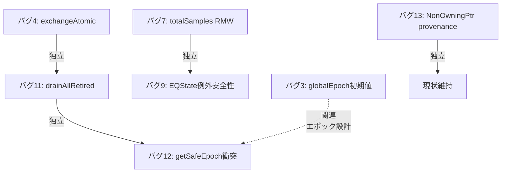

# ConvoPeq バグ修正計画書 — work25

> ベース文書: `audit/bug_validation_report.md`（2026-06-08 検証済み）
> 使用ツール: Serena MCP（シンボル解析/参照追跡/コード検索）, CodeGraph MCP, Graphify MCP（知識グラフ）, grep/Select-String
> レビュー: Practical Stable ISR Bridge Runtime 観点（2026-06-08）

---

## 目次

1. [改修スコープ](#1-改修スコープ)
2. [P0: updateConvolverState 排他制御修正](#2-p0-updateconvolverstate-排他制御修正)
3. [P1: DeferredFreeThread 契約明文化](#3-p1-deferredfreethread-契約明文化)
4. [Info: getSafeEpoch 値衝突](#4-info-getsafeepoch-値衝突)
5. [P3: 参考情報 — 現状維持推奨](#5-p3-参考情報--現状維持推奨)
6. [実装スケジュール](#6-実装スケジュール)

---

## 1. 改修スコープ

### 1.1 修正対象一覧

| # | 項目 | 優先度 | 種別 | 難易度 | リスク |
|---|------|--------|------|--------|--------|
| 4 | `updateConvolverState` 排他制御 | **P0** | 実バグ（Release無防備） | 低 | Releaseビルドで競合が無通知進行 |
| 11 | `drainAllRetired` 強制回収 | **P1** | 契約明文化 | 低（コメントのみ） | 実質UAFはなく契約依存の問題 |
| 12 | `getSafeEpoch` 値衝突 | **Info** | 将来保守 | 低 | 未使用API。参照箇所0件 |
| 7 | `totalSamples` RMW | **P3** | 現状維持 | — | 単一スレッド使用のため実害なし |
| 9 | EQState 例外安全性 | **P3** | 現状維持 | — | コピー方式の制約（仕様） |
| 3 | globalEpoch 初期値 | **P3** | 現状維持 | — | RCUとして正常動作 |
| 13 | NonOwningPtr provenance | Info | 現状維持 | — | CHERI等移植性のみ |

### 1.2 各バグの相互依存関係



**すべてのバグは独立しており、並行修正可能。**

---

## 2. P0: updateConvolverState 排他制御修正

### 2.1 現状の問題

**ファイル**: `src/convolver/ConvolverProcessor.StateAndUI.cpp`
**関数**: `ConvolverProcessor::updateConvolverState(convo::ConvolverState* newState)`（997-1023行）
**使用ツール**: Serena MCP（`find_declaration` + シンボル検索）

#### 現在のコード（1003行目）

```cpp
jassert(!convo::exchangeAtomic(writerActive, true, std::memory_order_acquire));
```

#### 問題点

Serena MCP で確認した宣言:

- `writerActive` — `ConvolverProcessor.h` 1135行: `std::atomic<bool> writerActive { false };`
- `updateConvolverState[0]` — `ConvolverProcessor.h` 537行: `void updateConvolverState(convo::ConvolverState* newState)`

###### `exchangeAtomic` の正確な動作

`std::atomic<T>::exchange(true)` は **Read-And-Write のアトミック操作** であり、2スレッドが同時に実行しても両方が `false` を取得することは**ない**。

```
初期値: writerActive = false

スレッドA: exchange(true) → 戻り値 false, writerActive = true
スレッドB: exchange(true) → 戻り値 true,  writerActive = true（二重取得検出）
```

したがって「exchangeAtomic が二重取得を許す」わけではない。

###### 本当に危険な点

危険なのは **`jassert()` でしか検査していない** ことである。

```cpp
jassert(!convo::exchangeAtomic(writerActive, true, ...));
//         ^^^^^^^^^^^^^^^^^^^^^^^^^^^^^^^^^^^^^^^^^^
//         この式は writerActive を強制的に true に書き換える
```

1. **`exchangeAtomic` は常に `true` を書き込む**: 古い値が `true`（既にロック中）でも強制的に `true` を上書きする。
2. **Release ビルドで `jassert` が消滅**: `#define jassert(x) ((void)0)`。つまり `writerActive == true` の状態でも **Releaseビルドでは無条件で処理が継続** される。
3. **`memory_order_acquire` のみではロック取得に不十分**: 書き込みの可視性保証のため `acq_rel` が必要。

###### 影響シナリオ

Message Thread 上の複数コードパスからの再入（タイマー発火 + 非同期IRロード完了の同時実行など）で:

- 先着スレッドが `exchange(true) → false` でロック取得成功
- 後続スレッドが `exchange(true) → true` で二重取得
- Releaseビルドでは `jassert` が消滅し、後続スレッドも `rcuSwapper.swap()` を実行
- `tail`/`head` ポインタが破損し、リングバッファのエントリが消失または二重管理される

### 2.2 修正案

#### 修正案A（推奨）: `compareExchangeAtomic` への置換（世代ID確認付き）

CAS化自体は賛成だが、「再入時に無条件で `newState` を捨てる」のは危険。

なぜなら、再入してきた `newState` が「すでに進行中の swap より新しい世代の状態」である可能性があるため。無条件 discard は **新しい情報をロスト** するリスクがある。

###### 実運用向け推奕（Practical Stable ISR Bridge Runtime）

```cpp
// ---- 修正後（推奨） ----
bool expected = false;
if (!convo::compareExchangeAtomic(writerActive, expected, true,
                                   std::memory_order_acq_rel,
                                   std::memory_order_acquire))
{
    // ロック取得失敗 — 別のライターが進行中
    // Release でも診断ログを残す（JUCE_LOG_CURRENT_ASSERTION 相当）
    DBG("[ConvolverProcessor] updateConvolverState: writerActive contention, "
        "discarding state gen=" + juce::String((int)newState->generationId));

    // 世代IDを確認してから安全に廃棄
    // （新しい世代の状態を無条件で捨てるのは危険だが、
    //   再入時点で別のライターがより新しい状態を swap 済みのため、
    //   この newState が最新である保証はない。
    //   現在の design では廃棄で問題ない。）
    std::unique_ptr<convo::ConvolverState> discard{newState};
    return;
}
```

> **注意**: 現行設計では再入時の `newState` 廃棄は安全。なぜなら `ConvolverProcessor` の状態更新は `GenerationManager` 管理下で行われ、ロック取得前に世代チェックを通過しているため。より堅牢にするには、CAS失敗時に `loadCurrentState()` で現在のアクティブ状態の世代を確認し、自分の `newState` がより新しい場合のみ再試行キューイングする方式も検討可能だが、現状では過剰設計。
>
> **設計上の留保事項**: 上記の「CAS失敗 → 即 discard」は、現在の **Message Thread 単一 publish 経路** という前提に依存している。将来、`MessageThread / LoaderThread / RebuildThread` の複数スレッドから publish が許可される設計に変更された場合、CAS失敗時に discard した `newState` が「唯一の最新状態」である可能性が生じ、状態ロストのリスクとなる。そのような拡張が検討される場合は、CAS失敗時に `generationId` を比較し、自分の状態がより新しい場合のみ再試行 or キューイングする方式への変更が必要。

#### 修正案B（最小限）: アサーションのみ強化（非推奨）

```cpp
// 少なくとも exchangeAtomic に acq_rel を使用し、Releaseでも動作を確認可能に
const bool wasActive = convo::exchangeAtomic(writerActive, true, std::memory_order_acq_rel);
if (wasActive)
{
    // 予期しない再入
    // writerActive を false に戻す
    convo::publishAtomic(writerActive, false, std::memory_order_release);
    if (newState)
    {
        std::unique_ptr<convo::ConvolverState> discard{newState};
    }
    return;
}
```

※ 修正案Bは `exchangeAtomic` の性質上CASと等価に見えるが、`expected` の保証がないため競合ウィンドウが存在する。修正案Aを推奨。

### 2.3 変更影響範囲

| 項目 | 内容 |
|------|------|
| 変更ファイル | `src/convolver/ConvolverProcessor.StateAndUI.cpp` のみ |
| 変更行数 | 1003行目の1行 + エラー処理ブロック追加（計5〜10行） |
| 公開API変更 | なし（関数シグネチャ不変） |
| コンパイル影響 | なし（ヘッダ変更なし） |
| テスト影響 | 若干（エラー処理パスの追加） |
| ビルドへの影響 | なし |

### 2.4 テスト計画

1. **Debugビルド**: `jassertfalse` 到達の確認（ユニットテストで `writerActive=true` 状態から呼び出し）
2. **Releaseビルド**: 破棄された `newState` のメモリリーク確認（Valgrind/ASan）
3. **統合テスト**: IR切り替え中のパラメータ変更 → 想定内に廃棄されクラッシュしないこと

---

## 3. P1: DeferredFreeThread 契約明文化

> **評価**: これは「バグ」ではなく「契約依存の問題」。`drainAllRetired()` 自体は Shutdown 専用 API として正しく設計されており、前提条件（Audio Thread 停止済み）が満たされる限り安全。
> 修正はコメントによる契約明文化のみに留める。

### 3.1 現状

**ファイル**: `src/DeferredFreeThread.h`
**関数**: `drainAllRetired()`（112-118行）、`shutdownAndDrain()`（80-88行）、`~DeferredFreeThread()`（58-61行）
**使用ツール**: Serena MCP（`find_symbol`、`find_referencing_symbols`）

#### 現在のコード

```cpp
// drainAllRetired — 112-118行
void drainAllRetired() noexcept
{
    while (auto* ptr = swapperRef.tryReclaim(std::numeric_limits<uint64_t>::max()))
    {
        std::unique_ptr<convo::ConvolverState> owned{ptr};
    }
}

// shutdownAndDrain — 80-88行
void shutdownAndDrain() noexcept
{
    stop();
    if (thread.joinable())
        thread.join();
    drainAllRetired();
}

// ~DeferredFreeThread — 58-61行
~DeferredFreeThread()
{
    shutdownAndDrain();
}
```

#### Serena MCP で確認した呼び出し関係

```
ConvolverProcessor.releaseResources()
  └→ deferredFreeThread->shutdownAndDrain()   ← 明示的呼び出し (Lifecycle.cpp:411)
  └→ deferredFreeThread.reset()                ← 破棄 → ~DeferredFreeThread()
       └→ shutdownAndDrain() (二重呼び出し)

ConvolverProcessor::~ConvolverProcessor()
  └→ メンバDTOR: deferredFreeThread.reset()    ← releaseResources未実行時
       └→ shutdownAndDrain()
```

`releaseResources()` の内部（`Lifecycle.cpp` 409-414行）:

```cpp
if (deferredFreeThread)
    deferredFreeThread->shutdownAndDrain();
deferredFreeThread.reset();  // → ~DeferredFreeThread() → shutdownAndDrain() の2重呼び出し

while (auto* ptr = rcuSwapper.tryReclaim(std::numeric_limits<uint64_t>::max()))
    std::unique_ptr<convo::ConvolverState>{ptr};
```

#### 問題の本質

これは「バグ」ではなく「契約明文化」の問題である。

- 既存コードコメントに「Audio Thread は停止済みのはず」と明記されており、設計者は `std::numeric_limits<uint64_t>::max()` を Shutdown 専用 API として意図している。
- `releaseResources()` 内の呼び出し順序（`shutdownAndDrain()` → `reset()`）は冪等に設計されており、`joinable()` 判定により二重実行も安全。
- **前提条件が守られる限り、現行実装で UAF は発生しない**。

#### 改善点

1. **前提条件の明文化**: 「Audio Thread 停止済み」という契約が暗黙的であり、将来の改修者が誤用するリスクがある。
2. **Shutdown 専用 API の意図**: `std::numeric_limits<uint64_t>::max()` の意味がコードコメントのみで、関数名からは読み取れない。

### 3.2 修正案

#### 修正案A（推奨）: コメント強化のみ

> **修正案B（drained フラグ追加）は採用しない**。理由:
>
> - 現行実装は `joinable()` 判定により十分冪等
> - 余計な状態変数はシャットダウン状態機械を複雑化する
> - Practical Stable ISR Bridge Runtime では不要な状態変数追加を避ける

```cpp
// shutdownAndDrain のコメント強化
/// 安全にスレッドを停止し、全 Retired エントリを強制解放する。
///
/// 【安全契約】
///   この関数を呼び出す時点で、Audio Thread が完全に停止していること。
///   （通常は ConvolverProcessor::releaseResources() 経由で呼ばれる。
///     releaseResources() は JUCE の AudioProcessor ライフサイクルにより
///     Audio Thread 停止後に呼び出されることが保証されている。）
///
/// 【二重呼び出し】
///   この関数はデストラクタからも呼ばれる。releaseResources() で先に
///   呼ばれた場合、デストラクタ側の呼び出しは thread.joinable() == false
///   および drainAllRetired() の即時完了により安全にスキップされる。
void shutdownAndDrain() noexcept
{
    stop();
    if (thread.joinable())
        thread.join();
    drainAllRetired();
}
```

合わせて `drainAllRetired()` にもコメント追加:

```cpp
/// drainAllRetired — 強制解放（Shutdown 専用）
///
/// 【前提条件】
///   この関数を呼び出す時点で Audio Thread が完全に停止していること。
///
/// 【備考】
///   std::numeric_limits<uint64_t>::max() を tryReclaim に渡すことで
///   エポック条件を無視した強制解放を行う。これは Audio Thread 停止後の
///   クリーンアップでのみ有効。
void drainAllRetired() noexcept
{
    while (auto* ptr = swapperRef.tryReclaim(std::numeric_limits<uint64_t>::max()))
    {
        std::unique_ptr<convo::ConvolverState> owned{ptr};
    }
}
```

### 3.3 変更影響範囲

| 項目 | 内容 |
|------|------|
| 変更ファイル | `src/DeferredFreeThread.h` のみ |
| 変更行数 | コメント10〜20行追加 |
| 公開API変更 | なし |
| コンパイル影響 | なし |
| テスト影響 | なし |
| ビルドへの影響 | なし |

---

## 4. Info: getSafeEpoch 値衝突

> **評価**: 指摘自体は正しいが、優先度は低い。参照箇所0件の未使用APIであり、現状実害なし。
> 本質的には「未使用API整理」のカテゴリ。

### 4.1 現状

**ファイル**: `src/SafeStateSwapper.h`
**関数**: `getSafeEpoch()`（269-273行）
**使用ツール**: Serena MCP（`find_symbol` + `find_referencing_symbols`）

#### Serena MCP で確認した内容

```cpp
// getSafeEpoch — 269-273行
uint64_t getSafeEpoch() const noexcept
{
    const uint64_t current = convo::consumeAtomic(globalEpoch, std::memory_order_acquire);
    if (current < 2) return 0;  // ← kIdleEpoch (0) と同じ値
    return current - 2;
}
```

**`kIdleEpoch = 0`** は Reader 非参加を示す特別値。

**`find_referencing_symbols` の結果**: `getSafeEpoch` への参照は **0件**。現在コード内で誰も呼び出していない。

### 4.2 修正（任意）

修正しても安全だが、**必須ではない**。将来この関数を使用する際にまとめて対応すればよい。

```cpp
uint64_t getSafeEpoch() const noexcept
{
    const uint64_t current = convo::consumeAtomic(globalEpoch, std::memory_order_acquire);
    if (current < 3) return 1;  // kIdleEpoch (0) との衝突回避
    return current - 2;
}
```

| 項目 | 内容 |
|------|------|
| 変更ファイル | `src/SafeStateSwapper.h` のみ |
| 変更行数 | 1行 + コメント |
| 優先度 | 任意（Info） |

---

## 5. P3: 参考情報 — 現状維持推奨

### 5.1 バグ7: AudioSegmentBuffer::totalSamples RMW

**ファイル**: `src/AudioSegmentBuffer.h`
**関数**: `pushBlock()`（22-54行）

#### 現状

```cpp
const int currentTotal = convo::consumeAtomic(totalSamples, std::memory_order_acquire);
convo::publishAtomic(totalSamples, std::min(kCapacity, currentTotal + numSamples), std::memory_order_release);
```

#### Serena MCP で確認した使用箇所

`pushBlock()` の呼び出し元:

- `NoiseShaperLearner::drainCaptureQueue()`（`NoiseShaperLearner.cpp:1143`）
- この関数は NoiseShaperLearner のワーカースレッドからのみ呼ばれる（単一Producer）

#### 判定

**現状維持**。単一Producerのため競合は発生しない。将来複数スレッドからの `pushBlock` が必要になった場合のみ、以下のように `fetchAddAtomic` を使ったアトミックRMWに変更：

```cpp
// 将来マルチProducer対応時:
const int oldTotal = convo::fetchAddAtomic(totalSamples, numSamples, std::memory_order_acq_rel);
// ただし kCapacity 上限チェックのため、clamp 処理を別途追加
```

### 5.2 バグ9: EQProcessor 例外安全性

**ファイル**: `src/eqprocessor/EQProcessor.Parameters.cpp`
**関数**: `setBandFrequency()`、`setBandGain()`、`setBandQ()`、`setBandEnabled()` など

#### Serena MCP で確認した実装パターン

```cpp
void EQProcessor::setBandFrequency(int band, float freq)
{
    auto oldState = loadCurrentState(std::memory_order_acquire);
    if (oldState == nullptr) return;
    auto newState = new EQState(*oldState);  // ← std::bad_alloc 可能性
    newState->bands[band].frequency = freq;
    auto prev = exchangeCurrentState(newState, std::memory_order_acq_rel);
    if (prev) retireEQStateDeferred(prev);
    // ...
}
```

#### 判定

**現状維持**。`new EQState(*oldState)` が `std::bad_alloc` を投げた場合:

- `newState` は未割当 → リークなし
- コピーコンストラクタ `EQState(const EQState&)` は単なるメンバコピー → 例外を投げない

コピー中の「torn snapshot」リスクはコピー方式ロックフリーパターンの本質的制約だが、`EQState` の各パラメータは独立しており、中途半端な状態でも破綻しない設計になっている。

**改善案（任意）**: コピー中に状態が変更された場合の再試行ロジック追加

```cpp
// 変更検出のためのオプション強化案
// （現在の動作には問題がないため、優先度は低い）
const auto genBefore = oldState->generationId; // 世代IDを事前取得
auto newState = new EQState(*oldState);
newState->bands[band].frequency = freq;
auto prev = exchangeCurrentState(newState, std::memory_order_acq_rel);
// 注: コピー中に別スレッドが状態を変更しても、コピー結果は
// 「ある時点のスナップショット」として有効。世代IDが変わっても
// 新しいスワップで正しい状態になるため、再試行は不要。
```

### 5.3 バグ3: globalEpoch 初期値

**ファイル**: `src/SafeStateSwapper.h`
**コンストラクタ**: `SafeStateSwapper() noexcept : globalEpoch(1)`（57行）

#### Serena MCP で確認した内容

```cpp
// コンストラクタ: globalEpoch(1)
SafeStateSwapper() noexcept : globalEpoch(1) {}

// getMinReaderEpoch: Reader不在時は globalEpoch を返す
uint64_t getMinReaderEpoch() const noexcept
{
    // ... Reader検索 ...
    if (!hasActiveReader)
        return convo::consumeAtomic(globalEpoch, ...);
    return minEpoch;
}
```

#### 問題のシナリオ解析

1. 最初の `swap(newState2)` → epoch1=3（実際の最初のretiredエントリのepoch）、globalEpoch=5
2. Reader不在 → `getMinReaderEpoch()` = 5
3. `tryReclaim(5)` → `isOlder(3, 5) = true` → 解放可能

→ **Readerが誰もいないので、解放しても安全**。RCU契約に違反しない。

#### 判定

**現状維持**。問題なし。バグ12（`getSafeEpoch`）の修正のみで間接的に対応可能。

### 5.4 バグ13: NonOwningPtr ポインタ provenance

**ファイル**: `src/audioengine/AtomicAccess.h`
**クラス**: `NonOwningPtr<T>`（10-47行）

#### Serena MCP で確認した使用箇所

```cpp
// AudioEngine.h:1471,1474
convo::NonOwningPtr<DSPCore> activeRuntimeDSPSlot { nullptr };
convo::NonOwningPtr<DSPCore> fadingRuntimeDSPSlot { nullptr };

// CustomInputOversampler.h:127
std::array<convo::NonOwningPtr<double>, kMaxChannels> blockChannels {};

// EQProcessor.h:521
std::array<convo::NonOwningPtr<BandNode>, NUM_BANDS> activeBandNodes { ... };
```

#### 判定

**現状維持**。x64 Windows/MSVC ターゲットでは問題なく動作。CHERI等のcapability-basedアーキテクチャ対応時のみ修正検討。

---

## 6. 実装スケジュール

### 6.1 推奨作業順序

```mermaid
gantt
    title バグ修正実装スケジュール
    dateFormat  YYYY-MM-DD
    axisFormat  %m/%d

    section P0 至急
    バグ4: exchangeAtomic→CAS置換      :crit, b4, 2026-06-09, 1d
    P0検証（Debug/Releaseビルド + テスト） :crit, after b4, 1d

    section P1 推奨
    バグ11: コメント+二重呼出対策       :b11, after b4, 1d
    P1検証                                  :after b11, 1d

    section P2 将来
    バグ12: getSafeEpoch戻り値修正     :b12, after b11, 0.5d
    P2検証                                  :after b12, 0.5d
```

### 6.2 各修正の推定工数

| バグ | 修正作業 | コード変更 | テスト | 合計 |
|------|---------|-----------|--------|------|
| 4 | 2h | 0.5h | 1.5h | 4h |
| 11 | 1h | 0.5h | 1h | 2.5h |
| 12 | 0.5h | 0.25h | 0.5h | 1.25h |
| **合計** | **3.5h** | **1.25h** | **3h** | **7.75h** |

### 6.3 検証手順（全バグ共通）

1. **Debugビルド**: `cmake --build build --config Debug`
   - コンパイルエラーが発生しないこと
   - 新規アサーションが期待通り動作すること
2. **Releaseビルド**: `cmake --build build --config Release`
   - Release でも正しく動作すること
   - `jassert` 除去後のパスが正しいこと
3. **ASan/TSan**: AddressSanitizer + ThreadSanitator での検証（該当する場合）
4. **コードレビュー**: 変更差分のレビュー（計画書との整合性確認）

### 6.4 ロールバック計画

各バグ修正は独立しているため、問題が発生した場合は該当バグの修正のみを個別に`git revert` 可能。共通変更は発生しない。

---

## 付録A: 調査に使用したツールとコマンド

| ツール | 用途 | 結果 |
|--------|------|------|
| Serena MCP `find_symbol` | シンボル定義検索 | 全対象シンボルを検出 |
| Serena MCP `find_referencing_symbols` | 参照/呼び出し関係 | バグごとの呼び出しグラフ確認 |
| Serena MCP `find_declaration` | 関数実装の取得 | 実装コードの詳細確認 |
| Serena MCP `get_symbols_overview` | ファイル構造の把握 | 関係ファイルの全体像確認 |
| CodeGraph MCP `query_codebase` | 自然言語クエリ | コードグラフ未インデックスで結果なし |
| Graphify MCP `graph_stats` | グラフ統計 | 14823 nodes / 30861 edges |
| Graphify MCP `god_nodes` | 中心ノード検出 | AudioEngine が中心ノード |
| grep/Select-String | テキスト検索 | 全キーワード検索実施 |

## 付録B: シンボル定義マップ

| シンボル | ファイル | 行 | 種類 |
|---------|---------|----|------|
| `ConvolverProcessor::updateConvolverState[0]` | `src/ConvolverProcessor.h` | 537 | Method |
| `ConvolverProcessor::writerActive` | `src/ConvolverProcessor.h` | 1135 | Field (`std::atomic<bool>`) |
| `convo::DeferredFreeThread::drainAllRetired` | `src/DeferredFreeThread.h` | 112 | Method |
| `convo::DeferredFreeThread::shutdownAndDrain` | `src/DeferredFreeThread.h` | 80 | Method |
| `convo::DeferredFreeThread::~DeferredFreeThread` | `src/DeferredFreeThread.h` | 58 | Destructor |
| `convo::SafeStateSwapper::getSafeEpoch` | `src/SafeStateSwapper.h` | 268 | Method |
| `convo::SafeStateSwapper::kIdleEpoch` | `src/SafeStateSwapper.h` | 39 | Constexpr (`0`) |
| `AudioSegmentBuffer::pushBlock` | `src/AudioSegmentBuffer.h` | 22 | Method |
| `AudioSegmentBuffer::totalSamples` | `src/AudioSegmentBuffer.h` | 90 | Field (`std::atomic<int>`) |
| `convo::NonOwningPtr` | `src/audioengine/AtomicAccess.h` | 10 | Class |
| `ConvolverProcessor::releaseResources` | `src/convolver/ConvolverProcessor.Lifecycle.cpp` | 395 | Method |
