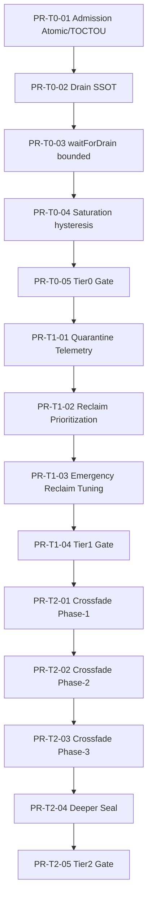

# ConvoPeq ISR Bridge Runtime v6.x 実装タスク分解（PR粒度）

- Project: ConvoPeq
- Date: 2026-05-28
- Source: `doc/work3/ConvoPeq_ISR_Bridge_Runtime_v6.x_詳細設計_2026-05-28.md`
- Rule: **Tier0 完了前に Tier1/Tier2 へ進まない**
- Goal: 実装を PR 単位で安全に分割し、rollback 可能性と受入判定を維持する

---

## 実行ポリシー

- 1PR 1目的（横展開禁止）
- 各 PR は「変更範囲」「受入条件」「rollback 手順」を必須記載
- RT path に lock/alloc/blocking を追加しない
- `coordinator.isFullyDrained()` を source-of-truth 以外に増やさない

### 推奨検証コマンド（本リポ既存）

- `Strict Atomic Dot-Call Scan`
- `Debug Build (cmd env retry)`
- `Release Build (cmd env retry)`

---

## Tier0（必須先行）

### PR-T0-01 Admission Gate 原子契約と TOCTOU 封じ

- **目的**: `acceptsRuntimePublication()` の atomic 契約（acquire/release）固定と enqueue/publish 直前 double-check 導入
- **主変更**:
  - Admission 判定呼び出し箇所の前倒し統一
  - queue push 後 reject パターンの除去
  - shutdown 遷移観測後の enqueue 破棄
- **対象ファイル（候補）**:
  - `src/audioengine/AudioEngine.Commit.cpp`
  - `src/audioengine/AudioEngine.RebuildDispatch.cpp`
  - `src/audioengine/AudioEngine.h`
- **受入条件**:
  - shutdown 中 publish/rebuild intent 受理が 0
  - `queue.push -> rejectLater` パターン残存なし
- **rollback**: 判定ロジック差分のみを revert（state enum 変更は別PRで扱う）

### PR-T0-02 Drain SSOT の実体化（`isFullyDrained()` 合成）

- **目的**: drain completion を coordinator 単一判定へ集約、呼び出し側 mutex 取得を排除
- **主変更**:
  - publication/retire/fallback/reclaim/staging/deferred/swap pending を内部集約
  - Audio Thread / Worker からの呼び出し禁止ガード
- **対象ファイル（候補）**:
  - `src/core/RuntimePublicationCoordinator.h`
  - `src/audioengine/ISRRuntimePublicationCoordinator.cpp`
  - `src/audioengine/AudioEngine.Threading.cpp`
- **受入条件**:
  - drain completion 判定 API が単一化
  - subsystem 独自 drained 判定追加なし
- **rollback**: 集約 counters 追加分を戻し、既存判定へ復帰

### PR-T0-03 `waitForDrain(timeout)` bounded 契約導入

- **目的**: non-RT 限定 bounded best-effort wait（2000ms/10000ms, poll 1〜5ms）を固定
- **主変更**:
  - timeout 到達時 `false` 返却
  - 内部連鎖待機/無限待機の禁止
- **対象ファイル（候補）**:
  - `src/audioengine/AudioEngine.Commit.cpp`
  - `src/audioengine/ISRShutdown.cpp`
  - `src/audioengine/ISRShutdown.h`
- **受入条件**:
  - 無限待機経路が存在しない
  - RT thread から `waitForDrain` 呼出不可
- **rollback**: 新 API 呼び出し箇所を旧 path へ戻す

### PR-T0-04 Saturation 判定入力・HWM/LWM hysteresis 固定

- **目的**: `retireResidency + fallbackResidency` 合算で saturation 判定を deterministic 化
- **主変更**:
  - `>= HWM` で on
  - `<= LWM` かつ 1 publication cycle 後に off
  - `HWM <= LWM` 構成エラー処理
- **対象ファイル（候補）**:
  - `src/audioengine/AudioEngine.Threading.cpp`
  - `src/audioengine/RetireRuntime*.cpp`
  - `src/audioengine/AudioEngine.h`
- **受入条件**:
  - saturation 発火/解除が deterministic
  - saturation 中に unsafe direction（緩和方向）が実行されない
- **rollback**: hysteresis 追加分のみ revert（定数は維持）

### PR-T0-05 Tier0 統合受入（17.5 対応）

- **目的**: Tier0 完了条件（1/2/3/8/9/10）をまとめて確認
- **主変更**: 実装変更なし（検証・文書・軽微フックのみ）
- **受入条件**:
  - 条件 1,2,3,8,9,10 を全充足
  - 未達なら Tier1 着手禁止
- **rollback**: 検証フックのみ削除（本体ロジックに影響なし）

---

## Tier1（Tier0完了後のみ）

### PR-T1-01 Quarantine telemetry 実体化

- **目的**: quarantine を観測可能メトリクスとして実体化
- **主変更**: owner/increment/reset/finalization を固定
- **対象ファイル（候補）**:
  - `src/audioengine/RetireRuntime*.cpp`
  - `src/audioengine/AudioEngine.h`
  - `doc/work3/*`
- **受入条件**: telemetry が visibility 用途に限定され、lifecycle/shutdown 判定に使われない
- **rollback**: telemetry カウンタ追加分のみ戻す

### PR-T1-02 Reclaim prioritization（oldest obsolete 優先）

- **目的**: 飽和時回収を oldest-generation-first に収束
- **主変更**: obsolete retire 優先 pop、fallback drain 優先度調整
- **対象ファイル（候補）**:
  - `src/audioengine/RetireRuntime*.cpp`
  - `src/audioengine/AudioEngine.Threading.cpp`
- **受入条件**: 飽和時の収束改善、starvation なし
- **rollback**: comparator/優先度ロジックのみ revert

### PR-T1-03 Emergency reclaim cadence tuning（bounded）

- **目的**: emergency reclaim を bounded window で制御
- **主変更**:
  - worker=1 固定
  - cadence boost 上限=通常の2倍
  - boost window=500ms
- **対象ファイル（候補）**:
  - `src/audioengine/AudioEngine.Threading.cpp`
  - `src/audioengine/RetireRuntime*.cpp`
- **受入条件**: 無期限 boost なし、RT reclaim なし
- **rollback**: cadence/boost 定数のみ revert

### PR-T1-04 Tier1 統合受入

- **目的**: Tier1 完了条件（Tier0 + reclaim メトリクス安定）を確認
- **主変更**: 実装変更なし（検証記録中心）
- **受入条件**: reclaim 関連メトリクスが安定収束
- **rollback**: 検証資料のみ削除可

---

## Tier2（Tier1完了後のみ）

### PR-T2-01 Crossfade mutable reduction Phase-1

- **目的**: `latencyDelayOld_RT` を execution-local 読み出しへ限定
- **主変更**: authority を RT ローカル処理へ狭める
- **対象ファイル（候補）**:
  - `src/audioengine/AudioEngine.*`
  - `src/convolver/*`
- **受入条件**: shared mutable authority が増えない、RT path 新規 lock/alloc なし
- **rollback**: Phase-1 差分のみ revert

### PR-T2-02 Crossfade mutable reduction Phase-2

- **目的**: `latencyDelayNew_RT` を publication handoff 経由へ移行
- **主変更**: Message->Audio の単方向 handoff を強化
- **受入条件**: publish 後 topology mutation なし、cross-runtime mutable progression 共有なし
- **rollback**: handoff 経路差分のみ revert

### PR-T2-03 Crossfade mutable reduction Phase-3

- **目的**: `dspCrossfade*` を authority narrowing で整理
- **主変更**: execution-local snapshotization の徹底
- **受入条件**: 受入条件 6（shared mutable state 不在）充足
- **rollback**: フィールド単位で段階 revert

### PR-T2-04 Deeper seal propagation（最小拡張）

- **目的**: `capture -> finalize -> seal -> handoff` の seal 契約を深部へ伝播
- **主変更**: fingerprint 比較規則（version 不一致は collapse 対象外）の統一
- **対象ファイル（候補）**:
  - `src/audioengine/RuntimeBuildTypes.h`
  - `src/audioengine/RuntimeBuilder.*`
  - `src/audioengine/AudioEngine.RebuildDispatch.cpp`
- **受入条件**: finalize 再実行で fingerprint 差分 0、unsafe collapse なし
- **rollback**: deep seal 伝播分のみ取り下げ

### PR-T2-05 Tier2 統合受入

- **目的**: Tier2 完了条件（Tier1 + 条件6）を確認
- **主変更**: 実装変更なし（検証・記録）
- **受入条件**: 条件6達成、long-session で stability 低下なし
- **rollback**: 検証フック/記録のみ削除可

---

## PR共通テンプレート

```text
## Purpose
## Scope (Files)
## In-Scope / Out-of-Scope
## Acceptance Criteria
## Verification
- Strict Atomic Dot-Call Scan
- Debug Build (cmd env retry)
- Release Build (cmd env retry)
## Rollback Plan
## Risk & Mitigation
```

### Residency追加時の追記（必須）

```text
[Residency Contract]
Name:
Boundedness:
Reclaim Owner:
Drain Condition:
Shutdown Completion Path:
Observed By (Telemetry):
```

---

## 実行順序（DAG）



---

## Go/No-Go 判定

- **Go**: 各 Tier Gate PR の受入条件を満たした場合のみ次 Tier へ進行
- **Conditional Go**: 既知の軽微課題が non-RT・non-SSOT 領域に限定される場合
- **No-Go**: Tier0 条件未達、または RT safety / drain SSOT / bounded wait の破綻がある場合
