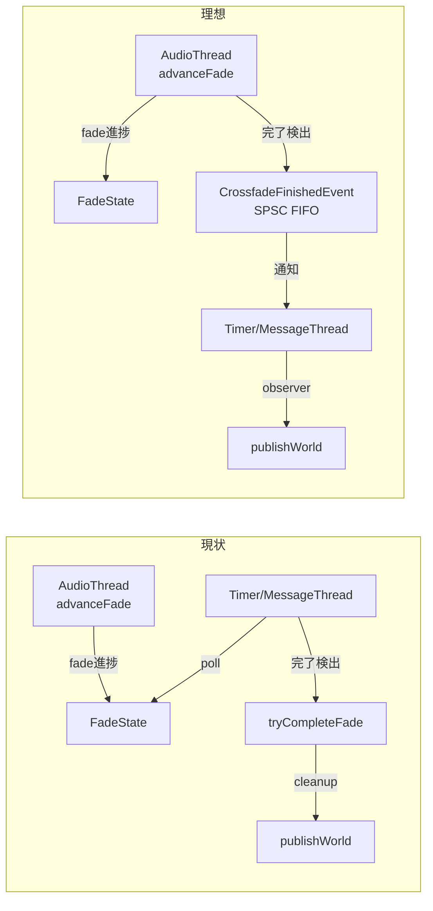

# ISR Bridge Runtime Practical Stable 改修計画

**作成日**: 2026-06-11
**根拠文書**: `01_review_validation_report.md`（第三者レビュー妥当性検証）
**対象バージョン**: ConvoPeq ISR Bridge Runtime v5.5+
**推定工数**: P0=3h / P1=3.5日 / P2=2日 / P3=1.5週間

---

## 優先度定義

| 優先度 | 定義 | 完了基準 |
|--------|------|----------|
| **P0** | Practical Stable に必須。未対処で運用破綻リスク | コード修正 + build green + CI gate通過 |
| **P1** | 長時間運用の安定性に寄与。監視・制御の閉ループ化 | コード修正 + build green + CI gate通過 |
| **P2** | 防御的改善。現状でも運用可能だが、強化が望ましい | コード修正 + build green |
| **P3** | 中長期的改善。Phase-C/D 以降の検討事項 | 設計書 + 承認待ち |

---

## Phase 0: 即時修正（P0、総工数〜3h）

### P0-A: ISRRetireRouter dynamic_cast 撤廃（〜1.5h）

**現状**: `pendingRetireCount()` と `drainAll()` で `dynamic_cast<EpochDomain*>(provider_)` を使用。
ヘッダの `pendingRetireFn_` / `drainAllFn_` / `epochContext_` は未初期化のデッドコード。

**修正内容**:

#### A-1: ISRRetireRouter コンストラクタで関数ポインタ初期化（.cpp）

`ISRRetireRouter.cpp` コンストラクタ:

```cpp
ISRRetireRouter::ISRRetireRouter(IEpochProvider& provider) noexcept
    : provider_(&provider)
{
    // pendingRetireCount / drainAll は EpochDomain 固有メソッド。
    // IEpochProvider インターフェースに追加する代わりに、
    // 関数ポインタで動的キャスト結果をキャッシュする。
    if (auto* ed = dynamic_cast<EpochDomain*>(&provider))
    {
        pendingRetireFn_ = [](void* ctx) -> uint32_t {
            return static_cast<EpochDomain*>(ctx)->pendingRetireCount();
        };
        drainAllFn_ = [](void* ctx) {
            static_cast<EpochDomain*>(ctx)->drainAll();
        };
        epochContext_ = ed;
    }
}
```

#### A-2: pendingRetireCount() / drainAll() を関数ポインタ経由に変更（.cpp）

```cpp
uint32_t ISRRetireRouter::pendingRetireCount() const noexcept
{
    assert(provider_ != nullptr);
    if (pendingRetireFn_ && epochContext_)
        return pendingRetireFn_(epochContext_);
    return 0;
}

void ISRRetireRouter::drainAll() noexcept
{
    assert(provider_ != nullptr);
    if (drainAllFn_ && epochContext_)
        drainAllFn_(epochContext_);
}
```

#### A-3: 関数ポインタ型を noexcept 対応（.h、オプション）

```cpp
uint32_t (*pendingRetireFn_)(void*) noexcept = nullptr;
void     (*drainAllFn_)(void*)      noexcept = nullptr;
```

**CI gate**: `check-work21-epochdomain-gates.ps1` に dynamic_cast 検出パターンを追加。

**確認方法**: build green + `grep "dynamic_cast<EpochDomain\*>"` が ISRRetireRouter.cpp で0になること。

---

### P0-B: EQProcessor Fallback 経路削除（〜1h）

**現状**: `EQProcessor.Core.cpp` に direct EpochDomain fallback が生存。coordinator 未設定時に発動。
コメントに「削除」と書いてあるが未削除。

**修正内容**:

`enqueueDeferredDeleteWithFallback()` のフォールバック経路を削除:

```cpp
bool EQProcessor::enqueueDeferredDeleteWithFallback(void* ptr,
                                                    void (*deleter)(void*),
                                                    uint64_t epoch) noexcept
{
    if (ptr == nullptr || deleter == nullptr)
        return true;

    // [Phase-B] coordinator は常時設定済み。jassert で保証。
    jassert(m_retireCoordinator != nullptr);

    const uint64_t retireEpoch = (epoch != 0) ? epoch : m_epochDomain.currentEpoch();
    convo::isr::ISRRetireRouter stackRouter(m_epochDomain);
    auto result = m_retireCoordinator->enqueueRetire(
        convo::isr::RetireAuthority::Granted,
        stackRouter,
        ptr, deleter, retireEpoch);
    if (result == convo::isr::RetireEnqueueResult::Success)
        return true;

    // [P0-5] enqueue failure -> drop + telemetry (RT-safe).
    return false;
}
```

併せて `#include "core/EpochDomain.h"` が coordinator 経路のみで不要になれば削除。

**確認方法**: build green + `grep "Fallback.*direct EpochDomain"` が src/ で0になること。

---

### P0-C: Crossfade 完了の RT 権威化 — 設計フェーズ（〜0.5h）

**現状**: `tryCompleteFade()` が Timer (MessageThread) 依存。
AudioThread (`advanceFade()`) で fade 進捗を更新するが、完了検出は Timer のみ。

**P0-C では設計書の作成まで。実装は P1-C で行う。**



**設計方針**:

1. `CrossfadeRuntime` に `isFadeComplete()` を追加（AudioThread から安全に読める atomic フラグ）
2. AudioThread の `advanceFade()` 完了時に `CrossfadeFinishedEvent` を SPSC FIFO に push
3. Timer callback は SPSC FIFO を consume して cleanup を実行
4. 完了判定の Authority は DSPTransition（AudioThread 側）に移す

---

## Phase 1: 監視・制御閉ループ（P1、総工数〜3.5日）

### P1-A: Reader Slot Exhaustion 監視追加（〜4h）

**ファイル**:

- `src/audioengine/RuntimeHealthMonitor.h`
- `src/audioengine/RuntimeHealthMonitor.cpp`
- `src/core/EpochDomain.h`

**修正内容**:

#### A-1: EpochDomain に readerRegistrationFailureCount 追加

```cpp
// EpochDomain.h
std::atomic<uint64_t> readerRegistrationFailureCount_{0};
```

`registerReaderThread()` の return -1 箇所でインクリメント:

```cpp
if (/* slot exhaustion */) {
    fetchAddAtomic(readerRegistrationFailureCount_, 1u, std::memory_order_release);
    return -1;
}
```

#### A-2: RuntimeHealthMonitor で reader registration failure 監視

```cpp
// RuntimeHealthMonitor.h に追加
static constexpr uint32_t EVENT_READER_EXHAUSTION = 3002;
void setReaderRegistrationFailureRef(const std::atomic<uint64_t>* ref) noexcept {
    m_readerRegistrationFailureRef = ref;
}

// RuntimeHealthMonitor.cpp
void RuntimeHealthMonitor::checkReaderExhaustion() noexcept {
    if (!m_readerRegistrationFailureRef) return;
    uint64_t failures = consumeAtomic(*m_readerRegistrationFailureRef, std::memory_order_acquire);
    if (failures > 0) {
        // Degraded 警告を発行
        emitOnTransition(m_prevReaderState, MonitorState::Warning,
            HealthEvent::Severity::Warning, EVENT_READER_EXHAUSTION, failures);
    }
}
```

#### A-3: RCUReader の failure 時の挙動改善

`RCUReader::enter()` の slot 取得失敗時に少なくともデバッグログを出力:

```cpp
if (tid >= 0)
    epochProvider->enterReader(tid);
else
{
    // ★ P1-A: slot 枯渇 — 保護無し読み取りに移行
    JUCE_LOG_WARNING("[RCUReader] reader slot exhausted!");
    // fallthrough: nestingDepth と owner を解放
    ...
}
```

---

### P1-B: HealthMonitor → Admission 閉ループ完成（〜2日）

**ファイル**:

- `src/audioengine/RuntimeHealthMonitor.h` / `.cpp`
- `src/audioengine/PublicationAdmission.h` / `.cpp`
- `src/audioengine/AudioEngine.h` / `AudioEngine.Retire.cpp`

**修正内容**:

#### B-1: ISRHealthState 導入

```cpp
// RuntimeHealthMonitor.h または RuntimeBuildTypes.h
enum class ISRHealthState : uint8_t {
    Healthy = 0,
    Degraded,     // 軽度障害: Reader枯渇/Retire backlog増加
    Critical      // 重度障害: Publication stall/Reader stuck
};
```

#### B-2: HealthMonitor が HealthState を管理

```cpp
// RuntimeHealthMonitor.h に追加
ISRHealthState getHealthState() const noexcept;
```

`tick()` の各チェック結果を統合して HealthState を決定:

```cpp
void RuntimeHealthMonitor::updateHealthState() noexcept {
    ISRHealthState newState = ISRHealthState::Healthy;

    // Retire stall → Degraded
    if (m_prevRetireState == MonitorState::Error)
        newState = ISRHealthState::Critical;
    else if (m_prevRetireState == MonitorState::Warning)
        newState = ISRHealthState::Degraded;

    // Publication stall → Critical
    if (m_prevPublicationState == MonitorState::Error)
        newState = ISRHealthState::Critical;

    // Reader exhaustion → Degraded
    if (/* reader slot exhausted */)
        newState = std::max(newState, ISRHealthState::Degraded);

    convo::publishAtomic(m_healthState_, newState, std::memory_order_release);
}
```

#### B-3: PublicationAdmission が HealthState を参照

```cpp
// PublicationAdmission.h に追加
void setHealthStateRef(const std::atomic<ISRHealthState>* ref) noexcept {
    m_healthStateRef = ref;
}

// PublicationAdmission::evaluate() 内
if (m_healthStateRef) {
    auto health = convo::consumeAtomic(*m_healthStateRef, std::memory_order_acquire);
    if (health == ISRHealthState::Critical)
        return Decision::RejectedPressure;
    if (health == ISRHealthState::Degraded) {
        // Degraded 時は低優先度 publish を拒否
        if (/* low priority heuristic */)
            return Decision::RejectedLowPriority;
    }
}
```

#### B-4: AudioEngine で HealthMonitor → Admission を配線

```cpp
// AudioEngine の初期化箇所
m_healthMonitor.setHealthStateRef(&m_healthState);
m_admission.setHealthStateRef(&m_healthState);
```

---

### P1-C: Crossfade 完了の RT 権威化 — 実装（〜1日）

**ファイル**:

- `src/audioengine/CrossfadeRuntime.h`
- `src/audioengine/DSPTransition.h`
- `src/audioengine/AudioEngine.Timer.cpp`
- `src/LockFreeRingBuffer.h` または新規 SPSC

**修正内容**:

#### C-1: CrossfadeRuntime に完了検出 atomic 追加

```cpp
// CrossfadeRuntime.h
std::atomic<bool> fadeComplete_{false};
std::atomic<uint64_t> completeTimestampUs_{0};

bool isFadeComplete() const noexcept {
    return convo::consumeAtomic(fadeComplete_, std::memory_order_acquire);
}
```

#### C-2: AudioThread 側で完了フラグ設定

`DSPTransition` の crossfade 進捗ループ（AudioThread）内:

```cpp
// updateFade() または advanceFade() 内
// fade 完了を検出したら atomic フラグをセット
if (/* fade alpha >= 1.0 */) {
    convo::publishAtomic(fadeComplete_, true, std::memory_order_release);
    convo::publishAtomic(completeTimestampUs_, getCurrentTimeUs(), std::memory_order_release);
}
```

#### C-3: Timer 側は consumer に徹する

```cpp
// AudioEngine.Timer.cpp
// 現状: m_coordinator.tryCompleteFade() ← Authority が Timer にある
// 修正後: crossfadeRuntime_.isFadeComplete() を読むのみ
if (crossfadeRuntime_.isFadeComplete()) {
    // cleanup (DSP retire, publishWorld 等) は従来通り Timer で実行
    // ただし「完了した」という Authority は AudioThread 側にある
    convo::publishAtomic(crossfadeRuntime_.fadeComplete_, false, std::memory_order_release);
    // ... cleanup ...
}
```

---

## Phase 2: 防御的改善（P2、総工数〜2日）

### P2-A: Deprecated API 完全除去（〜2h）

**ファイル**: `src/core/EpochDomain.h`

**修正内容**:

- `advanceEpoch()` → private 化（`publishEpoch()` のみ公開）
- `reclaimRetired()` → private 化（`tryReclaim()` のみ公開）
- `enqueueRetire()` 4-param → private 化
- `enterReader()` / `exitReader()` → オーバーライドにつき残置（deprecated 注釈のみ除去しても可）

CI gate: `check-work21-epochdomain-gates.ps1` の advanceEpoch 許容1を0に変更。

---

### P2-B: Shutdown VerifyDrained と DrainAudit 接続（〜4h）

**ファイル**:

- `src/audioengine/ISRShutdown.cpp`
- `src/audioengine/ISRShutdown.h`
- `src/audioengine/RuntimeDrainAudit.h`

**修正内容**:

`VerifyDrained` phase で `RuntimeDrainAudit` を使用:

```cpp
// ISRShutdown.cpp
void ShutdownRuntime::advancePhase() noexcept {
    // ... 既存の advance ロジック ...
    case ShutdownPhase::VerifyDrained: {
        // ★ P2-B: DrainAudit を使用した最終監査
        auto audit = m_drainAudit.load();
        if (audit.isAllZero()) {
            next = ShutdownPhase::ShutdownComplete;
        } else {
            // 完了条件未達 → TimedOut
            // 主要阻害要因をログ出力
            auto reason = audit.getPrimaryBlockingReason();
            markTimedOut();
        }
        break;
    }
}
```

`RuntimeDrainAudit` を atomic で ShutdownRuntime に保持可能にする（std::atomic は複合型を直接保持できないため、個別カウンタ参照か atomic<uint64_t> ビットマスクを使用）。

---

### P2-C: HealthSnapshot の Admission 注入（〜2日）

**ファイル**:

- `src/audioengine/PublicationAdmission.h` / `.cpp`
- `src/audioengine/RuntimePublicationOrchestrator.cpp`

**修正内容**:

`PublicationAdmission` に `RuntimeHealthSnapshot` 相当の情報を注入可能にする:

```cpp
// PublicationAdmission.h
struct AdmissionHealthContext {
    uint64_t retireBacklogCount;
    uint64_t quarantineResidentCount;
    uint64_t readerSlotUsage;       // activeReaderCount / kMaxReaders
    bool publicationStallDetected;
};

void setHealthContext(const std::atomic<AdmissionHealthContext>* ctx) noexcept;
```

`PublicationAdmission::evaluate()` で HealthContext を参照し、動的な PressureLevel 調整を行う。

---

## Phase 3: 中長期改善（P3、総工数〜1.5週間）

### P3-A: HealthMonitor ↔ RetirePressure 統合（〜3日）

**現状**: `AudioEngine.Retire.cpp` の圧力制御と `RuntimeHealthMonitor` が独立動作。

**修正**: HealthMonitor の診断結果を `retirePressureLevel_` へフィードバックする経路を追加。
具体的には `HealthMonitor::tick()` 内で `AudioEngine::applyRetirePressurePolicyNoRt()` を呼べる IF を追加。

### P3-B: WorldLifecycleAudit 導入（〜1週間）

**新規ファイル**: `src/audioengine/WorldLifecycleAudit.h` / `.cpp`

**設計**:

```cpp
struct WorldLifecycleRecord {
    uint64_t worldId;
    uint64_t publishEpoch;
    uint64_t retireEpoch;    // 0 = 未退役
    uint64_t publishTimestampUs;
    uint64_t retireTimestampUs;
    // Trace info
    CorrelationId correlationId;
};

class WorldLifecycleAudit {
public:
    void onWorldPublished(uint64_t worldId, uint64_t epoch, CorrelationId cid);
    void onWorldRetired(uint64_t worldId, uint64_t epoch);
    bool isWorldFullyLifecycled(uint64_t worldId) const;
    uint64_t unretiredWorldCount() const;
    void emitSnapshot() const;  // 診断用
    bool allWorldsRetired() const;  // shutdown 完了判定用
};
```

---

## マイルストーン

| マイルストーン | 内容 | フェーズ | 時期目安 |
|---|---|---|---|
| **M1: EpochDomain隠蔽完了** | dynamic_cast撤廃 + Fallback削除 + Deprecated API整理 | P0-A〜B, P2-A | Day 1 |
| **M2: Crossfade RT権威化（設計）** | 設計書 + インターフェース定義 | P0-C | Day 1 |
| **M3: 監視基盤強化** | Reader exhaustion 監視追加 | P1-A | Day 2 |
| **M4: 閉ループ完成** | HealthMonitor → Admission 接続 | P1-B, P2-C | Day 3-5 |
| **M5: Crossfade RT権威化（実装）** | AudioThread 完了検出 + SPSC | P1-C | Day 5-6 |
| **M6: Shutdown強化** | VerifyDrained + DrainAudit | P2-B | Day 6 |
| **M7: 統合安定化** | HealthMonitor↔RetirePressure統合 | P3-A | Week 2-3 |
| **M8: 長期運用対応** | WorldLifecycleAudit | P3-B | Week 3-4 |

---

## リスクと注意点

| リスク | 影響 | 緩和策 |
|--------|------|--------|
| HealthState atomic のメモリオーダリング誤り | 状態不整合による誤判定 | acquire/release の HB コメント明記、CI gate で memory ordering contract 検査 |
| Crossfade RT 権威化で SPSC FIFO 導入 | AudioThread での allocation | 固定サイズ ring buffer（ロックフリー）、prepareToPlay で事前確保 |
| WorldLifecycleAudit のメモリ肥大 | 長時間運用での unbounded growth | 上限数設定 + 古いレコードの定期的パージ |
| RetirePressure と HealthMonitor の二重制御 | 制御の干渉・誤動作 | HealthMonitor を一次 source、RetirePressure を二次 filter として明確な優先順位定義 |

---

## 付録: 関連ファイル一覧

### 修正対象ファイル

| ファイル | 関連P | 変更概要 |
|----------|-------|----------|
| `src/audioengine/ISRRetireRouter.cpp` | P0-A | 関数ポインタ初期化 + dynamic_cast 置換 |
| `src/audioengine/ISRRetireRouter.h` | P0-A | 関数ポインタ型に noexcept 追加(任意) |
| `src/eqprocessor/EQProcessor.Core.cpp` | P0-B | Fallback経路削除 + jassert |
| `src/audioengine/CrossfadeRuntime.h` | P0-C, P1-C | isFadeComplete atomic追加 |
| `src/audioengine/DSPTransition.h` | P1-C | 完了検出ロジック追加 |
| `src/audioengine/RuntimeHealthMonitor.h` | P1-A/B, P2-C | HealthState, reader監視追加 |
| `src/audioengine/RuntimeHealthMonitor.cpp` | P1-A/B | tick() 拡張 |
| `src/core/EpochDomain.h` | P1-A, P2-A | readerFailureCount, deprecated整理 |
| `src/core/RCUReader.h` | P1-A | failure 警告追加 |
| `src/audioengine/PublicationAdmission.h` | P1-B, P2-C | HealthState参照追加 |
| `src/audioengine/PublicationAdmission.cpp` | P1-B | evaluate() 拡張 |
| `src/audioengine/AudioEngine.h` | P1-B | HealthState 配線 |
| `src/audioengine/AudioEngine.Timer.cpp` | P1-C | Timer consumer化 |
| `src/audioengine/ISRShutdown.cpp` | P2-B | VerifyDrained 強化 |
| `src/audioengine/RuntimeDrainAudit.h` | P2-B | isAllZero 完了条件化 |
| `src/audioengine/AudioEngine.Retire.cpp` | P3-A | HealthMonitor 連携 |

### 新規ファイル候補

| ファイル | 関連P | 目的 |
|----------|-------|------|
| `src/audioengine/WorldLifecycleAudit.h` | P3-B | World 発行/退役ライフサイクル追跡 |
| `src/audioengine/WorldLifecycleAudit.cpp` | P3-B | 同上実装 |

### テスト・CI ファイル

| ファイル | 関連P | 変更概要 |
|----------|-------|----------|
| `.github/scripts/check-work21-epochdomain-gates.ps1` | P0-A, P2-A | dynamic_cast 検出追加、advanceEpoch許容0へ |
| `.github/workflows/isr-authority-compliance.yml` | P0-B, P2-A | Fallback経路検出追加 |
