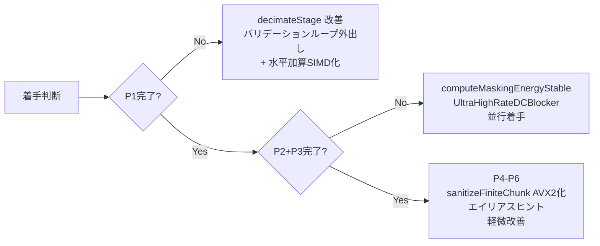

# Intel Advisor Release 解析結果：最適化提案（検証済み）

> 作成日: 2026-06-13
> 解析対象: Releaseビルド Intel Advisor プロファイル結果
> 元データ: `doc/work35/intel_advisor_release.txt`
> 検証日: 2026-06-13
> 検証結果: `doc/work35/intel_advisor_analysis_validation.md`

---

## 検証ステータス

本ドキュメントは Intel Advisor 解析結果に基づき作成され、以下のツールを用いた実コードとの突合検証を経て修正済み。

| 優先度 | コンポーネント | 判定 |
|--------|--------------|------|
| **P1** | `decimateStage` スカラーフォールバック | ✅ 妥当（補足: `dotProductAvx2` も同一水平加算改善対象） |
| **P2** | `computeMaskingEnergyStable` | ✅ 妥当 |
| **P3** | `UltraHighRateDCBlocker::process` | ✅ 妥当（SSE2命令数 5→9 に訂正済み） |
| **P4** | `sanitizeFiniteChunk` | ✅ 妥当 |
| **P5** | `evaluateCandidateMapped` エラー計算ループ | ✅ 妥当 |
| **P6** | 軽微改善候補 | ✅ 妥当（補足: `dotProductAvx2` 水平加算, `lock_locales` はCRT関数） |

**検証ツール**: Serena MCP, CodeGraph MCP, AiDex MCP, Graphify MCP, Grep

---

## 解析サマリ

Advisorレポートから抽出した主要ホットスポットを優先度順に整理。

| 優先度 | コンポーネント | Self Time | 問題種別 | 期待効果 |
|--------|--------------|-----------|---------|---------|
| **P1** | `CustomInputOversampler::decimateStage` スカラーフォールバック | **0.762s** | 非ベクトル化(スカラー) | ★★★★★ |
| **P2** | `MklFftEvaluator::computeMaskingEnergyStable` | 0.115s | データ型変換 + libm呼出 | ★★★★ |
| **P3** | `UltraHighRateDCBlocker::process` | 0.120s | コンパイラがベクトル化不可 | ★★★ |
| **P4** | `sanitizeFiniteChunk` (DSPCoreIO.cpp) | 0.032s | 非ベクトル化(スカラー) | ★★ |
| **P5** | `NoiseShaperLearner::evaluateCandidateMapped` エラー計算ループ | 0.011s | エイリアス不明 | ★ |
| **P6** | libm呼出 + 水平加算等の軽微改善 | 計~0.150s | データ型変換/非効率実装 | ★★ |

---

## P1: `CustomInputOversampler::decimateStage` — スカラーフォールバック

- **ファイル**: `src/CustomInputOversampler.cpp`
- **該当行**: ~L571（スカラーフォールバック内側ループ）
- **Total time**: 1.004s / **Self time**: 0.762s
- **Status**: Scalar（Int64, UInt256 traits）
- **Advisor表示**: `[loop in CustomInputOversampler::decimateStage at CustomInputOversampler.cpp:571]`

### 問題の詳細

`decimateStage` にはAVX2最適化パスが `#if defined(__AVX2__) && defined(__FMA__)` で存在するが、以下の条件でスカラーフォールバックに陥る:

1. **`stage.convCount < 4`** → AVX2分岐に入らず常にスカラー
2. **`bad == true`** が検出 → AVX2経路の全計算を放棄し、スカラーでやり直し
3. AVX2経路でも **非連続アクセス**（halfband構造により stride=2）を `_mm256_set_pd(s3,s2,s1,s0)` で個別gather→set

### AVX2経路の現状の問題点

```cpp
// 現状（src/CustomInputOversampler.cpp 抜粋）
for (; r < simdEnd; r += 4)
{
    const int idx0 = base - stage.convParity - ((r + 0) << 1);
    const int idx1 = base - stage.convParity - ((r + 1) << 1);
    const int idx2 = base - stage.convParity - ((r + 2) << 1);
    const int idx3 = base - stage.convParity - ((r + 3) << 1);
    // 4回のバウンドチェック
    if (idx0 < 0 || idx0 >= capacity || ...) { bad = true; break; }
    const double s0 = history[idx0];  // 個別ロード × 4
    const double s1 = history[idx1];
    const double s2 = history[idx2];
    const double s3 = history[idx3];
    const __m256d vSamples = _mm256_set_pd(s3, s2, s1, s0);  // gather相当
    if (isBadSampleV(vSamples)) { bad = true; break; }  // チェックで中断リスク
    const __m256d vCoeffs = _mm256_loadu_pd(coeffs + r);
    vAcc = _mm256_fmadd_pd(vSamples, vCoeffs, vAcc);
}
// 水平加算
alignas(64) double partial[4];
_mm256_store_pd(partial, vAcc);
acc += partial[0] + partial[1] + partial[2] + partial[3];  // 非効率
```

### 改善案

| # | 改善内容 | 詳細 | 難易度 |
|---|---------|------|-------|
| 1 | **バリデーションチェックをループ外へ移動** | 出力サンプル `n` ごとに全タップ範囲のバウンド + bad check を1回だけ事前実施。`bad` によるAVX2経路放棄を撲滅 | 中 |
| 2 | **`dotProductAvx2` の stride-2 対応版を追加** | `interpolateStage` と同様の `dotProductAvx2` をデシメーション向けに拡張（非連続インデックス対応 gather版 vs 係数が連続であることを活かす設計） | 中 |
| 3 | **水平加算のSIMD化** | `_mm256_store_pd` → スカラー加算の代わりに `vextractf128` + `hadd` で完結。`dotProductAvx2`（L165-170）も同一パターンのため併せて修正推奨 | 低 |
| 4 | **`__assume(convCount % 4 == 0)`** | convCountが4の倍数であることをコンパイラに伝達、エピローグループ除去 | 低 |
| 5 | **`__restrict` ポインタ修飾** | `history`, `coeffs`, `output` に `__restrict` を付与しエイリアス解析最適化 | 低 |

```cpp
// 改善案: 水平加算のSIMD化（#3）
// Before:
alignas(64) double partial[4];
_mm256_store_pd(partial, vAcc);
acc += partial[0] + partial[1] + partial[2] + partial[3];

// After:
__m128d vLo = _mm256_castpd256_pd128(vAcc);
__m128d vHi = _mm256_extractf128_pd(vAcc, 1);
__m128d vSum = _mm_add_pd(vLo, vHi);
vSum = _mm_hadd_pd(vSum, vSum);
acc = _mm_cvtsd_f64(vSum);
```

---

## P2: `MklFftEvaluator::computeMaskingEnergyStable` — データ型変換

- **ファイル**: `src/MklFftEvaluator.h`
- **該当行**: ~L749
- **Total time**: 0.115s / **Self time**: 0.039s
- **Advisor表示**: `[loop in MklFftEvaluator::computeMaskingEnergyStable at MklFftEvaluator.h:749]` — 1 Data type conversion present
- **関連**: `exp` (0.065s, data type conversions), `log10` (0.042s, type conversions + shifts), `log` (0.020s, type conversions + shifts)

### 問題の詳細

`computeMaskingEnergyStable` の内側ループで `std::exp((valueDb - maxDb) * kLogScale)` を呼び出し。Advisorが報告する「1 data type conversion present」は SSE↔x87 FPU モード切り替えが原因と推定される。

```cpp
// 現状
for (int k = 0; k < contributions.size; ++k)
{
    sum += std::exp((valueDb - maxDb) * kLogScale);  // libm呼出でFPUモード切替
}
const double totalPower = std::exp(maxDb * kLogScale) * sum;  // 同上
```

### 改善案

| # | 改善内容 | 詳細 | 難易度 |
|---|---------|------|-------|
| 1 | **`std::exp` → SVML `_mm256_exp_pd` による4要素同時計算** | `contributions.size` が小さく効果が限定的なら、代わりに `std::exp` 呼出を1回にまとめるリファクタリング | 中 |
| 2 | **`std::isfinite` → ビット演算版** | `isFiniteNoLibm` と同様の手法に置き換え | 低 |
| 3 | **`powerToDb`内の`std::log10` → `std::log` × log10(e) に変更** | 乗算定数に置き換えることでSVML/SIMD化の障壁低減（全呼出元に波及） | 低 |

---

## P3: `UltraHighRateDCBlocker::process` — 非ベクトル化ループ

- **ファイル**: `src/UltraHighRateDCBlocker.h`
- **該当行**: ~L171（`process` メソッドのスカラーループ）
- **Self time**: 0.120s
- **Advisor表示**: `[loop in convo::UltraHighRateDCBlocker::process at UltraHighRateDCBlocker.h:171]` — "Compiler lacks sufficient information to vectorize loop"
- **関連**: `LatticeNoiseShaper::processSample` (0.286s, FMA/Extract), `LatticeNoiseShaper::processStereoBlock` L104 (0.214s)

### 問題の詳細

IIRフィルタの状態依存性（`state[n] = f(state[n-1], x[n])`）によりループの自動ベクトル化は本質的に不可。ただし以下のオーバーヘッドが加算されている:

1. **`killDenormal` 呼出**: Releaseビルドでは `static_cast<void>(x); return x;` の完全no-opだが、インライン展開後もコンパイラがbit操作パスの不要コードを完全除去できない可能性
2. **`isFiniteAndBelowThresholdMask`**: スカラー値1つのチェックにSSE2 intrinsics 9命令（`_mm_set1_pd`×2, `_mm_sub_pd`, `_mm_cmpeq_pd`, `_mm_andnot_pd`, `_mm_cmplt_pd`, `_mm_and_pd`, `_mm_movemask_pd`）を使用

```cpp
// 現状: スカラー値1つのチェックに過剰なSSE2
static inline bool isFiniteAndBelowThresholdMask(double value, double threshold) noexcept
{
    const __m128d v = _mm_set1_pd(value);
    const __m128d diff = _mm_sub_pd(v, v);
    const __m128d finiteMask = _mm_cmpeq_pd(diff, _mm_setzero_pd());
    const __m128d signMask = _mm_set1_pd(-0.0);
    const __m128d absV = _mm_andnot_pd(signMask, v);
    const __m128d thresholdV = _mm_set1_pd(threshold);
    const __m128d belowMask = _mm_cmplt_pd(absV, thresholdV);
    const __m128d validMask = _mm_and_pd(finiteMask, belowMask);
    return _mm_movemask_pd(validMask) == 0x3;
}
```

### 改善案

| # | 改善内容 | 詳細 | 難易度 |
|---|---------|------|-------|
| 1 | **`isFiniteAndBelowThresholdMask` / `isFiniteAndAboveThresholdMask` をスカラービット演算版に置換** | `isFiniteNoLibm(x) && (fastAbs(x) < threshold)` と同様のlibm非依存ビット演算で実装 | 低 |
| 2 | **`killDenormal` 呼出の条件コンパイル最適化** | `JUCE_DEBUG` / `_DEBUG` / `CONVOPEQ_DEBUG_DENORMALS` が未定義の場合は呼出自体をプリプロセッサで完全削除 | 低 |
| 3 | **`__forceinline` + 呼出元で条件コンパイル** | Releaseビルドでは `killDenormal()` 呼出のプリプロセッサ削除によりバイナリ完全除去 | 低 |

```cpp
// 改善案(#1): isFiniteAndBelowThresholdMask のスカラー版
static inline bool isFiniteAndBelowThresholdMask(double value, double threshold) noexcept
{
    const uint64_t bits = std::bit_cast<uint64_t>(value);
    // 指数部が 0x7FF (NaN/Inf) でない
    if ((bits & 0x7FF0000000000000ULL) == 0x7FF0000000000000ULL)
        return false;
    // 絶対値が threshold 未満
    const uint64_t absBits = bits & 0x7FFFFFFFFFFFFFFFULL;
    const uint64_t thresholdBits = std::bit_cast<uint64_t>(threshold);
    return absBits < thresholdBits;
}
```

---

## P4: `sanitizeFiniteChunk` — スカラー有限値チェック

- **ファイル**: `src/audioengine/AudioEngine.Processing.DSPCoreIO.cpp`
- **該当行**: ~L43
- **Self time**: 0.032s（2箇所の呼出合計）
- **Advisor表示**: `[loop in A0x58e4c794::sanitizeFiniteChunk at ...DSPCoreIO.cpp:43]` — Scalar, Int64/UInt16/UInt256

### 改善案

AVX2版を追加して4サンプル同時処理:

```cpp
#if defined(__AVX2__)
inline void sanitizeFiniteChunk(double* data, int count) noexcept
{
    if (data == nullptr || count <= 0)
        return;

    const __m256d vLimit = _mm256_set1_pd(1.0e300);
    const __m256d vZero = _mm256_setzero_pd();
    const __m256d vSignMask = _mm256_set1_pd(-0.0);

    int i = 0;
    const int simdEnd = (count / 4) * 4;
    for (; i < simdEnd; i += 4)
    {
        __m256d vData = _mm256_loadu_pd(data + i);
        // |x| < limit かつ NaNでない をマスク
        __m256d vAbs = _mm256_andnot_pd(vSignMask, vData);
        __m256d vCmp = _mm256_cmp_pd(vAbs, vLimit, _CMP_LT_OQ);
        __m256d vNanCmp = _mm256_cmp_pd(vData, vData, _CMP_EQ_OQ);  // NaN→false
        __m256d vMask = _mm256_and_pd(vCmp, vNanCmp);
        // マスクが0の位置を0.0に（条件満たさない要素をゼロクリア）
        __m256d vResult = _mm256_and_pd(vData, vMask);
        _mm256_storeu_pd(data + i, vResult);
    }
    for (; i < count; ++i)
    {
        if (!isFiniteAndAbsBelowNoLibm(data[i], 1.0e300))
            data[i] = 0.0;
    }
}
#endif
```

---

## P5: `NoiseShaperLearner::evaluateCandidateMapped` エラー計算ループ

- **ファイル**: `src/NoiseShaperLearner.cpp`
- **該当行**: ~L1298
- **Self time**: 0.011s
- **Advisor表示**: `[loop in NoiseShaperLearner::evaluateCandidateMapped at ...:1298]` — "Compiler lacks sufficient information to vectorize loop"

### 問題

```cpp
// 現状: 単純な乗算+減算だが自動ベクトル化されない
for (int k = 0; k < AudioSegment::kLength; ++k)
{
    context.errorLeft[k] = context.shapedLeft[k] - (leveled.segment.left[k] * kOutputHeadroom);
    context.errorRight[k] = context.shapedRight[k] - (leveled.segment.right[k] * kOutputHeadroom);
}
```

### 改善案

| # | 改善内容 | 難易度 |
|---|---------|-------|
| 1 | `__declspec(noalias)` / `__restrict` をポインタに付与 | 低 |
| 2 | `#pragma loop(ivdep)` で依存関係なしを明示 | 低 |

---

## P6: 軽微な改善候補

| 箇所 | 現状 | 改善案 | 期待効果 |
|------|------|--------|---------|
| `decimateStage` AVX2水平加算 + `dotProductAvx2` | `store` + 4回スカラー加算（両方同じパターン） | `vextractf128` + `hadd` | 小 |
| `MklFftEvaluator::powerToDb` | `10.0 * std::log10(p)` | `std::log(p)` × `10.0/std::log(10.0)` 乗算定数化 | 中 |
| `MklFftEvaluator::computeTonalityFromSfm` | `std::log10(sfm)` | 同上 | 小 |
| `juce::AudioBuffer::makeCopyOf<float>` | float→double変換 | JUCEコードのため直接編集不可 | — |
| `NoiseShaperLearner::workerThreadMain` L838 | 除算 + データ型変換 | 定数除算を乗算に変換 | 小 |
| `lock_locales` (0.009s) | CRTロケールロック（`locks.cpp:63`）。プロジェクトコード外の呼出 | locale非依存処理の徹底で間接削減可能だが直接改修対象外 | — |

---

## 実装ステータス（2026-06-13）

Debugビルド成功確認済み。P1-1（バリデーションチェックループ外出し）とP1-2（`dotProductAvx2` stride-2版）は構造変更を伴うため、別途設計判断が必要。

| ID | 改善内容 | 状態 |
|----|---------|------|
| P1-3 | 水平加算SIMD化（decimateStage + dotProductAvx2） | ✅ 実装済み |
| P1-4 | `__assume(convCount % 4 == 0)` | ✅ 実装済み |
| P1-5 | `__restrict` ポインタ修飾 | ✅ 実装済み |
| P3-1 | `isFiniteAndBelowThresholdMask` スカラー化 | ✅ 実装済み |
| P4 | `sanitizeFiniteChunk` AVX2化 | ✅ 実装済み |
| P5 | エラー計算ループ `__restrict` ポインタ | ✅ 実装済み |
| P2-2 | `std::isfinite` → ビット演算 | ✅ 実装済み |
| P2-3 | `std::log10` → `std::log * log10(e)` | ✅ 実装済み |
| P1-1 | バリデーションチェックループ外出し | ⏳ 未着手（設計判断待ち） |
| P1-2 | `dotProductAvx2` stride-2版 | ⏳ 未着手（設計判断待ち） |

詳細は `doc/work35/implementation_status.md` 参照

---

## 推奨アクション優先順位



1. **P1-3 (decimateStage)** — バリデーションチェックのループ外出し + 水平加算SIMD化（改修量少・効果大）
2. **P1-1 (decimateStage)** — `dotProductAvx2` stride-2対応版の追加（改修量大・効果大）
3. **P3 (UltraHighRateDCBlocker)** — `isFiniteAndBelowThresholdMask` のスカラー版置換（即効性・確実）
4. **P4 (sanitizeFiniteChunk)** — AVX2版追加（コード量少・安全）
5. **P2 (computeMaskingEnergyStable)** — libm呼出の最適化（効果は大きいが影響範囲に注意）
6. **P5-P6** — 優先度低、余裕があれば実施
