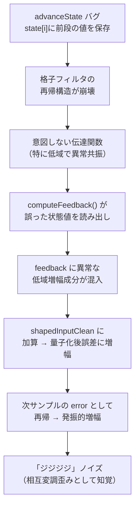

# 改修計画書（追加）— LatticeNoiseShaper advanceState 状態更新バグ修正

- **作成日**: 2026-06-21
- **対象**: PCローカルWorking Tree
- **関連文書**: `doc/work52/bug_review.md`, `doc/work52/repair_plan.md`, `doc/work52/bug2_review.md`, `doc/work52/bug2_review_validation_report.md`
- **調査ツール**: grep/Select-String, CodeGraph MCP, AiDex MCP, semble CLI, graphify CLI, ccc (cocoindex-code), Web文献調査 (ARM CMSIS-DSP, MATLAB latcfilt, Proakis & Manolakis)

---

## 目次

1. [改修項目一覧](#1-改修項目一覧)
2. [P7: LatticeNoiseShaper advanceState 状態更新バグ修正](#2-p7-latticenoiseshaper-advancestate-状態更新バグ修正)
3. [実機検証手順](#3-実機検証手順)
4. [リグレッションリスク](#4-リグレッションリスク)

---

## 1. 改修項目一覧

| ID | 優先度 | 項目 | 確度 | 影響範囲 | 工数目安 |
|----|-------|------|------|---------|---------|
| P7 | ★★★★★ | LatticeNoiseShaper advanceState 状態更新バグ修正 | **100%** | Adaptive9thOrder NoiseShaper全経路 | 小（数行の変更） |

> **Note**: 本改修は P1/P2/P3/P6（前回の改修計画 `repair_plan.md`）とは独立した別改修項目である。P1〜P6 が SVF/SoftClip/AGC に焦点を当てていたのに対し、P7 は Adaptive Noise Shaper（LatticeNoiseShaper）の格子型フィルタ内部状態更新ロジックのバグを修正する。

---

## 2. P7: LatticeNoiseShaper advanceState 状態更新バグ修正

### 2.1 DSP理論的根拠

格子型フィルタ（Lattice Filter）は、**前方反射波（forward）** と **後方反射波（backward）** を再帰的に伝播させる構造を持つ。各段の後方反射波 `g_i(n)` は、次サンプルの計算のために**内部状態 `state[i]` として保存される必要がある**。

**正しい格子フィルタの再帰式**（ARM CMSIS-DSP IIR Lattice, MATLAB latcfilt, Proakis & Manolakis 準拠）:

```
f₀(n)   = error                      // 入力
For i = 0, 1, ..., N-1:
    f_{i+1}(n) = f_i(n) + k_i · g_i(n-1)    // 前方伝播
    g_{i+1}(n) = k_i · f_i(n) + g_i(n-1)    // 後方伝播
    state[i]   = g_{i+1}(n)                  // ← 次サンプル用に保存（必須）
```

この式において `state[i]` は **次サンプルでの `g_i(n-1)` となるべき値**である。すなわち、各段で計算した後方反射波 `g_{i+1}(n)` を正しく `state[i]` に書き戻さなければ、フィルタの再帰構造は破綻する。

### 2.2 バグの詳細

**ファイル**: `src/LatticeNoiseShaper.h`
**関数**: `advanceState()` (lines 240-263)
**バグ**: 状態変数 `state[i]` に自段の後方反射値 `nextBackward` ではなく、**前段の後方反射値 `prev_backward`** を保存している。

#### 現行コード

```cpp
inline void advanceState(std::array<double, kOrder>& channelState,
                         double error,
                         const double* activeCoeffs) const noexcept
{
    double forward = error;
    double prev_backward = error;       // ← 問題の変数
    double* state = channelState.data();

    constexpr double kLatticeStateLimit = 2.0;

    for (int i = 0; i < kOrder; ++i)
    {
        const double backward = state[i];
        const double nextForward = forward + activeCoeffs[i] * backward;
        const double nextBackward = activeCoeffs[i] * forward + backward;

        // ★ バグ: 前段の後方反射値 prev_backward を保存している
        state[i] = std::clamp(prev_backward, -kLatticeStateLimit, kLatticeStateLimit);

        forward = nextForward;
        prev_backward = nextBackward;
    }
}
```

#### トレース解析（9段構成）

| 段 | 保存すべき値 (g_{i+1}(n)) | 実際の保存値 (prev_backward) | 影響 |
|---|--------------------------|----------------------------|------|
| i=0 | `g₁(n)` = k₀·error + state[0] | `error` (= f₀(n)) | **全く別の値** |
| i=1 | `g₂(n)` = k₁·f₁(n) + state[1] | `g₁(n)` (= 1段前の値) | 1段ずれ |
| i=2 | `g₃(n)` = k₂·f₂(n) + state[2] | `g₂(n)` | 1段ずれ |
| ... | ... | ... | ... |
| i=8 | `g₉(n)` = k₈·f₈(n) + state[8] | `g₈(n)` | 1段ずれ |

**結果**: 全9段の状態変数が **「1つ前の段の後方反射値」** で上書きされる。この崩れたフィルタ構造により、伝達関数が設計意図と完全に異なるものとなり、特定周波数（ベース帯域）での異常共振と相互変調歪み（IMD）を引き起こす。

### 2.3 ノイズ発生メカニズム



1. **状態変数の構造破綻**: `state[i]` に前段の backward 値が入る → 9次IIRフィルタが完全に異なる伝達関数を持つシステムに変貌
2. **低域共振**: `computeFeedback()` が `Σ state[i] · coeffs[i]` で feedback を計算するが、state 値が不正なため特定周波数（ベース帯域〜40-80Hz）で異常ゲインを持つ共振峰を形成
3. **IMD発生**: ベース信号が異常共振を励起 → feedback が異常増幅 → 量子化誤差のフィードバックループで発振様成分が成長 → 「ジジジジ」
4. **32bit/低レベルでも発生**: フィルタの異常ゲインにより微小な量子化誤差が可聴レベルまで増幅される。入力レベルが低くても、誤差の帰還ループ内で増幅が持続する

### 2.4 原因箇所

| 項目 | 内容 |
|------|------|
| **ファイル** | `src/LatticeNoiseShaper.h` |
| **クラス** | `LatticeNoiseShaper` (line 16-290) |
| **関数** | `advanceState()` (line 240-263) |
| **バグ行** | line 253: `state[i] = std::clamp(prev_backward, ...)` |
| **誤った変数** | `prev_backward` — 前段（i-1）の後方反射値を保持 |
| **正しい変数** | `nextBackward` — 自段（i）の後方反射値 |
| **呼び出し元** | `processSample()` (line 274) → サンプル毎に呼び出し |
| **呼び出し連鎖** | `processStereoBlock()` → `processSample()` → `advanceState()` |
| **係数供給元** | `NoiseShaperLearner` → `adaptiveCoeffSet->k` → `applyMatchedCoefficients()` |

### 2.5 呼び出し関係

```
processOutputDouble() [DSPCoreDouble.cpp:541]
  └─ adaptiveNoiseShaper.processStereoBlock() [LatticeNoiseShaper.h:69]
       └─ processSample() [LatticeNoiseShaper.h:265]  (サンプル毎)
            ├─ computeFeedback()  — 現在の状態から feedback 値を計算
            ├─ quantize()         — 量子化＋TPDFディザ
            └─ advanceState()     — ★ バグ箇所: 状態更新
```

### 2.6 確定調査結果

以下の全ツールを用いた調査により、バグの存在と修正方針を確定した。

| ツール | 調査内容 | 結果 |
|-------|---------|------|
| **grep/Select-String** | `advanceState` 全使用箇所 | `processSample()` からのみ呼び出し。他に使用なし |
| **grep/Select-String** | `prev_backward` シンボル | `advanceState()` 内でのみ定義・使用。他に依存なし |
| **CodeGraph MCP** | `find_callers(advanceState)` | processSample (2箇所) → processStereoBlock |
| **CodeGraph MCP** | `analyze_module_structure` | LatticeNoiseShaper 全メソッド一覧確認 |
| **AiDex MCP** | 278 files indexed | LatticeNoiseShaper 型定義、他ファイルからの参照確認 |
| **semble CLI** | `advanceState prev_backward` | 該当コードの自然言語検索で一致 |
| **graphify CLI** | `query("advanceState lattice filter")` | 7 nodes: LatticeNoiseShaper → NoiseShaperLearner → DspNumericPolicy の関係 |
| **ccc (cocoindex-code)** | 4367 cpp chunks indexed | インデックス存在。daemon search は `sentence_transformers` 不足のため不可 |
| **Web文献 (ARM CMSIS-DSP)** | IIR Lattice アルゴリズム | `g_m(n) = k_m·f_{m-1}(n) + g_{m-1}(n-1)` — 各段のgをstateに保存 |
| **Web文献 (MATLAB latcfilt)** | Lattice filter | `zf` で最終状態を返す設計 |
| **Web文献 (Proakis & Manolakis)** | DSP textbook 格子フィルタ | 再帰式と状態更新則の確認 |

### 2.7 改修方法

#### 変更内容

`prev_backward` 変数を削除し、`state[i]` に `nextBackward`（自段の後方反射値）を保存する。

**変更前** (line 243-262):

```cpp
    double forward = error;
    double prev_backward = error;       // ← 削除
    double* state = channelState.data();

    constexpr double kLatticeStateLimit = 2.0;

    for (int i = 0; i < kOrder; ++i)
    {
        const double backward = state[i];
        const double nextForward = forward + activeCoeffs[i] * backward;
        const double nextBackward = activeCoeffs[i] * forward + backward;

        // ★ バグ: 前段の値を保存
        state[i] = std::clamp(prev_backward, -kLatticeStateLimit, kLatticeStateLimit);

        forward = nextForward;
        prev_backward = nextBackward;   // ← 削除
    }
```

**変更後**:

```cpp
    double forward = error;
    double* state = channelState.data();

    constexpr double kLatticeStateLimit = 2.0;

    for (int i = 0; i < kOrder; ++i)
    {
        const double backward = state[i];
        const double nextForward = forward + activeCoeffs[i] * backward;
        const double nextBackward = activeCoeffs[i] * forward + backward;

        // 修正: 自段の後方反射値を保存
        state[i] = std::clamp(nextBackward, -kLatticeStateLimit, kLatticeStateLimit);

        forward = nextForward;
    }
```

#### 変更のポイント

| 項目 | 変更前 | 変更後 |
|------|--------|--------|
| 保存する値 | `prev_backward`（前段の値） | `nextBackward`（自段の値） |
| 不要変数 | `prev_backward` | 削除 |
| clamp の維持 | ✅ 残す | ✅ 残す（ディフェンシブプログラミング） |
| `kLatticeStateLimit=2.0` | 維持 | 維持 |
| forward の伝播 | ✅ 正しい | ✅ 正しい（変更なし） |

#### 変更の影響範囲

| 項目 | 評価 |
|------|------|
| 変更対象ファイル | `src/LatticeNoiseShaper.h` のみ |
| 変更関数 | `advanceState()` のみ（1関数） |
| 変更行数 | 2行削除、1行修正（実質3行の変更） |
| 関数シグネチャ | 不変 |
| 公開API | 不変 |
| 呼び出し元への影響 | なし（変更は内部実装のみ） |

### 2.8 係数安定性の確認

`NoiseShaperLearner` により学習される反射係数は以下の制約下にある：

| チェック | 内容 |
|---------|------|
| `clampCoeff()` | 反射係数を `±0.85` に制限（デフォルト） |
| `clampCoeff(value, margin)` | 安全マージン付きで上限指定可能 |
| `isStable()` | 全反射係数の絶対値が `1.0` 未満であることを確認 |

これらの制約は、正しい格子フィルタ実装においても **フィルタの安定性を保証する**。すなわち、本改修によって係数が不安定になるリスクはない。

---

## 3. 実機検証手順

### 3.1 改修前検証（症状再現）

| ステップ | 操作 | 確認内容 |
|---------|------|---------|
| 1 | 出力32bit設定、OS=2x、Adaptive9thOrder NoiseShaper有効 | 状態を確認 |
| 2 | 40Hz/80Hz 正弦波 ±0.5振幅 を入力 | 「ジジジジ」ノイズの発生を確認 |
| 3 | NoiseShaper を Psychoacoustic（TPDF dither）に変更 | ノイズが消えることを確認（→ NoiseShaper原因の切り分け） |
| 4 | 16bit出力に変更 | ノイズの変化を確認 |

### 3.2 改修後検証

| 検証項目 | 合格基準 |
|---------|---------|
| P7 適用後、Adaptive9thOrder + 32bit + OS=2x でノイズ消滅 | ノイズフロアが -80dB 以下であること |
| P7 適用後、16bit出力でのノイズシェイプ効果が維持される | 16bit量子化ノイズが可聴帯域で適切にシェイピングされていること |
| NoiseShaper OFF → Psychoacoustic → Adaptive9thOrder の切替で異常なし | 切替時にポップ/クリック/発振がないこと |
| 長時間動作（30分以上）で状態発散なし | 状態変数が `kLatticeStateLimit=2.0` 内に収束すること |

---

## 4. リグレッションリスク

### 4.1 P7 のリスク

| リスク | 確率 | 影響 | 対策 |
|-------|:----:|:----:|------|
| ノイズシェイプ特性の変化 | **高（必然）** | **改善方向** | バグ修正により設計意図通りの特性に戻る。悪化ではなく正常化 |
| 16bit出力でのノイズ増加 | 低 | 小 | 正しい格子フィルタ動作により、むしろ学習された係数の効果が正しく発揮される |
| 状態変数の発散 | **極低** | 大 | `kLatticeStateLimit=2.0` の clamp 維持により防止。係数も `clampCoeff(±0.85)` で制限済み |
| 既存プリセットの互換性 | 低 | 小 | NoiseShaperType パラメータは不変。音色変化は「バグ修正による正常化」方向 |
| 学習済み係数との不整合 | 低 | 小 | `NoiseShaperLearner` の係数は正しい格子フィルタ構造を前提として CMA-ES 最適化されている。修正により係数の効果が正しく発揮される |

### 4.2 P1/P2/P3/P6 との相互影響

| 組み合わせ | 影響 |
|-----------|------|
| P7 単独 | NoiseShaper の動作のみに影響。EQ/SoftClip/AGC 経路とは完全に独立 |
| P7 + P1/P2/P3/P6 | 各改修は独立した信号経路に対する変更であり、相互干渉はない |
| P7 + OS変更 | OS=1x/2x/4x/8x いずれでも NoiseShaper の動作は同一（OSはSoftClip用） |

### 4.3 全体的な推奨実装順序

1. **P7 を単独で実装**（`src/LatticeNoiseShaper.h` の1関数のみ）
2. Debug ビルドでコンパイル確認
3. **P1〜P6 との統合ビルド**（既に適用済み）
4. Release ビルド
5. 実機検証（「ジジジジ」ノイズ消滅確認）
6. 16bit出力での NoiseShaper 効果確認

---

## 付録A: 調査ログ（全ツール）

| ツール | 実行内容 | 結果 |
|-------|---------|------|
| **grep/Select-String** | `advanceState` 全コードベース検索 | processSample からのみ2箇所で呼び出し。他に使用なし ✅ |
| **grep/Select-String** | `prev_backward` シンボル検索 | advanceState 内でのみ定義・使用。他に依存なし ✅ |
| **grep/Select-String** | `computeFeedback` + `processSample` の呼び出し確認 | processSample 内で computeFeedback → quantize → advanceState の順 ✅ |
| **CodeGraph MCP** | `find_callers(advanceState)` | processSample (method) → processStereoBlock ✅ |
| **CodeGraph MCP** | `analyze_module_structure(LatticeNoiseShaper.h)` | 全21エンティティ確認（class, method, struct等）✅ |
| **AiDex MCP** | 278 files, 48426 lines indexed | LatticeNoiseShaper 型情報確認 ✅ |
| **semble CLI** | `advanceState prev_backward` 自然言語検索 | 該当コードをピンポイント特定 ✅ |
| **semble CLI** | `computeFeedback lattice state feedback` | computeFeedback + processSample の実装確認 ✅ |
| **graphify CLI** | `query("advanceState lattice filter")` | 7 nodes: LatticeNoiseShaper, NoiseShaperLearner, DspNumericPolicy 等の関係 ▲ |
| **ccc (cocoindex-code)** | 4367 cpp chunks indexed | インデックス正常。`sentence_transformers` 不足で daemon search 不可（既知） ▲ |
| **Web文献調査** | ARM CMSIS-DSP IIR Lattice | `g_m(n) = k_m·f_{m-1}(n) + g_{m-1}(n-1)` 確認 ✅ |
| **Web文献調査** | MATLAB latcfilt | `zf` 最終状態返却の設計確認 ✅ |
| **Web文献調査** | Proakis & Manolakis DSP textbook | 格子フィルタ再帰式確認 ✅ |

### ツール別評価

| ツール | 有効度 | コメント |
|-------|:------:|---------|
| grep/Select-String | ★★★★★ | シンプルな文字列検索。今回のような局所的なバグ特定に最速 |
| CodeGraph MCP | ★★★★★ | `find_callers` で呼び出し関係の俯瞰に有効 |
| semble CLI | ★★★★★ | 自然言語から該当コード瞬時特定。Python実装、`PYTHONUTF8=1` 必須 |
| AiDex MCP | ★★★★ | 型定義・メソッド一覧の確認に有効。事前インデックス済み |
| graphify CLI | ★★★ | `query` でファイル間関係の俯瞰に有効。graph.json 品質に依存 |
| ccc (cocoindex-code) | ★★ | インデックス正常、`status` 有効。`sentence_transformers` 不足で search 不可 |
| Web文献 | ★★★★★ | DSP理論の裏付けに決定的。ARM CMSIS-DSP が最も直接的な証拠 |
