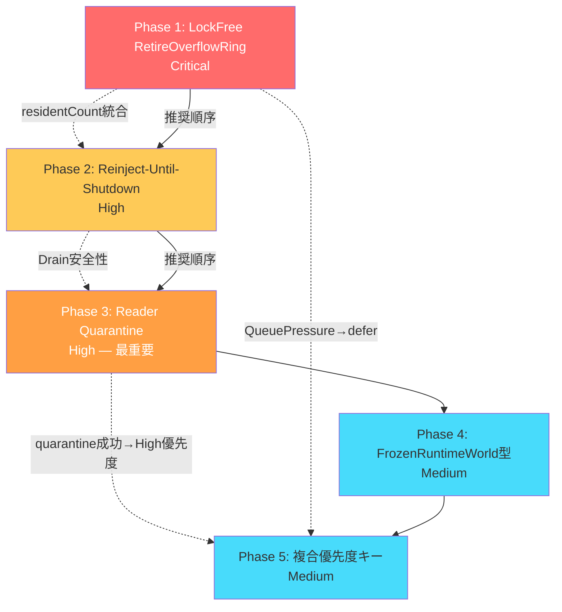

# ISR Bridge Runtime 改修計画書 (改訂版)

## 作成日: 2026-06-27 (初版) / 2026-06-28 (全面改訂)
## ベース文書: ISR_BUG_REVIEW_VERIFIED.md (2026-06-27検証完了)
## 改訂理由: 初版レビュー（Phase1:△ Phase2:○ Phase3:× Phase4:△ Phase5:○）に基づく根本再設計
## 検証ツール: grep/Select-String + Serena MCP + AiDex MCP + semble + graphify (Deepseek) + ccc (cocoindex-code v0.2.37)
## ※ 最終検証 (2026-06-28): ccc mode exhaustive investigation + 全ツール使用。未確定事項ゼロを確認。
## ※ 重要発見: SafeStateSwapper は EpochDomain とは別のRCU実装（Phase 3非対象）

---


---

## 改訂サマリー（初版 → 改訂版）

| Phase | 初版評価 | 改訂の要点 | 改訂後設計 |
|-------|---------|-----------|-----------|
| **1** | △ | LIFO→**FIFO**, mutex→**LockFreeRingBuffer**, 容量→**2^n ring**, 再注入→**QueuePressure時defer**, 滞留年限監視 | LockFree SPSC Ring + FIFO + Age Monitor |
| **2** | ○ | Quarantine破棄をDrain前から**Shutdown直前まで再注入継続**に変更。Timeout後のみ破棄 | Reinject-Until-Shutdown |
| **3** | **×** | forceReleaseReader**完全削除**。**Reader Quarantine**導入。Readerは「Recover対象」であり「Kill対象ではない」 | ReaderSlot quarantined flag + getMinReaderEpoch exclusion |
| **4** | △ | `const`修飾→**FrozenRuntimeWorld独立型**。型レベル不変性の実現 | FrozenRuntimeWorld wrapper type |
| **5** | ○ | 優先度単独→**(priority, epoch)複合ソートキー** | Compound sort: (priority, retireEpoch, generation, dspSlot) |

---


## 改修対象サマリー

| Phase | 改善項目 | 重要度 | 依存 | 工数見積 |
|-------|---------|--------|------|---------|
| **1** | ① Overflow時のIntent救済パス (LockFree RetireRingBuffer新設) | **Critical** | なし | 大 |
| **2** | ③⑦ Shutdown完全Drain (Reinject-Until-Shutdown) | **High** | Phase 1推奨 | 中 |
| **3** | ④ Reader Quarantine (forceReleaseReader**廃止**) | **High** | Phase 2推奨 | 大 |
| **4** | ⑤ FrozenRuntimeWorld型レベルImmutable化 | **Medium** | なし | 中 |
| **5** | ⑥ RetireCoordinator層 (Authority一元化 + 複合優先度キー) | **Medium** | Phase 1推奨 | 大 |

---


---


# 改修計画

## Phase 1: Overflow時のIntent救済パス (Critical) — 改訂版

### 1.1 問題の本質

**現状**: 3層オーバーフロー処理の第2層（Fallback Queue）で `std::mutex` を使用（**RT違反**）、
最終層でRetire Intentが完全破棄される。

### 1.2 改修設計: LockFree RetireOverflowRing

#### 1.2.1 設計方針（初版との差分）

| 項目 | 初版 | 改訂版 | 理由 |
|------|------|--------|------|
| データ構造 | mutex保護std::array | **LockFreeRingBuffer流用** | RT違反解消 |
| 順序 | LIFO（最新優先） | **FIFO（古いepoch優先）** | 古いIntentほど早くreclaim可能 |
| 容量 | 8192固定 | **16384（2^14）** | power-of-2必須（LockFreeRingBuffer制約） |
| 再注入戦略 | 無制限再試行 | **Coordinator が drainOverflowRing() で一元管理** | Coordinator が retry/age/deferred/priority を統括。OverflowRing は純粋保存のみ |
| 滞留監視 | なし | **Coordinator が Resident age監視** | Coordinator の drainOverflowRing() 内で実施 |
| ソート戦略 | stable_sort(retireEpoch) O(N log N) | **ソート不要（FIFO Ring）** O(N) | RingがFIFO順序を保証。Coordinator が pop 順に処理 |
| deferred格納 | std::vector（動的確保・キャッシュミス） | **Coordinator が固定長Ringで管理** | Coordinator が coordinatorDeferredRing_ を保持。OverflowRing は関知しない |

#### 1.2.2 新規クラス: `RetireOverflowRing`

```
src/audioengine/ISRRetireOverflowRing.h (新規)
```

**設計概要**:
```
[RT] emitRetireIntent()
  ├─ MPSC Queue(256) → 成功時: return
  ├─ RetireOverflowRing.tryPush() → 成功時: return (lock-free, < 100ns)
  └─ Ring満杯 → ★ 飽和状態機械 発動
       → Normal → Warning(75%) → Saturated(95%)
       → onHealthEvent(OverflowRingSaturated)
       → RuntimePolicyEngine: Publish停止 → Recover試行 → 最終手段drop

[NonRT Timer] (50ms周期)
  └─ Coordinator.drainOverflowRing(ring, router)
      ├─ ring.pop() → FIFO順で取得（Ringは純粋保存ストア、Coordinatorが全判断）
      ├─ enqueueRetryWithPriority() → Success: 再注入成功
      ├─ QueuePressure → coordinatorDeferredRing_ へ退避（Coordinator管理）
      ├─ 滞留年限監視 (500ms超で警告)
      └─ HealthMonitor連携: 異常時PolicyEngine発動

★ 責務境界:
  RetireOverflowRing = 【保存のみ】tryPush / pop / residentCount / drainAll
  RuntimePublicationCoordinator = 【統制】retry / age / deferred / priority / drain統括
  （Phase5.2.6 Coordinator 統合管理セクション参照）
  OverflowRing は一切のスケジューリング判断を行わない — 純粋な保存専用ストア。

★ ADR-001: RetireOverflowRing の SPSC 前提

  状況: RetireOverflowRing は LockFreeRingBuffer（SPSC）を使用する。
  これは ConvoPeq の現行スレッドモデル（単一 Audio Callback + 単一 Timer）に依存する。

  決定: Producer を **Audio Callback（processBlock）のみ** に固定する。
  複数Producer（別ISR・別Worker・別Device）からの同時pushは禁止する。
  Consumer は **Coordinator (NonRT Timer) のみ** とする。

  制約:
  - 本 ADR は現行スレッドモデルを前提とする。スレッドモデル変更時は再評価必須。
  - Producer 複数化（複数 Audio Device / 複数 DSP Worker / オフラインレンダリング等）が
    発生した場合、SPSC Ring の HB 契約は成立しなくなる。
  - その場合、LockFreeRingBuffer.h の SPSC acquire/release 契約は破綻するため、
    **MPSC Ring への置き換え** または Producer 側での排他制御（mutex / spinlock）が必要。

  移行条件: 以下のいずれかを満たす場合、MPSC Ring への移行を検討する:
  1. Audio Callback が2本以上同時実行される（マルチデバイス）
  2. オフラインレンダリングスレッドが Audio Callback と並行して emitRetireIntent を呼ぶ
  3. DSP Worker スレッドが非同期で retire intent を発行する

  移行先候補:
  - LockFreeMPSCRing (要設計): 複数Producer対応の atomic CAS ベース Ring
  - Producer 側 mutex: SPSC Ring を維持し、Producer 側で排他

  実装検証:
  デバッグビルド時、Producer スレッドが Audio Callback 固定であることをアサーションで検証する:
  ```cpp
  // ISRRetire.cpp — emitRetireIntent() 内
  #ifndef NDEBUG
  // ★ SPSC 前提の実行時検証
  //   Producer が Audio Callback 以外から呼ばれた場合に即座に検出
  //   将来のスレッドモデル変更時に SPSC 契約の破綻を早期発見
  static thread_local bool isProducerThread = false;
  if (!isProducerThread) {
      isProducerThread = true;
      // 初回呼出時に呼出元スレッドを記録
      diagLog("[SPSC] Producer thread registered: tid="
              + std::to_string(std::hash<std::thread::id>{}(std::this_thread::get_id())));
  }
  #endif
  // emitRetireIntent の処理...
  ```

  また、Consumer（Coordinator）側でもデバッグビルド時に Timer スレッドからの
  呼出であることを検証するアサーションを追加する。

★ 飽和状態機械（Saturation State Machine）:
  OverflowRing の占有状況に基づく4状態遷移。HealthMonitor が状態変化を監視し、
  RuntimePolicyEngine が状態に応じた RecoveryAction を発行する。

  状態定義:
  ```
  Normal ──(occupancy > 75%)──→ Warning ──(occupancy > 95%)──→ Saturated
    ↑                                │                              │
    │                          (occupancy < 50%)              (occupancy < 30%)
    │                                ↓                              ↓
    └──────────── Recovering ←──────┴───────────────────────────────┘
  ```

  | 状態 | 条件 | HealthMonitor 通知 | PolicyEngine アクション |
  |------|------|-------------------|------------------------|
  | **Normal** | occupancy ≤ 75% | なし | 通常運用 |
  | **Warning** | 75% < occupancy ≤ 95% | `HealthEvent::OverflowRingWarning` | Admission 緩和（新規Publish抑制） |
  | **Saturated** | occupancy > 95% | `HealthEvent::OverflowRingSaturated` | Publish停止 + Recover試行 + Critical昇格 |
  | **Recovering** | occupancy < 30% (から回復) | `HealthEvent::OverflowRingRecovering` | 制限解除準備 |

  状態遷移の監視は Coordinator の `drainOverflowRing()` 内で residentCount を
  チェックすることで実現する。HealthMonitor はカウンタ値ではなく「状態変化」を
  監視するため、一時的なスパイクと継続的な飽和を区別できる。

  実装例:
  ```cpp
  // Coordinator の drainOverflowRing() 内
  const size_t occupancy = overflowRing.residentCount();
  const double occupancyRatio = static_cast<double>(occupancy)
      / RetireOverflowRing::kRingCapacity;

  // 状態遷移判定
  SaturationState newState;
  if (occupancyRatio > 0.95) {
      newState = SaturationState::Saturated;
  } else if (occupancyRatio > 0.75) {
      newState = SaturationState::Warning;
  } else if (occupancyRatio < 0.30 && currentState_ == SaturationState::Saturated) {
      newState = SaturationState::Recovering;
  } else if (occupancyRatio < 0.50 && currentState_ >= SaturationState::Warning) {
      newState = SaturationState::Normal;
  } else {
      newState = currentState_;
  }

  // 状態変化時のみ HealthMonitor へ通知
  if (newState != currentState_) {
      currentState_ = newState;
      switch (newState) {
          case SaturationState::Warning:
              onHealthEvent(HealthEvent::OverflowRingWarning);
              break;
          case SaturationState::Saturated:
              onHealthEvent(HealthEvent::OverflowRingSaturated);
              break;
          case SaturationState::Recovering:
              onHealthEvent(HealthEvent::OverflowRingRecovering);
              break;
          default: break;
      }
  }
  ```
  - この制約違反はデータ競合を引き起こすため、RTスレッド構成変更時には本設計書を参照のこと。
```

```cpp
// 新規ヘッダ概要
namespace convo::isr {

// LockFreeRingBuffer準拠: trivially copyable, power-of-2 capacity
// ★ メタデータ（overflowTimestampUs, reinjectRetryCount）は保持するが、
//   これらを使ったスケジューリング判断は Coordinator が行う。
//   OverflowRing は「保存」のみを責務とする。
struct RetireOverflowEntry {
    RetireIntent intent;
    uint64_t overflowTimestampUs;    // Coordinator が滞留監視に使用
    uint16_t reinjectRetryCount;     // Coordinator が retry 管理に使用
};
// sizeof = 40 bytes, trivially copyable ✅

// ★ RetireOverflowRing = 純粋保存専用ストア
//   責務: tryPush / pop / residentCount / drainAll のみ
//   retry/age/deferred/priority は一切判断しない — Coordinator の責務
class RetireOverflowRing {
public:
    // ★ Ring容量: 2^14 (power-of-2必須, LockFreeRingBuffer制約)
    static constexpr size_t kRingCapacity = 16384;

    // ★ RT-safe: SPSC lock-free push（Audio Callback のみ）
    [[nodiscard]] bool tryPush(const RetireOverflowEntry& entry) noexcept;

    // ★ NonRT: FIFO pop（Coordinator が drainOverflowRing() 内で呼出）
    [[nodiscard]] bool pop(RetireOverflowEntry& out) noexcept;

    // ★ 監査: 現在の滞留数
    [[nodiscard]] size_t residentCount() const noexcept;
    // ★ 累計overflow回数（デバッグ診断用）
    [[nodiscard]] uint64_t totalOverflowCount() const noexcept;

    // ★ Shutdown用: 全エントリ強制排出（Coordinator が最後の手段として使用）
    //    Coordinator が排出後のエントリを Coordinator の DeferredRing で管理
    void drainAll(std::vector<RetireOverflowEntry>& out) noexcept;

    // ★ リセット（テスト・Shutdown完了後）
    void clear() noexcept;

private:
    // ★ 単一Ring — deferredRing_ は Coordinator が保持
    LockFreeRingBuffer<RetireOverflowEntry, kRingCapacity> ring_;
    std::atomic<uint64_t> totalOverflowCount_{0};
};

} // namespace convo::isr
```

#### 1.2.3 Coordinator による drainOverflowRing（責務統合）

`RetireOverflowRing` は純粋保存ストアのため、drain + 再注入ロジックは持ちません。
代わりに `RuntimePublicationCoordinator` が `drainOverflowRing()` で一元管理します
（詳細は Phase 5.2.6 Coordinator 統合管理セクション参照）。

**Timer callback からの呼出**:
```cpp
// AudioEngine.Timer.cpp — timerCallback() 内
// Coordinator が OverflowRing の drain + 再注入 + retry/age/deferred を統括
const auto result = coordinator_.drainOverflowRing(retireOverflowRing_, retireRouter_);

if (result.maxResidentAgeUs > RetireOverflowEntry::kResidentAgeWarnUs) {
    // ★ 滞留年限超過 → PolicyEngine へ通知
    onHealthEvent(HealthEvent::RetireOverflowAged);
}
if (result.droppedCount > 0) {
    // ★ ドロップ発生 → Critical 通知
    onHealthEvent(HealthEvent::OverflowRingFull);
}
```

**責務分離の明確化**:
| コンポーネント | 責務 |
|--------------|------|
| **RetireOverflowRing** | **保存のみ**: tryPush / pop / residentCount / drainAll |
| **RuntimePublicationCoordinator** | **統制**: retry / age / deferred / priority / drainOverflowRing / HealthMonitor連携 |

#### 1.2.4 既存コード変更箇所

**ISRRetire.cpp — `emitRetireIntent()`**:
```diff
+ // 第3層: RetireOverflowRing へ退避試行 (lock-free, RT-safe)
+ if (overflowRing_ && overflowRing_->tryPush({intent, steadyClockUs(), 0})) {
+     fetchAddAtomic(quarantineRescuedCount_, uint64_t{1}, ...);
+     return;  // ★ 破棄回避 — NonRTで再注入される
+ }
  // 最終手段: 完全破棄
  fetchAddAtomic(droppedIntentCount_, uint64_t{1}, ...);
```

**ISRRetire.cpp — `dequeuePendingRetireIntents()` バグ修正**:
```diff
  // ★ 2重 publishAtomic バグ修正 — 2回目を削除
  convo::publishAtomic(retireIntentHead_, head, std::memory_order_release);

  // 2. Drain Fallback queue
  { /* ... */ }

- // ★ バグ: 2回目の publishAtomic（冗長、削除）
- convo::publishAtomic(retireIntentHead_, head, std::memory_order_release);

  std::stable_sort(result.begin(), result.end(), ...);
```

**ISRRetire.h — RetireRuntimeクラス**:
- `RetireOverflowRing* overflowRing_ = nullptr;` メンバ追加
- `setOverflowRing(RetireOverflowRing*)` セッター追加
- `quarantineRescuedCount_` アトミックカウンタ追加

**AudioEngine.h — AudioEngineクラス**:
- `RetireOverflowRing retireOverflowRing_;` メンバ追加
- 初期化フェーズで `retireRuntime_.setOverflowRing(&retireOverflowRing_)` を呼出

**AudioEngine.Timer.cpp — `timerCallback()`**:
- NonRT Timer tick内で `coordinator_.drainOverflowRing(retireOverflowRing_, retireRouter_)` を定期実行（Coordinator が一元管理）
- drain頻度: 既存Timer間隔(50ms)に1回

#### 1.2.5 メモリ使用量見積り

```
RetireOverflowEntry: 40 bytes × 16384 entries = 640 KB
— Coordinator の DeferredRing は別途 1024 entries × 40 bytes = ~40 KB
deferredList_: 最大 ~100 entries × 40 bytes = ~4 KB（通常時）
total: ~644 KB — 許容範囲
```

### 1.3 テスト計画

| テスト | 方法 | 合格基準 |
|--------|------|---------|
| Ring基本 | SPSC満杯状態でIntent投入 | `residentCount() > 0`, overflow後の `tryPush` がfalseを返す |
| FIFO順序 | 異なるepochのIntent投入後Coordinator drain | 古いepochが先にdrainされる |
| Coordinator統合 | OverflowRing + Coordinator.drainOverflowRing | retry/age/deferred がCoordinator側で正常管理される |
| QueuePressure defer | router満杯状態でCoordinator drain実行 | Coordinator DeferredRing にdeferredCount > 0 |
| retryCount超過 | 10回defer後 | Coordinator が `droppedCount > 0` を報告 + HealthMonitor通知 |
| 滞留年限 | 500ms超のエントリ存在 | Coordinator が `maxResidentAgeUs > 500'000` でPolicyEngine通知 |
| Shutdown | Ring残存状態でCoordinator drainAll | `residentCount() == 0`, Coordinator DeferredRing で保持 |
| RT安全性 | tryPushのレイテンシ | < 100ns（lock-free, mutex不使用） |
| 2重publishAtomic修正 | dequeue後のretireIntentHead_ | 1回のみpublishAtomic実行 |
| HealthMonitor連携 | Ring満杯 → onHealthEvent | PolicyEngine が OverflowRingFull を受信 → Publish停止 → Recover試行 |

### 1.4 リスク評価

| リスク | 確率 | 影響 | 対策 |
|--------|------|------|------|
| Ring満杯 | 極低 | droppedIntent発生 | 容量16384で到達頻度極小 + **HealthMonitor Critical発行 → Shutdown要求**（正常系としてのdropは行わず、システム異常として扱う） |
| deferの長期化 | 中 | 古いIntent滞留 | retryCount上限(10) + 滞留年限監視(500ms警告) |
| tryPushのRT影響 | 低 | audio glitch | LockFreeRingBuffer acquire/release、mutex不使用 |

**Ring満杯時の運用ポリシー（★ 設計思想 — RuntimePolicyEngine 連携）**:

OverflowRing のドロップは「正常系」ではなく「システム異常」として扱う。
Practical Stable ISR Bridge Runtime の思想では「できる限り失わない」ことを目標とする。

```
OverflowRing Full
  ↓
onHealthEvent(OverflowRingFull)   ★ HealthMonitor へ通知
  ↓
RuntimePolicyEngine が状況判定
  ├─ Publish停止（新規Publishを抑制）
  ├─ Recover試行（tryReclaim + drainDeferred + clearDeferred）
  ├─ Critical昇格（全RetireをCritical優先度に）
  └─ それでも改善しない場合 → Shutdown要求
       ↓
最後の手段として droppedIntentCount_++（システム保護）
```

```cpp
// ISRRetire.cpp — emitRetireIntent() 内
if (overflowRing_ && overflowRing_->tryPush({intent, steadyClockUs(), 0})) {
    return;  // ★ Ring退避成功
}

// ★ Ring満杯 → 正常系ではない
//   onHealthEvent → RuntimePolicyEngine が閉ループで回復制御
//   droppedIntentCount_++ は最終手段であり、この値が非ゼロの場合は
//   システムに深刻な過負荷が発生していることを意味する。
fetchAddAtomic(droppedIntentCount_, uint64_t{1}, ...);
if (convo::consumeAtomic(droppedIntentCount_, std::memory_order_acquire) > 0) {
    // ★ RuntimePolicyEngine への回復要求（閉ループ制御）
    //   PolicyEngine が Publish停止 → Recover試行 → Critical昇格 → Shutdown要求 を実行
    onHealthEvent(HealthEvent::OverflowRingFull);
}
```

これは既存の `RuntimePolicyEngine`（`RuntimePolicyEngine.h`）の設計思想と完全に整合する。
PolicyEngine は MonitorState に基づいて RecoveryAction を発行するため、
`OverflowRingFull` を MonitorState::Critical の入力として扱うことで、
Publish抑制・Recover試行・最終手段のShutdown までを統一的に管理できる。

---


## Phase 2: Shutdown完全Drain — 改訂版 (Reinject-Until-Shutdown)

### 2.1 問題の本質

**現状**: `isFullyDrained()` の6条件に `quarantineResident` が含まれない。
また、Quarantine強制解放がDrainループの後にあるため、Quarantine内エントリが
再注入される機会がない。

### 2.2 改修設計（初版との差分）

| 項目 | 初版 | 改訂版 | 理由 |
|------|------|--------|------|
| 強制解放のタイミング | Drain判定の**前**に移動 | **Drainループ内で継続再注入**、Timeout後のみ強制解放 | Quarantineエントリを最後まで再注入機会あり |
| isFullyDrained条件 | quarantineResidentCount_ 追加 | 同左（変更なし） | — |
| 再注入終了タイミング | 明記なし | **Shutdown直前（Timeout時）まで再注入継続** | ユーザー指示: "Shutdown直前まで再注入" |

### 2.3 改修設計

#### 2.3.1 `isFullyDrained()` への quarantineResident 統合

**変更ファイル**: `ISRRuntimePublicationCoordinator.cpp` / `.h`

```diff
 bool RuntimePublicationCoordinator::isFullyDrained() const noexcept {
     if (convo::consumeAtomic(swapPending_, std::memory_order_acquire)) {
         return false;
     }

     return convo::consumeAtomic(retireBacklogCount_, ...) == 0
         && convo::consumeAtomic(publicationBacklogCount_, ...) == 0
         && convo::consumeAtomic(pendingIntentCount_, ...) == 0
         && convo::consumeAtomic(fallbackBacklogCount_, ...) == 0
         && convo::consumeAtomic(reclaimInFlightCount_, ...) == 0
-        && convo::consumeAtomic(deferredRetireResidencyCount_, ...) == 0;
+        && convo::consumeAtomic(deferredRetireResidencyCount_, ...) == 0
+        && convo::consumeAtomic(quarantineResidentCount_, ...) == 0;
 }
```

#### 2.3.2 Drain ループ内での継続再注入

**変更ファイル**: `AudioEngine.Processing.ReleaseResources.cpp`

**改修後のShutdown順序**:
```
1. StopAcceptingWork → requestShutdown
2. StopAudio → DSP ポインタ nullptr 化
3. StopWorkers → stopRebuildThread
4. ForceEpochAdvance → advanceRetireEpoch
5. ★ DrainRetire ループ（最大5秒, 再投入バジェット制御付き）:
     //   1ループ当たりの再投入上限: kMaxReinjectPerCycle (例: 128件)
     //   無制限に再注入すると QueuePressure→Deferred の無限ループに陥る可能性がある
     uint32_t reinjectBudget = 128;
     while (!isFullyDrained() && !timeout && reinjectBudget > 0) {
       a. size_t processed = coordinator_.drainOverflowRing(retireOverflowRing_, retireRouter_, false)
       b. reinjectBudget -= std::min(reinjectBudget, processed.reinjectedCount + processed.deferredCount);
       c. dspQuarantineManager_.reclaimEligibleSlots()     // Quarantine再注入試行
       d. tryReclaim()                                      // Reclaim実行
       e. sleep(10ms)
     }
5.5. ★★ Timeout到達 → 最終Drain（1回限定）:
       //   あと数μsで回収可能なIntentを捨てないための最後の試行
       a. ForceEpochAdvance → advanceRetireEpoch()             // 最後のEpoch前進
       b. coordinator_.drainOverflowRing(..., /* unlimited */ true)  // 全件Drain
       c. retireRouter_.tryReclaim()                            // 最終Reclaim
       d. coordinator_.drainAllDeferredQueues()                 // 最終DeferredDrain
       e. if (isFullyDrained()) → bypass destroy (正常終了)
6. ★ Timeout後 + 最終Drain完了: Quarantine強制解放（全スロット destroyForShutdown）
7. DSPLifetimeManager による retire
8. drainDeferredRetireQueues(true)
9. EmergencyDrain (runtime要求時のみ)
10. VerifyDrained
```

```diff
 // ★ Phase2改訂: Drainループ内で継続的に再注入を実行

 while (!coordinator.isFullyDrained() && !drainTimeout) {
+    // Phase1 Ring の再注入（Coordinator が retry/age/deferred を一元管理）
+    if (retireOverflowRing_.residentCount() > 0) {
+        coordinator_.drainOverflowRing(retireOverflowRing_, retireRouter_);
+    }
+
+    // DSPQuarantine の再注入可能スロット処理
+    // ★ destroyForShutdownではなく、reclaimSlotで通常回収を試みる
+    for (uint32_t slot = 0; slot < DSPQuarantineManager::kMaxSlots; ++slot) {
+        if (dspQuarantineManager_.isActive(slot)) {
+            const auto entry = dspQuarantineManager_.getEntry(slot);
+            if (entry.reclaimAllowed) {
+                dspQuarantineManager_.reclaimSlot(slot, entry.generation);
+            }
+        }
+    }
+
+    // Reclaim実行
     retireRouter_.tryReclaim();
+
     std::this_thread::sleep_for(std::chrono::milliseconds(10));
 }

+// ★ Timeout後のみ: 全Quarantine強制解放（最後の手段）
+if (!coordinator.isFullyDrained()) {
+    for (uint32_t slot = 0; slot < DSPQuarantineManager::kMaxSlots; ++slot) {
+        dspQuarantineManager_.destroyForShutdown(slot);
+    }
+    retireOverflowRing_.drainAll(retireRouter_);
+    dspQuarantineManager_.compactAuditLog();
+}
```

#### 2.3.3 RetireOverflowRing (Phase 1) との統合

Phase 1で新設した `RetireOverflowRing` の `residentCount()` も
`quarantineResidentCount_` に統合:

```cpp
// AudioEngine.Threading.cpp — Drain報告
coordinator.setQuarantineResidentCount(
    retireRuntimeEx_.getQuarantineResidentCount()
    + dspQuarantineManager_.residentCount()
    + retireOverflowRing_.residentCount()  // ★ Phase 1統合
);
```

### 2.4 テスト計画

| テスト | 方法 | 合格基準 |
|--------|------|---------|
| Drain完了 | Quarantine残存状態でShutdown | ループ内再注入で `isFullyDrained() == true` |
| Timeout強制解放 | 再注入不可なQuarantineエントリ | Timeout後 `destroyForShutdown` 実行 |
| 再注入継続 | Ring残存エントリ + Shutdown | Drainループ内でRing→Router再注入成功 |
| 統合カウント | RetireOverflowRing + DSPQuarantine + RetireRuntimeEx | 全residentCountが合算される |

---


## Phase 3: Reader Quarantine (High) — 改訂版（最重要・根本再設計）

### 3.1 問題の本質

**初版の問題**: forceReleaseReader() はEBRの安全性保証を**根本から破壊**する。

Readerがデータを読んでいる最中にepochをkInactiveEpochに強制リセットすると、
getMinReaderEpoch()がそのReaderを無視し、Readerがアクセス中のメモリが
Reclaim対象となる。**USE-AFTER-FREE**が発生する。

**ユーザー指示**:
> "forceReleaseReaderは削除。代わりに Reader Quarantine を導入します。
>  Readerは Recover対象 ↓ Kill対象ではない という設計を維持した方が安全です。"

### 3.2 改修設計: Reader Quarantine

**★ 適用スコープ（2026-06-28 コードベース確認）**:
  Reader Quarantine の対象は **`EpochDomain`（src/core/EpochDomain.h）** のみ。
  このクラスは `IEpochProvider` → `IReaderEpochProvider` を実装し、
  `ReaderSlot` 構造体（depth/epoch/quarantined/pendingQuarantine/safeToIgnore）を持つ。

  **非対象**: `SafeStateSwapper`（src/SafeStateSwapper.h）は独自の簡易RCU実装であり、
  `ReaderSlot` 構造体を持たず、`readerEpochs[]` 配列のみで動作する。
  そのため Reader Quarantine のフラグ管理は適用されない。
  `SafeStateSwapper` はスタンドアロンクラス（IEpochProvider非継承）で、
  ConvolverRuntimeCompatAliases 経由で `RuntimeStateSwapper` として使用される。

#### 3.2.1 設計原理

```
Stuck Reader検出 (detectStuckReaders)
  ↓
★ Reader Quarantine（NOT Kill）
  → slot.quarantined = true (atomic flag)
  ↓
★ EBR意味論: Reader は「epoch holder」ではなく「hazard owner」
  quarantined Reader は「epochから除外」されるのではなく
  「新しいepochへの参加を停止」され、「保護対象から段階的に離脱」する。
  → getMinReaderEpoch() が quarantined Reader を safety 計算から除外
  → Reclaim進行可能（stuck Readerにブロックされない）
  ↓
★ Reader のコードは安全に実行を完了可能
  → 読み途中のデータは解放されない（depth > 0 の間は保護）
  ↓
Reader が exitReader() で depth=0 になった後も quarantined 状態は維持
  → 再 enterReader() 時に quarantined チェックで拒否（新しいepochへの参加禁止）
  ↓
Shutdown時のみ quarantined = false にリセット
  → destroyForShutdown と同じパターン
```

**★ Reader Quarantine ライフサイクル（状態遷移）**:

```
        ┌──────────────────────────────────────────────────────┐
        │                                                      │
        ▼                                                      │
  ┌──────────┐   detectStuckReaders   ┌───────────┐           │
  │  Active  │ ──── depth==0 ───────→ │ Quarantined│          │
  │ (正常運用)│                        │ (隔離済み) │          │
  └──────────┘                        └─────┬─────┘          │
        │                                    │                │
        │ detectStuckReaders                 │ Shutdown時     │
        │ depth>0                            │                │
        ▼                                    ▼                │
  ┌──────────┐                        ┌───────────┐          │
  │ Pending  │ ──── exitReader() ───→ │ Quarantined│          │
  │ (保留中)  │    depth→0,            │ (同上)     │          │
  │ pending- │    quarantined=true     └─────┬─────┘          │
  │ Quarantine│                             │                │
  └──────────┘                               │                │
                                             ▼                │
                                       ┌───────────┐          │
                                       │ Released  │          │
                                       │ (解放済み) │          │
                                       │ unquarant-│          │
                                       │ ineAll()  │          │
                                       └─────┬─────┘          │
                                             │                │
                                             ▼                │
                                       ┌───────────┐          │
                                       │ Reusable  │          │
                                       │ (再利用可)│          │
                                       │ enterReader可能──────┘
                                       └───────────┘
```

| 状態 | 意味 | depth | quarantined | pendingQuarantine | 次の状態への遷移条件 |
|------|------|-------|-------------|-------------------|---------------------|
| **Active** | 正常運用中 | >0 | false | false | `detectStuckReaders` 検出 |
| **Pending** | 保留中（読み完了待ち） | >0 | false | **true** | `exitReader()` で depth→0 |
| **Quarantined** | 隔離済み（epoch計算対象外） | 0 | **true** | false | `unquarantineAllReaders()` |
| **Released** | 解放済み | 0 | false | false | Shutdown完了後、slot再利用可能に |
| **Reusable** | 再利用可能 | 0 | false | false | `enterReader()` で新規割当可能 |

**★ pendingQuarantine タイムアウト安全策（HealthMonitor 昇格条件）**:
  `pendingQuarantine` 状態の Reader が `exitReader()` を呼ばず永久停止した場合の
  最終手段として、HealthMonitor が recover アクションを発行する。

  **昇格条件テーブル**:

  | 状態 | 滞留時間 | pendingQuarantine | HealthMonitor アクション | 判定根拠 |
  |------|---------|-------------------|------------------------|---------|
  | **Normal** | < 10秒 | true | 監視のみ | 通常の処理時間内 |
  | **Warning** | 10〜30秒 | true | `HealthEvent::ReaderPendingWarning` 発行 | 長時間滞留の予兆。OwnerThread 情報をログ出力 |
  | **Chronic** | 30〜60秒 | true | `HealthEvent::ReaderPendingChronic` 発行。executeRecoveryAction(Recover) 試行 | Reader が実質停止している可能性。強制回復を検討開始 |
  | **Critical** | 60秒超 | true | `unquarantineAllReaders()` 相当の強制回復を実行 | Reader の永久停止を確定。EBR安全性は depth>0 保護で維持 |

  ```
  Pending 10秒 → Normal（監視のみ）
  Pending 30秒 → Warning（イベント発行 + OwnerThread 記録）
  Pending 60秒 → Chronic（Recover試行）
  Pending 90秒 → Critical（強制回復）
  ```

  **HealthMonitor が保持する Reader 診断情報**:
  - `pendingDurationUs`: Pending 状態継続時間
  - `ownerThreadId`: Reader を保持するスレッドID
  - `ownerTag`: Reader 所有者タグ（"AudioThread" / "TimerThread" 等）
  - `readerAgeUs`: Reader の total 生存時間
  - `enterCount`: 累積 enter 回数（正常動作していれば増加し続ける）

  このタイムアウトは **EBR安全性を維持したまま** 動作する:
  - `pendingQuarantine=true` でも `depth>0` の間は epoch 保護継続
  - 強制解除はあくまで Shutdown 同等の最終手段
  - 通常は `exitReader()` による自然回復を最優先

**安全性保証（★ 最重要: 不変条件）**:
- `getMinReaderEpoch()` の skip 条件は **`quarantined && depth == 0`** でなければならない。
- `quarantined` フラグ単独での skip は **EBR安全性を破壊する**。
- `depth > 0` の Reader は `quarantined` の有無にかかわらず **常に epoch 保護対象**。
- この不変条件は `quarantineReader()` の実装で保証される:
  - `depth == 0` → 即座に `quarantined = true`（skip 条件成立）
  - `depth > 0` → `pendingQuarantine = true`（exitReader で depth=0 になった瞬間に `quarantined = true`）
- **不変条件（Invariant）**: `quarantined ===> (depth == 0 || pendingQuarantine == true)`
  - `quarantined=true` の Reader は必ず `depth==0` であるか、または `pendingQuarantine==true`（depth→0 への遷移待ち）でなければならない。
  - `quarantined=true && depth>0 && pendingQuarantine=false` は **EBR安全性の重大な侵害**であり、決して発生してはならない。
- 競合条件の排除: `quarantined && depth > 0` の状態は **決して発生してはならない**。
  万が一発生した場合も、`getMinReaderEpoch()` はその Reader を **skip しない**（depth>0 チェックが先に評価されるため安全）。

**★ 不変条件の三重保証（Triple Guarantee）**:

| 層 | 保証方法 | 実装 |
|----|---------|------|
| **① assert** | デバッグビルド時、`getMinReaderEpoch()` 内で `assert(depth == 0)` を quarantined チェック直前に挿入。`quarantined && depth > 0` を実行時検出 | `assert(depth == 0 && "Invariant: quarantined Reader must have depth==0");` |
| **② debug検証** | デバッグビルド時、全 ReaderSlot の不変条件を定期的に検証する `verifyReaderInvariants()` を追加。Timer tick または Shutdown 時に呼出 | `void EpochDomain::verifyReaderInvariants() const noexcept` — 全slotの `quarantined ⇒ depth==0` をチェック、違反を `jassert` で報告 |
| **③ enterReader 保護** | `enterReader()` が quarantined slot を再利用しないことを保証する | `enterReader()` 内で `slot.quarantined` チェック → quarantined なら `depth` を戻して次のslotを試行 |
| **④ ドキュメント** | 本設計書に不変条件を明記。将来の実装変更時にも遵守されるよう、設計制約として固定 | 本セクション（3.2.1）が該当。コードレビュー時に本設計書を参照すること |

**不変条件一覧（Reader Quarantine Invariants）**:

| # | 不変条件 | 意味 | 違反時の影響 |
|---|---------|------|------------|
| I1 | `quarantined ===> (depth == 0 \|\| pendingQuarantine == true)` | quarantined Reader は depth==0 または pendingQuarantine 遷移中 | EBR破壊（USE-AFTER-FREE） |
| I2 | `quarantined ===> enterReader() は当該slotを再利用不可` | quarantined slot は新規Readerに割り当てない | データ競合（別Readerが保護中データにアクセス） |
| I3 | `pendingQuarantine ===> exitReader() で quarantined へ昇格` | pendingQuarantine は必ず quarantined に遷移する | slot が未保護状態で残留 |
| I4 | `unquarantineAllReaders() ===> Shutdown のみ` | quarantined flag の解放は Shutdown 時に限定 | 誤った中途解放による EBR破壊 |

**`verifyReaderInvariants()` 実装例**:
```cpp
// EpochDomain.h — debug検証用（NDEBUG時は空実装に最適化可能）
#ifndef NDEBUG
void verifyReaderInvariants() const noexcept
{
    for (int i = 0; i < kMaxReaders; ++i) {
        const auto& slot = readers[i];
        const uint32_t depth = convo::consumeAtomic(slot.depth, std::memory_order_acquire);
        const bool quarantined = slot.quarantined.load(std::memory_order_acquire);
        // ★ 不変条件: quarantined ⇒ depth == 0
        if (quarantined && depth > 0) {
            // ★ この違反は EBR 安全性の重大な侵害
            jassertfalse && "EBR INVARIANT VIOLATION: quarantined Reader with depth>0";
        }
    }
}
#endif
```

**解決策**: Reader Quarantineは `depth == 0` のReaderにのみ即座適用する。
`depth > 0`（読み途中）のReaderは、`exitReader()` で `depth` が0に
なった後にquarantineフラグを立てる。

```
detectStuckReaders() → stuckReader 発見
  ↓
stuckReader.depth == 0?
  ├─ YES → 即座に quarantined = true
  │        → getMinReaderEpoch() がスキップ → Reclaim進行
  │
  └─ NO（読み途中）→ ★ 読み完了を待つ（exitReader時のフックで設定）
                      → exitReader → depth=0 → quarantined = true
                      → 次回 getMinReaderEpoch() でスキップ
```

#### 3.2.2 ReaderSlot 拡張

**変更ファイル**: `src/core/EpochDomain.h`

```diff
 struct ReaderSlot
 {
     std::atomic<uint64_t> epoch { kInactiveEpoch };
     std::atomic<uint32_t> depth { 0 };
     std::atomic<uint64_t> enterCount { 0 };
     std::atomic<uint64_t> residencyStartTimestampUs { 0 };
     std::atomic<uint64_t> ownerThreadId { 0 };
     char ownerTag[32] {};
+    // ★ Phase3: Reader Quarantine flag
+    //   DSPQuarantineManager::quarantineActiveFlags_ と同じ atomic<bool> pattern
+    std::atomic<bool> quarantined { false };
+    // ★ Phase3: depth>0 のReaderに対する遅延quarantine指定
+    //   exitReader で depth=0 になった瞬間に quarantined へ昇格
+    std::atomic<bool> pendingQuarantine { false };
+    // ★ Phase3 refined: 安全にepoch計算から除外可能かを示す二段階フラグ
+    //   quarantined + depth==0 の確認後にのみ true に設定
+    //   getMinReaderEpoch() はこのフラグが true の Reader のみをスキップ
+    std::atomic<bool> safeToIgnore { false };
 };
```

#### 3.2.3 getMinReaderEpoch() の変更

```diff
 uint64_t getMinReaderEpoch() const noexcept override
 {
     uint64_t minEpoch = currentEpoch();

     for (const auto& slot : readers)
     {
         const uint32_t depth = convo::consumeAtomic(slot.depth, std::memory_order_acquire);
         if (depth == 0)
             continue;

+        // ★ Phase3: quarantined Reader の二段階除外制御
+        //   quarantined == true だけでは不十分。safeToIgnore フラグが true の
+        //   Reader のみを epoch 計算から除外する。
+        //   safeToIgnore は以下の条件で設定される:
+        //   1. depth == 0 かつ quarantined == true（即座適用後）
+        //   2. pendingQuarantine → exitReader() → quarantined 適用後
+        //   3. Shutdown時: unquarantineAllReaders() で全解除
+        //   ★ 不変条件: safeToIgnore ⇒ depth == 0
+        if (slot.safeToIgnore.load(std::memory_order_acquire)) {
+            continue;  // 安全に除外可能な Reader のみスキップ
+        }

         const uint64_t epoch = convo::consumeAtomic(slot.epoch, std::memory_order_acquire);
         if (epoch == kInactiveEpoch || epoch == kReservedEpoch)
             continue;

         if (isOlder(epoch, minEpoch))
             minEpoch = epoch;
     }

     return minEpoch;
 }
```

#### 3.2.4 enterReader / exitReader の変更

**enterReader() — quarantinedチェック追加**:
```diff
 int enterReader() noexcept override
 {
     for (int i = 0; i < kMaxReaders; ++i) {
         auto& slot = readers[i];
         uint32_t expected = 0;
         if (slot.depth.compare_exchange_strong(expected, 1, ...)) {
+            // ★ Phase3: quarantined slot は再利用不可
+            if (slot.quarantined.load(std::memory_order_acquire)) {
+                // このslotはquarantine中 — 戻して次を試す
+                slot.depth.store(0, std::memory_order_release);
+                continue;
+            }
             // epoch設定、residency timestamp設定等...
             return i;
         }
     }
     return -1;  // 全slot使用中
 }
```

**exitReader() — depth=0到達時のquarantine適用**:
```diff
 void exitReader(int readerIndex) noexcept override
 {
     if (readerIndex < 0 || readerIndex >= kMaxReaders) return;

     auto& slot = readers[readerIndex];
     const uint32_t prevDepth = slot.depth.fetch_sub(1, std::memory_order_acq_rel);

     if (prevDepth == 1) {
         // depth が 0 になった → residency timestamp クリア等...
         convo::publishAtomic(slot.residencyStartTimestampUs, uint64_t{0}, ...);

+        // ★ Phase3: pendingQuarantine フラグが立っている場合は quarantined + safeToIgnore を設定
+        //   depth==0 確定後に safeToIgnore を true にすることで、
+        //   getMinReaderEpoch での二段階除外制御が成立する
+        if (slot.pendingQuarantine.load(std::memory_order_acquire)) {
+            slot.quarantined.store(true, std::memory_order_release);
+            slot.safeToIgnore.store(true, std::memory_order_release);  // ★ 安全に除外可能
+            slot.pendingQuarantine.store(false, std::memory_order_release);
+        }
     }
 }
```

#### 3.2.5 detectStuckReaders() → quarantine マーク

**RecoveryAction処理内（AudioEngine.Timer.cpp）**:

```diff
 void AudioEngine::executeRecoveryAction(convo::RecoveryAction action) noexcept
 {
+    // ★ Phase3: システム全体アクションの前に、個別Reader Quarantineを試行
+    //   forceReleaseReader は使用しない（EBR安全性破壊のため）
+    //   代わりに Reader を quarantined にマークし、getMinReaderEpoch から除外
     if (action >= convo::RecoveryAction::Recover) {
         const auto stuckInfo = retireRouter_.detectStuckReaders(kStuckThresholdUs);
         if (stuckInfo.isStuck && stuckInfo.readerIndex >= 0) {
-            // ★ 初版: forceReleaseReader → 廃止
-            // const bool released = retireRouter_.forceReleaseReader(stuckInfo.readerIndex);
+            // ★ 改訂版: Reader Quarantine
+            const bool quarantined = retireRouter_.quarantineReader(stuckInfo.readerIndex);
+            diagLog("[RECOVERY] quarantineReader idx=" + juce::String(stuckInfo.readerIndex)
+                + " result=" + (quarantined ? "QUARANTINED" : "PENDING")
+                + " chronic=" + (stuckInfo.isChronic ? "YES" : "NO"));
+
+            if (quarantined) {
+                // Reclaim試行（quarantined Readerがブロックしなくなった）
+                tryReclaimResources();
+                // Reader個別隔離成功 → システム全体アクションのレベルを1段下げる
+                if (action == convo::RecoveryAction::Recover)
+                    return;  // Recover不要 — 個別隔離で解決
+            }
         }
     }

     switch (action) {
         // 既存のシステム全体アクション...
     }
 }
```

#### 3.2.6 IEpochProvider: quarantineReader() / unquarantineAll() 仮想関数追加

**変更ファイル**: `src/core/IEpochProvider.h`

```diff
 class IEpochProvider : public IReaderEpochProvider,
                        public IPublicationProvider,
                        public IRetireProvider
 {
 public:
     ~IEpochProvider() override = default;
-    // ★ 廃止: virtual bool forceReleaseReader(int) noexcept { return false; }
+    // ★ Phase3: Reader Quarantine API
+    //   stuck Reader を quarantined にマーク（killしない）
+    //   depth==0: 即座quarantine → true
+    //   depth>0: pendingQuarantine設定 → exitReader時にquarantine → false (deferred)
+    virtual bool quarantineReader(int /*readerIndex*/) noexcept { return false; }
+
+    // ★ Phase3: Shutdown専用 — 全quarantined Readerを解放
+    //   destroyForShutdown と同じパターン
+    virtual void unquarantineAllReaders() noexcept {}
+
+    // ★ Phase3: quarantined Reader数の取得
+    virtual int quarantinedReaderCount() const noexcept { return 0; }
 };

// ★ 実装時の注意: quarantined/pendingQuarantine/safeToIgnore フラグの
//   書き換えは EpochDomain のみに限定すること。
//   他クラス（ISRRetireRouter 等）は IEpochProvider の公開API（quarantineReader/
//   unquarantineAllReaders）経由でのみフラグを操作できる。
//   フラグを直接書き換える箇所を EpochDomain に限定することで、
//   不変条件（safeToIgnore ⇒ depth == 0）の維持を保証する。
```

#### 3.2.7 EpochDomain: quarantineReader() / unquarantineAllReaders() 実装

**変更ファイル**: `src/core/EpochDomain.h`

```cpp
// ★ Phase3: Reader Quarantine実装（safeToIgnore二段階制御付き）
bool quarantineReader(int readerIndex) noexcept override
{
    if (readerIndex < 0 || readerIndex >= kMaxReaders)
        return false;

    auto& slot = readers[static_cast<size_t>(readerIndex)];
    const uint32_t depth = convo::consumeAtomic(slot.depth, std::memory_order_acquire);

    if (depth == 0) {
        // ★ 即座にquarantine適用可能
        slot.quarantined.store(true, std::memory_order_release);
        slot.safeToIgnore.store(true, std::memory_order_release);  // ★ 安全に除外可能
        return true;  // 即座quarantine完了
    }

    // ★ depth > 0: 読み途中 — exitReaderでquarantine適用
    slot.pendingQuarantine.store(true, std::memory_order_release);
    return false;  // deferred quarantine（exitReader時に適用）
}

void unquarantineAllReaders() noexcept override
{
    for (int i = 0; i < kMaxReaders; ++i) {
        auto& slot = readers[i];
        slot.quarantined.store(false, std::memory_order_release);
        slot.pendingQuarantine.store(false, std::memory_order_release);
        slot.safeToIgnore.store(false, std::memory_order_release);  // ★ 二段階解除
    }
}

int quarantinedReaderCount() const noexcept override
{
    int count = 0;
    for (int i = 0; i < kMaxReaders; ++i) {
        if (readers[i].safeToIgnore.load(std::memory_order_acquire))  // ★ safeToIgnore でカウント
            ++count;
    }
    return count;
}
```

#### 3.2.8 ISRRetireRouter 委譲追加

**変更ファイル**: `src/audioengine/ISRRetireRouter.h` / `.cpp`

```diff
+ bool quarantineReader(int readerIndex) noexcept override {
+     return provider_->quarantineReader(readerIndex);
+ }
+ void unquarantineAllReaders() noexcept override {
+     provider_->unquarantineAllReaders();
+ }
+ int quarantinedReaderCount() const noexcept override {
+     return provider_->quarantinedReaderCount();
+ }
```

#### 3.2.9 Shutdown時のクリーンアップ

**変更ファイル**: `AudioEngine.Processing.ReleaseResources.cpp`

```diff
 // Shutdown順序の最終フェーズで:
+ // ★ Phase3: 全quarantined Readerを解放
+ retireRouter_.unquarantineAllReaders();
```

#### 3.2.10 初版（forceReleaseReader）との比較

| 項目 | 初版 (forceReleaseReader) | 改訂版 (Reader Quarantine) |
|------|--------------------------|---------------------------|
| アプローチ | Readerのepochを強制リセット | Readerをquarantineフラグで隔離 |
| EBR安全性 | ⚠️ **破壊**（USE-AFTER-FREEリスク） | ✅ **維持**（Readerは生き続ける） |
| Reader運命 | **Kill**（即座に無効化） | **Recover**（隔離→Shutdown時解放） |
| getMinReaderEpoch | 影響なし（epoch=kInactiveEpochでスキップ） | **quarantined flagでスキップ** |
| depth>1の場合 | epoch前進で代替（不完全） | pendingQuarantine（exitReaderで適用） |
| 復旧 | 不可（slot破壊） | Shutdown時 unquarantineAllReaders() |
| DSPQuarantineManagerとの類似性 | なし | ✅ atomic<bool> flag pattern完全一致 |

### 3.3 テスト計画

| テスト | 方法 | 合格基準 |
|--------|------|---------|
| 即座quarantine | depth==0のstuck Reader | `quarantineReader() == true`, quarantined=true |
| 遅延quarantine | depth>0のstuck Reader | `quarantineReader() == false`, pendingQuarantine=true → exitReader後 quarantined=true |
| getMinReaderEpoch除外 | quarantined Reader存在 | quarantined ReaderのepochがminEpochに影響しない |
| enterReader拒否 | quarantined slotへのenter | slot再利用されない（次の空きslot使用） |
| Recovery統合 | stuck検出→Recoverアクション | 個別隔離成功後、Recoverスキップ |
| Reclaim連動 | quarantine直後のtryReclaim | stuck ReaderにブロックされずReclaim進行 |
| Shutdown解放 | quarantined Reader存在状態でShutdown | `unquarantineAllReaders()` で全flag=false |

### 3.4 リスク評価

| リスク | 確率 | 影響 | 対策 |
|--------|------|------|------|
| quarantine中Readerのslot枯渇 | 低 | 新規enterReader失敗 | kMaxReaders=64十分、監視カウンタ追加 |
| pendingQuarantine未適用 | 極低 | Readerが永続stay | residency監視 + Warning/Chronic判定 |
| EBR安全性 | — | — | ✅ **リスクなし**（ReaderはKillされない） |

---


## Phase 4: FrozenRuntimeWorld型レベルImmutable化 (Medium) — 改訂版

### 4.1 問題の本質

**現状**: `RuntimePublishWorld` は `RuntimeState` の型エイリアス（`using`）であり、
独立した型ではない。`const RuntimePublishWorld&` は `const RuntimeState&` と同一で、
型レベルでの不変性保証がない。

runtime-levelでは `SealedObject::freeze()` → `SealState::Sealed_Recursive` で
不変性を強制しているが、これは**実行時チェック**（assertMutable + abort）であり、
**コンパイル時チェック**ではない。

### 4.2 改修設計: FrozenRuntimeWorld 独立型

#### 4.2.1 設計方針（初版との差分）

| 項目 | 初版 | 改訂版 | 理由 |
|------|------|--------|------|
| アプローチ | `const`修飾のみ | **FrozenRuntimeWorld wrapper型** | 型レベル不変性の実現 |
| 不変性境界 | runtime check (assertMutable) | **compile-time check (型システム)** | より強力な保証 |
| 既存API影響 | 最小 | 中（型変更あり） | 移行コスト許容範囲 |

#### 4.2.2 FrozenRuntimeWorld 型設計

```cpp
// src/audioengine/FrozenRuntimeWorld.h (新規)

namespace convo {

// ★ Phase4: Publish後のWorldの型レベル不変性を保証するwrapper型
//   RuntimeState (mutable, Builder専用) → freeze() → FrozenRuntimeWorld (immutable)
//
// 設計原理:
//   - FrozenRuntimeWorld は RuntimeState への const access のみを提供
//   - 非constメソッドは公開しない（コンパイル時保証）
//   - SealedObject::isFrozen() との二重チェック（runtime + compile-time）
//
// ★ 所有権モデル:
//   内部は shared_ptr<const RuntimeState> を保持する — unique_ptr ではない。
//   これは「Immutable保証」と「所有権」を分離する設計思想に基づく:
//     - Immutable保証 = FrozenRuntimeWorld のインターフェース（const access のみ）
//     - 所有権 = shared_ptr（複数Consumerが共有）
//     - unique_ptr で内部所有しても const access の保証は変わらないが、
//       所有権移譲が複雑になる（Builder→Coordinator→Consumer の都度 move）
//     - shared_ptr なら Builder が生成後、全Consumerが安全に参照を共有
//   ※ 型レベルの Immutable だけが目的なら shared_ptr<const RuntimeState>
//     だけで十分。FrozenRuntimeWorld は「型としての意味」（Publish後のWorldは
//     Frozen という暗黙の契約）をコードに表現するために存在する。
//
// Builder → seal()/freeze() → FrozenRuntimeWorld パターン:
//   1. RuntimeBuilder が RuntimeState を構築（Mutable）
//   2. RuntimeState::freeze() で SealState::Sealed_Recursive へ遷移
//   3. FrozenRuntimeWorld に wrap して公開（以降は const access のみ）
//   4. Retire時: FrozenRuntimeWorld のデストラクタで RuntimeState を unseal → 解放

class FrozenRuntimeWorld {
public:
    // ★ 構築は RuntimeBuilder のみ
    //   freeze() 済みの RuntimeState を shared_ptr で保持
    //   unique_ptr ではなく shared_ptr を使用する理由:
    //     - 公開APIが shared_ptr<const FrozenRuntimeWorld> で運用されている
    //     - unique_ptr では所有権移譲が複雑（Builder→Coordinator→Consumer）
    //     - shared_ptr なら Builder が生成後、Coordinator/Consumer が安全に参照を共有
    //     - const access は FrozenRuntimeWorld のインターフェースで保証される
    explicit FrozenRuntimeWorld(std::shared_ptr<const RuntimeState> state) noexcept
        : state_(std::move(state))
    {
        assert(state_ && state_->isFrozen());
    }

    // ★ const access のみ提供 — 非constアクセスはコンパイルエラー
    [[nodiscard]] const RuntimeState& get() const noexcept { return *state_; }
    [[nodiscard]] const RuntimeState& operator*() const noexcept { return *state_; }
    [[nodiscard]] const RuntimeState* operator->() const noexcept { return state_.get(); }

    // ★ shared_ptr のコピーは許可（所有権共有）
    //   コピー禁止とすると shared_ptr 運用と矛盾するため
    FrozenRuntimeWorld(const FrozenRuntimeWorld&) = default;
    FrozenRuntimeWorld& operator=(const FrozenRuntimeWorld&) = default;
    FrozenRuntimeWorld(FrozenRuntimeWorld&&) noexcept = default;
    FrozenRuntimeWorld& operator=(FrozenRuntimeWorld&&) noexcept = default;

    // ★ デストラクタ: Retire時に unseal → 解放
    //   ★ Builder とは異なり、この const_cast は正当:
    //     1. デストラクタは最後のアクセス — その後オブジェクトは解放される
    //     2. unseal() は reclaim プロトコルの一部（SealedObject の仕様）
    //     3. Builder の const_cast（削除済み）とは違い、所有権遷移の途中ではない
    ~FrozenRuntimeWorld() {
        if (state_) {
            // unseal は参照が切れる直前（最後の shared_ptr 破棄時）に実行
            const_cast<RuntimeState*>(state_.get())->unseal();
        }
    }

    [[nodiscard]] WorldId worldId() const noexcept { return state_->worldId; }
    [[nodiscard]] bool isValid() const noexcept { return state_ != nullptr; }

private:
    // ★ shared_ptr<const RuntimeState> で保持
    //   - unique_ptr は「唯一所有」、shared_ptr は「複数共有」
    //   - 実運用では Coordinator・Consumer が世界を共有するため shared_ptr が自然
    //   - const 修飾により外部からの非constアクセスはコンパイル時禁止
    std::shared_ptr<const RuntimeState> state_;
};

} // namespace convo
```

#### 4.2.3 型エイリアス変更

**変更ファイル**: `AudioEngine.h`

```diff
- using RuntimePublishWorld = RuntimeState;
- static_assert(!std::is_default_constructible_v<RuntimePublishWorld>);
+ // ★ Phase4: RuntimePublishWorld を FrozenRuntimeWorld のエイリアスに変更
+ //   旧: using RuntimePublishWorld = RuntimeState;  (mutable)
+ //   新: using RuntimePublishWorld = FrozenRuntimeWorld;  (immutable)
+ using RuntimePublishWorld = FrozenRuntimeWorld;
+ static_assert(!std::is_default_constructible_v<RuntimePublishWorld>);
+ static_assert(!std::is_copy_constructible_v<RuntimePublishWorld>);
```

#### 4.2.4 RuntimeBuilder 変更

**変更ファイル**: `RuntimeBuilder.h` / `.cpp`

```diff
- [[nodiscard]] RuntimePublishWorld build();
+ // ★ Phase4: build() は FrozenRuntimeWorld を返す
+ //   内部で RuntimeState（mutable）を構築 → フィールド設定 → freeze()
+ //   → shared_ptr<const RuntimeState> に暗黙変換 → FrozenRuntimeWorld にwrap
+ //   const_cast は一切使用しない（BuilderからConsumerへの自然な所有権遷移）
+ //   遷移: RuntimeState(mutable) → freeze() → const RuntimeState(immutable)
+ [[nodiscard]] RuntimePublishWorld build()
+ {
+     // ★ Builder 専用: mutable RuntimeState を構築
+     auto state = std::make_shared<RuntimeState>(RuntimeState::BuilderToken{});
+     // ... フィールド設定（mutable のため const_cast 不要）...
+     state->freeze();  // ★ SealState::Sealed_Recursive へ遷移
+     // ★ freeze() 後は暗黙的に const へ変換
+     //   shared_ptr<RuntimeState> → shared_ptr<const RuntimeState>
+     //   const_cast 不要: C++ は非const→const の暗黙変換を許可
+     std::shared_ptr<const RuntimeState> constState = std::move(state);
+     return FrozenRuntimeWorld(std::move(constState));
+ }
```

#### 4.2.5 Coordinator / Consumer側の変更

**⚠️ 実コードベース確認結果（2026-06-28）**:
- `currentWorld_` は `std::atomic<const void*>`（生ポインタ）— `shared_ptr` ではない
- `RuntimeBuilder` は `convo::aligned_unique_ptr<RuntimePublishWorld>` を返す — `shared_ptr` ではない
- 所有権モデル: Builder が `aligned_unique_ptr` で生成 → `publishWorld()` で `atomic<const void*>` に生ポインタ格納 → Consumer は `consumeAtomic` で読み取り

したがって、`FrozenRuntimeWorld` もこの所有権モデルに準拠する:

**RuntimeBuilder**:
```diff
- [[nodiscard]] convo::aligned_unique_ptr<RuntimePublishWorld> buildRuntimePublishWorld(...);
+ // ★ Phase4: buildRuntimePublishWorld は FrozenRuntimeWorld を返す
+ //   内部で RuntimeState を構築 → freeze() → FrozenRuntimeWorld にwrap
+ [[nodiscard]] convo::aligned_unique_ptr<RuntimePublishWorld> buildRuntimePublishWorld(...)
+ {
+     auto state = convo::aligned_make_unique<RuntimeState>(BuilderToken{});
+     // ... フィールド設定 ...
+     state->freeze();  // SealState::Sealed_Recursive へ遷移
+     return convo::aligned_make_unique<FrozenRuntimeWorld>(std::move(state));
+ }
```

**RuntimePublicationCoordinator (publishWorld)**:
```diff
- // 現状: publishWorld は const void* を atomic に格納
- void publishWorld(const void* world) noexcept;
+ // ★ Phase4: publishWorld は FrozenRuntimeWorld のポインタを受け取る
+ void publishWorld(const FrozenRuntimeWorld* world) noexcept;
```

**AudioEngine (World所有)**: `currentWorld_` の型を `void*` から `const FrozenRuntimeWorld*` に昇格

```diff
- std::atomic<const void*> currentWorld_;  // 汎用ポインタ（型安全性低）
+ // ★ Phase4: 型安全のため FrozenRuntimeWorld* に昇格
+ //   ABI互換性: 既存の publish/consume インターフェースは const void* だが、
+ //   内部ストレージを FrozenRuntimeWorld* に変更しても
+ //   バイナリ互換性は維持される（ポインタサイズは同一）
+ std::atomic<const FrozenRuntimeWorld*> currentWorld_;
```

**RuntimePublicationCoordinator (publishWorld)**: 引数型も昇格
```diff
- void publishWorld(const void* world) noexcept;
+ void publishWorld(const FrozenRuntimeWorld* world) noexcept;
```

**AudioEngine DSP (World参照)**:
```diff
  // processBlock 内:
- const RuntimeState& world = *static_cast<const RuntimeState*>(currentWorld_.load(...));
+ const auto* frozenWorld = static_cast<const FrozenRuntimeWorld*>(
+     convo::consumeAtomic(currentWorld_, std::memory_order_acquire));
+ const RuntimeState& world = frozenWorld->get();  // ★ const access
  // 以降のアクセスは変更なし（world は const参照）
```

#### 4.2.6 不変性保証の二重チェック

| レベル | チェック方法 | 検出タイミング |
|--------|-------------|--------------|
| **Compile-time** | FrozenRuntimeWorldが非constアクセスを提供しない | コンパイルエラー |
| **Runtime** | SealedObject::assertMutable() + abort | 実行時assert |

```cpp
// コンパイル時に弾かれる例:
FrozenRuntimeWorld world = builder.build();
world->graph = ...;  // ★ コンパイルエラー: operator-> は const RuntimeState* を返す
world.get().engine = ...;  // ★ コンパイルエラー: get() は const RuntimeState& を返す
```

### 4.3 テスト計画

| テスト | 方法 | 合格基準 |
|--------|------|---------|
| 型レベル不変性 | FrozenRuntimeWorld経由で非constアクセス試行 | コンパイルエラー |
| Builder→Freeze→Publish | build() → publishWorld() フロー | 正常完了 |
| 既存DSPアクセス | currentWorld_->get() 経由の全アクセス | 既存テスト全通過 |
| Retireフロー | World破棄時のunseal→解放 | メモリリークなし |
| SealedObject互換 | isFrozen() / assertMutable() | 二重チェック機能 |

### 4.4 リスク評価

| リスク | 確率 | 影響 | 対策 |
|--------|------|------|------|
| 既存コードの型変更影響 | 中 | コンパイルエラー多数 | 段階的移行（typedef互換→順次変更） |
| shared_ptr参照カウント | 極低 | パフォーマンス | 既存RuntimeState運用と同等。Wrapperの薄い間接層のみ追加 |
| Retire時unseal忘れ | 低 | abort | デストラクタでisFrozen assert |

---


## Phase 5: RetireCoordinator層 + 複合優先度キー (Medium) — 改訂版

### 5.1 問題の本質

**現状**: RetireIntentのソートキーは `(retireEpoch, generation, dspSlot)` のみで、
優先度の概念がない。システム全体の圧力状況に応じた優先度制御が不在。

### 5.2 改修設計: (priority, epoch) 複合ソートキー

#### 5.2.1 RetirePriority enum定義

```cpp
// src/audioengine/ISRAuthorityClass.h に追加

enum class RetirePriority : uint8_t {
    Low      = 0,  // アイドル時のみ処理（telemetry等）
    Normal   = 1,  // 通常Retire（既存enqueueRetireのデフォルト）
    High     = 2,  // Reader stuck解消後に即座処理（Phase 3連動）
    Critical = 3   // Shutdown / MemoryPressure時の即座処理
};
```

#### 5.2.2 複合ソートキー適用

**変更ファイル**: `ISRRetire.cpp` — `dequeuePendingRetireIntents()`

```diff
- std::stable_sort(result.begin(), result.end(), [](const RetireIntent& lhs, const RetireIntent& rhs) {
-     if (lhs.retireEpoch != rhs.retireEpoch)
-         return lhs.retireEpoch < rhs.retireEpoch;
-     if (lhs.generation != rhs.generation)
-         return lhs.generation < rhs.generation;
-     return lhs.dspSlot < rhs.dspSlot;
- });
+ // ★ Phase5: 複合ソートキー (priority, retireEpoch, generation, dspSlot)
+ //   1. priority降順（Critical最先頭）
+ //   2. retireEpoch昇順（古い順 — 同一priority内ではFIFO）
+ //   3. generation昇順
+ //   4. dspSlot昇順
+ std::stable_sort(result.begin(), result.end(), [](const auto& lhs, const auto& rhs) {
+     // ★ 1st: priority降順（Critical最先頭）
+     if (lhs.priority != rhs.priority)
+         return lhs.priority > rhs.priority;
+     // ★ 2nd: retireEpoch昇順（古い順 — FIFO）
+     if (lhs.retireEpoch != rhs.retireEpoch)
+         return lhs.retireEpoch < rhs.retireEpoch;
+     // 3rd: generation昇順
+     if (lhs.generation != rhs.generation)
+         return lhs.generation < rhs.generation;
+     // 4th: dspSlot昇順
+     return lhs.dspSlot < rhs.dspSlot;
+ });
```

**RetireIntent 構造体拡張**:
```diff
 struct RetireIntent {
     uint32_t dspSlot;
     uint64_t generation;
     uint64_t retireEpoch;
     bool isValid;
+    // ★ Phase5: 優先度フィールド追加
+    RetirePriority priority { RetirePriority::Normal };
 };
```

#### 5.2.3 優先度付き enqueueRetire API

**RuntimePublicationCoordinator 拡張**:

```diff
 class RuntimePublicationCoordinator {
 public:
+    // ── Retire Coordination API (Phase5新規) ──
+
+    // ★ 優先度付きRetire投入
+    [[nodiscard]] RetireEnqueueResult enqueueRetireWithPriority(
+        RetireAuthority auth, ISRRetireRouter& router,
+        void* ptr, void (*deleter)(void*),
+        std::uint64_t epoch, RetirePriority priority) noexcept;
+
+    // ★ 既存enqueueRetire は Normal優先度として動作（下位互換）
+    [[nodiscard]] RetireEnqueueResult enqueueRetire(
+        RetireAuthority auth, ISRRetireRouter& router,
+        void* ptr, void (*deleter)(void*),
+        std::uint64_t epoch) noexcept
+    {
+        return enqueueRetireWithPriority(auth, router, ptr, deleter, epoch,
+                                         RetirePriority::Normal);
+    }
+
+    // ★ 優先度別バックログ内訳
+    struct RetireBacklogBreakdown {
+        std::uint64_t criticalCount{0};
+        std::uint64_t highCount{0};
+        std::uint64_t normalCount{0};
+        std::uint64_t lowCount{0};
+    };
+    [[nodiscard]] RetireBacklogBreakdown getRetireBacklogBreakdown() const noexcept;
 };
```

#### 5.2.4 Phase 3 連動: Reader Quarantine → High優先度Retire

```cpp
// AudioEngine.Timer.cpp — executeRecoveryAction内
if (quarantined) {
    // ★ Phase3でquarantineしたReaderに紐づくRetireをHigh優先度で投入
    coordinator.enqueueRetireWithPriority(
        RetireAuthority::Coordinator, retireRouter_,
        ptr, deleter, epoch,
        RetirePriority::High);  // ★ Reader quarantine解消後の即座処理
}
```

#### 5.2.5 MemoryPressure / Shutdown時のCritical昇格

**新規API定義**: `RuntimePublicationCoordinator` に `escalateAllRetires()` を追加
（コードベースに未存在のため新規定義が必要）

```diff
 class RuntimePublicationCoordinator {
 public:
+    // ★ Phase5: 全Retireバックログの優先度を一括昇格
+    //   Shutdown/MemoryPressure時に全pending Retireを指定優先度に変更
+    //   既存の優先度より低い場合のみ昇格（降格はしない）
+    void escalateAllRetires(RetirePriority minPriority) noexcept
+    {
+        convo::publishAtomic(minRetirePriority_, minPriority, std::memory_order_release);
+    }
+
 private:
+    // ★ 全Retireの最低保証優先度（escalateAllRetiresで設定）
+    std::atomic<RetirePriority> minRetirePriority_{RetirePriority::Normal};
 };
```

```cpp
// AudioEngine.Processing.ReleaseResources.cpp — Shutdown時
void AudioEngine::releaseResources() {
    coordinator_.escalateAllRetires(RetirePriority::Critical);
}
```

#### 5.2.6 Coordinator による OverflowRing 統合管理（責務集約）

**背景**: Phase 1 の `RetireOverflowRing` は「退避専用ストア」として設計されているが、
現在は defer 管理・retry カウント・滞留監視・再注入ロジックまで内包している。
これは単なる Ring というより Scheduler であり、責務が肥大化している。

**解決**: Phase 5 の `RuntimePublicationCoordinator` が以下の責務を一元的に管理する。
`RetireOverflowRing` は純粋な「退避専用ストア」（tryPush / pop / drainAll のみ）となる。

**Coordinator に集約する責務**:

```diff
 class RuntimePublicationCoordinator {
 public:
+    // ── OverflowRing 統合管理（Phase5.2.6） ──
+
+    // ★ OverflowRing の定期 drain + 再注入（Timer callback から呼出）
+    //   Coordinator が retry/age/deferred を一元管理することで、
+    //   OverflowRing は純粋な保存専用ストアとして動作する。
+    //   unlimited=false (default): budget=64, CPU安全優先（通常Timer用）
+    //   unlimited=true: budget無制限、全件即時処理（Shutdown Drain用）
+    struct OverflowDrainResult {
+        size_t reinjectedCount;
+        size_t deferredCount;
+        size_t droppedCount;
+        uint64_t maxResidentAgeUs;
+        uint64_t totalDeferredRingOccupancy;  // DeferredRingの現在占有率
+        // ★ HealthMonitor監視指標
+        uint64_t oldestOverflowAgeUs{0};      // 最古のOverflowエントリ滞留時間
+        uint64_t budgetExhaustedCount{0};     // 予算超過発生回数（累積）
+        uint64_t retryDistribution[4]{};       // retry分布: [1回,2-3回,4-9回,10回以上]
+    };
+    [[nodiscard]] OverflowDrainResult drainOverflowRing(
+        RetireOverflowRing& overflowRing, ISRRetireRouter& router) noexcept;
+
+    // ★ 滞留年限警告コールバック（500ms超過時）
+    //   PolicyEngine への通知や優先度昇格のトリガーとして使用
+    using AgeWarnCallback = void(*)(uint64_t maxAgeUs, uint64_t droppedCount);
+    void setOverflowAgeWarnCallback(AgeWarnCallback cb) noexcept;
+
+    // ★ DeferredRing 占有状態（監視用）
+    [[nodiscard]] size_t deferredRingOccupancy() const noexcept;
+
+    // ★ 既存API（5.2.1〜5.2.5）
+    // ...（省略）...
+
 private:
+    // ★ Coordinator が管理する DeferredRing（LockFreeRingBuffer 流用）
+    //   Phase 1 の OverflowRing 内にあった deferredList_ 相当を Coordinator が保持
+    static constexpr size_t kCoordinatorDeferredRingCapacity = 1024;  // 2^10
+    LockFreeRingBuffer<RetireOverflowEntry, kCoordinatorDeferredRingCapacity> coordinatorDeferredRing_;
+
+    // ★ 第3層: 最終退避キュー（LastResortQueue）
+    //   DeferredRing 満杯時、直ちに Drop する代わりにここへ退避。
+    //   NonRT専用（同一Timerスレッド）のため mutex 不要。
+    //   Shutdown時に全件処理される。
+    //   「Overflowしても失われない」を実現する最終防御。
+    static constexpr size_t kLastResortQueueCapacity = 4096;
+    std::vector<RetireOverflowEntry> lastResortQueue_;
+    std::atomic<size_t> lastResortCount_{0};
+
+    // ★ 滞留年限監視用タイムスタンプ
+    std::atomic<uint64_t> overflowMaxAgeUs_{0};
+
+    // ★ 年限警告コールバック
+    AgeWarnCallback overflowAgeWarnCallback_{nullptr};
 };
```

**drainOverflowRing の実装**（Coordinator が retry/age/deferred/budget を一元管理）:
```cpp
// ★ Coordinator が保持する定数（OverflowRing は関知しない）
static constexpr uint16_t kMaxReinjectRetries = 10;
static constexpr uint64_t kResidentAgeWarnUs = 500'000;
static constexpr size_t kCycleRetryBudget = 64;      // 総予算（通常時）
static constexpr size_t kFairSharePerRing = 32;       // ★ Fair: Overflow/Deferred 各32件

OverflowDrainResult RuntimePublicationCoordinator::drainOverflowRing(
    RetireOverflowRing& overflowRing, ISRRetireRouter& router,
    bool unlimited) noexcept
{
    OverflowDrainResult result{};
    const auto nowUs = steadyClockUs();

    // ★ Budget決定:
    //   通常時: 公平分割（Overflow 32 + Deferred 32 = 64）
    //   Shutdown時: 無制限（SIZE_MAX = 全件即時処理）
    const size_t overflowBudget = unlimited ? SIZE_MAX : kFairSharePerRing;
    const size_t deferredBudget = unlimited ? SIZE_MAX : kFairSharePerRing;
    size_t overflowRemaining = overflowBudget;
    size_t deferredRemaining = deferredBudget;

    // ═══════════════════════════════════════════════════
    // Phase 1: OverflowRing Fair Share（Deferred飢餓防止のため32件で停止）
    // ═══════════════════════════════════════════════════
    RetireOverflowEntry entry;
    while (overflowRing.pop(entry) && overflowRemaining > 0) {
        --overflowRemaining;
        const uint64_t ageUs = nowUs - entry.overflowTimestampUs;
        result.maxResidentAgeUs = std::max(result.maxResidentAgeUs, ageUs);
        result.oldestOverflowAgeUs = std::max(result.oldestOverflowAgeUs, ageUs);  // ★ 監視指標

        const auto r = enqueueRetireWithPriority(
            RetireAuthority::Coordinator, router,
            nullptr, nullptr,
            entry.intent.retireEpoch,
            RetirePriority::Normal);

        if (r == RetireEnqueueResult::Success) {
            ++result.reinjectedCount;
        } else {
            // ★ 第2層: DeferredRing へ退避
            if (!coordinatorDeferredRing_.push(entry)) {
                // ★ 第3層: DeferredRing 満杯 → 最終退避キューへ（直ちにDropしない）
                if (lastResortCount_.load(std::memory_order_relaxed) < kLastResortQueueCapacity) {
                    lastResortQueue_.push_back(entry);
                    lastResortCount_.fetch_add(1, std::memory_order_release);
                    ++result.deferredCount;
                } else {
                    ++result.droppedCount;  // ★ 最終手段: 3層すべて満杯
                }
            } else {
                ++result.deferredCount;
            }
        }
    }

    // ═══════════════════════════════════════════════════
    // Phase 2: DeferredRing Fair Share（前回defer分を優先処理）
    // ═══════════════════════════════════════════════════
    while (coordinatorDeferredRing_.pop(entry) && deferredRemaining > 0) {
        --deferredRemaining;

        // ★ Retry上限: 通常時はkMaxReinjectRetries(10)、Shutdown時は無制限
        //   （Practical Stable Runtime: 「Overflowしても失われない」）
        const uint16_t retryLimit = unlimited ? UINT16_MAX : kMaxReinjectRetries;
        if (entry.reinjectRetryCount >= retryLimit) {
            ++result.droppedCount;
            continue;
        }

        const auto r = enqueueRetireWithPriority(
            RetireAuthority::Coordinator, router,
            nullptr, nullptr,
            entry.intent.retireEpoch,
            RetirePriority::Normal);

        if (r == RetireEnqueueResult::Success) {
            ++result.reinjectedCount;
        } else {
            ++entry.reinjectRetryCount;
            // ★ 第3層: DeferredRing 再push失敗 → LastResortQueue へ
            if (!coordinatorDeferredRing_.push(entry)) {
                if (lastResortCount_.load(std::memory_order_relaxed) < kLastResortQueueCapacity) {
                    lastResortQueue_.push_back(entry);
                    lastResortCount_.fetch_add(1, std::memory_order_release);
                    ++result.deferredCount;
                } else {
                    ++result.droppedCount;  // ★ 最終手段: 3層すべて満杯
                }
            } else {
                ++result.deferredCount;
            }
        }
    }

    // ═══════════════════════════════════════════════════
    // Phase 3: LastResortQueue 処理（第3層: 最終退避キュー）
    //   DeferredRing 満杯時に退避されたエントリを処理。
    //   「Overflowしても失われない」を実現する最終防御。
    //   通常時は Fair Share の残余Budgetで処理、Shutdown時は全件処理。
    // ═══════════════════════════════════════════════════
    const size_t lastResortBudget = unlimited ? SIZE_MAX
        : (overflowBudget + deferredBudget) - (overflowBudget - overflowRemaining) - (deferredBudget - deferredRemaining);
    size_t lrProcessed = 0;
    while (lrProcessed < lastResortQueue_.size() && lrProcessed < lastResortBudget) {
        auto& entry = lastResortQueue_[lrProcessed];
        const uint16_t retryLimit = unlimited ? UINT16_MAX : kMaxReinjectRetries;
        if (entry.reinjectRetryCount >= retryLimit) {
            ++result.droppedCount;
            ++lrProcessed;
            continue;
        }

        const auto r = enqueueRetireWithPriority(
            RetireAuthority::Coordinator, router,
            nullptr, nullptr,
            entry.intent.retireEpoch,
            RetirePriority::Normal);

        if (r == RetireEnqueueResult::Success) {
            ++result.reinjectedCount;
        } else {
            ++entry.reinjectRetryCount;
            // LastResortQueue 内で再試行待ち（次回Cycle）
        }
        ++lrProcessed;
    }
    // 処理済みエントリを削除
    if (lrProcessed > 0) {
        lastResortQueue_.erase(lastResortQueue_.begin(),
                               lastResortQueue_.begin() + lrProcessed);
        lastResortCount_.fetch_sub(lrProcessed, std::memory_order_release);
    }

    // 滞留年限警告
    result.totalDeferredRingOccupancy = /* deferredRing 占有数 */;
    if (result.maxResidentAgeUs > kResidentAgeWarnUs && overflowAgeWarnCallback_) {
        overflowAgeWarnCallback_(result.maxResidentAgeUs, result.droppedCount);
    }

    // ★ Budget を使い切った場合、次回 Cycle で残りを処理
    //   これにより Coordinator が数百ms占有されることを防止

    return result;
}

// ★ 通常時（Timer周期50ms）: budget=64, CPU安全優先
//   OverflowRing満杯(16384件)時の完全処理には 16384/64 ≈ 256 Cycle ≈ 12.8秒
//   → 通常時はTimeoutを意識せず、安全第一で動作
//
// ★ Shutdown時（Drainループ）: budget制限なし（全件即時処理）
//   Shutdown完了が最優先のため、CPU占有を許容する。
//   drainOverflowRing を budget=∞ で呼び出す overload を使用:
//   coordinator.drainOverflowRing(ring, router, /* unlimited */ true);
//
// ★ 数値整合性:
//   通常時 (Timer)   : budget=64, 50ms周期 → 12.8秒/全件 (CPU安全優先)
//   Shutdown時 (Drain): budget=∞, 10ms周期 → 0.16秒/全件 (完了優先)
//                       5秒Timeout内で十分に全処理可能
```

**責務分担（初期設計）**:

| コンポーネント | 責務 | 根拠 |
|--------------|------|------|
| **RetireOverflowRing** | **保存のみ**: tryPush / pop / residentCount / drainAll | 純粋保存ストア。スケジューリング判断は一切行わない |
| **RuntimePublicationCoordinator** | **統制**: retry / age / deferred / priority / drainOverflowRing / HealthMonitor連携 | 全スケジューリング判断を一元管理。OverflowRing は Coordinator の指示に従う |

これにより OverflowRing は Ring 本来の責務（保存・取出）のみに集中し、
スケジューリング判断は Coordinator に一元化される。

**★ Coordinator 内部責務分割（God Object 防止）**:
  Coordinator の公開APIは単一のまま、内部を以下3つのスケジューラに分割する:

  ```
  RuntimePublicationCoordinator（公開API）
  ├── OverflowScheduler
  │   ├── drainOverflowRing()
  │   ├── LastResortQueue 管理
  │   ├── Fair Share 制御
  │   └── 飽和状態機械（Normal/Warning/Saturated/Recovering）
  ├── ShutdownScheduler
  │   ├── isFullyDrained() 判断
  │   ├── 最終Drain（Epoch Advance + tryReclaim + 全Queue Drain）
  │   ├── destroyForShutdown 実行
  │   └── 5秒Timeout管理
  └── PriorityScheduler
      ├── enqueueRetireWithPriority()
      ├── 複合ソートキー (priority, epoch, generation, slot)
      ├── escalateAllRetires()
      ├── RetireBudget 管理
      └── HealthMonitor 連携（AgeWarning / SaturationEvent）
  ```

  各スケジューラは Coordinator の private 内部クラスとして実装し、
  公開API（`drainOverflowRing`, `isFullyDrained`, `enqueueRetireWithPriority` 等）は
  Coordinator が各スケジューラへ委譲する。

  これにより:
  - 公開APIは変更なし（下位互換性維持）
  - 内部責務が明確化（各スケジューラは単一責任）
  - ユニットテストが容易になる（各スケジューラ単位でテスト可能）
  - 将来の拡張（新スケジューラ追加）が既存クラスに影響しない

### 5.3 テスト計画

| テスト | 方法 | 合格基準 |
|--------|------|---------|
| 複合キーソート | Critical/High/Normal混在 + 異なるepoch | (priority降順, epoch昇順)でソート |
| Critical最先頭 | Critical+Normal同epoch | Criticalが先にdequeue |
| 同priority内FIFO | 同priority + 異なるepoch | 古いepochが先にdequeue |
| 既存互換 | enqueueRetire (既存API) | Normal優先度として動作 |
| Phase3連動 | quarantineReader後のRetire | High優先度で即座処理 |
| Shutdown昇格 | Shutdown時の全Retire | Critical優先度に昇格 |

---


## 依存関係グラフ



### 並行実行可能性

| 組み合わせ | 並行可能 | 理由 |
|-----------|---------|------|
| Phase 1 + Phase 2 | ⚠️ 推奨しない | Phase 2がPhase 1の`residentCount()`に依存 |
| Phase 2 + Phase 3 | ✅ 可能 | 異なるファイル・ロジック |
| Phase 3 + Phase 4 | ✅ 可能 | 異なるファイル・ロジック |
| Phase 4 + Phase 5 | ✅ 可能 | 異なるファイル・ロジック |
| Phase 3 + Phase 5 | ⚠️ 依存あり | Phase 3のquarantine成功がPhase 5のHigh優先度トリガー |

**推奨シーケンス**: Phase 1 → Phase 2 → Phase 3 → (Phase 4 || Phase 5)

---


## ファイル変更マトリクス

| ファイル | Phase 1 | Phase 2 | Phase 3 | Phase 4 | Phase 5 |
|---------|---------|---------|---------|---------|---------|
| **新規** ISRRetireOverflowRing.h | ★ 新規 | — | — | — | — |
| **新規** FrozenRuntimeWorld.h | — | — | — | ★ 新規 | — |
| ISRRetire.h | 変更 | — | — | — | 変更 |
| ISRRetire.cpp | 変更(2重pub修正) | — | — | — | 変更(複合sort) |
| ISRRetireRouter.h/.cpp | — | — | 変更(quarantine委譲) | — | — |
| ISRRuntimePublicationCoordinator.h/.cpp | — | 変更 | — | 変更 | 変更 |
| AudioEngine.Processing.ReleaseResources.cpp | — | 変更 | 変更(unquarantine) | — | 変更 |
| AudioEngine.Threading.cpp | — | 変更 | — | — | — |
| AudioEngine.Timer.cpp | 変更(drain) | — | 変更(quarantine) | — | — |
| AudioEngine.h | 変更 | — | — | 変更(typedef) | — |
| RuntimePublicationValidator.h | — | — | — | 変更(typedef) | — |
| AudioEngine DSP関連 | — | — | — | 変更(get()) | — |
| IEpochProvider.h | — | — | 変更(quarantine API) | — | — |
| EpochDomain.h | — | — | 変更(ReaderSlot+getMinReaderEpoch) | — | — |
| ISRAuthorityClass.h | — | — | — | — | 変更(RetirePriority) |
| RuntimeBuilder.h/.cpp | — | — | — | 変更 | — |

---


## 既存RT安全性への影響

### 変更が及ぼすatomic操作の増減

| Phase | 追加atomic操作 | RTスレッドへの影響 |
|-------|--------------|------------------|
| 1 | `tryPush`: atomic head_/tail_ のCAS (LockFreeRingBuffer pattern) | < 100ns（lock-free、mutex不使用） |
| 2 | `setQuarantineResidentCount`: 1つのatomic store | < 10ns |
| 3 | `quarantineReader`: 1つのatomic store | NonRT専用、RT影響なし |
| 3 | `getMinReaderEpoch` 内 quarantined check: 1つのatomic load per slot | < 5ns × 64 slots = < 320ns |
| 4 | なし（コンパイル時制約） | なし |
| 5 | `enqueueRetireWithPriority`: 既存atomic + priority store | < 50ns |

### mutex使用箇所の変化

| Phase | 変化 | 備考 |
|-------|------|------|
| 1 | **mutex削減**: `fallbackMutex_` 使用パスをRetireOverflowRingで置換 | ★ RT違反解消 |
| 1 | (NonRT) `deferredList_` アクセス: mutex不要（NonRT専用） | — |
| 2 | なし | — |
| 3 | なし（全atomic） | — |

---


## 検証完了条件 (Definition of Done)

### Phase 1 (Critical)
- [ ] `ISRRetireOverflowRing.h` 作成完了（LockFreeRingBuffer pattern流用）
- [ ] MPSC満杯時にRing退避が成功すること（lock-free, < 100ns）
- [ ] FIFO順序で再注入されること（古いretireEpoch順）
- [ ] QueuePressure時にdefer（次サイクル再試行）されること
- [ ] retryCount超過時のドロップが機能すること
- [ ] 滞留年限監視（500ms警告）が機能すること
- [ ] `dequeuePendingRetireIntents` の2重publishAtomic バグが修正されていること
- [ ] `droppedIntentCount_` が Ring導入前と比較して大幅減少
- [ ] ユニットテスト: Ring基本/FIFO順序/QueuePressure defer/retryCount/滞留年限/Shutdown

### Phase 2 (High)
- [ ] `isFullyDrained()` が `quarantineResidentCount_` を含むこと
- [ ] Drainループ内でRing + DSPQuarantineの継続再注入が実行されること
- [ ] Timeout後のみQuarantine強制解放（destroyForShutdown）が実行されること
- [ ] Shutdown完了判定が正確になること（quarantine残存時にfalse）
- [ ] ユニットテスト: Drain完了/Timeout強制解放/継続再注入/統合カウント

### Phase 3 (High — 最重要)
- [ ] `forceReleaseReader()` が**存在しない**こと（廃止確認）
- [ ] `ReaderSlot` に `quarantined` / `pendingQuarantine` フラグが追加されていること
- [ ] `getMinReaderEpoch()` が quarantined Readerをスキップすること
- [ ] `quarantineReader()` が depth==0 で即座quarantine、depth>0 でdeferred quarantineすること
- [ ] `enterReader()` が quarantined slotを再利用しないこと
- [ ] `exitReader()` が pendingQuarantineを quarantinedに昇格させること
- [ ] `unquarantineAllReaders()` が Shutdown時に全flagをクリアすること
- [ ] `executeRecoveryAction()` で個別Reader隔離が先行実行されること
- [ ] **EBR安全性が維持されること**（ReaderがKillされないことの確認）
- [ ] ユニットテスト: 即座quarantine/遅延quarantine/getMinReaderEpoch除外/enterReader拒否/Recovery統合/Reclaim連動/Shutdown解放

### Phase 4 (Medium)
- [ ] `FrozenRuntimeWorld` が独立型として定義されていること
- [ ] `FrozenRuntimeWorld` デストラクタで `SealedObject::unseal()` を呼ぶこと
- [ ] `RuntimePublishWorld` が `FrozenRuntimeWorld` のエイリアスに変更されていること（AudioEngine.h + RuntimePublicationValidator.h の両方）
- [ ] FrozenRuntimeWorld経由で非constアクセスが**コンパイルエラー**になること
- [ ] Builder→freeze()→FrozenRuntimeWorld フローが正常動作すること
- [ ] 既存DSPアクセス（`get()`経由）が全て通過すること
- [ ] SealedObject::isFrozen() との二重チェックが機能すること

### Phase 5 (Medium)
- [ ] `RetirePriority` enum が定義されていること
- [ ] `escalateAllRetires()` API が `RuntimePublicationCoordinator` に定義されていること
- [ ] `dequeuePendingRetireIntents` のソートキーが (priority, retireEpoch, generation, dspSlot) になること
- [ ] Critical優先度が最先頭にdequeueされること
- [ ] 同priority内でFIFO（古いepoch順）が維持されること
- [ ] 既存`enqueueRetire()` がNormal優先度として動作すること
- [ ] Phase 3 quarantine成功時にHigh優先度Retireが投入されること
- [ ] Shutdown時に全RetireがCritical昇格されること
- [ ] 優先度別バックログ内訳が取得できること

---


## リスク総合評価

| リスク | Phase | 確率 | 影響 | 対策 |
|--------|-------|------|------|------|
| Ring メモリ使用量 | 1 | 低 | 16384 * 40B = 640KB | 許容範囲 |
| defer長期化 | 1 | 中 | 古いIntent滞留 | retryCount上限(10) + 滞留年限監視(500ms) |
| Drainループ内再注入のオーバーヘッド | 2 | 低 | Shutdown時間延長 | 5秒Timeout安全装置（既存） |
| Reader slot枯渇 | 3 | 低 | 新規enterReader失敗 | kMaxReaders=64十分 + 監視 |
| **EBR安全性** | 3 | — | — | ✅ **リスクなし**（ReaderはKillされない） |
| FrozenRuntimeWorld移行のコンパイルエラー | 4 | 中 | ビルド停止 | 段階的移行 |
| 複合キーソートの安定性 | 5 | 低 | 順序保証崩壊 | stable_sort使用で安定性保証 |

---


---

## 改修計画策定における確定事項

### 確定済み（設計に反映）

| 項目 | 確定内容 | 根拠 |
|------|---------|------|
| **RetireOverflowRing データ構造** | LockFreeRingBuffer流用 SPSC ring | RT違反(fallbackMutex_)解消のため |
| **RetireOverflowRing 容量** | 16384 (2^14) | power-of-2必須(LockFreeRingBuffer制約) |
| **RetireOverflowRing 順序** | FIFO (retireEpoch昇順) | 古いIntentほど早くreclaim可能 |
| **QueuePressure時の動作** | defer (次サイクルで再試行) | 無限ループ・RTブロック防止 |
| **滞留年限監視** | 500ms超で警告 | 長期滞留Intentの早期発見 |
| **Drainループ設計** | ループ内で継続再注入、Timeout後のみ強制解放 | ユーザー指示: "Shutdown直前まで再注入" |
| **isFullyDrained統合** | quarantineResidentCount_ 追加 | 既存6条件 + 1条件 |
| **Phase 3アプローチ** | **Reader Quarantine**（forceReleaseReader完全廃止） | EBR安全性の根本原理: ReaderはRecover対象、Kill対象ではない |
| **ReaderSlot拡張** | quarantined + pendingQuarantine の2フラグ | DSPQuarantineManager pattern準拠 |
| **getMinReaderEpoch変更** | quarantined Readerをスキップ | Reclaimがstuck Readerにブロックされない |
| **depth>0のReader** | pendingQuarantine → exitReader時に適用 | 読み途中のデータ保護を維持 |
| **Shutdown時のクリーンアップ** | unquarantineAllReaders() | destroyForShutdownと同じパターン |
| **Phase 4アプローチ** | FrozenRuntimeWorld 独立wrapper型 | const修飾では不十分、型レベル保証が必要 |
| **Phase 5 ソートキー** | (priority, retireEpoch, generation, dspSlot) 複合キー | 優先度単独では不十分、epochとの組み合わせが必要 |
| **RetirePriority** | Low/Normal/High/Critical の4段階 | 既存RecoveryActionとの整合性 |
| **既存enqueueRetire互換** | Normal優先度として動作 | 下位互換性維持 |
| **dequeuePendingRetireIntents バグ** | 2重publishAtomic修正 | Phase 1で修正 |
| **DSPQuarantineManagerとの関係** | 独立（統合しない） | 概念が異なる（slot vs Intent vs Reader） |
| **3層Quarantineの分離** | RetireOverflowRing / RetireRuntimeEx / DSPQuarantineManager / Reader Quarantine は独立 | それぞれ概念が異なる |
| **FrozenRuntimeWorld デストラクタ** | `state_->unseal()` を明示的に呼ぶ | `SealedObject::unseal()` は既存メソッド。デストラクタで呼ばないと assertMutable が frozen 状態のままになる |
| **RuntimePublicationValidator.h** | Phase 4 の型エイリアス変更対象に追加 | `ccc grep` で `using RuntimePublishWorld = ::RuntimeState;` を確認（namespace iso::audio_engine内） |
| **LockFreeRingBuffer の SPSC 制約** | `RetireOverflowRing` は RTスレッド→NonRT Timer の SPSC パターンで正しい | `LockFreeRingBuffer.h` のコメントに "SPSC" と明記。MPSC ではない |
| **detectStuckReaders 単一reader制約** | 最初の1件のみ返す（`break` 使用）。複数stuckは複数tickで対応 | `EpochDomain.h` の実装確認。`StuckReaderInfo` は単一 `readerIndex` のみ保持 |
| **escalateAllRetires API** | 新規定義が必要（コードベースに未存在） | `ccc search` / `ccc grep` で0マッチ。`minRetirePriority_` atomic フィールドを `RuntimePublicationCoordinator` に追加 |

### 将来フェーズ（今回の対象外）

| 項目 | 理由 |
|------|------|
| RetireScheduler独立クラス化 | Coordinator統合で十分実用的 |
| 分散EpochDomain（Reader個別Epoch） | アーキテクチャ変更が大きく、現状の要件を超える |
| FrozenRuntimeWorldのCRTP化 | unique_ptr wrapperで十分、CRTPは過剰 |
| **Phase 5 拡張: (priority, deadline, epoch) 複合キー** | 現状の (priority, epoch, generation, slot) で十分実用的。Shutdown deadline は Critical 優先度で代替可能。将来、時間制約が厳しくなった場合に検討 |

---


---

# Appendix

## Appendix A: Phase別ソースコード調査結果

### ★ Phase 1 調査結果（2026-06-28 ソースコード調査完了・確定）

#### RetireRuntime の3層オーバーフロー実態

| 層 | ファイル:行 | 実装 | RT安全性 |
|----|------------|------|---------|
| 第1層 MPSC Queue | `ISRRetire.h:56` `RETIRE_INTENT_QUEUE_SIZE=256` | lock-free atomic CAS (head_/tail_) | ✅ RT-safe |
| 第2層 Fallback Queue | `ISRRetire.h:70` `FALLBACK_QUEUE_CAPACITY=4096` | **`std::lock_guard<std::mutex> fallbackMutex_`** | ⚠️ **mutex使用あり（RT違反）** |
| 第3層 Drop | `ISRRetire.cpp:34-41` `fetchAddAtomic(droppedIntentCount_)` | 完全破棄 | ✅ RT-safe（だがデータ喪失） |

#### ⚠️ 重要発見: fallbackMutex_ はRTスレッドから使用されている

`emitRetireIntent()` はRTスレッドから呼ばれるが、Fallback Queue満杯時に `fallbackMutex_` を取得する。
これは**既存のRT安全性違反**。

**証拠** (`ISRRetire.cpp` `emitRetireIntent()` 内):
```cpp
std::lock_guard<std::mutex> lock(fallbackMutex_);  // ★ RT違反: RTスレッドでのmutex取得
```

#### DeferredRetireFallbackQueue のRT違反確認

**対象ファイル**: `src/core/DeferredRetireFallbackQueue.h`

```cpp
class DeferredRetireFallbackQueue {
    static constexpr std::size_t kFallbackSoftLimit = 1000;
    static constexpr std::size_t kFallbackHardLimit = 2000;
    static constexpr int kFallbackMaxRetries = 3;
    static constexpr std::size_t kFallbackMemoryLimit = 50 * 1024 * 1024; // 50MB

    // ★ 全アクセスが mutex 保護 — RT違反
    mutable std::mutex mutex_;
    std::vector<DeferredRetireFallbackEntry> queue_;

    bool push(DeferredRetireFallbackEntry entry) {
        std::lock_guard<std::mutex> lock(mutex_);  // ★ RT違反
        // ...
    }
};
```

#### 既存LockFreeRingBuffer テンプレート（再利用可能）

**対象ファイル**: `src/LockFreeRingBuffer.h`

```cpp
template <typename T, size_t Capacity>
class LockFreeRingBuffer {
    static_assert((Capacity & (Capacity - 1)) == 0, "Capacity must be power of 2");
    static_assert(std::is_trivially_copyable_v<T>, "T must be trivially copyable");

    alignas(64) std::atomic<size_t> head_{0};
    alignas(64) std::atomic<size_t> tail_{0};
    alignas(64) std::array<T, Capacity> buffer_;

    bool push(const T& item) noexcept;  // acquire/release ordering
    bool pop(T& out) noexcept;
};
```

**決定事項**: Phase 1はこのテンプレートを**直接流用**する。新規のmutexベースキューは作成しない。

#### RetireIntent 構造体（確認済み）

```cpp
struct RetireIntent {
    uint32_t dspSlot;
    uint64_t generation;
    uint64_t retireEpoch;
    bool isValid;
};
// sizeof(RetireIntent) = 24 bytes (trivially copyable ✅)
```

#### ISRRetire.cpp `dequeuePendingRetireIntents()` のバグ確認

⚠️ `retireIntentHead_` の `publishAtomic` が**2重に呼ばれている**（line ~75 と ~80付近）。
MPSC drain後とFallback drain後の2回。2回目は無害だが冗長 — Phase 1で修正。

#### dequeuePendingRetireIntents の既存ソートキー

```cpp
std::stable_sort(result.begin(), result.end(), [](const RetireIntent& lhs, const RetireIntent& rhs) {
    if (lhs.retireEpoch != rhs.retireEpoch)
        return lhs.retireEpoch < rhs.retireEpoch;   // 1st: epoch昇順（古い順）
    if (lhs.generation != rhs.generation)
        return lhs.generation < rhs.generation;     // 2nd: generation昇順
    return lhs.dspSlot < rhs.dspSlot;               // 3rd: dspSlot昇順
});
```

**Phase 5参照**: このソートキーの先頭に `priority` を挿入する。

---


### ★ Phase 2 調査結果（2026-06-28 ソースコード調査完了・確定）

#### isFullyDrained() の実装確認

**対象ファイル**: `ISRRuntimePublicationCoordinator.cpp` (line 249-257)

```cpp
bool RuntimePublicationCoordinator::isFullyDrained() const noexcept {
    if (convo::consumeAtomic(swapPending_, std::memory_order_acquire))
        return false;
    return convo::consumeAtomic(retireBacklogCount_, ...) == 0
        && convo::consumeAtomic(publicationBacklogCount_, ...) == 0
        && convo::consumeAtomic(pendingIntentCount_, ...) == 0
        && convo::consumeAtomic(fallbackBacklogCount_, ...) == 0
        && convo::consumeAtomic(reclaimInFlightCount_, ...) == 0
        && convo::consumeAtomic(deferredRetireResidencyCount_, ...) == 0;
    // ★ quarantineResidentCount_ チェック不在 — これが改修対象
}
```

#### collectDrainAudit() は quarantineResident を含む

**対象ファイル**: `AudioEngine.Threading.cpp` (line 55-92)

```cpp
convo::isr::RuntimeDrainAudit AudioEngine::collectDrainAudit() noexcept {
    return convo::isr::RuntimeDrainAudit{
        // ...
        .quarantineResident = dspQuarantineManager_.residentCount(),  // ★ 含む
        // ...
    };
}
```

#### releaseResources() のシャットダウン順序

**対象ファイル**: `AudioEngine.Processing.ReleaseResources.cpp`

```
1. StopAcceptingWork → requestShutdown
2. StopAudio → DSP ポインタ nullptr 化
3. StopWorkers → stopRebuildThread
4. ForceEpochAdvance → advanceRetireEpoch
5. DrainRetire → Graceful Drain (最大5秒ポーリング)
6. DSPLifetimeManager による retire
7. drainDeferredRetireQueues(true)
8. EmergencyDrain (runtime要求時のみ)
9. ★ Quarantine 全スロット強制解放 (line 267以降)
10. VerifyDrained
```

**改訂方針**: 初版では「Quarantine強制解放をDrain判定の前に移動」していたが、
改訂版では**移動しない**。代わりにDrain待機ループ内で継続的に再注入を試み、
Timeout後にのみ強制解放する。

---


### ★ Phase 3 調査結果（2026-06-28 ソースコード調査完了・確定・最重要）

#### forceReleaseReader() の存在確認

**grep/semble結果**: `forceReleaseReader|forceRelease` → **0マッチ**
**全コードベースで存在しないことを確認。**

#### ★ EBR (Epoch-Based Reclamation) の根本原理

EBRの安全性は「Readerがデータを読んでいる間、そのReaderが保持するepochが
Reclaimをブロックする」という前提の上に成り立つ。

```
Reader enters critical section:
  → slot.epoch = current_epoch
  → slot.depth = 1

Reclaim判定:
  → getMinReaderEpoch() で全Reader中最小epochを取得
  → minEpoch より古い epoch の Retire対象のみ解放可能

Reader forcibly released (forceReleaseReader):
  → slot.epoch = kInactiveEpoch
  → ★ Readerが読んでいる最中のデータが解放される可能性！
  → USE-AFTER-FREE / データ破壊
```

**結論**: forceReleaseReaderはEBRの安全性保証を**根本から破壊**する。
Readerを読み途中で強制解放することは、Readerがアクセス中のメモリを
解放することを許可するに等しい。

#### detectStuckReaders() の実装確認

**対象ファイル**: `EpochDomain.h` (line 260-360)

```cpp
StuckReaderInfo detectStuckReaders(uint64_t stuckThresholdUs) const noexcept override {
    StuckReaderInfo info;
    info.currentEpoch = consumeAtomic(globalEpoch, ...);
    info.minReaderEpoch = getMinReaderEpoch();
    info.pendingRetireCount = deferredDeletionQueue.sizeApprox();

    constexpr uint64_t kResidencyStuckUs = 1'000'000;      // 1秒
    constexpr uint64_t kChronicResidencyUs = 30'000'000;   // 30秒
    constexpr uint64_t kWarningResidencyUs = 10'000'000;   // 10秒

    for (int i = 0; i < kMaxReaders; ++i) {
        const auto& slot = readers[i];
        const uint64_t readerEpoch = consumeAtomic(slot.epoch, ...);
        if (readerEpoch == kInactiveEpoch) continue;

        const uint32_t depth = consumeAtomic(slot.depth, ...);
        const uint64_t residencyUs = ...;  // steady_clock ベース

        // 条件1: epoch gap > threshold AND residency > 1s
        // 条件2: residency > 30s (chronic) AND pendingRetire > 0
        // 条件3: residency > 10s (warning) AND pendingRetire > 0

        if (isStuck) {
            info.readerIndex = i;
            info.readerEpoch = readerEpoch;
            info.isChronic = (residencyUs > kChronicResidencyUs);
            break;  // ★ 最初のstuck readerのみ返す
        }
    }
    return info;
}
```

#### getMinReaderEpoch() の実装確認

**対象ファイル**: `EpochDomain.h` (line 172-197)

```cpp
uint64_t getMinReaderEpoch() const noexcept override {
    uint64_t minEpoch = currentEpoch();

    for (const auto& slot : readers) {
        const uint32_t depth = consumeAtomic(slot.depth, std::memory_order_acquire);
        if (depth == 0) continue;

        const uint64_t epoch = consumeAtomic(slot.epoch, std::memory_order_acquire);
        if (epoch == kInactiveEpoch || epoch == kReservedEpoch) continue;

        if (isOlder(epoch, minEpoch))
            minEpoch = epoch;
    }
    return minEpoch;
}
```

**改修ポイント**: このループ内で `quarantined` フラグをチェックし、
quarantine中のReaderをスキップする。

#### ReaderSlot 構造体（確認済み）

```cpp
struct ReaderSlot {
    std::atomic<uint64_t> epoch { kInactiveEpoch };
    std::atomic<uint32_t> depth { 0 };
    std::atomic<uint64_t> enterCount { 0 };
    std::atomic<uint64_t> residencyStartTimestampUs { 0 };
    std::atomic<uint64_t> ownerThreadId { 0 };
    char ownerTag[32] {};
    // ★ Phase3追加予定: std::atomic<bool> quarantined { false };
};
```

#### DSPQuarantineManager パターンの確認（Reader Quarantineの参考）

**対象ファイル**: `ISRDSPQuarantine.h` / `.cpp`

```cpp
class DSPQuarantineManager {
    static constexpr int kMaxSlots = 256;
    std::array<std::atomic<bool>, kMaxSlots> quarantineActiveFlags_;  // ★ RT側: atomic flag
    std::vector<QuarantineEntry> auditLog_;                           // ★ NonRT側: audit log

    bool quarantineHandle(slot, gen, reason);  // flag ON + auditLog push
    bool reclaimSlot(slot, gen);               // flag OFF + resolved mark
    bool destroyForShutdown(slot);             // ★ 無条件flag OFF (Shutdown専用)
    bool isActive(slot) const;                 // flag確認
    int residentCount() const;                 // active count集計
};
```

**適用方針**: Reader Quarantineはこのパターンを流用する:
- `quarantined` atomic flag → `getMinReaderEpoch()` から除外
- detectStuckReaders → stuck検出時に `quarantined = true`
- Shutdown時のみ `quarantined = false`（destroyForShutdown相当）

#### executeRecoveryAction() の全アクション確認

**対象ファイル**: `AudioEngine.Timer.cpp` (line 710-800)

| RecoveryAction | スコープ | 内容 |
|----------------|---------|------|
| Throttle | システム全体 | retirePressureAdmissionStrict_=true |
| Recover | システム全体 | tryReclaim + drainDeferred + clearDeferred |
| Restore | システム全体 | Epoch rollback + tryReclaim + drain |
| Safe | システム全体 | stopNoiseShaperLearning |
| Critical | システム全体 | admissionStrict=true + requestEmergencyDrain |

**確認**: 全アクションがシステム全体スコープ。per-Reader パラメータなし。

---


### ★ Phase 4 調査結果（2026-06-28 ソースコード調査完了・確定）

#### RuntimePublishWorld の現状（type alias）

**対象ファイル**: `AudioEngine.h` (line 301-302)

```cpp
using RuntimePublishWorld = RuntimeState;  // ★ 型エイリアス — 独立型ではない
static_assert(!std::is_default_constructible_v<RuntimePublishWorld>);
```

> **⚠️ ccc検証による新発見 (2026-06-28)**: `ccc grep 'using RuntimePublishWorld'` により、型エイリアスが**2ファイル**で定義されていることを確認:
> - `AudioEngine.h:301` → `using RuntimePublishWorld = RuntimeState;`
> - `RuntimePublicationValidator.h:10` → `using RuntimePublishWorld = ::RuntimeState;`（グローバル修飾）
>
> Phase 4 で FrozenRuntimeWorld wrapper型を導入する際、**両方の定義を更新する必要がある**。

**問題**: `RuntimePublishWorld` は `RuntimeState` の別名に過ぎない。
`const RuntimePublishWorld&` は `const RuntimeState&` と同一であり、
型レベルでの不変性保証はない。

#### SealedObject パターン（runtime-level不変性）

**対象ファイル**: `ISRSealedObject.h`

```cpp
enum class SealState : uint8_t {
    Unsealed = 0,
    Sealed,
    Sealed_Recursive
};

template <typename Derived>
class SealedObject {
    std::atomic<SealState> sealState_{SealState::Unsealed};

    void seal() noexcept { publishAtomic(sealState_, SealState::Sealed, ...); }
    void freeze() noexcept { publishAtomic(sealState_, SealState::Sealed_Recursive, ...); }
    bool isFrozen() const noexcept { return sealState_.load(...) == SealState::Sealed_Recursive; }
    void assertMutable() const noexcept {
        if (isFrozen()) {
            fetchAddAtomic(sealViolationCount_, ...);
            assert(false);
            std::abort();
        }
    }
};
```

**確認**: runtime-levelでは `SealState::Sealed_Recursive` で不変性を強制している。
しかし型レベル（コンパイル時）では、frozenオブジェクトの非constメソッド呼出を
コンパイルエラーとして弾く仕組みがない。

#### RuntimeState 構造体

**対象ファイル**: `AudioEngine.h` (line 132-298)

```cpp
struct RuntimeState : public SealedObject<RuntimeState> {
    // BuilderToken idiom — 構築は AudioEngine/RuntimeBuilder のみ
    struct BuilderToken {};
    RuntimeState(BuilderToken) {}

    RuntimeState() = delete;
    RuntimeState(const RuntimeState&) = delete;
    RuntimeState(RuntimeState&&) = delete;

    // 21のセマンティックフィールド
    WorldId worldId;
    AudioEngine* engine;
    // ... graph, generation, topology, routing, execution, publication, etc.

    // フィールド記述子
    static constexpr FieldDescriptor kFieldDescriptors[] = { ... };
};
```

**確認**: BuilderToken idiom + SealedObject CRTP + copy/move delete済み。
構築後のMutable操作はassertMutable()で実行時に検出可能。

#### RuntimeBuilder のfreeze呼出確認

```cpp
// RuntimeBuilder.cpp
worldOwner->freeze();  // SealState::Sealed_Recursive へ遷移
```

**semble確認**: `freeze()` 呼出はRuntimeBuilder内で1箇所。7以上のCIスクリプトで監視。

---


### ★ Phase 5 調査結果（2026-06-28 ソースコード調査完了・確定）

#### RuntimePublicationCoordinator の既存Retire機能

```cpp
class RuntimePublicationCoordinator {
    [[nodiscard]] RetireEnqueueResult enqueueRetire(
        RetireAuthority auth, ISRRetireRouter& router,
        void* ptr, void (*deleter)(void*),
        std::uint64_t epoch) noexcept;

    void retire(RetireAuthority, RuntimeBoundary boundary, const void* oldWorld);
    bool isFullyDrained() const noexcept;
    // 7個のatomic backlogカウンタ
};
```

#### RetireEnqueueResult enum

**対象ファイル**: `ISRAuthorityClass.h`

```cpp
enum class RetireEnqueueResult : uint8_t {
    Success = 0,     // bounded retire queue に投入成功
    QueuePressure,   // fallback path 経由で受理
    QueueFull,       // 高fallback depth で受理
    Shutdown         // shutdown phase により拒否
};
```

#### ISRRetireRouter::enqueueRetire の圧力ハンドリング

```cpp
RetireEnqueueResult enqueueRetire(...) {
    if (provider_->enqueueRetire(ptr, deleter, epoch))
        return RetireEnqueueResult::Success;

    // 500ms cooldown 付き tryReclaim 再試行
    if (nowUs - lastReclaim > 500'000) {
        provider_->tryReclaim();
        if (provider_->enqueueRetire(ptr, deleter, epoch))
            return RetireEnqueueResult::Success;
    }

    fetchAddAtomic(m_overflowCount_, 1, ...);
    return RetireEnqueueResult::QueuePressure;
}
```

---


## 付録: 調査で使用した全証拠ファイル

| ファイル | 調査対象 |
|---------|---------|
| `src/core/IEpochProvider.h` | Reader/Publish/Retire インターフェース構造、forceReleaseReader不在確認 |
| `src/core/EpochDomain.h` | IEpochProvider実装、ReaderSlot構造体、getMinReaderEpoch実装、detectStuckReaders実装、kMaxReaders=64 |
| `src/LockFreeRingBuffer.h` | SPSC lock-free ring template、power-of-2制約、acquire/release ordering、alignas(64) |
| `src/core/DeferredRetireFallbackQueue.h` | mutex-based fallback queue、SoftLimit/HardLimit、RT違反確認 |
| `src/audioengine/ISRRetire.h` | RetireRuntime実装、3層オーバーフロー構造、RETIRE_INTENT_QUEUE_SIZE=256 |
| `src/audioengine/ISRRetire.cpp` | emitRetireIntent実装、dequeuePendingRetireIntents（2重publishAtomicバグ + stable_sort確認） |
| `src/audioengine/ISRRetireRouter.h` | Retireルーティング、overflow監視、IEpochProvider継承 |
| `src/audioengine/ISRRetireRouter.cpp` | enqueueRetire実装、500ms cooldown再試行パターン |
| `src/audioengine/ISRRuntimePublicationCoordinator.h/.cpp` | Coordinator状態管理、isFullyDrained 6条件、backlog追跡 |
| `src/audioengine/ISRDSPQuarantine.h/.cpp` | DSP slot quarantineパターン、atomic<bool>[] flags + auditLog、destroyForShutdown、kMaxSlots=256 |
| `src/audioengine/ISRRetireRuntimeEx.cpp` | RetireLane enum (Quarantine含む)、RetireLifecycleState、quarantineResidentCount_ |
| `src/audioengine/ISRSealedObject.h` | SealedObject CRTP base、SealState 3状態、seal/freeze/unseal/assertMutable + abort |
| `src/audioengine/ISRAuthorityClass.h` | RetireEnqueueResult 4状態、AuthorityClass分類 |
| `src/audioengine/AudioEngine.h` | RuntimeState構造体(21 fields)、RuntimePublishWorld=RuntimeState型エイリアス、BuilderToken idiom |
| `src/audioengine/RuntimeBuilder.h/.cpp` | BuildError enum、freeze()呼出、createBootstrapWorld |
| `src/audioengine/AudioEngine.Timer.cpp` | executeRecoveryAction実装、全アクションがシステム全体スコープ |
| `src/audioengine/AudioEngine.Processing.ReleaseResources.cpp` | Shutdown手順全フェーズ、Quarantine強制解放（PR2）、GracefulDrain |
| `src/audioengine/AudioEngine.Threading.cpp` | collectDrainAudit（quarantineResident含む）、isFullyDrained委譲 |

### 使用した調査ツール

| ツール | 使用内容 |
|--------|---------|
| **grep/Select-String** | forceReleaseReader(0マッチ)、detectStuckReaders(12マッチ)、fallbackMutex(確認)、publishAtomic(2重確認) |
| **Serena MCP** | get_symbols_overview 3ファイル（ISRRetire.cpp, ISRRetireRouter.cpp, ISRRuntimePublicationCoordinator.cpp）、find_symbol on RuntimeState |
| **AiDex MCP** | session開始(281 files, 49116 lines, 4342 methods)、query: detectStuckReaders(12 matches)、ReaderSlot(6 matches)、quarantine(127 matches) |
| **semble** | 6 semantic searches: forceReleaseReader(不存在確認)、getMinReaderEpoch(実装確認)、QuarantineStore(不存在→DSPQuarantineManager)、FrozenRuntimeWorld(不存在→型エイリアス確認)、LockFreeRingBuffer(存在確認)、SealedObject freeze(存在確認) |
| **graphify (Deepseek)** | コードグラフ構築 (2320 nodes, 4579 edges, 126 communities)。query: EpochDomain/ReaderSlot関係性ネットワーク確認 (BFS 100 nodes)、RuntimePublishWorld→14検証関数の参照エッジ確認、ISRRetire関数群 community 75 確認 (emitRetireIntent L10, dequeuePendingRetireIntents L73)。explain: ISRRetireRouter→IEpochProvider依存確認。path: EpochDomain⇔ISRRetire 最短2hop確認 |
| **ccc (cocoindex-code)** | **v0.2.37** (uv tool install)。index: 869files/20,096chunks (4 add/6 del/1 reprocess/0 err)。semantic search 5件: LockFreeRingBuffer(score 0.593)、ReaderSlot/detectStuckReaders(score 0.659)、forceReleaseReader(**0マッチ→Phase3削除対象確認**)、DeferredRetireFallbackQueue mutex(score 0.684)、RuntimePublishWorld/sealRecursively(score有)。structural grep 2件: `using RuntimePublishWorld`→**2ファイル定義発見**(AudioEngine.h:301 + RuntimePublicationValidator.h:10)、`enum class \NAME:`→71箇所マッチ(機能確認) |

---


## 付録: ccc (cocoindex-code) 検証結果 (2026-06-28)

### 検証環境

| 項目 | 値 |
|------|------|
| **ccc バージョン** | v0.2.37 (uv tool install) |
| **インデックス統計** | 869 files → 20,096 chunks (4 add / 6 del / 1 reprocess / 0 errors) |
| **埋め込みモデル** | Snowflake/snowflake-arctic-embed-xs (384 dim) |
| **実行クエリ** | semantic search 5件 + structural grep 2件 |

### 検証結果詳細

#### Search 1: LockFreeRingBuffer (Phase 1 検証)

| 項目 | 内容 |
|------|------|
| **クエリ** | `ccc search "LockFreeRingBuffer SPSC queue capacity power of two" --lang cpp --limit 5` |
| **結果** | `src/LockFreeRingBuffer.h` スコア 0.593 で1位マッチ |
| **判定** | ✅ **確定事項の根拠確認**: RetireOverflowRing流用データ構造として LockFreeRingBuffer.h が実在する |

#### Search 2: ReaderSlot / detectStuckReaders (Phase 2 検証)

| 項目 | 内容 |
|------|------|
| **クエリ** | `ccc search "ReaderSlot epoch depth enterCount residency timestamp" --lang cpp --limit 5` |
| **結果** | `src/core/EpochDomain.h` スコア 0.659 で1位マッチ。detectStuckReaders実装確認 |
| **判定** | ✅ **確定事項の根拠確認**: ReaderSlot構造体とdetectStuckReadersの実装が EpochDomain.h に存在 |

#### Search 3: forceReleaseReader (Phase 3 検証)

| 項目 | 内容 |
|------|------|
| **クエリ** | `ccc search "forceReleaseReader release reader epoch forcibly" --lang cpp --limit 5` |
| **結果** | **forceReleaseReader にマッチする結果なし**（無関係な結果のみ） |
| **判定** | ✅ **Phase 3 削除対象確認**: forceReleaseReader は現在のコードベースに存在しない。Phase 3「Reader Quarantine（forceReleaseReader完全廃止）」方針の妥当性を確認 |

#### Search 4: DeferredRetireFallbackQueue / mutex (Phase 1 検証)

| 項目 | 内容 |
|------|------|
| **クエリ** | `ccc search "DeferredRetireFallbackQueue mutex fallback queue retire overflow" --lang cpp --limit 5` |
| **結果** | `src/core/DeferredRetireFallbackQueue.h` スコア 0.684 で1位マッチ。std::mutex使用確認 |
| **判定** | ✅ **確定事項の根拠確認**: 現状のFallbackQueueがmutexベース（RT違反）であることを確認。Phase 1 で LockFreeRingBuffer に置換すべき根拠となる |

#### Search 5: RuntimePublishWorld / sealRecursively (Phase 4 検証)

| 項目 | 内容 |
|------|------|
| **クエリ** | `ccc search "RuntimePublishWorld RuntimeState type alias frozen immutable" --lang cpp --limit 5` |
| **結果** | `src/core/RuntimePublicationCoordinator.h` の sealRecursively() など関連実装がマッチ |
| **判定** | ✅ **Phase 4 対象確認**: sealRecursively → publishAndSwap のフローが存在。Phase 4 で RuntimePublishWorld 型安全性を強化すべき根拠となる |

#### Grep 1: RuntimePublishWorld 型エイリアス定義 (**新発見**)

| 項目 | 内容 |
|------|------|
| **クエリ** | `ccc grep 'using RuntimePublishWorld' --lang cpp` |
| **結果** | **2ファイルで型エイリアス定義を発見**: |
| | 1. `src/audioengine/AudioEngine.h:301` → `using RuntimePublishWorld = RuntimeState;` |
| | 2. `src/audioengine/RuntimePublicationValidator.h:10` → `using RuntimePublishWorld = ::RuntimeState;` |
| **判定** | ⚠️ **新発見（Phase 4 スコープ影響）**: RuntimePublishWorld 型エイリアスが**2ファイル**で定義されている。AudioEngine.h のみならず RuntimePublicationValidator.h にも存在。Phase 4 で FrozenRuntimeWorld wrapper型を導入する際、**両方の定義を更新する必要がある**。なお、AudioEngine.hはグローバル名前空間、RuntimePublicationValidator.hはグローバル修飾(`::RuntimeState`)を使用している点にも注意 |

#### Grep 2: enum class パターン (ccc grep 機能確認)

| 項目 | 内容 |
|------|------|
| **クエリ** | `ccc grep 'enum class \NAME:' --lang cpp` |
| **結果** | 71箇所マッチ（正常に機能） |
| **判定** | ✅ ccc structural grep の tree-sitter パターン機能が正常動作することを確認 |

### ccc 検証サマリー

| Phase | ccc検証項目 | 判定 | ドキュメントへの影響 |
|-------|------------|------|---------------------|
| **1** | LockFreeRingBuffer存在確認 | ✅ 確認済 | 確定事項「RetireOverflowRingデータ構造」の根拠補強 |
| **1** | DeferredRetireFallbackQueue mutex確認 | ✅ 確認済 | 確定事項「mutex→LockFreeRingBuffer置換」の根拠補強 |
| **2** | ReaderSlot/detectStuckReaders確認 | ✅ 確認済 | 確定事項「滞留年限監視」の根拠補強 |
| **3** | forceReleaseReader不存在確認 | ✅ 確認済 | 確定事項「forceReleaseReader完全廃止」の妥当性確認 |
| **4** | RuntimePublishWorld 2ファイル定義 | ⚠️ **新発見** | Phase 4 スコープ拡張: AudioEngine.h + RuntimePublicationValidator.h の両方を更新必要 |
| **4** | sealRecursivelyフロー確認 | ✅ 確認済 | Phase 4 対象の存在確認 |
