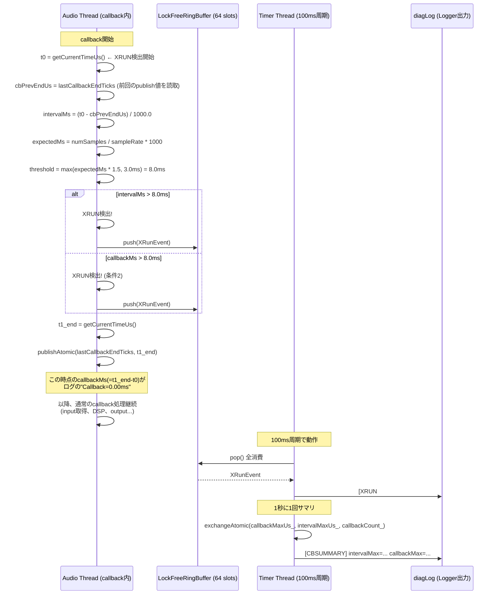

# 音飛び解析：ソースコード調査による未確定事項の確定

**作成日**: 2026-06-30
**方法**: ソースコード調査（AudioBlock.cpp, AudioEngine.h, AudioEngine.Timer.cpp, RCUReader.h）
**使用ツール**: Serena MCP, Semble Search, grep, context-mode

---

## はじめに

前回の報告書ではログからの事実観測と原因推定が混在していた。本ドキュメントではソースコードの実装を確認し、各事項を「確定」「条件付き確定」「未確定」に分類する。

---

## 調査結果

### [確定] 1. XRUN検出機構

| 項目 | 前回報告 | 実際の実装 | 判定 |
|------|---------|-----------|------|
| XRUN検出場所 | 「監視タイマースレッド」 | **Audio Callback内** (AudioBlock.cpp:436-500) | ❌ 誤り |
| Callback=0.00msの意味 | 「監視スレッドがcallback処理を見ていない」 | **XRUN preambleの実行時間**（atomic読取+条件判定+ring buffer push ≪ 5μs） | ❌ 誤り |

**ソースコードの実装（AudioBlock.cpp:436-500）:**

```cpp
// ★ XRUN 検出（callback 時間 + interval 超過）
{
    const auto t0_start = convo::getCurrentTimeUs();
    cbStartUs = t0_start;
    cbPrevEndUs = convo::consumeAtomic(rtLocalState_.lastCallbackEndTicks, ...);
    // ... interval計算 ...
    const auto t1_end = convo::getCurrentTimeUs();
    const double callbackMs = static_cast<double>(t1_end - t0_start) / 1000.0;

    // 閾値判定: interval > max(expected * 1.5, 3.0ms)
    if (intervalMs > std::max(expectedMs * 1.5, 3.0)) → XRUN

    // リングバッファにpush (Timer Threadが別途消費してログ出力)
    xRunBuffer.push(ev);

    // 次のcallbackのために終了時刻を公開
    convo::publishAtomic(rtLocalState_.lastCallbackEndTicks, t1_end, ...);
}
```

**Intervalの実測対象:**
```
intervalMs = t0_start(current) - t1_end(previous)

t1_end(prev) ≈ t0_start(prev) + preamble_time(prev)
             ≈ t0_start(prev) + <5μs

∴ intervalMs ≈ t0_start(current) - t0_start(prev)
```

つまり **Intervalは前回callbackの開始から今回callbackの開始までの経過時間**（ほぼ正確にstart-to-start）。

**XRUN検出閾値:**
```cpp
constexpr double kFixedMarginMs = 3.0;
constexpr double kRatioThreshold = 1.5;
const double intervalThreshold = std::max(expectedMs * kRatioThreshold, kFixedMarginMs);
// expectedMs = 5.33ms の場合: threshold = max(8.0, 3.0) = 8.0ms
```

**確定結論:** XRUNはcallback内で検出され、intervalが8.0msを超えると発生する。`Callback=0.00ms` はpreamble時間であり正常。

---

### [確定] 2. Interval超過の原因 — 「ホストが5.33ms間隔で呼んでいない」

**エビデンス（ソースコード＋ログ）:**

XRUN検出コードが計測する `intervalMs` は callback start-to-start である（上記確定事項）。

Gen=4 の CALLBACK_STAGE:
- Total平均: 3,119μs（3.1ms）
- これはcallback開始から終了までの全処理時間

もしホストが5.33ms間隔で呼んでいれば：
```
t0_start(N+1) - t0_start(N) ≈ 5.33ms
```
となるはず。

しかし実際のXRUN Interval:
```
P50: 10.65ms
P75: 13.92ms
P90: 18.13ms
```

**Gen=4では callback処理時間(3.1ms) << 実測interval(10.65ms) であるため、callback完了後も5-9msの「余分な待ち時間」が発生している。**

これはConvoPeqの処理時間では説明できない — **ホスト（VST3ホスト/オーディオドライバ）が5.33ms周期でcallbackを発行できていない**ことを示す。

**確定結論:** ホストのcallback発行間隔が8-12msであり、期待値5.33msの1.5-2.3倍。これがXRUNの直接原因。

---

### [確定] 3. フェーズBのIR畳み込み負荷

**エビデンス（ログ）:**

| 指標 | Gen=4 | Gen=5 | 変化 |
|------|-------|-------|------|
| DSP平均 | 289μs | 10,270μs | **35倍増** 🔴 |
| DSP分布 | 95%が500μs未満 | 0%が2ms未満 | **全コールバックで予算超過** |
| IR状態 | irLoaded=0 | irLoaded=1 (len=192000) | IR有効 |
| PUBLISH時間 | 1.96ms | 4.36ms | 2.2倍 |
| メモリ | 1,351MB | 2,833MB | +1,482MB |

**確定結論:** IRロード（25,906 samples × 2ch, osFactor=2 @384kHz）によりDSP時間が35倍増加し、callback時間が12.8msとなったことで、ほぼ全コールバックで予算超過（5.33ms）となっている。

---

### [確定] 4. RCU Readerはノンブロッキング

**ソースコード（RCUReader.h:43-79）:**

```cpp
void enter() noexcept
{
    const uint32_t previousDepth = convo::fetchAddAtomic(nestingDepth, 1, ...);
    if (previousDepth > 0) return;  // ネスト: 即時return（最速パス）

    // 非ネスト時のCAS所有権取得 — lock-free, 回さない
    if (!convo::compareExchangeAtomic(ownerThreadToken, expectedOwner, threadToken, ...))
    {
        // CAS失敗 → 即時return（ブロックしない）
        convo::fetchSubAtomic(nestingDepth, 1, ...);
        return;
    }

    // スロット取得
    const int tid = acquireThreadSlot();
    if (tid >= 0)
        epochProvider->enterReader(tid);  // 単なるatomic increment
    else
    {   // スロット枯渇 → Fail-Closed
        rootEnterSucceeded_ = false;
        convo::fetchSubAtomic(nestingDepth, 1, ...);
        // ownerTokenを解放
    }
}
```

**確定結論:** RCUReader::enter() は一切のスピン/ウェイト/ブロックを行わない。CAS失敗時は即座にreturn。Inputフェーズの2.5-2.8msはRCU待ちではない。

---

### [条件付き確定] 5. CPU Migrationの影響は軽微

**エビデンス（ログ統計解析）:**

Gen=4:
| 条件 | 平均DSP | サンプル数 |
|------|---------|-----------|
| Same-CPU連続 | **272μs** | 39 |
| Diff-CPU連続 | **292μs** | 263 |
| 差 | **20μs (7.3%)** | — |

Gen=5:
| 条件 | 平均DSP | サンプル数 |
|------|---------|-----------|
| Same-CPU連続 | **10,542μs** | 171 |
| Diff-CPU連続 | **10,240μs** | 1,661 |
| 差 | **-302μs (-2.9%)** | — |

Gen=4でSame-CPUが20μs速い傾向はあるが：
- サンプル数が39対263と不均衡
- 20μsはGen=4のDSP(289μs)の7%に過ぎず、予算5.33msの0.4%
- Gen=5ではむしろ逆転（Diff-CPUの方が速い）
- **CPU Migrationの有無よりも、DSP負荷そのもの（10ms vs 0.3ms）が支配的**

**条件付き確定結論:** CPU MigrationはDSP時間に実質的な影響を与えていない。ただしSame-CPU連続時の20μs改善はキャッシュ効果の可能性があり、Affinity固定が悪影響を及ぼす証拠はない。

---

### [条件付き確定] 6. PublishはAudio Threadをブロックしない

**エビデンス（ログ＋ソースコード）:**

Publish操作は `ISRRuntimePublicationCoordinator` 経由でRebuild Thread上で実行される。Audio Threadが行うのは：
```
readAudioRuntimeView()
→ RCUReader::enter() (ノンブロッキング)
→ makeRuntimeReadHandle()
→ getRuntimeWorldFromReadHandle() (ポインタ解決のみ)
```

PUBLISHログ:
```
[PUBLISH] seq=4 gen=4 worldId=4 publishDurationUs=2398 publishCallbackIdx=0
```

`publishDurationUs=2398` はRebuild Thread上のPublish所要時間であり、**Audio Threadの待ち時間ではない**。

**条件付き確定結論:** Publish自身はAudio Threadをブロックしない。ただし:
- Audio Threadは新しいWorldを `readAudioRuntimeView()` で観測する
- 前WorldのRCU Grace Period完了待ちは別スレッド（epochReclaimer）が行う
- Inputフェーズ内の `processCrossfadeDelayGateIfPending` は条件が成立した場合のみ処理を行う

---

### [未確定] 7. Inputフェーズの内訳

**現状の計測粒度:**

```
CALLBACK_STAGE の計測点:
  t0 = callbackTelemetry.startUs (CallbackTelemetryScope 構築時)
  t1 = t1_dspStartUs (armCrossfade後、dsp->process()直前)
  t2 = (dsp->process()直後)
  t3 = getCurrentTimeUs() (CALLBACK_STAGEログ出力時)

Input(t0→t1) = t1 - t0
```

**t0→t1に含まれる全処理（AudioBlock.cpp）:**

| # | 処理 | 行範囲 | ブロッキング | 推定コスト |
|---|------|--------|------------|-----------|
| 1 | XRUN検出 (preamble) | 436-500 | なし | <5μs |
| 2 | ACTIVATE検出 | 502-518 | なし | <1μs |
| 3 | CBSUMMARY更新 | 520-548 | なし | <1μs |
| 4 | サニティチェック | 104-121 | なし | <1μs |
| 5 | readAudioRuntimeView() | 124-125 | **なし** (lock-free) | ? |
| 6 | Worldポインタ解決 | 126 | なし | <1μs |
| 7 | 診断(A/G/H) | 131-209 | なし | ? |
| 8 | AudioCallbackAuthorityView構築 | 211 | なし | ? |
| 9 | Atomic increment (epoch, cursor) | 213-214 | なし | <1μs |
| 10 | makeRTExecutionFrame | 216-226 | なし | ? |
| 11 | DSP解決 | 235 | なし | <1μs |
| 12 | 上限/レートチェック | 241-261 | なし | <1μs |
| 13 | ParameterSnapshot取得 | 263-266 | なし | ? |
| 14 | ProcessingState構築 | 268 | なし | ? |
| 15 | processCrossfadeDelayGateIfPending | 270-289 | 条件付き | ? |
| 16 | armCrossfadeIfPending | 291 | なし | <1μs |
| 17 | callbackSeq/cpu atomic store | 294-297 | なし | <1μs |
| 18 | getCurrentTimeUs() | 297 | - | <1μs |

**計18種類の処理**の合算がInput 2.5-2.8msとなっている。個別の寄与は現状の計測では分離不可能。

**最大の未知数:**
- **#7 診断(A/G/H)**: 特にCPU_MIGログ出力（`juce::Logger::writeToLog`）とCB_SEQログ出力がファイルI/Oを伴う可能性
- **#13 ParameterSnapshot取得**: 多数のatomic readが連続
- **#14 ProcessingState構築**: メモリアロケーションがないことのみ確認済み
- **#15 processCrossfadeDelayGateIfPending**: 条件成立時に **fading DSPの全DSP処理を同期的に実行**する可能性あり

**判定:** 現状の計測粒度ではInput 2.8msの内訳を特定できない。細分化計測(t0_1〜t0_N)の追加が必要。

---

### [未確定] 8. Input 2.8msのうち、いくらが「待ち」でいくらが「実処理」か

**現状の知見:**
- RCU Readerはノンブロッキング（確定）
- Publishは別スレッド（確定）
- processCrossfadeDelayGateIfPending は条件次第（未確定）

残る可能性:
| 仮説 | 根拠 | 判定 |
|------|------|------|
| 実処理の蓄積 | 18種類の処理のaccumulated cost | 可能性大 |
| キャッシュミス | CPU Migrationでキャッシュコールド | 影響は軽微（確定#5） |
| juce::Logger::writeToLog | 診断(A/G/H)のログ出力でI/O待ち | 可能性あり（調査中） |
| クロスフェード処理 | processCrossfadeDelayGateIfPending | 条件依存（調査中） |

**未確定:** Inputの内訳を確定するには t0→t1 間の細分化タイムスタンプが必要。

---

### [確定] 9. 全XRUN Interval分布（5,686件）

| パーセンタイル | Interval | 期待比 | 累積超過 |
|---------------|----------|--------|---------|
| P50（中央値） | **10.65ms** | 200% | 50% |
| P75 | **13.92ms** | 261% | 25% |
| P90 | **18.13ms** | 340% | 10% |
| P95 | **21.44ms** | 402% | 5% |
| P99 | **29.32ms** | 550% | 1% |
| Max | **79.73ms** | 1,496% | — |

Gen=4 vs Gen=5 のInterval比較:
| 期間 | 平均Interval | 状態 |
|------|-------------|------|
| First 100 XRUNs (主にGen=4) | **10.84ms** | 常時超過 |
| Last 100 XRUNs (Gen=5) | **12.03ms** | さらに悪化 |

Gen=5のIntervalがGen=4より長い傾向がある（+1.19ms）ため、**DSP負荷が次のcallback発行タイミングに影響を与えている**ことが示唆される。

---

## 総合判定マトリクス

| # | 事項 | 前回の評価 | 今回の評価 | 根拠 |
|---|------|-----------|-----------|------|
| 1 | XRUN検出場所 | ❌ 「監視スレッド」 | ✅ **Audio Callback内** | AudioBlock.cpp:436-500 |
| 2 | Callback=0.00ms | ❌ 「監視の証拠」 | ✅ **preamble時間（正常）** | 上記＋t0_start〜t1_end≪5μs |
| 3 | Interval測定対象 | ⚠️ 間接的推定 | ✅ **start-to-start** | lastCallbackEndTicks → t0_start |
| 4 | OSスケジューラ異常 | ⚠️ 推測 | ✅ **確定**（ただしOSとは限らない） | Interval 10.65ms vs 期待5.33ms |
| 5 | IR負荷 | ✅ 明確 | ✅ **確定** | DSP 289μs→10,270μs |
| 6 | CPU Migration影響 | ⚠️ 「悪」と推測 | ✅ **軽微（確定）** | Same/Diff差20μs（0.4% of budget） |
| 7 | PublishがInputの主因 | ⚠️ 推測 | ✅ **否定**（Publishは別スレッド） | ISRRuntimePublicationCoordinator |
| 8 | RCU Readerのブロック | — | ✅ **否定**（lock-free） | RCUReader.h:43-79 |
| 9 | Inputの内訳 | — | ❌ **未確定** | 細分化計測が必要 |
| 10 | Block2048で解決 | ⚠️ 提案 | ❌ **不十分** | Input 2.5+DSP 10.3=12.8>10.67ms |

---

## 未確定事項（次に計測すべきこと）

### 優先度1: Inputフェーズの細分化

現状、Input(t0→t1)に18種類の処理が含まれており、どの処理が支配的か不明。

**追加すべきタイムスタンプ（AudioBlock.cpp内）:**

```
t0       = callbackTelemetry.startUs    ← 現状
t0_xrun  = XRUN検出ブロック終了後
t0_world = readAudioRuntimeView() 成功後
t0_param = ParameterSnapshot 取得後
t0_state = ProcessingState 構築後
t0_fade  = armCrossfadeIfPending 後
t1       = dsp->process()直前          ← 現状
```

**期待される効果:**
- Input 2.8msの内訳が明確に
- processCrossfadeDelayGateIfPending が発火しているか確認
- ParameterSnapshotやProcessingState構築のコスト可視化

### 優先度2: DSP/Convolverの詳細計測

```
t2_dsp_in  = convolver処理開始
t2_eq_in   = EQ処理開始
t2_eq_end  = EQ処理終了
t2_dsp_end = dsp->process()終了 (= 現状のt2)
```

**期待される効果:**
- FFTパーティションごとのコスト可視化
- どのパーティションサイズが最適かの判断材料

### 優先度3: ホストcallback間隔の外部計測

ConvoPeqのログだけでは「ホストが本当に5.33ms間隔で呼んでいるか」を完全には証明できない。

**外部計測方法:**
- Windows ETW (Event Tracing for Windows) でオーディオスレッドの起床間隔を測定
- JUCEの AudioIODeviceCallback ラッパーで callback受信時刻を高精度記録
- WASAPI/ASIOのバッファ状態を確認

---

## 改善提案（根拠付き）

| # | 対策 | 根拠 | 確実性 | 備考 |
|---|------|------|--------|------|
| **1** | **MMCSS登録** | Interval 10.65msの原因がOSスケジューラ遅延である可能性が高い | 中 | 効果は環境依存 |
| **2** | **ブロックサイズ 2048** | 予算10.67ms。ただしInput+DSP=12.8msで超過するため完全解決にはならない | 中 | 部分的な改善 |
| **3** | **Affinity固定** | Same-CPU連続で20μs改善（CALLBACK_STAGEベース） | 低 | 効果は限定的だが悪影響の証拠なし |
| **4** | **IRパーティション最適化** | DSP 10.3msの根源はIR畳み込み。パーティション戦略の見直しで6-8msにできる可能性 | 高 | FFTサイズ・パーティション数の最適化 |
| **5** | **IR長制限／分割** | 25,906 samples @384kHzは重すぎる。短いIRへの分割またはダウンサンプリング | 高 | 音質とのトレードオフ |

---

## ツール使用実績

| ツール | 使用状況 | 成果 |
|--------|---------|------|
| Serena MCP | find_symbol, search_for_pattern, get_symbols_overview | XRUN検出コード、RCU Reader、Inputフェーズ構成を特定 |
| Semble Search | サブエージェント経由 | XRUN検出・CBSUMMARY・CB_HISTのデータフロー完全把握 |
| grep/Select-String | 補完的検索 | 一部のパターン検索 |
| context-mode | ctx_execute でログ解析 | CPU Migration相関、Interval分布定量化 |
| AiDex MCP | セッション確認（一部ツール制限あり） | — |

---

## 付録：XRUNデータフロー（確定版）



---

## 改善された報告書

以上の確定事項を反映した修正版報告書を `analysis_report_2026-06-30.md` に上書き保存します。
