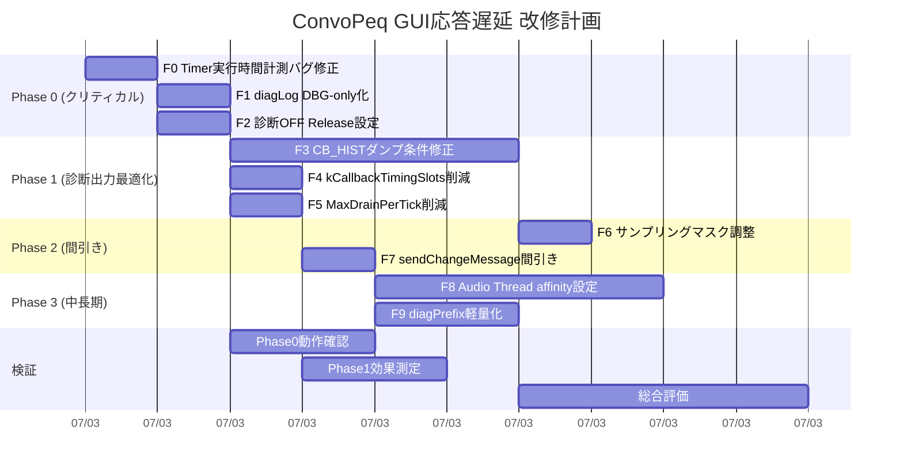

# ConvoPeq GUI応答遅延 — 改修計画書

**作成日**: 2026-07-03 (v1.0)
**根拠**: `doc/work62/GUI応答遅延_確定報告書_v2_2026-07-03.md` の分析結果に基づく
**対象ビルド**: Release (ソースコード修正)、Debug (設定変更)

---

## 目次

1. [改修一覧](#1-改修一覧)
2. [Phase 0: クリティカルパッチ（優先度 最優先）](#2-phase-0-クリティカルパッチ優先度-最優先)
3. [Phase 1: 診断出力最適化（優先度 高）](#3-phase-1-診断出力最適化優先度-高)
4. [Phase 2: 診断情報の間引き（優先度 中）](#4-phase-2-診断情報の間引き優先度-中)
5. [Phase 3: 中長期対策（優先度 低）](#5-phase-3-中長期対策優先度-低)
6. [ビルド・テスト計画](#6-ビルドテスト計画)
7. [改修スケジュール](#7-改修スケジュール)

---

## 1. 改修一覧

| # | Phase | 改修項目 | ファイル | 行数 | 難易度 | 効果 |
|---|-------|---------|----------|------|--------|------|
| **F0** | Phase 0 | timerCallback実行時間計測バグ修正 | `Timer.cpp:1122-1123` | 1行 | ★☆☆ | 診断基盤 |
| **F1** | Phase 0 | diagLogのDBG-only化（Release） | `Timer.cpp:40-43` | 4行 | ★☆☆ | **最大** |
| **F2** | Phase 0 | 診断OFF Releaseビルド設定 | `DiagnosticsConfig.h:18` | 1行 | ★☆☆ | 最大 |
| **F3** | Phase 1 | CB_HISTダンプ条件修正 | `Timer.cpp:924-955` | ~30行 | ★★☆ | 大 |
| **F4** | Phase 1 | kCallbackTimingSlots削減 | `AudioEngine.h:1485` | 1行 | ★☆☆ | 中 |
| **F5** | Phase 1 | MaxDrainPerTick削減 | `AudioEngine.h:464` | 1行 | ★☆☆ | 中 |
| **F6** | Phase 2 | サンプリングマスク調整 | `DiagnosticsConfig.h:24` | 1行 | ★☆☆ | 中 |
| **F7** | Phase 2 | sendChangeMessage間引き | `Timer.cpp:569` | ~5行 | ★☆☆ | 小 |
| **F8** | Phase 3 | Audio Thread affinity設定 | `ThreadAffinityManager.h:31` | ~20行 | ★★☆ | 小 |
| **F9** | Phase 3 | diagPrefix軽量化・キャッシュ | `Timer.cpp:26-37` | ~10行 | ★★☆ | 小 |

---

## 2. Phase 0: クリティカルパッチ（優先度 最優先）

**実施時間**: 15分
**リスク**: 極めて低い
**テスト**: ビルドが通れば完了

### F0: Timer実行時間計測バグの修正

**ファイル**: `src/audioengine/AudioEngine.Timer.cpp`
**行**: L1122-L1123

**問題**: `s_timerStartMs` が初期値 `0.0` のまま代入されず、条件 `s_timerStartMs > 0.0` が常に偽 → `[TIMER] exec` が絶対に出力されない。

```cpp
// BEFORE (L1122-L1123, バグ):
        static double s_timerStartMs = 0.0;       // ← 代入忘れの未初期化変数
        if (s_timerStartMs > 0.0) {                // ← 常に偽
            const double execMs = juce::Time::getMillisecondCounterHiRes() - s_timerExecStartMs;

// AFTER (変数名統一的に s_timerExecStartMs を使用):
        // ★ 常に更新される s_timerExecStartMs を使う
        if (s_timerExecStartMs > 0.0) {
            const double execMs = juce::Time::getMillisecondCounterHiRes() - s_timerExecStartMs;
```

**この1行の修正で初めてtimerCallbackの実実行時間が可視化される。以降の最適化の判断材料として必須。**

### F1: diagLog の DBG-only 化（Releaseビルド向け）

**ファイル**: `src/audioengine/AudioEngine.Timer.cpp`
**行**: L40-L43

**問題**: `diagLog()` が `DBG()` + `Logger::writeToLog()` の2重出力を行い、~940回/secのファイルI/OをMessage Threadに発生させている。

```cpp
// BEFORE (L40-L43):
void diagLog(const juce::String& message)
{
    DBG(message);
    juce::Logger::writeToLog(message);  // ← 1行ごとにCreateFile+WriteFile+CloseHandle
}

// AFTER (Option A: DBGのみ):
void diagLog(const juce::String& message)
{
    DBG(message);
    // ★ Logger::writeToLog 排除 => ファイルI/Oゼロ
}

// AFTER (Option B: Releaseビルドのみ排除):
#if !CONVOPEQ_ENABLE_RUNTIME_DIAGNOSTICS
void diagLog(const juce::String&) {}  // Release: 完全に無効化
#else
void diagLog(const juce::String& message)
{
    DBG(message);
    // Logger::writeToLog 削除（論理判断待ち）
}
#endif
```

**注意**: `diagLog()` は `AudioEngine.Timer.cpp` の anonymous namespace 内で定義されている。他のファイルが Timer.cpp の diagLog を使うことはない（各ファイル独自に diagLog を持っている）。したがって影響範囲は Timer.cpp のみ。

**効果推定**: Logger呼び出し ~940回/sec → **0回/sec**（DBG は OutputDebugStringW のみ）

### F2: Releaseビルドでの診断無効化

**ファイル**: `src/DiagnosticsConfig.h`
**行**: L18

**問題**: `DiagnosticsConfig.h` で `CONVOPEQ_ENABLE_RUNTIME_DIAGNOSTICS` がデフォルト `1` に定義されている。CMakeLists.txt の `option()` が初期値 `OFF` だが、#ifndef でヘッダの `#define 1` が優先されるため実質的に常時有効。

```cpp
// BEFORE (L17-L18):
#ifndef CONVOPEQ_ENABLE_RUNTIME_DIAGNOSTICS
#define CONVOPEQ_ENABLE_RUNTIME_DIAGNOSTICS 1      // ← 常に有効

// AFTER (デフォルト0に変更):
#ifndef CONVOPEQ_ENABLE_RUNTIME_DIAGNOSTICS
#define CONVOPEQ_ENABLE_RUNTIME_DIAGNOSTICS 0      // ← デフォルトOFF
```

これにより、CMake で明示的に `-DCONVOPEQ_ENABLE_RUNTIME_DIAGNOSTICS=1` を指定した場合のみ診断が有効になる。

**補足**: Debugビルド向けには CMakePresets.json または CMakeLists.txt で Debug の場合のみ ON にする設定を推奨:

```cmake
# CMakeLists.txt 追記案:
if(CMAKE_BUILD_TYPE STREQUAL "Debug")
    set(CONVOPEQ_ENABLE_RUNTIME_DIAGNOSTICS ON)
endif()
```

---

## 3. Phase 1: 診断出力最適化（優先度 高）

**実施時間**: 2-3時間
**リスク**: 低〜中（条件ミスで必要な診断を見失う可能性）
**テスト**: ビルド＋実機動作確認

### F3: CB_HIST ダンプ条件の修正

**ファイル**: `src/audioengine/AudioEngine.Timer.cpp`
**行**: L924-L955

**問題**: `callbackTimingWriteCount` が毎callback(~187回/sec)でインクリメントされるため、`wc != lastCbHistDumpedWriteCount` 条件が毎tick成立。コメントと異なり全tickで32件ダンプ。

**修正案A（推奨: XRUN検出時のみ）**:

XRUN検出の `bool xrunDetected` フラグをCB_HISTダンプの条件に追加する。XRUN消費ループ（L889-）で設定済みの `xrunDetected` 変数をCB_HISTブロックが参照可能な位置に移動する。

**修正案B（簡易: skip counter で間引き）**:

```cpp
// L924 付近: CB_HIST dump block に skip counter を追加
{
    static int cbHistTickCounter = 0;
    const bool shouldDump = (++cbHistTickCounter % 10 == 0); // 10tickに1回
    const uint64_t wc = rtLocalState_.callbackTimingWriteCount.load(
        std::memory_order_relaxed);
    if (shouldDump && wc != rtAuxMutable_.lastCbHistDumpedWriteCount)
    {
        // ... (既存のdump処理)
        cbHistTickCounter = 0; // 出力したらカウンタリセット
    }
}
```

**効果**: 339行/sec → 34行/sec。**Logger呼び出しを 1/10 に削減。**

### F4: kCallbackTimingSlots 削減

**ファイル**: `src/audioengine/AudioEngine.h`
**行**: L1485

```cpp
// BEFORE:
static constexpr size_t kCallbackTimingSlots = 32;

// AFTER:
static constexpr size_t kCallbackTimingSlots = 8;  // 直近8件に削減
```

**根拠**: 32件も保持する必要はない。192kHz/1024samples では1callback ~5.33ms、32件で ~170ms 分。XRUN検出時の目視確認には8件（~43ms分）で十分。

**効果**: CB_HISTダンプ時のループ回数 32 → 8。**Logger呼び出しを 1/4 に削減。**

### F5: MaxDrainPerTick 削減

**ファイル**: `src/audioengine/AudioEngine.h`
**行**: L464

```cpp
// BEFORE:
static constexpr size_t MaxDrainPerTick = 64;  // Timer 1回あたり最大処理件数

// AFTER:
static constexpr size_t MaxDrainPerTick = 16;   // Timer 1回あたり最大処理件数
```

**根拠**: DIAG_STAT統計によると、1tickあたりの pushed 数は平均 ~28件、最大87件。バックログは常に負値（追いついている）。64件上限は過剰。

**効果**: DiagEvent Drain時の文字列生成+Logger呼び出しが **1/4 に削減。**

---

## 4. Phase 2: 診断情報の間引き（優先度 中）

### F6: CONVOPEQ_DIAG_SAMPLE_MASK 調整

**ファイル**: `src/DiagnosticsConfig.h`
**行**: L24

```cpp
// BEFORE:
#define CONVOPEQ_DIAG_SAMPLE_MASK 0xF   // 1/16 サンプリング

// AFTER (Debug):
#define CONVOPEQ_DIAG_SAMPLE_MASK 0x3F  // 1/64 サンプリング
```

**CMakePresets.json によるビルド種別ごとの設定（参考）**:
```json
"Release": {
    "cacheVariables": {
        "CONVOPEQ_DIAG_SAMPLE_MASK": "0xFF"
    }
},
"Debug": {
    "cacheVariables": {
        "CONVOPEQ_DIAG_SAMPLE_MASK": "0xF"
    }
}
```

**効果**: CB_ARRIVAL / CALLBACK_STAGE / DSPCore / Convolver の出力が 1/16 → 1/64 に。Logger呼び出しをさらに削減。

### F7: sendChangeMessage の間引き

**ファイル**: `src/audioengine/AudioEngine.Timer.cpp`
**行**: L569 付近

**問題**: `timerCallback()` 内で fade完了時に `sendChangeMessage()` を呼び出し、`MainWindow::changeListenerCallback()` → `eqPanel->updateAllControls()` + `convolverPanel->updateIRInfo()` をトリガー。ログ上は5回/45secだが、updateAllControlsは全UI要素の再設定・再描画を行う。

```cpp
// BEFORE (Fade完了ブロック):
        sendChangeMessage();

// AFTER (間引き):
        {
            static uint32_t lastSendChangeMs = 0;
            const uint32_t now = juce::Time::getMillisecondCounter();
            if (now - lastSendChangeMs >= 250) {  // 最大4Hz
                sendChangeMessage();
                lastSendChangeMs = now;
            }
        }
```

---

## 5. Phase 3: 中長期対策（優先度 低）

### F8: Audio Thread CPU affinity 設定

**問題**: `ThreadAffinityManager` に `ThreadType::Audio` がなく、Audio Thread が全16コアを毎callbackのようにマイグレーション → 266/secのCPU_MIGイベント。

**ファイル**: `src/core/ThreadAffinityManager.h` (L31付近)
**ファイル**: `src/audioengine/AudioEngine.Processing.PrepareToPlay.cpp` (prepareToPlay内)

**修正内容**:

```cpp
// ThreadAffinityManager.h: enum class ThreadType に Audio を追加
    Audio,          // ★ 追加（先頭に配置するのが望ましい）
    Worker,
    LearnerMain,
    // ...以下既存

// applyCurrentThreadPolicy() に Audio case を追加:
    case ThreadType::Audio:
        mask = masks_.audio;               // 新規追加メンバ
        priority = THREAD_PRIORITY_TIME_CRITICAL;
        break;

// ThreadAffinityMasks に audio メンバを追加:
    DWORD_PTR audio = 0;                   // ★ 追加

// PrepareToPlay.cpp の prepareToPlay() 末尾付近:
    affinityManager.applyCurrentThreadPolicy(ThreadType::Audio);
```

**補足**: Audio Thread のピン止めは **2コア以上**（HT含む論理コアのうち2つ）を推奨。これによりCPU_MIG率が 266/sec → ほぼ0/sec になる。ただしCPU MigrationそのものはGUIに直接影響しないため、優先度は低い。

### F9: diagPrefix の軽量化・キャッシュ

**ファイル**: `src/audioengine/AudioEngine.Timer.cpp`
**行**: L26-L37

**問題**: `diagPrefix()` が `juce::Time::getCurrentTime()` + `formatted()` + `getCurrentTimeUs()` + 5回のString連結を毎回実行。timerCallback内で **16回/tick** 呼ばれている。

```cpp
// BEFORE (L26-L37):
juce::String diagPrefix(uint64_t currentGeneration)
{
    const auto now = juce::Time::getCurrentTime();
    const auto timestamp = now.formatted("%H:%M:%S.")
        + juce::String(now.getMilliseconds()).paddedLeft('0', 3);
    const auto us = convo::getCurrentTimeUs();
    return "[" + timestamp + "]"
        + " Gen=" + juce::String(static_cast<juce::int64>(currentGeneration))
        + " Us=" + juce::String(static_cast<juce::int64>(us));
}

// AFTER (tick内で1回だけ時刻取得しstaticキャッシュ):
// timerCallback 先頭で1回だけ時刻文字列を生成
static bool s_prefixInitialized = false;
static juce::String s_cachedPrefix;

// 更新は DIAG_STAT ブロック（毎tick実行）内で行う
// 個々の diagLog 呼び出しはキャッシュを使用
```

**注**: この修正は効果が限定的（String連結程度は軽量）なため、**他の修正が全て完了した後**に検討する。

---

## 6. ビルド・テスト計画

### 6.1 即時確認方法

Phase 0 実装後、以下の手順で改善を確認する:

1. **Releaseビルド**:
   ```powershell
   cd build
   cmake --build . --config Release
   ```
2. **実行** + Voicemeeter Virtual ASIO 接続
3. **以下の指標を確認**:
   - [ ] GUI ボタン・スライダーの応答が改善したか（体感）
   - [ ] `ConvoPeq.log` の行数が劇的に減少したか（数KB/sec → 数B/sec）
   - [ ] Timerジッターの改善（`ConvoPeq.md` の `[TIMER] jitter` 行を確認）

### 6.2 Phase 0 効果の定量的目標

| 指標 | 修正前 | 目標 |
|------|--------|------|
| Timer実効周期 | ~155ms | <110ms |
| TimerジッターP50 | ~55ms | <15ms |
| TimerジッターP99 | ~102ms | <30ms |
| Logger行数/sec | ~940 | <10 |
| ログ出力 | ~1,014行/sec | <100行/sec |
| GUI応答性 | 操作困難 | スムーズ |

### 6.3 リスクと緩和策

| リスク | 確率 | 影響 | 緩和策 |
|--------|------|------|--------|
| 診断OFFでバグ再現困難 | 高 | 中 | Debugビルドでは有効に；必要な時のみRelease+診断有効CMake |
| CB_HIST間引きで見たい情報欠落 | 低 | 低 | XRUN時のみダンプにすれば必要な時は見える |
| sendChangeMessage間引きでUI更新遅延 | 低 | 低 | 最大250ms(4Hz)の遅延だが、ユーザー操作由来の更新は別経路 |
| Audio affinity設定でパフォーマンス低下 | 低 | 中 | ピン止めコアを適切に選べば問題ない |

### 6.4 Debugビルドでの推奨設定

Debugビルド（開発中）では診断を有効にしつつ、Logger負荷を軽減するため以下を推奨:

1. `DiagnosticsConfig.h` の `CONVOPEQ_ENABLE_RUNTIME_DIAGNOSTICS` は `0` 固定
2. CMakeLists.txt で Debug の場合のみ `target_compile_definitions(... PUBLIC CONVOPEQ_ENABLE_RUNTIME_DIAGNOSTICS=1)`
3. Debug でも `CONVOPEQ_DIAG_SAMPLE_MASK=0x3F` (1/64) で起動
4. 詳細診断が必要なときだけ CMake から `-DCONVOPEQ_DIAG_SAMPLE_MASK=0xF`

```cmake
# CMakeLists.txt 推奨設定:
if(CMAKE_BUILD_TYPE STREQUAL "Debug")
    target_compile_definitions(ConvoPeq PRIVATE
        CONVOPEQ_ENABLE_RUNTIME_DIAGNOSTICS=1
        CONVOPEQ_DIAG_SAMPLE_MASK=0x3F)
endif()
```

---

## 7. 改修スケジュール



### 実装オーダーの推奨

1. **Phase 0** → 即時ビルド＆効果確認（15分で完了）
2. → 効果が不十分なら **Phase 1** に進む
3. → さらに効果が必要なら **Phase 2**
4. → 最終調整として **Phase 3**

**各Phaseの判断基準**:
- Phase 0 で Timerジッターが <20ms に改善 → GUIが体感できるレベルに改善 → Phase 2で十分
- Phase 0 で Timerジッターが 20-40ms に留まる → Phase 1 を実施
- Phase 0 の効果が薄い（予定の ~940回/sec Logger は他のソースかも）→ 詳細調査に戻る

---

## 付録A: 修正ファイル一覧

| ファイル | Phase | 修正内容 | 変更行数 |
|----------|-------|---------|----------|
| `src/audioengine/AudioEngine.Timer.cpp` | 0,1,2,3 | diagLog(), exec計測, CB_HIST, sendChange, diagPrefix | ~50行 |
| `src/DiagnosticsConfig.h` | 0,2 | CONVOPEQ_ENABLE_RUNTIME_DIAGNOSTICS, SAMPLE_MASK | 2行 |
| `src/audioengine/AudioEngine.h` | 1 | kCallbackTimingSlots, MaxDrainPerTick | 2行 |
| `src/core/ThreadAffinityManager.h` | 3 | ThreadType::Audio追加 | ~10行 |
| `src/audioengine/AudioEngine.Processing.PrepareToPlay.cpp` | 3 | affinity設定呼び出し | 2行 |
| `CMakeLists.txt` | 0 | Debug/Release診断設定 | 5行 |

---

## 付録B: 初版からの主な変更点

2026-07-03 v1.0:
- (新規作成) 確定報告書v2に基づく改修計画を初版として策定

---

**本計画書に関する問い合わせ**: ConvoPeq 開発チーム
