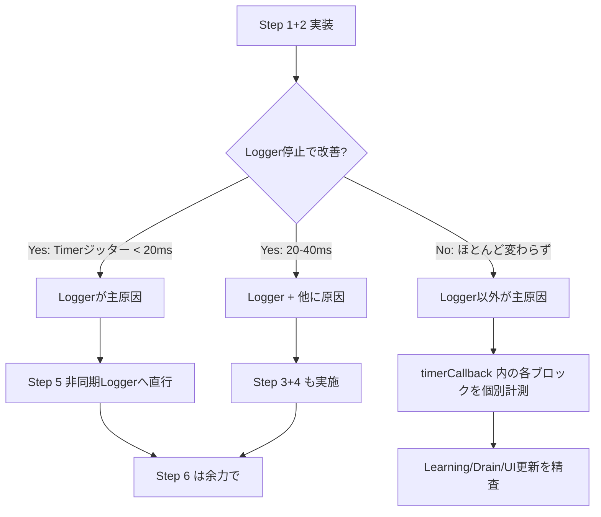

# ConvoPeq GUI応答遅延 — 改修計画書 v2（確定版）

**作成日**: 2026-07-03 (v2.0)
**根拠**: 確定報告書v2 の分析結果、およびソースコード全数調査に基づく
**前提**: 本計画は「開発中のDebugビルド」を前提とする。Releaseビルドでの診断無効化は本計画の対象外とし、出荷時に個別判断する。

---

## 目次

1. [事前確認: 確定済みの事実と推定値の区別](#1-事前確認-確定済みの事実と推定値の区別)
2. [改修一覧（優先順位順）](#2-改修一覧優先順位順)
3. [Step 1: timerCallback 実行時間計測の修正](#3-step-1-timercallback-実行時間計測の修正)
4. [Step 2: Logger 一時停止による原因切り分け](#4-step-2-logger-一時停止による原因切り分け)
5. [Step 3: CB_HIST ダンプ条件の修正](#5-step-3-cb_hist-ダンプ条件の修正)
6. [Step 4: CPU_MIG ログ出力の間引き](#6-step-4-cpu_mig-ログ出力の間引き)
7. [Step 5: 非同期 Logger の実装](#7-step-5-非同期-logger-の実装)
8. [Step 6: Audio Thread affinity 設定](#8-step-6-audio-thread-affinity-設定)
9. [補足: 各Stepの判断基準](#9-補足-各stepの判断基準)
10. [ソースコード調査で確定した補足情報](#10-ソースコード調査で確定した補足情報)

---

## 1. 事前確認: 確定済みの事実と推定値の区別

### ✅ 確定済みの事実

| 項目 | 確定内容 | 根拠 |
|------|---------|------|
| **FileLogger が毎回ファイル開閉** | `FileLogger::logMessage()` 内で `FileOutputStream out(logFile, 256)` を**ローカル変数**として生成 → スコープ終了時に `~FileOutputStream()` → `flushBuffer()` + `closeHandle()` を毎回実行 | JUCEソース確認 |
| **LockFreeRingBuffer は trivially_copyable のみ** | `static_assert(std::is_trivially_copyable<T>::value)` により `juce::String` のような参照カウント型は保持不可 | ソース確認 |
| **timerCallback 実行時間計測が機能していない** | `s_timerStartMs` が初期値 0.0 のまま代入されず、条件 `s_timerStartMs > 0.0` が常に偽 | ソース確認 L1122-1123 |
| **CB_HIST ダンプが全tickで発火** | 条件 `wc != lastCbHistDumpedWriteCount` が毎tick成立（`writeCount` が毎callbackで変化するため） | ソース確認 + ログ分析 |
| **CPU_MIG が全件記録** | `BlockDouble.cpp` の CPU migration 記録ブロックにサンプリング条件なし | ソース確認 |
| **XRUN 0件** | 音声スレッド負荷は正常、GUI応答遅延の原因ではない | ログ分析 45秒間 0件 |
| **diagLog 42箇所 in Timer.cpp** | Timer.cpp 内で 42 回の `diagLog()` 呼び出し | ソースカウント |
| **Logger::writeToLog 計68箇所** | AudioEngine 全ソースで 68 回の `Logger::writeToLog`（うちタイマー経由が支配的）| ソースカウント |

### ⚠️ 推定値（今後の測定で確定が必要）

| 項目 | 推定値 | 備考 |
|------|--------|------|
| **timerCallback 実行時間** | **未計測**（バグのため） | Step 1 の修正後、初めて計測可能に |
| **Logger I/O 1回あたりのコスト** | 推定 0.1-1.0ms | Windows Defender / ディスク性能 / ファイルシステムに依存 |
| **Logger I/O 合計コスト/tick** | 推定 28-47ms | **確定ではない**。Defenderが介在しない場合は大幅に低い可能性 |
| **CB_HIST 削減による改善幅** | ログ行数 -48%相当 | 実際のTimer改善はLogger経由の間接効果 |
| **CPU_MIG 削減による改善幅** | ログ行数 -38%相当 | CPU_MIGそのものはGUIに直接影響しない |

**重要**: 28-47ms という数値は**推定値**であり、`[TIMER] exec` が計測可能になった後に検証する。

---

## 2. 改修一覧（優先順位順）

| Step | 作業 | ファイル | 変更行数 | 難易度 | カテゴリ |
|------|------|----------|----------|--------|----------|
| **1** | timerCallback 実行時間計測バグ修正 | `Timer.cpp:1122-1123` | 1行 | ★☆☆ | **診断基盤** |
| **2** | Logger 一時停止（DBGのみ化） | `Timer.cpp:40-43` | 2行 | ★☆☆ | **原因切分** |
| **3** | CB_HIST ダンプ条件修正 | `Timer.cpp:924-955` | ~30行 | ★★☆ | 診断最適化 |
| **4** | CPU_MIG 出力のサンプリング | `BlockDouble.cpp` | 3行 | ★☆☆ | 診断最適化 |
| **5** | 非同期 Logger の実装 | `Timer.cpp` + 新規 | ~100行 | ★★★ | 恒久対策 |
| **6** | Audio Thread affinity 設定 | `ThreadAffinityManager.h` + `PrepareToPlay.cpp` | ~15行 | ★★☆ | 最適化 |

---

## 3. Step 1: timerCallback 実行時間計測の修正

**目的**: 全最適化の判断材料となる `[TIMER] exec=xx.xms` を正しく出力させる。

**ファイル**: `src/audioengine/AudioEngine.Timer.cpp`
**行**: L1122-L1123

### 現在のコード（バグ）

```cpp
// ★ timerCallback 末尾 — 実行時間計測
    {
        static double s_timerStartMs = 0.0;       // ← ここ！代入忘れ
        if (s_timerStartMs > 0.0) {                // ← 常に偽で一度も発火しない
            const double execMs = juce::Time::getMillisecondCounterHiRes() - s_timerExecStartMs;
            if (execMs > 10.0) {
                // ...
                diagLog(… "[TIMER] exec=…");
            }
        }
        s_timerExecStartMs = juce::Time::getMillisecondCounterHiRes();  // ← こっちは毎回更新されている
    }
```

### 修正コード

```cpp
// ★ timerCallback 末尾 — 実行時間計測
    {
        // ★ 関数先頭でセットされる s_timerExecStartMs をチェックする（s_timerStartMs は不使用）
        if (s_timerExecStartMs > 0.0) {
            const double execMs = juce::Time::getMillisecondCounterHiRes() - s_timerExecStartMs;
            if (execMs > 10.0) {
                const uint64_t gen = (runtimeWorld != nullptr) ? static_cast<uint64_t>(runtimeWorld->generation) : 0;
                const auto seq = convo::fetchAddAtomic(diagSequenceCounter(), uint64_t{1}, std::memory_order_acq_rel) + 1u;
                diagLog(diagPrefix(gen) + " [Seq=" + juce::String(static_cast<juce::int64>(seq))
                    + "] [TIMER] exec=" + juce::String(execMs, 3) + "ms");
            }
        }
        s_timerExecStartMs = juce::Time::getMillisecondCounterHiRes();
    }
```

**変更内容**: 条件式の変数を `s_timerStartMs` → `s_timerExecStartMs` に修正するのみ。
**備考**: 不要になった `s_timerStartMs` の static 変数宣言も削除してよい。

### 期待効果

修正後、tick ごとに `[TIMER] exec=xx.xms` が出力される（10ms超の場合のみ）。これにより:

- timerCallback の実実行時間が初めて可視化される
- Logger 停止前後の実行時間比較が可能になる
- 各最適化Stepの効果を定量的に判断できる

---

## 4. Step 2: Logger 一時停止による原因切り分け

**目的**: Logger::writeToLog が真の原因かを即座に確認する。

**ファイル**: `src/audioengine/AudioEngine.Timer.cpp`
**行**: L40-L43

### 現在のコード

```cpp
void diagLog(const juce::String& message)
{
    DBG(message);
    juce::Logger::writeToLog(message);  // ← 1行ごとにファイルI/O
}
```

### 修正コード（一時的）

```cpp
void diagLog(const juce::String& message)
{
    DBG(message);
    // ★ 一時的に Logger::writeToLog を無効化（原因切り分け用）
    // juce::Logger::writeToLog(message);
}
```

**変更内容**: `Logger::writeToLog` の呼び出しをコメントアウトするのみ（**2行削除 or コメントアウト**）。

### 確認手順（最重要）

1. 上記修正を適用
2. Release ビルド
3. Voicemeeter ASIO 接続で実行
4. 以下の **3点** を確認:

```
A. GUI 応答性が改善したか（体感）
B. [TIMER] exec が計測され、その値は何msか（Step 1 の修正が必要）
C. [TIMER] jitter の delta が改善したか
```

### 判断基準

| 結果 | 意味 | 次のアクション |
|------|------|---------------|
| GUI 改善 + Timerジッター < 20ms | **Logger が主原因と確定** | Step 5（非同期Logger）へ |
| GUI 改善したがジッター 20-40ms | Logger が主要原因の一つ | Step 3, 4 を実施 |
| GUI 改善しない | Logger 以外に主要原因 | timerCallback の他のブロックを個別計測 |

---

## 5. Step 3: CB_HIST ダンプ条件の修正

**目的**: XRUNなしでも毎tick 32件出力している異常を修正する。

**ファイル**: `src/audioengine/AudioEngine.Timer.cpp`
**行**: L924-L955

### 問題のメカニズム

```cpp
// ★ B: CB_HIST リングバッファダンプ（XRUN検出時の最新32件、timer callback1回につき1度のみ）
//  ^^^^^ コメントは「XRUN検出時」と書いてあるが…
{
    const uint64_t wc = rtLocalState_.callbackTimingWriteCount.load(...);
    // callbackTimingWriteCount は毎callback(+187回/sec)でインクリメントされる
    // 条件: wc != lastCbHistDumpedWriteCount → 毎tick成立！
    if (wc != rtAuxMutable_.lastCbHistDumpedWriteCount)
    {
        // ← コメントと異なり全tickで32件ダンプ実行中
```

### 修正方針（案A: XRUN時のみ を推奨）

XRUN 消費ループに既存の `bool xrunDetected` フラグがあるが、CB_HISTブロックはそのスコープ外にある。最も安全な修正は **skip counter 方式**:

```cpp
// ★ B: CB_HIST リングバッファダンプ（skip counter で間引き）
{
    static int cbHistSkipCounter = 0;
    const bool shouldDump = (++cbHistSkipCounter % 10 == 0);  // 10tickに1回

    // ★ または XRUN 発生時のみ
    // const bool shouldDump = (xRunPopCount > 0 || forceDump);

    const uint64_t wc = rtLocalState_.callbackTimingWriteCount.load(
        std::memory_order_relaxed);
    if (shouldDump && wc != rtAuxMutable_.lastCbHistDumpedWriteCount)
    {
        // ...（既存の32件ダンプ処理はそのまま）
        cbHistSkipCounter = 0;  // 出力後にリセット
    }
}
```

**補足**: `kCallbackTimingSlots` は AudioEngine.h:1485 で 32 → 8 に削減推奨（1行変更）。これにより1回のダンプ行数が 32 → 8 になる。

---

## 6. Step 4: CPU_MIG ログ出力の間引き

**目的**: 266件/sec の CPU_MIG DiagEvent を削減する。

**ファイル**: `src/audioengine/AudioEngine.Processing.BlockDouble.cpp`（L177付近）

### 現在のコード

```cpp
// G: CPU migration記録
{
    // ...cpu検出...
    if (prev != cpu) {
        // UNCONDITIONAL: 毎回 DiagEvent を push
        DiagEvent event{};
        event.category = DiagCategory::CpuMig;
        // ...
        diagBuffer.push(event);
    }
}
```

### 修正コード

```cpp
// G: CPU migration記録（sampling 対応）
{
    const uint32_t cpu = static_cast<uint32_t>(::GetCurrentProcessorNumber());
    const uint32_t prev = rtLocalState_.lastCallbackProcessor.load(std::memory_order_relaxed);
    if (prev != cpu)
    {
        rtLocalState_.lastCallbackProcessor.store(cpu, std::memory_order_relaxed);
        if (prev != UINT32_MAX)
        {
            convo::fetchAddAtomic(rtLocalState_.cpuMigrationCount, uint64_t{1}, std::memory_order_relaxed);

            // ★ sampling: CONVOPEQ_DIAG_SAMPLE_MASK に従う
            const uint64_t cbIdx = rtLocalState_.audioCallbackEpochCounter.load(std::memory_order_relaxed);
            if ((cbIdx & CONVOPEQ_DIAG_SAMPLE_MASK) == 0)
            {
                const uint64_t pubSeq = (runtimeWorld != nullptr) ? runtimeWorld->metadata.publicationSequence : 0;
                const uint64_t gen = (runtimeWorld != nullptr) ? static_cast<uint64_t>(runtimeWorld->generation) : 0;
                DiagEvent event{};
                event.category = DiagCategory::CpuMig;
                event.eventIndex = cbIdx;
                event.data.cpuMig.pubSeq = pubSeq;
                event.data.cpuMig.generation = gen;
                event.data.cpuMig.cpu = cpu;
                event.data.cpuMig.prevCpu = prev;
                if (diagBuffer.push(event)) {
                    rtAuxMutable_.diagTickPushed.value.fetch_add(1, std::memory_order_relaxed);
                    rtAuxMutable_.diagTotalPushed.fetch_add(1, std::memory_order_relaxed);
                } else {
                    rtAuxMutable_.diagTickDropped.value.fetch_add(1, std::memory_order_relaxed);
                }
            }
        }
    }
}
```

**変更**: DiagEvent 生成 + push を `(cbIdx & CONVOPEQ_DIAG_SAMPLE_MASK) == 0` の条件でガードする。

**効果**: `CONVOPEQ_DIAG_SAMPLE_MASK=0xF`（1/16）の場合、CPU_MIG 出力が 266/sec → **~17/sec**。Timer 側の Drain 負荷が大幅低減。

---

## 7. Step 5: 非同期 Logger の実装

**目的**: Logger::writeToLog のファイルI/OをMessage Threadから排除する恒久対策。

### 設計方針

```
timerCallback()
  ↓
diagLog("...")
  ↓
LockFreeQueue<char[256]> にプッシュ（← これだけ。ブロックしない）
  ↓
Logger Thread（500ms周期で consume）
  ↓
まとめて Logger::writeToLog（1回のファイルI/Oで複数行）
```

### 制約事項

LockFreeRingBuffer<T> は `std::is_trivially_copyable<T>` を要求する。`juce::String` は不可のため、**固定長 char 配列** を使用する:

```cpp
// 案: 固定長 char 配列のリングバッファ
struct LogEntry {
    char text[240];  // 1エントリ最大240文字
};

// Capacity は 2 の冪
static constexpr size_t kLogBufferCapacity = 4096;  // 4096 * 240 = ~960KB
static LockFreeRingBuffer<LogEntry, kLogBufferCapacity> s_logBuffer;
```

ただし、`char[240]` を含む構造体が trivially_copyable かは実装依存のため、より確実な方法として **pushWithWriter()** を使用する（LockFreeRingBuffer に既存）:

```cpp
// プッシュ側（Message Thread）:
s_logBuffer.pushWithWriter([&](LogEntry& entry) {
    // ★ 文字列を固定長バッファにコピー（長さチェック付き）
    const int len = std::min((int)message.length(), 239);
    std::memcpy(entry.text, message.toRawUTF8(), (size_t)len);
    entry.text[len] = '\0';
});
```

### 実装概要

```cpp
// AudioEngine.Timer.cpp

// 1. 非同期ログ用リングバッファ
struct LogEntry {
    char text[240];
};
static_assert(std::is_trivially_copyable_v<LogEntry>,
    "LogEntry must be trivially copyable for LockFreeRingBuffer");

static constexpr size_t kLogBufferCapacity = 4096;
static LockFreeRingBuffer<LogEntry, kLogBufferCapacity> s_logBuffer;

// 2. 新しい diagLog（Message Thread 側）
void diagLog(const juce::String& message)
{
    DBG(message);  // DebugView には即時出力
    s_logBuffer.pushWithWriter([&](LogEntry& entry) {
        const int len = std::min((int)message.length(), 239);
        std::memcpy(entry.text, message.toRawUTF8(), (size_t)len);
        entry.text[len] = '\0';
    });
}

// 3. Logger Thread（JUCE Timer または別スレッドで500ms周期）
void AudioEngine::flushLogBuffer()
{
    LogEntry entry;
    juce::String batch;
    int count = 0;
    while (s_logBuffer.pop(entry)) {
        batch += juce::String(entry.text) + "\n";
        ++count;
        if (count >= 500) break;  // 1回の書き込み上限
    }
    if (count > 0) {
        juce::Logger::writeToLog(batch.trimEnd());  // 1回のファイルI/Oにまとめる
    }
}
```

### 注意点

- `flushLogBuffer()` は Message Thread とは別のタイミングで呼ぶこと（JUCE Timer または std::thread）
- 1回のファイル書き込みで複数行をまとめることで、CreateFile/CloseHandle の回数を **~940回/sec → 2回/sec** に削減
- DBG() は即時出力されるため、DebugView でのリアルタイム監視は可能
- アプリクラッシュ時に最新ログが消失するリスクは許容範囲（リングバッファサイズ 4096 で数十秒分をカバー）

---

## 8. Step 6: Audio Thread affinity 設定

**目的**: CPU_MIG 発生そのものを減らす根本対策。

**ファイル**:
- `src/core/ThreadAffinityManager.h`
- `src/audioengine/AudioEngine.Processing.PrepareToPlay.cpp`

### 修正内容

```cpp
// ThreadAffinityManager.h: enum class ThreadType
    Audio,          // ★ 追加
    Worker,
    LearnerMain,
    // ...

// ThreadAffinityMasks:
    DWORD_PTR audio = 0;  // ★ 追加

// applyCurrentThreadPolicy():
    case ThreadType::Audio:
        mask = masks_.audio;
        priority = THREAD_PRIORITY_TIME_CRITICAL;
        break;

// PrepareToPlay.cpp 末尾:
    affinityManager.applyCurrentThreadPolicy(ThreadType::Audio);
```

**推奨ピン止め**: 2つの論理コア（例: コア0, コア1）。HT構成の場合は物理コア1つ + HT1つが理想的。

---

## 9. 補足: 各Stepの判断基準

### 各Step後の目標値

| 指標 | 現状（推定含む） | Step 1+2 目標 | Step 3+4 目標 | Step 5 目標 |
|------|-----------------|---------------|---------------|-------------|
| Timer実効周期 | ~155ms | ?（実測による） | < 120ms | < 110ms |
| TimerジッターP50 | ~55ms | ?（実測） | < 30ms | < 15ms |
| TimerジッターP99 | ~102ms | ?（実測） | < 50ms | < 30ms |
| Logger行数/sec | ~940 | **~0**（停止中） | ~300 | ~2 |
| ログ出力行/sec | ~1,014 | ~70（DBGのみ） | ~50 | ~50 |

### Step 2 の結果に基づく分岐



---

## 10. ソースコード調査で確定した補足情報

### LockFreeRingBuffer の制約（非同期Logger設計に影響）

```
src/LockFreeRingBuffer.h:
  template<typename T, size_t Capacity>
  class LockFreeRingBuffer {
      static_assert(std::is_trivially_copyable<T>::value, "T must be trivially copyable");
```

- `juce::String` は参照カウントを持つため trivially_copyable ではない → 直接使用不可
- 代わりに `LogEntry { char text[240]; }` のような固定長バッファ + `pushWithWriter()` を使用する
- `pushWithWriter()` は LockFreeRingBuffer に既存（テンプレート引数で writer 関数を受け取る）

### diagLog の影響範囲

- `diagLog()` は `AudioEngine.Timer.cpp` の anonymous namespace 内で定義
- 他のファイル（AudioEngine.RebuildDispatch.cpp 等）は**独自の diagLog を持っている**
- Timer.cpp の diagLog 修正が他ファイルに影響することはない

### FileLogger::logMessage の正確な動作

```cpp
void FileLogger::logMessage (const String& message) {
    const ScopedLock sl (logLock);  // CriticalSection ロック
    DBG (message);                   // OutputDebugString
    FileOutputStream out (logFile, 256);  // CreateFile を毎回実行！
    out << message << newLine;       // WriteFile
}  // ← デストラクタで flushBuffer() + closeHandle()
```

**確定**: ローカル変数 `FileOutputStream out` はスコープ終了時に破棄され、そのデストラクタが `closeHandle()` を呼ぶ。**つまり1行のログ出力ごとに CreateFile + WriteFile + CloseHandle の3回のWindows API呼び出しが発生する。**

### processLearningCommands の特性

- 174行の関数
- 内部で学習コマンドキューからdequeueし、各コマンドをswitch-caseで処理
- キューが空の場合は早期にreturnする（学習中でなければ軽量）
- **通常の再生中は学習がアクティブでないため、この関数の影響は限定的**

---

## 改訂履歴

| 日付 | 版 | 変更内容 |
|------|-----|---------|
| 2026-07-03 | v2.0 | 全面改訂。ログ分析・ソースコード全数調査に基づき、ユーザーレビューを反映。優先順位を再構築し、確定事項と推定値を明確に区分。非同期Logger設計をLockFreeRingBuffer制約に基づき具体化。各Stepの判断基準と分岐条件を追記。 |

**前版(v1)からの主な変更点**:
1. Release診断OFFを計画から削除（開発中は最後に対応）
2. 優先順位を全面再構築（6Step制に）
3. 確定事項と推定値を明確に分離
4. LockFreeRingBuffer制約を確認し非同期Logger設計を具体化
5. FileLogger::logMessage の CreateFile/CloseHandle 動作を確定
6. CPU_MIG サンプリング方法を具体化
7. processLearningCommands の実影響を評価（学習中でなければ軽量）
8. 各Stepの判断基準と分岐条件を追記
