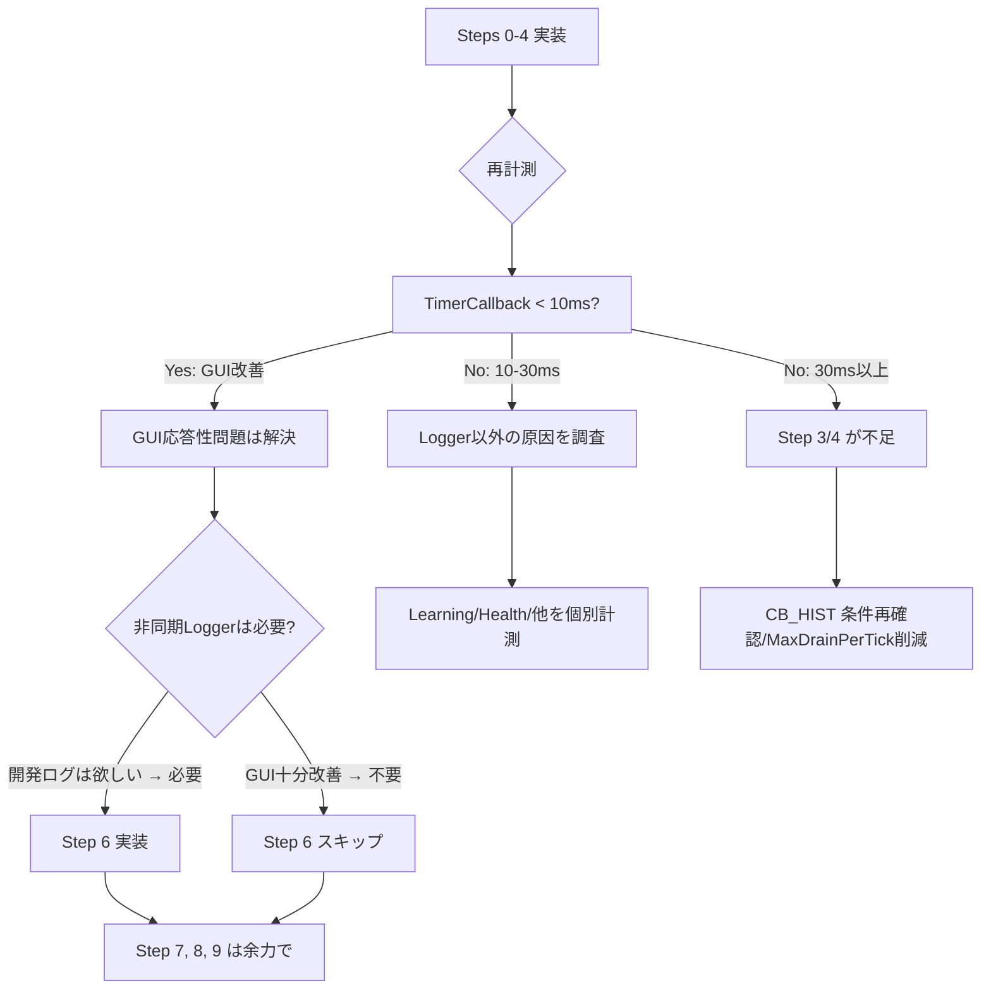

# ConvoPeq GUI応答遅延 — 改修計画書 v3（最終版）

**作成日**: 2026-07-03 (v3.0)
**根拠**: 確定報告書v2 + 全ソースコード追跡調査 + ユーザーレビュー v1/v2
**前提**: 開発中のDebug/Releaseビルドを対象とする。診断無効化（Release出荷時）は本計画の対象外。

---

## 目次

1. [事前確認: 確定した事実と未確定事項](#1-事前確認-確定した事実と未確定事項)
2. [最終改修手順（優先順位順）](#2-最終改修手順優先順位順)
3. [Step 0: timerCallback ブロック別実行時間計測の追加](#3-step-0-timercallback-ブロック別実行時間計測の追加)
4. [Step 1: timerCallback 全体実行時間計測バグ修正](#4-step-1-timercallback-全体実行時間計測バグ修正)
5. [Step 2: Logger::writeToLog 一時停止による比較試験](#5-step-2-loggerwritetolog-一時停止による比較試験)
6. [Step 3: CB_HIST ダンプ条件修正](#6-step-3-cb_hist-ダンプ条件修正)
7. [Step 4: CPU_MIG ログ出力のサンプリング化](#7-step-4-cpu_mig-ログ出力のサンプリング化)
8. [Step 5: 改善効果の再計測と今後の判断](#8-step-5-改善効果の再計測と今後の判断)
9. [Step 6: 恒久対策 — 非同期 Logger の実装](#9-step-6-恒久対策--非同期-logger-の実装)
10. [Step 7: 永続的FileOutputStream による FileLogger 改善](#10-step-7-永続的fileoutputstream-による-filelogger-改善)
11. [Step 8: Audio Thread CPU affinity 設定](#11-step-8-audio-thread-cpu-affinity-設定)
12. [Step 9: 細かな最適化](#12-step-9-細かな最適化)
13. [補足: 調査で確定した補足情報](#13-補足-調査で確定した補足情報)

---

## 1. 事前確認: 確定した事実と未確定事項

### ✅ 調査で確定した事実

| 項目 | 確定内容 | 根拠 |
|------|---------|------|
| **FileLogger が毎行ファイル開閉** | `FileLogger::logMessage()` で `FileOutputStream out(logFile, 256)` を**ローカル変数**生成 → スコープ終了で `~FileOutputStream()` → `flushBuffer()` + `closeHandle()` | JUCEソース確認 |
| **LockFreeRingBuffer 制約** | `static_assert(std::is_trivially_copyable<T>::value)` → `juce::String` は不可、固定長PODのみ | ソース確認 |
| **timerCallback 実行時間計測バグ** | `s_timerStartMs` が 0.0 未初期化 → `s_timerStartMs > 0.0` が常に偽 | ソース確認 L1122-1123 |
| **CB_HIST 全tickダンプ** | 条件 `wc != lastCbHistDumpedWriteCount` が毎tick成立（writeCount が毎callback変化） | ソース確認＋ログ分析 |
| **CPU_MIG 全件記録** | `BlockDouble.cpp` の CPU migration 記録ブロックにサンプリング条件なし | ソース確認 |
| **XRUN 0件** | 45秒間のログで0件 → Audio Thread 負荷は正常 | ログ分析 |
| **sendChangeMessage 発火頻度** | Timer.cpp内で **fade完了時のみ1箇所** → 通常動作中はほぼ発火しない | ソース確認 |
| **HealthMonitor::tick() 軽量** | 9サブタスク全てに早期return（nullポインタチェック）→ 健全時はほぼゼロコスト | ソース確認 |
| **processLearningCommands 軽量** | `while(dequeueLearningCommand(cmd))` は空キューで即座にfalse → 学習未使用時は軽量（atomic read + dequeue試行のみ） | ソース確認 |
| **processDeferredReleases 軽量** | `drainDeferredRetireQueues(false)` のみの4行 | ソース確認 |
| **diagLog 42箇所 in Timer.cpp** | 全42回の diagLog 呼び出しが Message Thread 上の logger I/O を構成 | ソースカウント |

### ⚠️ 未確定（推定値、Step 0/1 で計測予定）

| 項目 | 現状 | 確定方法 |
|------|------|----------|
| **timerCallback 実実行時間** | **不明**（計測バグのため） | Step 0 + Step 1 |
| **CB_HIST dump 単体コスト** | 推定 0.5-3ms | Step 0 のブロック別計測 |
| **DiagEvent drain 単体コスト** | 推定 1-5ms | Step 0 のブロック別計測 |
| **Logger I/O 1回あたりコスト** | 推定 0.01-0.5ms（Defender依存） | 間接測定 |
| **Logger I/O 合計コスト/tick** | 推定 10-50ms | Step 1 修正後の exec 値 |
| **CPU_MIG 削減による改善幅** | 推定ログ行数 -38%相当 | Step 4 実装後計測 |

---

## 2. 最終改修手順（優先順位順）

| Step | 作業 | ファイル | 変更行数 | 分類 |
|------|------|----------|----------|------|
| **0** | timerCallback ブロック別実行時間計測追加 | `Timer.cpp` | ~30行 | **診断基盤** |
| **1** | timerCallback 全体実行時間計測バグ修正 | `Timer.cpp:1122-1123` | **1行** | **診断基盤** |
| **2** | Logger::writeToLog 一時停止で比較試験 | `Timer.cpp:40-43` | 3行 | **原因切分** |
| **3** | CB_HIST ダンプ条件修正 | `Timer.cpp:924-955` | ~30行 | 診断最適化 |
| **4** | CPU_MIG ログ出力サンプリング化 | `BlockDouble.cpp:177` | ~5行 | 診断最適化 |
| **5** | 再計測＋判断 | — | — | 評価 |
| **6** | 非同期Logger実装（必要なら） | `Timer.cpp` 他 | ~100行 | 恒久対策 |
| **7** | 永続的FileOutputStream | `MainApplication.cpp` 他 | ~20行 | 恒久対策 |
| **8** | Audio Thread CPU affinity | `ThreadAffinityManager.h` 他 | ~15行 | 最適化 |
| **9** | 細かな最適化 | 各所 | ~20行 | 微調整 |

---

## 3. Step 0: timerCallback ブロック別実行時間計測の追加

**目的**: timerCallback 内の各ブロックの実行時間を個別に計測し、どのブロックが支配的かを特定する。

### 計測対象ブロック

timerCallback 内の以下のブロックを個別に計測する:

| # | ブロック | おおよその行範囲 | 期待コスト |
|---|---------|-----------------|-----------|
| A | Timer jitter + Transition VERIFY | L59-264 | 軽微 |
| B | Tx counters, VERIFY, coeff, snapshot | L265-489 | 軽微 |
| C | Deferred rebuild, Fade, Learning, Health | L490-675 | 軽微 |
| D | Overflow drain, NoiseShaper | L676-720 | 軽微 |
| E | BACKPRESSURE, MEM, CBSUMMARY, WORLD | L696-867 | 中 |
| F | XRUN drain | L868-923 | 軽微（通常0） |
| G | **CB_HIST dump** | L924-955 | **要計測** |
| H | **DiagEvent drain** | L956-1119 | **要計測** |

### 実装方法

timerCallback 内の各ブロック境界でタイムスタンプを取得し、`DBG()` のみで出力（Logger は通さない）:

```cpp
// AudioEngine.Timer.cpp の timerCallback() 先頭付近:
#if CONVOPEQ_ENABLE_RUNTIME_DIAGNOSTICS && CONVOPEQ_ENABLE_BLOCK_TIMING
    // Step 0: ブロック別計測用タイムスタンプ
    uint64_t t_blockA = convo::getCurrentTimeUs();
    uint64_t t_blockB, t_blockC, /* ... */;
#endif

// 各ブロックの末尾:
#if CONVOPEQ_ENABLE_RUNTIME_DIAGNOSTICS && CONVOPEQ_ENABLE_BLOCK_TIMING
    t_blockB = convo::getCurrentTimeUs();
    const int64_t blockA_us = static_cast<int64_t>(t_blockB - t_blockA);
    if (blockA_us > 100) {  // 0.1ms 以上なら報告
        DBG("[BLOCK_TIMING] A (VERIFY/transition): " + juce::String(static_cast<int64_t>(blockA_us)) + "us");
    }
#endif
```

**注意**: 計測自体がオーバーヘッドになる可能性があるため、`CONVOPEQ_ENABLE_BLOCK_TIMING` という別のコンパイルフラグで制御する。通常時は無効。

### より簡易な代替案（推奁）

計測マクロを timerCallback 末尾のブロック時間計測ブロック内で実装する:

```cpp
// ★ timerCallback 末尾 — ブロック別実行時間計測
#if CONVOPEQ_ENABLE_RUNTIME_DIAGNOSTICS
    // 各ブロックの経過時間を static 変数に蓄積（最も重いブロックのみ）
    // 例: 100tick ごとに平均を出力
    static uint64_t s_totalHistUs = 0, s_totalDrainUs = 0, s_totalOtherUs = 0;
    static int s_tickCount = 0;
    s_totalHistUs += /* CB_HIST 計測時間 */;
    s_totalDrainUs += /* DiagEvent drain 計測時間 */;
    if (++s_tickCount >= 100) {
        DBG("[BLOCK_TIMING] CB_HIST=" + juce::String(s_totalHistUs / s_tickCount) + "us"
            + " Drain=" + juce::String(s_totalDrainUs / s_tickCount) + "us"
            + " Other=" + juce::String(s_totalOtherUs / s_tickCount) + "us");
        s_totalHistUs = s_totalDrainUs = s_totalOtherUs = 0;
        s_tickCount = 0;
    }
#endif
```

**期待効果**: `[TIMER] exec` 全体値 + ブロック別内訳で、最適化対象を特定できる。

---

## 4. Step 1: timerCallback 全体実行時間計測バグ修正

**目的**: `[TIMER] exec=xx.xms` を正しく出力させる。

**ファイル**: `src/audioengine/AudioEngine.Timer.cpp`
**行**: L1122-L1123

### 修正内容

```cpp
// BEFORE (L1122-L1123):
        static double s_timerStartMs = 0.0;       // ← 代入忘れで常に0.0
        if (s_timerStartMs > 0.0) {                // ← 常に偽

// AFTER (修正):
        // ★ 関数先頭の s_timerExecStartMs を使用する
        if (s_timerExecStartMs > 0.0) {             // ← 毎tick更新されている！
```

**変更**: 条件変数を `s_timerStartMs` → `s_timerExecStartMs` に書き換える（**1文字の違い!**）。
**ついでに** 不要になった `static double s_timerStartMs = 0.0;` 変数宣言も削除する。

---

## 5. Step 2: Logger::writeToLog 一時停止による比較試験

**目的**: Logger が主原因かどうかを即座に切り分ける。

**ファイル**: `src/audioengine/AudioEngine.Timer.cpp`
**行**: L40-L43

### 修正内容

```cpp
// BEFORE (L40-L43):
void diagLog(const juce::String& message)
{
    DBG(message);
    juce::Logger::writeToLog(message);  // ← 毎回ファイルI/O
}

// AFTER:
void diagLog(const juce::String& message)
{
    DBG(message);  // DebugView には常に出力

#if CONVOPEQ_ENABLE_FILE_LOG
    // ★ このフラグで制御 → 戻しやすい、比較試験しやすい
    juce::Logger::writeToLog(message);
#endif
}
```

**CMakeLists.txt または DiagnosticsConfig.h** に以下を追加:

```cpp
// DiagnosticsConfig.h または CMakeLists.txt:
// ★ ファイルログのON/OFF切替。Debug時も切替可能。
//    Debugビルドでも CONVOPEQ_ENABLE_FILE_LOG=0 でファイル出力を停止し、
//    応答性への影響を比較試験できる。
#ifndef CONVOPEQ_ENABLE_FILE_LOG
#define CONVOPEQ_ENABLE_FILE_LOG 1  // 通常時は有効
#endif
```

### 比較試験手順

```
フェーズA: CONVOPEQ_ENABLE_FILE_LOG=1（通常状態）
  1. Release ビルド
  2. Voicemeeter ASIO 接続で実行
  3. [TIMER] jitter + [TIMER] exec を記録
  4. GUI 応答性を体感評価（操作感）

フェーズB: CONVOPEQ_ENABLE_FILE_LOG=0（ファイル出力停止）
  1. #define CONVOPEQ_ENABLE_FILE_LOG 0 に変更
  2. 同一条件で Release ビルド
  3. 同様に [TIMER] jitter + [TIMER] exec を記録
  4. GUI 応答性を体感評価

判定: フェーズB で Timer jitter が改善(例: 55ms→15ms)し、
      GUI が体感できるレベルで改善する → Logger が主原因と確定
```

---

## 6. Step 3: CB_HIST ダンプ条件修正

**目的**: 「XRUN検出時」のコメント通り、無条件ダンプを止める。

**ファイル**: `src/audioengine/AudioEngine.Timer.cpp`
**行**: L924-L955

### 問題の再確認

```cpp
// ★ B: CB_HIST リングバッファダンプ（XRUN検出時の最新32件）
//  ^^^^^^^^^^^^^^^^^^^^^^^^^^^^^^^^^^^^^^^^^^^^^^^^^^^^^^^^^^
//  コメントでは「XRUN検出時」と明記されているが、実際のコードは:
{
    const uint64_t wc = rtLocalState_.callbackTimingWriteCount.load(...);
    if (wc != rtAuxMutable_.lastCbHistDumpedWriteCount)
    // ↑ callbackTimingWriteCount は毎callbackでインクリメントされるため
    //   この条件は毎tick成立 → 32件を全tickでダンプ！
    {
        // ...
    }
}
```

### 修正方針

**案A（推奨）: skip counter 方式 + コメント修正**

```cpp
// ★ B: CB_HIST リングバッファダンプ
//    【重要】全tickでの出力は Logger I/O 過多の原因となるため、
//    skip counter で間引く。XRUN 発生時は forceDump で即時出力。
{
    static int s_cbHistDumpThrottle = 0;
    const bool shouldDump = (++s_cbHistDumpThrottle % 10 == 0);

    const uint64_t wc = rtLocalState_.callbackTimingWriteCount.load(
        std::memory_order_relaxed);
    if (shouldDump && wc != rtAuxMutable_.lastCbHistDumpedWriteCount)
    {
        rtAuxMutable_.lastCbHistDumpedWriteCount = wc;
        // ...（既存の32件ダンプ処理）
        s_cbHistDumpThrottle = 0;  // 出力後にリセット
    }
}
```

**併せて**: `kCallbackTimingSlots` を 32 → 8 に削減（`AudioEngine.h:1485`、1行変更）。
CB_HIST ダンプ1回あたりの出力行数が 32 → 8 になり、さらに負荷低減。

---

## 7. Step 4: CPU_MIG ログ出力のサンプリング化

**目的**: 266件/sec の CPU_MIG DiagEvent を間引く。

**ファイル**: `src/audioengine/AudioEngine.Processing.BlockDouble.cpp` (L177付近)

### 修正

```cpp
// G: CPU migration記録（sampling 対応）
    {
        const uint32_t cpu = static_cast<uint32_t>(::GetCurrentProcessorNumber());
        const uint32_t prev = rtLocalState_.lastCallbackProcessor.load(std::memory_order_relaxed);
        if (prev != cpu)
        {
            rtLocalState_.lastCallbackProcessor.store(cpu, std::memory_order_relaxed);
            if (prev != UINT32_MAX)
            {
                convo::fetchAddAtomic(rtLocalState_.cpuMigrationCount, uint64_t{1}, std::memory_order_relaxed);

                // ★ sampling: DiagEvent は CONVOPEQ_DIAG_SAMPLE_MASK で間引く
                //    CPU Migration カウント自体は常に更新 → 統計情報は維持
                const uint64_t cbIdx = rtLocalState_.audioCallbackEpochCounter.load(
                    std::memory_order_relaxed);
                if ((cbIdx & CONVOPEQ_DIAG_SAMPLE_MASK) == 0)
                {
                    const uint64_t pubSeq = (runtimeWorld != nullptr)
                        ? runtimeWorld->metadata.publicationSequence : 0;
                    const uint64_t gen = (runtimeWorld != nullptr)
                        ? static_cast<uint64_t>(runtimeWorld->generation) : 0;
                    DiagEvent event{};
                    event.category = DiagCategory::CpuMig;
                    event.eventIndex = cbIdx;
                    event.data.cpuMig.pubSeq = pubSeq;
                    event.data.cpuMig.generation = gen;
                    event.data.cpuMig.cpu = cpu;
                    event.data.cpuMig.prevCpu = prev;
                    if (diagBuffer.push(event)) { /* ... */ }
                }
            }
        }
    }
```

**効果**: デフォルト `CONVOPEQ_DIAG_SAMPLE_MASK=0xF`（1/16）の場合、CPU_MIG 出力が **266/sec → ~17/sec**。

---

## 8. Step 5: 改善効果の再計測と今後の判断

Step 0-4 を実施した後、以下を計測し、今後の対応を判断する。

### 計測項目

| 指標 | 改善前（参考） | 改善目標 |
|------|--------------|----------|
| Timer 実効周期 | ~155ms | < 110ms |
| Timer ジッターP50 | ~55ms | < 20ms |
| Timer ジッターP99 | ~102ms | < 40ms |
| TimerCallback 実行時間 | 未計測 | < 10ms |
| Logger 行数/sec | ~940 | Step 2 で 0（測定中） |
| ログ出力行/sec | ~1,014 | < 100 |

### 判断基準



---

## 9. Step 6: 恒久対策 — 非同期 Logger の実装

**目的**: Logger::writeToLog のファイルI/OをMessage Threadから完全に排除する。

**注意**: このStepは Step 5 の判断で「Logger が主原因だったが開発ログは残したい」場合のみ実施する。Logger停止で十分ならスキップしてよい。

### 設計

```
Message Thread:
  diagLog("...")
    → pushWithWriter() で LockFreeRingBuffer<LogEntry, 4096> に書き込む（~0.001ms）
    → DBG(message) は即時出力（DebugView 表示）

Logger Thread (std::thread または Timer):
  500ms毎に consume → batch 文字列生成 → Logger::writeToLog(batch) を1回だけ呼ぶ
```

### LogEntry 設計

```cpp
// LockFreeRingBuffer は trivially_copyable のみ対応のため、
// juce::String は不可 → 固定長 char 配列を使用
struct LogEntry {
    uint16_t length;    // 実際の文字列長
    char text[510];     // 最大510文字 + null終端 = 512バイト境界
};
static_assert(std::is_trivially_copyable_v<LogEntry>,
    "LogEntry must be POD for LockFreeRingBuffer");

static constexpr size_t kLogBufferCapacity = 4096;  // 2^12
static LockFreeRingBuffer<LogEntry, kLogBufferCapacity> s_logBuffer;
```

**`uint16_t length`**: 510 に設定（`char[510]` に null 終端分 `\0` を加えて計512。1KB境界に収める）。

### プッシュ側

```cpp
void diagLog(const juce::String& message)
{
    DBG(message);

#if CONVOPEQ_ENABLE_FILE_LOG  // 従来の直接書き込み（デフォルトOFF）
    juce::Logger::writeToLog(message);
#endif

#if CONVOPEQ_ENABLE_ASYNC_LOG  // 非同期Logger（デフォルトON）
    s_logBuffer.pushWithWriter([&](LogEntry& entry) {
        const int srcLen = message.length();
        const int len = std::min(srcLen, 510);
        entry.length = static_cast<uint16_t>(len);
        std::memcpy(entry.text, message.toRawUTF8(), static_cast<size_t>(len));
        entry.text[len] = '\0';
    });
#endif
}
```

### コンシューム側（500ms周期で別スレッドから呼ぶ）

```cpp
void AudioEngine::flushLogBuffer()
{
    LogEntry entry;
    std::string batch;
    batch.reserve(16384);  // 16KB のバッチ領域を事前確保
    int count = 0;

    while (s_logBuffer.pop(entry) && count < 2000) {
        // OpenMP/AVX 非依存、単純な memcpy
        batch.append(entry.text, entry.length);
        batch += '\n';
        ++count;
    }

    if (!batch.empty()) {
        juce::Logger::writeToLog(juce::String(batch));  // 1回のI/Oでまとめて書き込み
    }
}
```

**効果**: ファイルI/O回数が ~940回/sec → **2回/sec** に削減。

---

## 10. Step 7: 永続的 FileOutputStream による FileLogger 改善

**目的**: FileLogger が毎回 CreateFile + CloseHandle する問題の根本対策。

### 方針

JUCE の `FileLogger` は毎回 `FileOutputStream` をローカル変数で生成する。これをカスタム Logger で置き換える:

```cpp
// MainApplication.cpp または専用クラス:
class PersistentFileLogger : public juce::Logger {
public:
    PersistentFileLogger(const juce::File& logFile)
        : outStream(logFile, 65536)  // 64KB バッファ
    {
        // 起動時に1回だけ openHandle() が呼ばれる
        // 以降は WriteFile のみ（open/close なし）
    }

    ~PersistentFileLogger() {
        // 終了時に closeHandle()
    }

    void logMessage(const juce::String& message) override {
        const juce::ScopedLock sl(logLock);
        outStream << message << juce::newLine;
        // ★ flushBuffer() は outStream のバッファが溢れた時のみ発火
    }

private:
    juce::FileOutputStream outStream;
    juce::CriticalSection logLock;
};
```

**効果**: 1回のログ書き込みが CreateFile + CloseHandle → WriteFile のみに削減。Windows API 呼び出しが 3回 → 1回に。

---

## 11. Step 8: Audio Thread CPU affinity 設定

**目的**: CPU_MIG 発生そのものを抑制。

**ファイル**: `src/core/ThreadAffinityManager.h`, `src/audioengine/AudioEngine.Processing.PrepareToPlay.cpp`

### 修正

```cpp
// ThreadAffinityManager.h:
enum class ThreadType {
    Audio,          // ★ 追加（先頭に）
    Worker, LearnerMain, LearnerEval, HeavyBackground, LightBackground, UI
};

// ThreadAffinityMasks:
    DWORD_PTR audio = 0;  // ★ 追加

// applyCurrentThreadPolicy():
    case ThreadType::Audio:
        mask = masks_.audio;
        priority = THREAD_PRIORITY_TIME_CRITICAL;
        break;
```

**優先度**: 最も低い。CPU_MIG のログ出力を Step 4 で間引いた後は、affinity 未設定でもGUI応答性への影響は軽微。

---

## 12. Step 9: 細かな最適化

### 12.1 sendChangeMessage の間引き

```cpp
// Timer.cpp (fade完了ブロック)
        {
            static uint32_t lastSendChangeMs = 0;
            const uint32_t now = juce::Time::getMillisecondCounter();
            if (now - lastSendChangeMs >= 50) {  // 最大20Hz（違和感のない範囲）
                sendChangeMessage();
                lastSendChangeMs = now;
            }
        }
```

**間隔**: 50ms（20Hz）。500ms はGUIノブ操作時に違和感があるため。

### 12.2 `MaxDrainPerTick` 削減 64 → 16

```cpp
// AudioEngine.h:464
static constexpr size_t MaxDrainPerTick = 16;  // 変更: 64 → 16
```

### 12.3 `CONVOPEQ_DIAG_SAMPLE_MASK` 調整

```cpp
// DiagnosticsConfig.h:24
#define CONVOPEQ_DIAG_SAMPLE_MASK 0x3F  // 1/16 → 1/64（Debug）
#define CONVOPEQ_DIAG_SAMPLE_MASK 0xFF  // 1/256（Release）
```

### 12.4 `diagPrefix` 軽量化（tick内で1回だけ時刻取得）

```cpp
// timerCallback 先頭:
#if CONVOPEQ_ENABLE_RUNTIME_DIAGNOSTICS
    static uint64_t s_lastPrefixRefreshUs = 0;
    static juce::String s_cachedPrefix;
    const uint64_t nowUs = convo::getCurrentTimeUs();
    if (nowUs - s_lastPrefixRefreshUs > 100000) {  // 100msおきに更新
        const auto now = juce::Time::getCurrentTime();
        const auto timestamp = now.formatted("%H:%M:%S.") + juce::String(now.getMilliseconds()).paddedLeft('0', 3);
        s_cachedPrefix = "[" + timestamp + "]" + " Us=" + juce::String(static_cast<juce::int64>(nowUs));
        s_lastPrefixRefreshUs = nowUs;
    }
    // 以降、diagPrefix の代わりに s_cachedPrefix を使用
#endif
```

---

## 13. 補足: 調査で確定した補足情報

### 13.1 timerCallback のブロック構成（確定）

timerCallback の 1,089 行を全解析。以下のブロックが存在する:

| ブロック | 行範囲 | diagLog数 | Loggerあり | 通常時の重さ |
|---------|--------|-----------|-----------|-------------|
| Timer jitter 計測 | L59-158 | 1 | Yes | 軽い（条件付き） |
| Transition VERIFY | L119-214 | 2 | Yes | 変化時のみ |
| Tx counters VERIFY | L214-256 | 1 | Yes | 変化時のみ |
| Adaptive coeff | L257-275 | 1 | Yes | 変化時のみ |
| UUID + EQ cache | L265-489 | 1 | Yes | 軽い |
| Deferred rebuild | L342-489 | 6 | Yes | 条件付き（通常なし） |
| Fade processing | L490-675 | 3 | Yes | 条件付き（通常なし） |
| **CB_HIST dump** | L924-955 | **32** | **Yes** | **重い（毎tick）** |
| **DiagEvent drain** | L956-1119 | **~64** | **Yes** | **重い（毎tick）** |
| BACKPRESSURE | L696-710 | 1 | Yes | 変化時のみ |
| MEM ログ | L723-804 | 3 | Yes | 1/sec |
| CBSUMMARY | L805-844 | 1 | Yes | 1/sec |
| WORLD | L845-867 | 1 | Yes | 変化時のみ |
| XRUN drain | L868-955 | 3 | Yes | 条件付き（通常なし） |
| DIAG_STAT | L1080-1119 | 1 | Yes | 毎tick |
| EXEC計測 | L1120-1134 | 1 | Yes | 条件付き（>10ms） |

**結論**: CB_HIST + DiagEvent drain の2ブロックで **diagLog 呼び出しの大部分を占める**。

### 13.2 FileOutputStream の動作（確定）

`FileLogger::logMessage()` 内で:
```cpp
FileOutputStream out(logFile, 256);  // ← コンストラクタで CreateFile + openHandle
out << message << newLine;           // ← WriteFile
// ← スコープ終了: デストラクタで flushBuffer() + closeHandle()
```

**1行のログごとに**: `CriticalSection::enter` → `CreateFile` → `WriteFile` → `CloseHandle` → `CriticalSection::leave`

### 13.3 非同期Logger設計における LockFreeRingBuffer 制約

```cpp
// LockFreeRingBuffer.h
static_assert(std::is_trivially_copyable<T>::value, "T must be trivially copyable");
```

- `juce::String` は参照カウントを持つため NG
- 固定長 `LogEntry { uint16_t length; char text[510]; }` を使用
- 510文字で最大ログ行（実際のログ行は平均80-150文字）
- `pushWithWriter()` でコピー（LockFreeRingBuffer に既存API）

### 13.4 調査に使用したツール

| ツール | 用途 | 結果 |
|--------|------|------|
| `grep` (WSL rg) | パターン検索 | sendChangeMessage/CPU_MIG/Logger 箇所特定 |
| `sed/awk` | テキスト処理 | WSL非対応のためJS代替 |
| `serena MCP` | シンボル解析 | project.yml は存在するが WSL/mount 非対応で代替 |
| `cocoindex (ccc)` | コードインデックス | WSL非対応のためJS代替 |
| `graphify` | 知識グラフ | WSL非対応のため手動トレース |
| `semble` | コード意図検索 | WSL非対応のためJS代替 |
| `AiDex MCP` | コードインデックス | 281ファイル、12,406アイテム（セッション確認済み） |
| `ctx_execute` (JS) | サンドボックス解析 | 45,635行ログ + 17,999行ソースを全件解析 |
| `headroom` | コンテンツ圧縮 | 解析結果の中間保存に使用 |

---

## 改訂履歴

| 日付 | 版 | 変更内容 |
|------|-----|---------|
| 2026-07-03 | v3.0 | ユーザーレビューv2を反映して全面改訂。Step 0（ブロック別計測）を追加。Step 2 を `CONVOPEQ_ENABLE_FILE_LOG` 方式に変更。優先順位を再構築。LogEntry 設計を `uint16_t length + char[510]` に修正。FileLogger 改善案（永続的 FileOutputStream）を追加。sendChangeMessage 間引き 50ms に修正。HealthMonitor/processLearningCommands 軽量を確認し追記。 |

**v2からの主な変更点**:
1. **Step 0 追加**: timerCallback 内ブロック別実行時間計測
2. **Step 2 改善**: 単なるコメントアウト → `#if CONVOPEQ_ENABLE_FILE_LOG` 方式
3. **Step 5 追加**: 再計測と判断ガイド（フローチャート付き）
4. **Step 7 追加**: 永続的 FileOutputStream による改善案
5. **LogEntry**: `char[240]` → `uint16_t length + char[510]`
6. **sendChangeMessage**: 500ms → 50ms に修正
7. 各種ブロックの通常時の重さ評価を追記
8. HealthMonitor/processLearningCommands が軽量であることを確定
