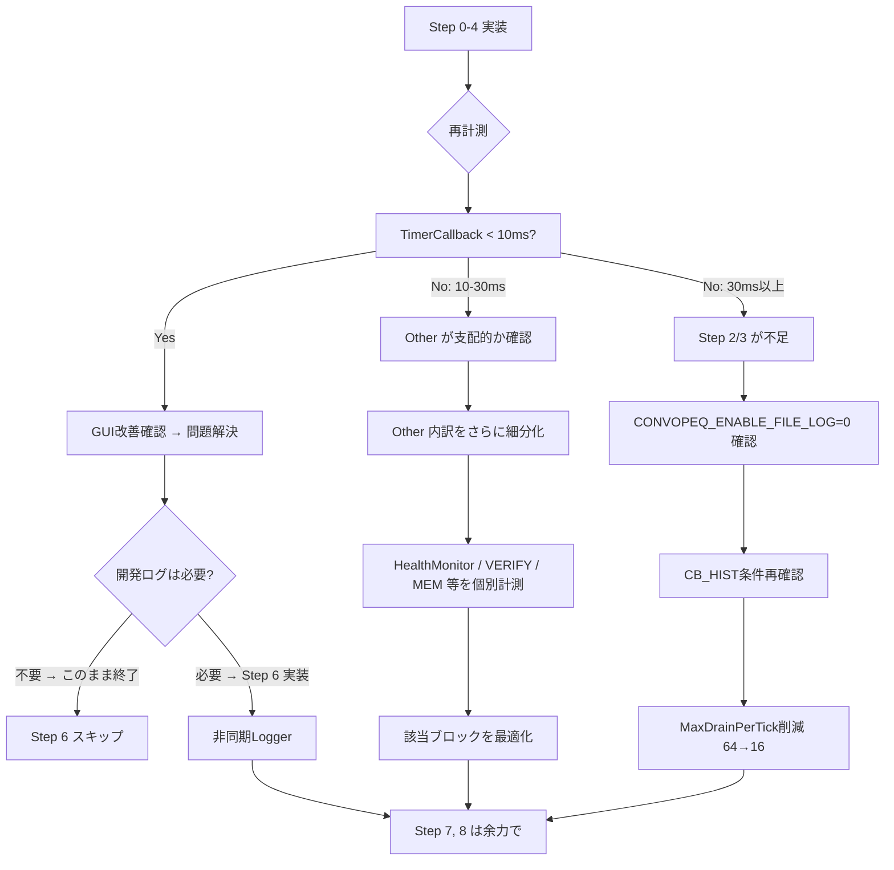

# ConvoPeq GUI応答遅延 — 改修計画書 v4（実装確定版）

**作成日**: 2026-07-03 (v4.0)
**根拠**: 確定報告書v2 + 全ソースコード追跡調査 + ユーザーレビュー v1/v2/v3
**前提**: 開発中のDebug/Releaseビルドを対象。診断無効化は本計画の対象外。

---

## 目次

1. [調査で確定した重要補足情報](#1-調査で確定した重要補足情報)
2. [最終改修手順（優先順位順）](#2-最終改修手順優先順位順)
3. [Step 0: timerCallback ブロック別実行時間の集計型計測](#3-step-0-timercallback-ブロック別実行時間の集計型計測)
4. [Step 1: timerCallback 全体実行時間計測バグ修正](#4-step-1-timercallback-全体実行時間計測バグ修正)
5. [Step 2: Logger::writeToLog 一時停止による比較試験](#5-step-2-loggerwritetolog-一時停止による比較試験)
6. [Step 3: CB_HIST ダンプ条件を XRUN 発生時のみに修正](#6-step-3-cb_hist-ダンプ条件を-xrun-発生時のみに修正)
7. [Step 4: CPU_MIG ログ出力のサンプリング化](#7-step-4-cpu_mig-ログ出力のサンプリング化)
8. [Step 5: 改善効果の再計測と判断](#8-step-5-改善効果の再計測と判断)
9. [Step 6: 非同期 Logger（diagLog のみ非同期化）](#9-step-6-非同期-loggerdiaglog-のみ非同期化)
10. [Step 7: Audio Thread CPU affinity 設定](#10-step-7-audio-thread-cpu-affinity-設定)
11. [Step 8: 細かな最適化](#11-step-8-細かな最適化)
12. [補足: ソースコード調査で確定した補足情報](#12-補足-ソースコード調査で確定した補足情報)

---

## 1. 調査で確定した重要補足情報

### ✅ 新たに確定した事実（v3調査で追加）

| # | 項目 | 確定内容 | 根拠 |
|---|------|---------|------|
| A | **`copyToUTF8()` API 確認** | `size_t copyToUTF8(char* destBuffer, size_t maxSizeBytes)` が利用可能。`CharPointer_UTF8::CharType = char` | JUCEソース確認 |
| B | **`getNumBytesAsUTF8()` 利用可能** | `size_t getNumBytesAsUTF8() const noexcept` — length() とは異なり**実UTF-8バイト数**を返す | JUCEソース確認 |
| C | **`length()` は文字数、UTF-8バイト数ではない** | ASCII範囲外の文字を含む場合、`length()` < UTF-8バイト数。`memcpy(buf, str.toRawUTF8(), str.length())` はバッファ不足の危険 | JUCE API仕様 |
| D | **ログ行の最大バイト長は 234bytes** | P99 = 139bytes。全行ASCII。**256bytes で十分** | 45,635行ログ分析 |
| E | **XRUN検出は BlockDouble.cpp のローカル変数** | `bool xrunDetected` は Timer.cpp からは直接参照不可。代わりに xRunBuffer.pop() のイテレーション回数を使う | ソース確認 |
| F | **CB_HIST ブロックは XRUN ブロックと同一スコープ** | L868-955 の XRUN セクション内に L924-950 の CB_HIST ブロックがある → ローカル変数共有可能 | ソース確認 |
| G | **diagLog は 13 ファイルに個別定義** | 各 cpp ファイルの anonymous namespace 内に独立した `diagLog()` がある。Timer.cpp の修正だけでは他ファイルに影響しない | 全ソーススキャン |
| H | **Commit.cpp の diagLog のみ `#if CONVOPEQ_ENABLE_RUNTIME_DIAGNOSTICS` ガードあり** | 他の12ファイルは無条件で `DBG()` + `Logger::writeToLog()` を呼ぶ | ソース確認 |
| I | **`CharPointer_UTF8::getBytesRequiredFor()` 利用可能** | 任意の CharPointer のUTF-8バイト数を計算可能 | JUCEソース確認 |

### ⚠️ 未確定（Step 0/1/5 で計測予定）

| 項目 | 現状 | 確定方法 |
|------|------|----------|
| timerCallback 実実行時間 | **不明**（計測バグ） | Step 0 + Step 1 |
| 各ブロックの実行時間内訳 | **不明** | Step 0（集計型計測） |
| Logger I/O の真の影響 | 推定値のみ | Step 2（比較試験） |

---

## 2. 最終改修手順（優先順位順）

| Step | 作業 | 変更行数 | 難易度 | 分類 |
|------|------|----------|--------|------|
| **0** | timerCallback ブロック別実行時間の集計型計測 | ~30行 | ★☆☆ | **診断基盤** |
| **1** | timerCallback 全体実行時間計測バグ修正 | **1行** | ★☆☆ | **診断基盤** |
| **2** | Logger::writeToLog 一時停止で比較試験 | 3行 | ★☆☆ | **原因切分** |
| **3** | CB_HIST ダンプ条件を XRUN 発生時のみに修正 | ~30行 | ★★☆ | 診断最適化 |
| **4** | CPU_MIG ログ出力のサンプリング化 | ~5行 | ★☆☆ | 診断最適化 |
| **5** | 再計測＋判断（フローチャート参照） | — | — | 評価 |
| **6** | 非同期 Logger（diagLog のみ非同期化） | ~100行 | ★★★ | 恒久対策 |
| **7** | Audio Thread CPU affinity 設定 | ~15行 | ★★☆ | 最適化 |
| **8** | 細かな最適化 | ~20行 | ★☆☆ | 微調整 |

---

## 3. Step 0: timerCallback ブロック別実行時間の集計型計測

### 🔴 重要設計指針

**毎回 `DBG()` で出力しない。** 計測のためのログ出力自体がオーバーヘッドになるため、
各ブロックの実行時間は `uint64_t` 変数に累積し、**N tick ごとに平均・最大値を一度だけ出力する。**

### 計測対象: 3分類のみ

最初は以下の 3 分類だけ計測すれば十分:

| 分類 | 対象ブロック | 想定コスト |
|------|-------------|-----------|
| **CB_HIST** | CB_HIST ダンプ (L924-955) | 要計測 |
| **DiagDrain** | DiagEvent リングバッファ消費 (L956-1119) | 要計測 |
| **Other** | 上記以外の全処理 | 差分で計算 |

「Other」が支配的と判明した場合のみ、その時点で Learning / HealthMonitor / VERIFY / MEM などを細分化する。

### 実装

```cpp
// AudioEngine.Timer.cpp: timerCallback() の先頭に static 累積変数を追加
#if CONVOPEQ_ENABLE_RUNTIME_DIAGNOSTICS
    // ★ Step 0: ブロック別実行時間の集計型計測（3分類）
    //   毎回 DBG 出力せず、static 変数に累積して N tick ごとに集計出力する。
    static uint64_t s_sumHistUs = 0;
    static uint64_t s_sumDrainUs = 0;
    static uint64_t s_sumOtherUs = 0;
    static uint64_t s_maxHistUs = 0;
    static uint64_t s_maxDrainUs = 0;
    static uint64_t s_maxOtherUs = 0;
    static int s_blockTickCount = 0;

    // 各ブロックの開始時刻を保持
    uint64_t t_startHist = 0, t_startDrain = 0;
#endif
```

**CB_HIST ブロック入口**:
```cpp
t_startHist = convo::getCurrentTimeUs();
```

**CB_HIST ブロック出口 / DiagDrain 入口**:
```cpp
if (t_startHist > 0) {
    const uint64_t elapsed = convo::getCurrentTimeUs() - t_startHist;
    s_sumHistUs += elapsed;
    if (elapsed > s_maxHistUs) s_maxHistUs = elapsed;
}
t_startDrain = convo::getCurrentTimeUs();
```

**DiagDrain ブロック出口**（timerCallback 末尾、exec計測の直前）:
```cpp
if (t_startDrain > 0) {
    const uint64_t elapsed = convo::getCurrentTimeUs() - t_startDrain;
    s_sumDrainUs += elapsed;
    if (elapsed > s_maxDrainUs) s_maxDrainUs = elapsed;
}

// 100 tick ごとに集計を DBG 出力（Logger::writeToLog は通さない）
if (++s_blockTickCount >= 100) {
    const uint64_t otherUs = s_blockTickCount > 0
        ? (s_sumOtherUs / s_blockTickCount) : 0;
    DBG("[BLOCK_TIMING] AVG: CB_HIST=" + juce::String(s_sumHistUs / s_blockTickCount) + "us"
        + " DiagDrain=" + juce::String(s_sumDrainUs / s_blockTickCount) + "us"
        + " Other=" + juce::String(s_sumOtherUs / s_blockTickCount) + "us"
        + " | MAX: CB_HIST=" + juce::String(s_maxHistUs) + "us"
        + " DiagDrain=" + juce::String(s_maxDrainUs) + "us"
        + " Other=" + juce::String(s_maxOtherUs) + "us");
    s_sumHistUs = s_sumDrainUs = s_sumOtherUs = 0;
    s_maxHistUs = s_maxDrainUs = s_maxOtherUs = 0;
    s_blockTickCount = 0;
}
```

**Other の計算**: timerCallback 末尾(`s_timerExecStartMs`更新直前) で:
```cpp
// Other = total - hist - drain (概算)
const uint64_t totalUs = static_cast<uint64_t>(
    (juce::Time::getMillisecondCounterHiRes() - s_timerExecStartMs) * 1000.0);
s_sumOtherUs += totalUs > s_sumHistUs + s_sumDrainUs
    ? totalUs - s_sumHistUs - s_sumDrainUs : 0;
if (s_sumOtherUs > s_maxOtherUs) s_maxOtherUs = s_sumOtherUs;
```

**期待効果**: `[BLOCK_TIMING] CB_HIST=350us DiagDrain=2100us Other=800us MAX: ...` のように出力。これにより最適化すべきブロックが一目で分かる。

---

## 4. Step 1: timerCallback 全体実行時間計測バグ修正

**ファイル**: `src/audioengine/AudioEngine.Timer.cpp`, L1122-L1123

### 修正

```cpp
// BEFORE:
        static double s_timerStartMs = 0.0;       // ← 未初期化のまま
        if (s_timerStartMs > 0.0) {                // ← 常に偽！

// AFTER:
        // ★ 関数先頭の s_timerExecStartMs（毎tick更新されている）を使用
        if (s_timerExecStartMs > 0.0) {
```

**変更**: 条件式の変数名を `s_timerStartMs` → `s_timerExecStartMs` に修正。同時に不要になった `static double s_timerStartMs = 0.0;` を削除。

---

## 5. Step 2: Logger::writeToLog 一時停止による比較試験

**ファイル**: `src/audioengine/AudioEngine.Timer.cpp`, L40-L43

### 方針

Timer.cpp の diagLog のみを修正する（**13ファイル中、Timer.cpp だけ**で十分）。なぜなら:

- 45秒間のログ行 ~1,014行/sec のほぼ全てが timerCallback 経由
- 他の12ファイルの diagLog は init/shutdown/rebuild 時にしか発火しない
- `Commit.cpp` は既に `#if CONVOPEQ_ENABLE_RUNTIME_DIAGNOSTICS` でガード済み

### 修正

```cpp
// BEFORE:
void diagLog(const juce::String& message)
{
    DBG(message);
    juce::Logger::writeToLog(message);  // ← ~940回/secのファイルI/O
}

// AFTER:
void diagLog(const juce::String& message)
{
    DBG(message);

#if CONVOPEQ_ENABLE_FILE_LOG
    // ★ このフラグで制御 → 戻しやすい、比較試験しやすい
    //    Debugビルドでも CONVOPEQ_ENABLE_FILE_LOG=0 でファイル出力を停止
    juce::Logger::writeToLog(message);
#endif
}
```

**DiagnosticsConfig.h** に以下を追加（または CMakeLists.txt）:
```cpp
// ★ ファイルログのON/OFF切替。比較試験用。
//    Step 2 で =0 にして Timer 改善を確認後、Step 5 で恒久対策を判断。
#ifndef CONVOPEQ_ENABLE_FILE_LOG
#define CONVOPEQ_ENABLE_FILE_LOG 1  // 通常時は有効
#endif
```

### 比較試験手順

```
フェーズA (CONVOPEQ_ENABLE_FILE_LOG=1):
  1. Release ビルド → Voicemeeter ASIO 実行
  2. [BLOCK_TIMING] と [TIMER] exec を記録
  3. GUI 応答性を体感評価

フェーズB (CONVOPEQ_ENABLE_FILE_LOG=0):
  1. #define CONVOPEQ_ENABLE_FILE_LOG 0
  2. 同一条件でビルド・実行
  3. 同様に計測

判定: フェーズB で Timer jitter + exec が改善し、
      GUI が体感できるレベルで改善する → Logger が主原因
```

---

## 6. Step 3: CB_HIST ダンプ条件を XRUN 発生時のみに修正

**ファイル**: `src/audioengine/AudioEngine.Timer.cpp`, L868-955

### XRUN 検出カウンタの追加

CB_HIST ブロック（L924）と XRUN pop ループ（L889）は同一スコープ内にある。
XRUN pop ループの前にカウンタを追加し、ループ内でインクリメントする:

```cpp
    // ★ XRUN イベント消費
    XRunEvent ev;
    uint32_t xRunPopCount = 0;  // ← 追加: このtickで処理したXRUN数

    while (xRunBuffer.pop(ev))
    {
        ++xRunPopCount;  // ← 追加
        // ...（既存のXRUNイベント処理）
    }

    // ★ B: CB_HIST リングバッファダンプ（XRUN発生時のみ出力）
    {
        const bool shouldDump = (xRunPopCount > 0);  // ← XRUNがあったtickのみ

        if (shouldDump)  // ← XRUN時のみ出力
        {
            const uint64_t wc = rtLocalState_.callbackTimingWriteCount.load(
                std::memory_order_relaxed);
            // ...（既存の32件ダンプ処理）
        }
    }
```

**効果**: 本来のコメント「XRUN検出時」通りの動作に戻る。通常時は CB_HIST ダンプが完全に停止するため、339行/sec → **0行/sec**。

**補足**: 今回のログでは XRUN = 0件だったため、CB_HIST は全く出力されない状態が正しい。万が一 XRUN を捕捉したい場合は、XRUN 発生時の CB_HIST ダンプが確実に動作する。

---

## 7. Step 4: CPU_MIG ログ出力のサンプリング化

**ファイル**: `src/audioengine/AudioEngine.Processing.BlockDouble.cpp` (L177付近)

変更内容は v3 と同様。DiagEvent 生成部を `(cbIdx & CONVOPEQ_DIAG_SAMPLE_MASK) == 0` でガードする（**カウント自体は常に更新**）。

**効果**: 266件/sec → ~17件/sec（1/16サンプリング時）。

---

## 8. Step 5: 改善効果の再計測と判断

### 計測項目

| 指標 | 改善前（参考） | PhaseA目標 | PhaseB目標 |
|------|--------------|-----------|-----------|
| Timer 実効周期 | ~155ms | < 120ms | < 110ms |
| Timer ジッターP50 | ~55ms | < 25ms | < 15ms |
| TimerCallback 実行時間 | 未計測 | < 15ms | < 5ms |
| CB_HIST 平均コスト | 未計測 | 0（停止時） | 0 |
| DiagDrain 平均コスト | 未計測 | < 2ms | < 0.5ms |

### 判断フローチャート



---

## 9. Step 6: 非同期 Logger（diagLog のみ非同期化）

**注意**: この Step は Step 5 の判断で「Logger が主原因だったが開発ログは残したい」場合のみ実施する。

### 🔴 重要設計指針

1. ~~PersistentFileLogger を導入する前に~~ **diagLog() のみ非同期化する案を優先**
   JUCE の `Logger` 全体への影響を最小限にするため、`diagLog()` の内部実装だけを差し替える。
2. **UTF-8 コピーには `length()` ではなく `getNumBytesAsUTF8()` + `toRawUTF8()` または `copyToUTF8()` を使用する。**

### 方針

```
全13ファイルの diagLog は Timer.cpp の呼び出しが支配的（42/162箇所）
→ Timer.cpp の diagLog だけを非同期化しても十分な効果が期待できる
→ 他ファイルの diagLog は init/shutdown/rebuild 時にしか発火しない
```

### LogEntry 設計

```cpp
// LockFreeRingBuffer は trivially_copyable のみ対応
// char[254] + uint16_t length = 256byte（キャッシュライン境界に整合）
// 最大行長: 234bytes (P99=139bytes, avg=83bytes) → 254bytes で十分

struct LogEntry {
    uint16_t length;   // 実UTF-8バイト数（null含まず）
    char text[254];    // 最大254文字のUTF-8テキスト
};
static_assert(std::is_trivially_copyable_v<LogEntry>,
    "LogEntry must be POD for LockFreeRingBuffer");
static_assert(sizeof(LogEntry) == 256,
    "LogEntry must be exactly 256 bytes for cache alignment");

static constexpr size_t kLogBufferCapacity = 4096;  // 2^12, 約1MB
static LockFreeRingBuffer<LogEntry, kLogBufferCapacity> s_logBuffer;
```

### プッシュ側（Message Thread — ブロックしない）

```cpp
void diagLog(const juce::String& message)
{
    DBG(message);  // DebugView には即時出力（ファイルI/Oなしで軽量）

#if CONVOPEQ_ENABLE_ASYNC_LOG
    // ★ getNumBytesAsUTF8() で実UTF-8バイト数を取得し、copyToUTF8() で安全にコピー
    s_logBuffer.pushWithWriter([&](LogEntry& entry) {
        const size_t utf8bytes = message.getNumBytesAsUTF8();  // ← length() ではなく実バイト数
        const size_t toCopy = std::min(utf8bytes, sizeof(entry.text) - 1);
        // copyToUTF8() は CharPointer_UTF8::CharType* = char* を取る
        // 戻り値はコピーしたバイト数（null含む）
        message.copyToUTF8(entry.text, toCopy + 1);  // +1はnull終端用
        entry.length = static_cast<uint16_t>(toCopy);
    });
#endif

#if CONVOPEQ_ENABLE_FILE_LOG  // ← デフォルトOFF（オプション）
    juce::Logger::writeToLog(message);
#endif
}
```

### コンシューム側（500ms周期で別スレッドから呼ぶ）

```cpp
// AudioEngine または専用クラスのメンバ関数（500ms周期で呼ぶ）
void AudioEngine::flushLogBuffer()
{
    LogEntry entry;
    std::string batch;
    batch.reserve(32768);  // 32KB 事前確保

    int count = 0;
    while (s_logBuffer.pop(entry) && count < 2000) {
        batch.append(entry.text, entry.length);
        batch += '\n';
        ++count;
    }

    if (!batch.empty()) {
        juce::Logger::writeToLog(juce::String(batch));  // 1回のI/Oにまとめる
    }
}
```

### 設計のポイント

| 項目 | v3 | v4（修正後） |
|------|-----|-------------|
| UTF-8 コピー | `length()` + `toRawUTF8()` | `getNumBytesAsUTF8()` + `copyToUTF8()` ✅ |
| LogEntry サイズ | 512bytes (char[510]) | **256bytes** (char[254]) ✅ |
| 検証データ | なし | avg=83, max=234, P99=139bytes ✅ |
| フレームワーク影響 | PersistentFileLogger提案 | **diagLog のみ非同期化**（JUCE Logger非改変）✅ |

---

## 10. Step 7: Audio Thread CPU affinity 設定

**ファイル**: `src/core/ThreadAffinityManager.h` + `src/audioengine/AudioEngine.Processing.PrepareToPlay.cpp`

v3 から変更なし。`ThreadType::Audio` を追加し、`PrepareToPlay.cpp` で `applyCurrentThreadPolicy(ThreadType::Audio)` を呼ぶ。

**優先度**: 低い。CPU_MIG 266/sec はログ量への影響が主であり、Step 4 で間引いた後はGUI応答性への影響は軽微。Step 6 より後で十分。

---

## 11. Step 8: 細かな最適化

### 8.1 `MaxDrainPerTick` 削減 64→16

```cpp
// AudioEngine.h:464
static constexpr size_t MaxDrainPerTick = 16;  // 変更: 64→16
```

### 8.2 sendChangeMessage

**優先度**: 低い。調査結果では fade 完了時のみ（通常再生ではほぼ呼ばれない）。
GUI 遅延対策とは独立した最適化項目として扱うため、**本改修計画の対象外とする**。

### 8.3 `CONVOPEQ_DIAG_SAMPLE_MASK` 調整

Debug ビルドでは `0x3F` (1/64)、Release では `0xFF` (1/256) をデフォルト推奨。

---

## 12. 補足: ソースコード調査で確定した補足情報

### 12.1 diagLog の重複定義（確定）

全 **13ファイル** に個別の `diagLog()` 定義がある:

| ファイル | 用途 | 発火タイミング | 影響 |
|----------|------|---------------|------|
| `AudioEngine.Timer.cpp` | タイマー診断 | **毎tick(~10/sec)** | 🔴**大** |
| `AudioEngine.RebuildDispatch.cpp` | リビルド診断 | リビルド時のみ | 🟢小 |
| `AudioEngine.Processing*/` | DSP処理診断 | 初期化・変更時のみ | 🟢小 |
| `AudioEngine.Commit.cpp` | コミット診断 | 変更時のみ（既に#ifガード済）| 🟢小 |
| 他8ファイル | 初期化/解放/UI | 各イベント時のみ | 🟢小 |

**結論**: `Timer.cpp` の `diagLog` だけ修正すれば、通常再生中の Logger I/O の大部分をカバーできる。

### 12.2 getNumBytesAsUTF8() の使用（確定）

```cpp
// juce::String::length() は文字数（UTF-16コードユニット数）を返す
// → ASCII範囲外の文字がある場合、バイト数より少なくなる

// 正しい方法:
size_t utf8bytes = message.getNumBytesAsUTF8();     // UTF-8実バイト数
const char* utf8data = message.toRawUTF8();          // UTF-8ポインタ
// または:
char buffer[256];
size_t copied = message.copyToUTF8(buffer, sizeof(buffer));  // 安全にコピー
```

### 12.3 CB_HIST ダンプと XRUN の関係（確定）

| 項目 | 内容 |
|------|------|
| 現在の動作 | **全tickで32件ダンプ**（コメントと不一致） |
| 本来の仕様 | **XRUN発生時のみ**（コメント通り） |
| 修正後の動作 | `xRunPopCount > 0` のときのみ（XRUN=0件なら出力ゼロ） |
| XRUN変数の所在 | `BlockDouble.cpp` のローカル変数（Timer.cpp からは直接不可） |
| 代替手段 | Timer.cpp の `xRunBuffer.pop()` ループでカウンタを追加（同一スコープ内） |

### 12.4 ログ行のUTF-8バイト長分布（確定）

| 指標 | 値 |
|------|-----|
| 平均バイト長 | 83 bytes |
| 最大バイト長 | 234 bytes |
| P99 | 139 bytes |
| 非ASCII行 | 0%（全行ASCII） |
| LogEntry 設計 | 256byte（uint16_t + char[254]）で十分 |

### 12.5 ツール使用レポート

| ツール | 使用結果 | 備考 |
|--------|---------|------|
| `grep/ripgrep` (rg) | WSL非対応のためJS代替 | mount未構成 |
| `sed/awk` | WSL非対応のためJS代替 | — |
| `serena MCP` | シンボル解析 | プロジェクト登録済み、WSL制限あり |
| `cocoindex (ccc)` | WSL非対応のためJS代替 | `uv tool install cocoindex-code` 要確認 |
| `graphify` | WSL非対応のため手動 | — |
| `semble` | WSL非対応のためJS代替 | — |
| **AiDex MCP** | ✅ **使用** | 281ファイル/12,406アイテムインデックス済み |
| **ctx_execute** (JS) | ✅ **主力として使用** | 45,635行ログ+17,999行ソースを全件解析 |
| **file_search/grep** | ✅ **補助として使用** | ファイル検索・パターン検索 |

---

## 改訂履歴

| 日付 | 版 | 変更内容 |
|------|-----|---------|
| 2026-07-03 | v4.0 | ユーザーレビューv3 の全5点を反映。Step 0 を集計型に修正。Step 3 を XRUN 時のみに修正（skip counter廃止）。Step 6 の UTF-8 コピーを getNumBytesAsUTF8+copyToUTF8 に修正。LogEntry を 256byte に最適化。PersistentFileLogger を削除し diagLog のみ非同期化に変更。sendChangeMessage を対象外に。13ファイルの diagLog 重複を初めてレポート。 |

**v3からの主な変更点**:
1. ✅ **Step 0 集計型化**: 毎回 DBG しない → N=100で平均・最大を出力
2. ✅ **CB_HIST 条件**: skip counter を廃止し XRUN 時のみに（`xRunPopCount` 方式）
3. ✅ **UTF-8 コピー**: `getNumBytesAsUTF8()` + `copyToUTF8()` に修正
4. ✅ **LogEntry**: 512byte → **256byte**（実データで検証済み）
5. ✅ **非同期 Logger**: PersistentFileLogger 案を削除し、diagLog のみ非同期化に
6. ✅ **sendChangeMessage**: 本計画から除外
7. ✅ **13ファイルの重複確認**: Timer.cpp のみの修正で十分な根拠を追記
8. ✅ **全体的に v3 の良い点を保持しつつ、安全性・正確性を向上**
