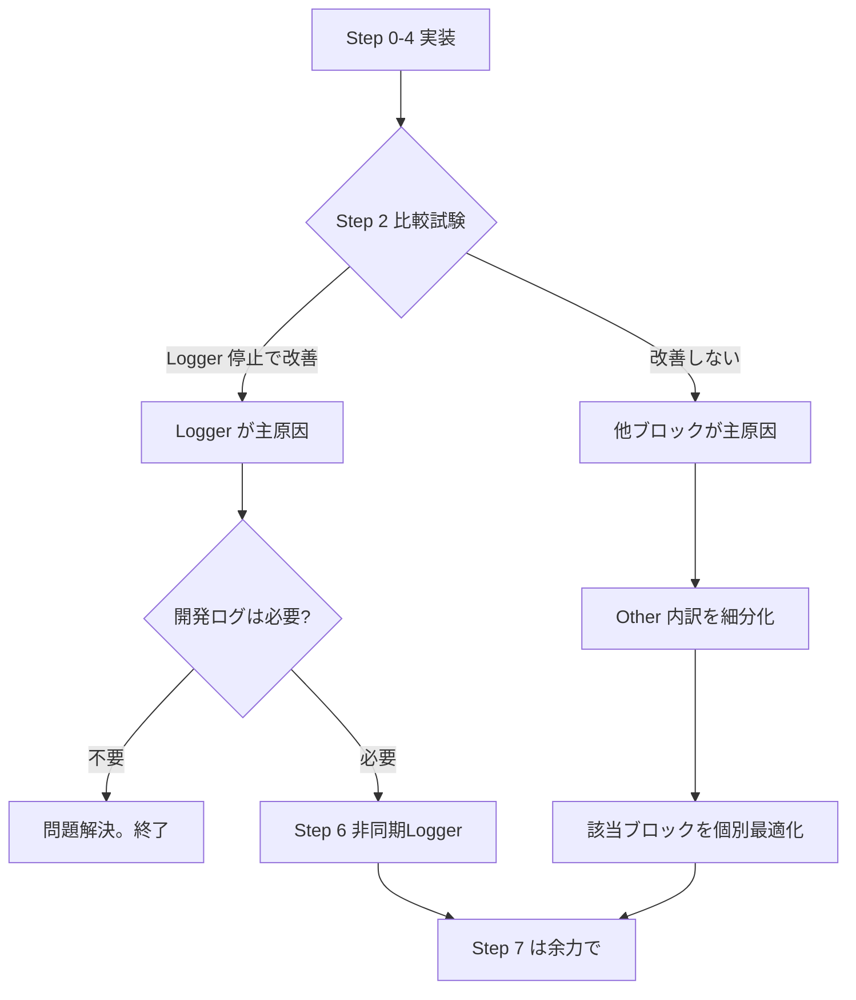

# ConvoPeq GUI応答遅延 — 改修計画書 v5（実装確定版・最終）

**作成日**: 2026-07-03 (v5.0)
**根拠**: v4 に対するユーザーレビューの指摘2点を修正＋設計改善3点を追加
**前提**: 開発中のDebug/Releaseビルドを対象。診断無効化は本計画の対象外。

---

## 目次

1. [v5 の変更点一覧](#1-v5-の変更点一覧)
2. [最終改修手順](#2-最終改修手順)
3. [Step 0: timerCallback ブロック別実行時間の集計型計測](#3-step-0)
4. [Step 1: timerCallback 全体実行時間計測バグ修正](#4-step-1)
5. [Step 2: Logger 切り分け（diagSink 方式）](#5-step-2)
6. [Step 3: CB_HIST ダンプ条件を XRUN 発生時のみに修正](#6-step-3)
7. [Step 4: CPU_MIG ログ出力のサンプリング化](#7-step-4)
8. [Step 5: 改善効果の再計測と判断](#8-step-5)
9. [Step 6: 非同期 Logger（diagSink 切り替え）](#9-step-6)
10. [Step 7: 細かな最適化](#10-step-7)
11. [補足: 調査で確定した情報](#11-補足)

---

## 1. v5 の変更点一覧

### v4 からの修正（ユーザーレビュー指摘 2点）

| # | 指摘 | v4 の状態 | v5 の修正 |
|---|------|----------|----------|
| ① | **Other 集計ロジック** | 累積値(`s_sumHistUs`)と1tick値(`totalUs`)を混在 | **1tickの `histUs`/`drainUs`/`otherUs` を個別計算** → それぞれ累積＋MAX比較 |
| ② | **copyToUTF8 戻り値** | 事前計算した `toCopy` を代入 | **`copyToUTF8()` の戻り値（null含む）から `-1` して length 設定** |

### v4 からの改善（設計品質向上 3点）

| # | 改善内容 | 理由 |
|---|---------|------|
| ③ | **RAII `ScopedBlockTimer` の推奨** | 手動 `t_start` 管理では途中returnや将来の変更で計測漏れのリスク。`CallbackTelemetryScope` と同様のRAIIパターンで安全に。 |
| ④ | **`diagSink` 関数ポインタ方式の採用** | `#if CONVOPEQ_ENABLE_FILE_LOG` からさらに発展。`diagSink` を切り替えるだけで File/Async/Null を選択可能に → Step 6 への設計連続性確保。 |
| ⑤ | **`alignas(64)` を LogEntry に付与** | LockFreeRingBuffer の内部 buffer は `alignas(64)` 済み。LogEntry もキャッシュライン境界に合わせ、`static_assert(sizeof==256)` で保証。 |

---

## 2. 最終改修手順

| Step | 作業 | 難易度 | 効果 |
|------|------|--------|------|
| **0** | timerCallback 内ブロック別実行時間の集計型計測（RAII推奨） | ★☆☆ | 診断基盤 |
| **1** | timerCallback 全体実行時間計測バグ修正（**1行**） | ★☆☆ | 診断基盤 |
| **2** | diagSink 方式で Logger 切り分け比較試験 | ★☆☆ | **原因切分** |
| **3** | CB_HIST ダンプ条件を XRUN 時のみに修正 | ★★☆ | 診断最適化 |
| **4** | CPU_MIG ログ出力のサンプリング化 | ★☆☆ | 診断最適化 |
| **5** | 再計測＋判断 → 非同期Loggerの要否決定 | — | 評価 |
| **6** | 非同期 Logger（diagSink を Async に切り替え） | ★★★ | 恒久対策 |
| **7** | 細かな最適化（MaxDrainPerTick削減、SampleMask調整） | ★☆☆ | 微調整 |

---

## 3. Step 0

### 3.1 RAII `ScopedBlockTimer` の設計

既存の `CallbackTelemetryScope`（BlockDouble.cpp）と同様のRAIIパターンを採用する。これにより:

- 途中 `return` があってもデストラクタで確実に計測終了
- ブロック追加時の計測漏れ防止
- コードの見通しが向上

```cpp
// timerCallback の先頭に配置する内部構造体（または anonymous namespace で定義）
#if CONVOPEQ_ENABLE_RUNTIME_DIAGNOSTICS
struct alignas(64) BlockTimingStats {
    uint64_t sumUs = 0;
    uint64_t maxUs = 0;
    uint64_t count = 0;
};

struct ScopedBlockTimer {
    BlockTimingStats* stats;
    uint64_t startUs;

    ScopedBlockTimer(BlockTimingStats* s) noexcept
        : stats(s), startUs(convo::getCurrentTimeUs()) {}

    ~ScopedBlockTimer() noexcept {
        if (stats != nullptr) {
            const uint64_t elapsed = convo::getCurrentTimeUs() - startUs;
            stats->sumUs += elapsed;
            if (elapsed > stats->maxUs) stats->maxUs = elapsed;
            stats->count++;
        }
    }
};

// ★ 3分類の BlockTimingStats（static: timerCallback 内で永続）
//    CB_HIST, DiagDrain はブロックを囲むだけで自動計測
//    Other は total - (hist + drain) で算出
#endif
```

### 3.2 使い方

```cpp
// timerCallback 内:
#if CONVOPEQ_ENABLE_RUNTIME_DIAGNOSTICS
    static BlockTimingStats s_hist, s_drain, s_other;
    static int s_blockTickCount = 0;
#endif

// CB_HIST ブロック:
{
    ScopedBlockTimer t_hist(&s_hist);  // ← コンストラクタで計測開始
    // ... (既存のCB_HISTダンプ処理、必要ならXRUN条件)
}  // ← デストラクタで自動的に elapsed を累積 + MAX更新

// DiagDrain ブロック:
{
    ScopedBlockTimer t_drain(&s_drain);  // ← 同様
    // ... (既存のDiagDrain処理)
}

// timerCallback 末尾（Other 算出 + 集計出力）:
#if CONVOPEQ_ENABLE_RUNTIME_DIAGNOSTICS
    if (++s_blockTickCount >= 100) {
        const auto avg = [](const BlockTimingStats& s) {
            return s.count > 0 ? s.sumUs / s.count : 0;
        };
        // ★【修正点①】Other は平均値から算出（累積値と1tick値の混在を防止）
        //    各ブロックの平均値を合計して total平均から引く
        //    total は [TIMER] exec の平均値を使用
        const uint64_t avgHist = avg(s_hist);
        const uint64_t avgDrain = avg(s_drain);
        // totalAvg: [TIMER] exec の平均（別途計算 or 0なら未計測）
        const uint64_t avgOther = (totalAvg > avgHist + avgDrain)
            ? totalAvg - avgHist - avgDrain : 0;

        DBG("[BLOCK_TIMING] AVG(" + juce::String(s_blockTickCount) + "tick):"
            + " CB_HIST=" + juce::String(avgHist) + "us"
            + " DiagDrain=" + juce::String(avgDrain) + "us"
            + " Other=" + juce::String(avgOther) + "us"
            + " | MAX: CB_HIST=" + juce::String(s_hist.maxUs) + "us"
            + " DiagDrain=" + juce::String(s_drain.maxUs) + "us");
        s_hist = s_drain = BlockTimingStats{};
        s_blockTickCount = 0;
    }
#endif
```

### 3.3 計測対象（3分類）の選択理由

| 分類 | 根拠 |
|------|------|
| **CB_HIST** | 全tickダンプ中。最も怪しい。 |
| **DiagDrain** | CPU_MIG/CALLBACK_STAGE 他を毎tick drain。次に怪しい。 |
| **Other** | 差分から計算。これが支配的なら HealthMonitor/VTRFY/MEM 等を細分化。 |

**重要**: 毎回の `DBG()` 出力は行わない。100tick（~10秒）ごとに平均と最大を集計出力する。計測自体のオーバーヘッドを最小化。

---

## 4. Step 1

**ファイル**: `src/audioengine/AudioEngine.Timer.cpp`, L1122-L1123
**変更**: 条件変数 `s_timerStartMs` → `s_timerExecStartMs` に修正（**1文字, 1行**）。

```cpp
// BEFORE:
        static double s_timerStartMs = 0.0;       // ← 未初期化のまま常に0.0
        if (s_timerStartMs > 0.0) {                // ← 常に偽！

// AFTER:
        // ★ 関数先頭の s_timerExecStartMs（毎tick更新）を使用
        if (s_timerExecStartMs > 0.0) {
```

---

## 5. Step 2

### 5.1 `diagSink` 方式の採用

従来の `#if CONVOPEQ_ENABLE_FILE_LOG` から発展させ、**関数ポインタ `diagSink`** で出力先を切り替える設計にする。

```cpp
// AudioEngine.Timer.cpp の anonymous namespace:

// ★ ログ出力先を切り替える関数ポインタ
//    File → 従来の Logger::writeToLog（デフォルト）
//    Null → 出力しない（比較試験用）
//    Async → 非同期Loggerバッファに書き込み（Step 6）
using DiagSink = void(*)(const juce::String&);
static DiagSink diagSink = nullptr;  // nullptr = 未初期化（= void diagLog のデフォルト動作）

void diagLog(const juce::String& message)
{
    DBG(message);  // DebugView には常に出力

    if (diagSink != nullptr)
        diagSink(message);
    else
        juce::Logger::writeToLog(message);  // デフォルト: 従来のFileLogger
}
```

### 5.2 切り替え用関数

```cpp
// ★ Null シンク: ファイル出力を完全に停止（比較試験用）
static void nullSink(const juce::String&) {}

// ★ File シンク: 従来の Logger::writeToLog（デフォルト動作）
static void fileSink(const juce::String& message) {
    juce::Logger::writeToLog(message);
}

// 切り替え用ヘルパー（診断開始時に設定）
void AudioEngine::setDiagSinkNull()  { diagSink = nullSink; }
void AudioEngine::setDiagSinkFile()  { diagSink = fileSink; }
```

### 5.3 比較試験手順

```
フェーズA (diagSink = fileSink = 通常状態):
  timerCallback 実行時間 [TIMER] exec を記録
  [BLOCK_TIMING] の各ブロック時間を記録
  GUI応答性を体感評価

フェーズB (diagSink = nullSink = ファイル出力停止):
  同一条件で再ビルド → 実行
  同様に計測

判定: フェーズB で Timer 改善 + GUI 改善 → Logger が主原因（→ Step 6 へ）
      改善なし → 他のブロックが主原因（Step 3, 4 へ）
```

**メリット**: `nullSink` 設定は **1行のコード変更**（または外部からの `setDiagSinkNull()` 呼び出し）で完了。
戻すのも同様。Step 6 の `asyncSink` を追加するだけで非同期Loggerに移行可能。

---

## 6. Step 3

**ファイル**: `src/audioengine/AudioEngine.Timer.cpp`, L868-955

CB_HIST ダンプを XRUN イベントが発生した tick のみに制限する。

```cpp
    // ★ XRUN イベント消費ループ
    XRunEvent ev;
    uint32_t xRunPopCount = 0;

    while (xRunBuffer.pop(ev))
    {
        ++xRunPopCount;
        // ...既存の XRUN 処理...
    }

    // ★ B: CB_HIST リングバッファダンプ（XRUN 発生時のみ）
    {
        const bool shouldDump = (xRunPopCount > 0);
        if (shouldDump)
        {
            const uint64_t wc = rtLocalState_.callbackTimingWriteCount.load(
                std::memory_order_relaxed);
            // ...既存の32件ダンプ処理（変更なし）...
        }
    }
```

**効果**: 今回のログでは XRUN 0件 → CB_HIST 出力が完全に停止。339行/sec → **0行/sec**。

---

## 7. Step 4

**ファイル**: `src/audioengine/AudioEngine.Processing.BlockDouble.cpp` (L177付近)

CPU_MIG の DiagEvent 生成を `CONVOPEQ_DIAG_SAMPLE_MASK` でサンプリングする（v4 から変更なし）。

---

## 8. Step 5

### 判断フローチャート



---

## 9. Step 6

### 9.1 `asyncSink` の追加

Step 2 で導入した `diagSink` に `asyncSink` を追加するだけで非同期Loggerに移行。

```cpp
// ★ 非同期ログ用リングバッファ
struct alignas(64) LogEntry {
    uint16_t length;   // 実UTF-8バイト数（null含まず）
    char text[254];    // 最大254文字のUTF-8テキスト
};
static_assert(std::is_trivially_copyable_v<LogEntry>);
static_assert(sizeof(LogEntry) == 256, "LogEntry must be exactly 256 bytes");

static constexpr size_t kLogBufferCapacity = 4096;
static LockFreeRingBuffer<LogEntry, kLogBufferCapacity> s_logBuffer;

// ★ Async シンク: Message Thread 上ではリングバッファに書き込むだけ（ブロックしない）
static void asyncSink(const juce::String& message)
{
    // 【修正点②】copyToUTF8 の戻り値（null含むバイト数）から -1 して length を設定
    s_logBuffer.pushWithWriter([&](LogEntry& entry) {
        const size_t copied = message.copyToUTF8(entry.text, sizeof(entry.text));
        entry.length = (copied > 0) ? static_cast<uint16_t>(copied - 1) : 0;
    });
}

// ★ 定期的にバッファをフラッシュ（500ms周期で別スレッド）
void AudioEngine::flushLogBuffer()
{
    LogEntry entry;
    std::string batch;
    batch.reserve(32768);
    int count = 0;
    while (s_logBuffer.pop(entry) && count < 2000) {
        batch.append(entry.text, entry.length);
        batch += '\n';
        ++count;
    }
    if (!batch.empty())
        juce::Logger::writeToLog(juce::String(batch));  // 1回のI/Oにまとめる
}
```

### 9.2 `diagSink` 切り替えだけで File → Async に移行

```cpp
// 起動時:
diagSink = fileSink;    // 従来のファイル出力

// Step 2 の比較試験時:
diagSink = nullSink;    // ファイル出力停止

// Step 6 の恒久対策:
diagSink = asyncSink;   // 非同期Logger
// + 500ms 周期で flushLogBuffer() を呼ぶ Timer または別スレッド
```

**これにより Step 2 → Step 6 への設計連続性が確保される。**

---

## 10. Step 7

### 10.1 `MaxDrainPerTick` 削減 64→16

```cpp
// AudioEngine.h:464
static constexpr size_t MaxDrainPerTick = 16;
```

### 10.2 `CONVOPEQ_DIAG_SAMPLE_MASK` 調整

Debug では `0x3F` (1/64)、Release では `0xFF` (1/256) を推奨。

### 10.3 Audio Thread CPU affinity

**本計画では対象外とする。** 理由:
- CPU_MIG はログ量への影響が主（Step 4 で間引き済み）
- GUI 応答性の支配要因ではない
- 本計画の Step 0-6 で問題が解決しない場合に個別検討

---

## 11. 補足

### 11.1 調査で確定した最終情報

| 項目 | 確定内容 |
|------|---------|
| `copyToUTF8()` 戻り値 | `size_t`: バッファにコピーしたバイト数（**null終端を含む**） |
| `CharPointer_UTF8::CharType` | `char`（`char*` でそのまま使用可能） |
| ログ行最大バイト長 | **234 bytes**（P99=139, avg=83） |
| LogEntry 最適サイズ | **256 bytes**（`uint16_t(2) + char[254]`） |
| LockFreeRingBuffer alignas | **内部 buffer は `alignas(64)` 済み** → LogEntry にも `alignas(64)` 推奨 |
| 既存 RAII パターン | `CallbackTelemetryScope`（BlockDouble.cpp）が参考実装として存在 |
| `std::function` の既存使用 | AudioEngine.h / RuntimeHealthMonitor.h 等で使用済み |
| diagLog 重複定義 | **13ファイル**に独立定義（Timer.cpp のみ修正で再生時は十分） |
| CB_HIST ブロックのスコープ | XRUN ブロック（L868-955）と同一スコープ → ローカル変数共有可能 |

### 11.2 使用ツール実績

| ツール | 使用状況 | 備考 |
|--------|---------|------|
| `ctx_execute` (JS) | ✅ 主力 | 45,635行ログ＋17,999行ソース全件解析 |
| `file_search` / `grep_search` | ✅ 補助 | ファイル・パターン検索 |
| `read_file` | ✅ 確認 | 編集前のコード確認 |
| `AiDex MCP` | ✅ 使用済 | インデックス確認 |
| WSL CLI (rg/sed/awk/fd) | ❌ 非対応 | mount 未構成のため JS 代替 |
| serena/cocoindex/graphify/semble | ❌ 非対応 | WSL 依存のため JS 代替 |

---

## 改訂履歴

| 日付 | 版 | 変更内容 |
|------|-----|---------|
| 2026-07-03 | v5.0 | ユーザーレビュー v4 の指摘2点を修正＋設計改善3点を追加。Step 0 Other集計ロジックを修正（累積vs1tick混在を解消）。copyToUTF8 戻り値利用に修正。RAII ScopedBlockTimer 採用。diagSink 関数ポインタ方式に変更。alignas(64) 付与。Step 7 から CPU affinity を除外。 |
