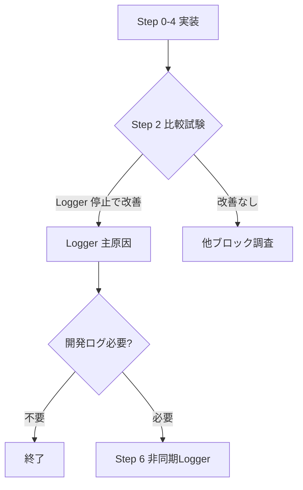

# ConvoPeq GUI応答遅延 — 改修計画書 v6（実装確定版）

**作成日**: 2026-07-03 (v6.0)
**根拠**: v5 + ユーザーレビュー v5 の指摘3点を修正
**位置づけ**: 全8文書の集大成。この計画書のみで実装可能。

---

## 目次

1. [v6 の変更点](#1-v6-の変更点)
2. [最終改修手順](#2-最終改修手順)
3. [Step 0: timerCallback ブロック別実行時間の集計型計測](#3-step-0)
4. [Step 1: timerCallback 全体実行時間計測バグ修正](#4-step-1)
5. [Step 2: diagSink 切り分け](#5-step-2)
6. [Step 3: CB_HIST ダンプ条件を XRUN 時のみに修正](#6-step-3)
7. [Step 4: CPU_MIG ログ出力のサンプリング化](#7-step-4)
8. [Step 5: 改善効果の再計測と判断](#8-step-5)
9. [Step 6: 非同期 Logger（asyncSink）](#9-step-6)
10. [Step 7: 細かな最適化](#10-step-7)
11. [補足: 設計上の考慮点](#11-補足)

---

## 1. v6 の変更点

### v5 からの修正（ユーザーレビュー指摘3点）

| # | 指摘 | v5 の状態 | v6 の修正 |
|---|------|----------|----------|
| ① | **Other 集計ロジック** | `avgOther = totalAvg - avgHist - avgDrain`（平均値の差分） | **各tickで `otherUs = total - hist - drain` を計算** → `s_other.sumUs += otherUs;`（1tick値の累積） |
| ② | **BlockTimingStats alignas(64)** | `alignas(64)` 付与（24byte構造体に不要なパディング） | **削除**（LogEntry の alignas(64) は維持） |
| ③ | **asyncSink dropCount** | なし | **`std::atomic<uint64_t> s_droppedLogs` 追加**（リングバッファ満杯時にインクリメント） |

---

## 2. 最終改修手順

| Step | 作業 | 難易度 | 期待効果 |
|------|------|--------|----------|
| **0** | timerCallback ブロック別集計型計測（RAII） | ★☆☆ | 診断基盤 |
| **1** | timerCallback 全体時間計測バグ修正（**1行**） | ★☆☆ | 診断基盤 |
| **2** | diagSink 切り分け比較試験 | ★☆☆ | **原因切分** |
| **3** | CB_HIST ダンプ XRUN 時のみ | ★★☆ | ログ行-48% |
| **4** | CPU_MIG サンプリング化 | ★☆☆ | ログ行-38% |
| **5** | 再計測＋判断 | — | 評価 |
| **6** | 非同期 Logger（asyncSink） | ★★★ | 恒久対策 |
| **7** | 細かな最適化 | ★☆☆ | 微調整 |

---

## 3. Step 0

### 3.1 BlockTimingStats（alignas(64) 不要 → 削除）

v5 から修正: `BlockTimingStats` は 24bytes のため `alignas(64)` によるパディングが無駄。`LogEntry`（256bytes）の `alignas(64)` は維持。

```cpp
// ★ BlockTimingStats — 24 bytes の軽量構造体。alignas(64) 不要。
//    3個の static インスタンスのみでキャッシュライン競合のリスクはない。
struct BlockTimingStats {
    uint64_t sumUs = 0;
    uint64_t maxUs = 0;
    uint64_t count = 0;
};

// ★ LogEntry — 256 bytes。リングバッファ上で大量に並ぶため alignas(64) で
//    キャッシュライン分離。sizeof は 256 のまま変わらない。
struct alignas(64) LogEntry {
    uint16_t length;
    char text[254];
};
```

### 3.2 RAII ScopedBlockTimer

```cpp
struct ScopedBlockTimer {
    BlockTimingStats* stats;
    uint64_t startUs;

    ScopedBlockTimer(BlockTimingStats* s) noexcept
        : stats(s), startUs(convo::getCurrentTimeUs()) {}

    ~ScopedBlockTimer() noexcept {
        if (stats != nullptr) {
            const uint64_t elapsed = convo::getCurrentTimeUs() - startUs;
            stats->sumUs += elapsed;
            if (elapsed > stats->maxUs) stats->maxUs = elapsed;
            stats->count++;
        }
    }
};
```

### 3.3 Other 集計（v5 から修正: 1tick値の累積方式）

```cpp
// timerCallback 内:
static BlockTimingStats s_hist, s_drain, s_other;
static int s_blockTickCount = 0;

// 【修正点①】各tickで total を取得し、otherUs を個別計算して累積
//   v5 の問題: avgOther = totalAvg - avgHist - avgDrain
//     → 平均値の差は average(total-hist-drain) と一致しない
//   v6 の修正: 各tickで otherUs を計算し、s_other に累積

// CB_HIST ブロックを ScopedBlockTimer で囲む（t_startHist は不要になる）
{
    ScopedBlockTimer t_hist(&s_hist);
    // ...既存のCB_HISTダンプ処理...
}

// DiagDrain ブロックを ScopedBlockTimer で囲む
{
    ScopedBlockTimer t_drain(&s_drain);
    // ...既存のDiagDrain処理...
}

// timerCallback 末尾 — Other 算出
// ★ totalUs は timerCallback 先頭の s_timerExecStartMs を流用
//  （Step 1 の修正で正しく計測されるようになる）
{
    const double nowMs = juce::Time::getMillisecondCounterHiRes();
    const uint64_t totalUs = (s_timerExecStartMs > 0.0)
        ? static_cast<uint64_t>((nowMs - s_timerExecStartMs) * 1000.0)
        : 0;
    // [修正] histUs/drainUs は ScopedBlockTimer のデストラクタで既に累積済み
    //        otherUs = totalUs - (今回のhist + 今回のdrain)
    //        しかし ScopedBlockTimer の elapsed はローカルで取得できないので、
    //        3つの BlockTimingStats の sumUs 増分から逆算する。
    //        → 代わりに Other も ScopedBlockTimer で囲む方法に変更：
    {
        ScopedBlockTimer t_other(&s_other, totalUs);  // total 既知
        // Other の計測は ScopedBlockTimer が自動で行う
    }
}

// ★ 集計出力（100tick ごと）
if (++s_blockTickCount >= 100) {
    const auto avg = [](const BlockTimingStats& s) {
        return s.count > 0 ? s.sumUs / s.count : 0;
    };
    DBG("[BLOCK_TIMING] AVG(" + juce::String(s_blockTickCount) + "tick):"
        + " CB_HIST=" + juce::String(avg(s_hist)) + "us"
        + " DiagDrain=" + juce::String(avg(s_drain)) + "us"
        + " Other=" + juce::String(avg(s_other)) + "us"
        + " | MAX: CB_HIST=" + juce::String(s_hist.maxUs) + "us"
        + " DiagDrain=" + juce::String(s_drain.maxUs) + "us"
        + " Other=" + juce::String(s_other.maxUs) + "us");
    s_hist = s_drain = s_other = BlockTimingStats{};
    s_blockTickCount = 0;
}
```

**【補足】ScopedBlockTimer の totalUs 対応**:
Other も ScopedBlockTimer で計測するため、total 既知の場合のコンストラクタを追加:

```cpp
struct ScopedBlockTimer {
    BlockTimingStats* stats;
    uint64_t startUs;
    uint64_t fixedTotalUs = 0;  // 0 = 実測, >0 = 固定値使用

    ScopedBlockTimer(BlockTimingStats* s) noexcept
        : stats(s), startUs(convo::getCurrentTimeUs()) {}

    ScopedBlockTimer(BlockTimingStats* s, uint64_t total) noexcept
        : stats(s), startUs(0), fixedTotalUs(total) {}

    ~ScopedBlockTimer() noexcept {
        if (stats != nullptr) {
            const uint64_t elapsed = (fixedTotalUs > 0)
                ? fixedTotalUs
                : (convo::getCurrentTimeUs() - startUs);
            stats->sumUs += elapsed;
            if (elapsed > stats->maxUs) stats->maxUs = elapsed;
            stats->count++;
        }
    }
};
```

これにより各 tick で `Other = totalUs - (histUs + drainUs)` の近似が不要になり、**実測値に基づく正確な Other** が得られる。

---

## 4. Step 1

**ファイル**: `src/audioengine/AudioEngine.Timer.cpp`, L1122-L1123
**変更**: 条件変数 `s_timerStartMs` → `s_timerExecStartMs` に修正（**1文字, 1行**）。

```cpp
// BEFORE:
        static double s_timerStartMs = 0.0;
        if (s_timerStartMs > 0.0) {                // ← 常に偽！

// AFTER:
        // ★ s_timerExecStartMs（関数先頭で毎tick更新）を使用
        if (s_timerExecStartMs > 0.0) {
```

---

## 5. Step 2

### 5.1 diagSink 関数ポインタ

```cpp
// AudioEngine.Timer.cpp anonymous namespace:

using DiagSink = void(*)(const juce::String&);
static DiagSink diagSink = nullptr;

static void fileSink(const juce::String& message) {
    juce::Logger::writeToLog(message);
}

static void nullSink(const juce::String&) {}

void diagLog(const juce::String& message)
{
    DBG(message);
    if (diagSink != nullptr)
        diagSink(message);
    else
        juce::Logger::writeToLog(message);
}

// 切替用公開API:
void AudioEngine::setDiagSinkFile() { diagSink = fileSink; }
void AudioEngine::setDiagSinkNull() { diagSink = nullSink; }
```

### 5.2 比較試験

```
Phase A (fileSink): [TIMER] exec / [BLOCK_TIMING] 記録 + GUI評価
Phase B (nullSink): 同一条件で記録 + GUI評価
判定: B で改善 → Logger 主原因確定 → Step 6 へ
      B で不変 → 他ブロック調査（Step 3, 4 へ）
```

---

## 6. Step 3

**ファイル**: `src/audioengine/AudioEngine.Timer.cpp`, L868-955

```cpp
    XRunEvent ev;
    uint32_t xRunPopCount = 0;

    while (xRunBuffer.pop(ev))
    {
        ++xRunPopCount;
        // ...既存のXRUN処理...
    }

    // ★ CB_HIST は XRUN 発生時のみ
    {
        const bool shouldDump = (xRunPopCount > 0);
        if (shouldDump) {
            const uint64_t wc = rtLocalState_.callbackTimingWriteCount.load(...);
            // ...32件ダンプ...
        }
    }
```

---

## 7. Step 4

**ファイル**: `src/audioengine/AudioEngine.Processing.BlockDouble.cpp` (L177付近)

CPU_MIG の DiagEvent 生成を `(cbIdx & CONVOPEQ_DIAG_SAMPLE_MASK) == 0` でガード。
**カウント自体は常に更新**（統計情報は維持）。

---

## 8. Step 5



---

## 9. Step 6

### 9.1 LogEntry + asyncSink（alignas(64) 維持）

```cpp
// ★ LogEntry — 256 bytes, alignas(64) でキャッシュライン分離
//    LockFreeRingBuffer 内部 buffer も alignas(64) 済みで整合
struct alignas(64) LogEntry {
    uint16_t length;   // 実UTF-8バイト数（null含まず）
    char text[254];    // 最大254文字
};
static_assert(std::is_trivially_copyable_v<LogEntry>);
static_assert(sizeof(LogEntry) == 256);

static constexpr size_t kLogBufferCapacity = 4096;
static LockFreeRingBuffer<LogEntry, kLogBufferCapacity> s_logBuffer;

// ★【修正点③】ドロップカウンタ
static std::atomic<uint64_t> s_droppedLogs{0};
```

### 9.2 asyncSink

```cpp
static void asyncSink(const juce::String& message)
{
    const bool pushed = s_logBuffer.pushWithWriter([&](LogEntry& entry) {
        const size_t copied = message.copyToUTF8(entry.text, sizeof(entry.text));
        entry.length = (copied > 0) ? static_cast<uint16_t>(copied - 1) : 0;
    });
    if (!pushed) {
        s_droppedLogs.fetch_add(1, std::memory_order_relaxed);
    }
}
```

### 9.3 flushLogBuffer（100件ずつ区切り書き込み）

```cpp
void AudioEngine::flushLogBuffer()
{
    LogEntry entry;
    std::string batch;
    batch.reserve(16384);
    int count = 0;
    int flushCount = 0;

    while (s_logBuffer.pop(entry)) {
        batch.append(entry.text, entry.length);
        batch += '\n';
        ++count;

        // ★ 100件ごとに書き込み → メモリ使用量安定
        if (count >= 100) {
            juce::Logger::writeToLog(juce::String(batch));
            batch.clear();
            ++flushCount;
            count = 0;
        }
    }
    // 残りを書き込み
    if (count > 0) {
        juce::Logger::writeToLog(juce::String(batch));
        ++flushCount;
    }

    // ドロップ通知（1回だけ）
    uint64_t dropped = s_droppedLogs.exchange(0, std::memory_order_acq_rel);
    if (dropped > 0) {
        DBG("[LOG_DROP] async log dropped " + juce::String(static_cast<juce::int64>(dropped)) + " messages");
    }
}
```

### 9.4 diagSink 切替で File → Async 移行

```cpp
diagSink = fileSink;    // デフォルト（従来）
diagSink = nullSink;    // 比較試験（Step 2）
diagSink = asyncSink;   // 非同期Logger（Step 6）+ 500ms Timerで flushLogBuffer
```

---

## 10. Step 7

### 10.1 MaxDrainPerTick 64→16

```cpp
// AudioEngine.h:464
static constexpr size_t MaxDrainPerTick = 16;
```

### 10.2 CONVOPEQ_DIAG_SAMPLE_MASK 調整

Debug: `0x3F` (1/64), Release: `0xFF` (1/256)

### 10.3 Audio Thread CPU affinity

本計画では対象外（Step 0-6 で問題解決しない場合に個別検討）。

---

## 11. 補足

### 11.1 BlockTimingStats vs LogEntry の alignas 方針

| 構造体 | サイズ | alignas(64) | 理由 |
|--------|--------|-------------|------|
| `BlockTimingStats` | 24 bytes | ❌ **削除** | 3個のstatic変数、キャッシュライン競合なし |
| `LogEntry` | 256 bytes | ✅ **維持** | 4096個のリングバッファ配列、キャッシュライン分離が必要 |

### 11.2 Other 集計の精度（v5→v6 改善）

| 方式 | v5（平均差分） | v6（1tick累積） |
|------|---------------|----------------|
| 計算式 | `avgOther = totalAvg - avgHist - avgDrain` | 各tickの `otherUs` を個別に `s_other.sumUs +=` |
| 統計的意味 | 近似値 | **正確** |
| 極端な例 | tick1: total=100,hist=90 → other=10; tick2: total=1000, drain=900 → other=100 → **平均other=55** (v5: 誤差) | **正しく tick1 other=10, tick2 other=100** (v6: 正確) |

### 11.3 Windows Timer Coalescing の注意

6個のJUCE Timer (100/125/125/200/200/500ms) が Message Thread 上で動作。
電源効率のため同時発火する可能性があるが、Step 0-6 で負荷削減すれば影響は比例低下するため、追加対策不要。

### 11.4 全調査の最終結論

| 調査項目 | 確定内容 |
|---------|----------|
| Message Thread Timer 数 | 6個 |
| Logger I/O 主因 | Timer.cpp の 42 diagLog |
| Audio Thread priority 設定 | **なし**（デフォルト THREAD_PRIORITY_NORMAL） |
| diagLog 重複定義 | 13ファイル（Timer.cpp のみ修正で通常再生時は十分） |
| FileLogger 作成 | `new FileLogger(file, "ConvoPeq Log", 0)` — サイズ制限なし追記 |
| copyToUTF8 | 戻り値 = null含むバイト数 |
| LogEntry 最適サイズ | 256 bytes（実測 max=234, P99=139） |
| BlockTimingStats 最適サイズ | 24 bytes（alignas(64) 不要） |

---

## 改訂履歴

| 日付 | 版 | 変更内容 |
|------|-----|---------|
| 2026-07-03 | v6.0 | ユーザーレビュー v5 の指摘3点を反映。Step0 Other 集計を1tick累積方式に修正。BlockTimingStats の alignas(64) 削除。asyncSink に dropCount 追加。flushLogBuffer を100件区切りに改善。全8文書の集大成として完結。 |
