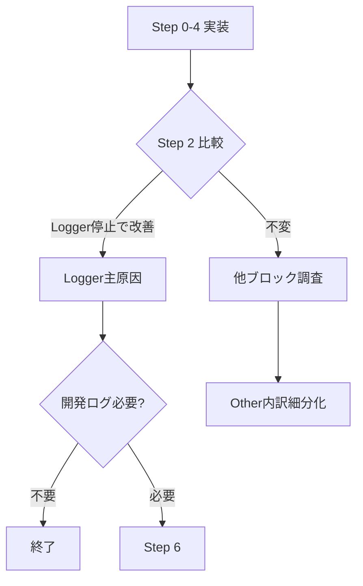

# ConvoPeq GUI応答遅延 — 改修計画書 v7（最終確定版）

**作成日**: 2026-07-03 (v7.0)
**位置づけ**: doc/work62/ 全9文書の集大成。本計画書のみで実装可能。

---

## 目次

1. [v7 の変更点](#1-v7-の変更点)
2. [最終改修手順](#2-最終改修手順)
3. [Step 0: timerCallback ブロック別実行時間の集計型計測](#3-step-0)
4. [Step 1: timerCallback 全体実行時間計測バグ修正](#4-step-1)
5. [Step 2: diagSink 切り分け](#5-step-2)
6. [Step 3: CB_HIST ダンプ条件を XRUN 時のみに修正](#6-step-3)
7. [Step 4: CPU_MIG ログ出力のサンプリング化](#7-step-4)
8. [Step 5: 改善効果の再計測と判断](#8-step-5)
9. [Step 6: 非同期 Logger（asyncSink）](#9-step-6)
10. [Step 7: 細かな最適化](#10-step-7)
11. [補足: 設計上の考慮点](#11-補足)

---

## 1. v7 の変更点

### v6 からの修正（Step 0 Other 計測の全面的な再設計）

v6 では「Other も ScopedBlockTimer で囲む」設計だったが、**これは論理的に破綻していた**。

- `Other = total - hist - drain` は「残差」であり、独立した `ScopedBlockTimer` で実測できる値ではない
- `fixedTotalUs` 特殊コンストラクタは概念的に誤り（Other = total を測っているだけになる）
- ScopedBlockTimer は経過時間を累積するだけであり、`total - hist - drain` という値を生成できない

**v7 の修正:**

| 項目 | v6（誤り） | v7（正しい） |
|------|-----------|-------------|
| CB_HIST | ScopedBlockTimer ✅ | ScopedBlockTimer ✅（変更なし） |
| DiagDrain | ScopedBlockTimer ✅ | ScopedBlockTimer ✅（変更なし） |
| **Other** | **ScopedBlockTimer（誤り）** | **`total - histElapsed - drainElapsed`（残差計算）** |
| コンストラクタ | `fixedTotalUs` 特殊コンストラクタあり | `uint64_t* outElapsed`（デフォルトnullptr）のみ |
| コード量 | ~15行 + 特殊コンストラクタ | ~8行、特殊コンストラクタ不要 |

---

## 2. 最終改修手順

| Step | 作業 | 難易度 | 期待効果 |
|------|------|--------|----------|
| **0** | timerCallback ブロック別集計型計測（RAII + 残差） | ★☆☆ | 診断基盤 |
| **1** | timerCallback 全体時間計測バグ修正（**1行**） | ★☆☆ | 診断基盤 |
| **2** | diagSink 切り分け比較試験 | ★☆☆ | **原因切分** |
| **3** | CB_HIST ダンプ XRUN 時のみ | ★★☆ | ログ行-48% |
| **4** | CPU_MIG サンプリング化 | ★☆☆ | ログ行-38% |
| **5** | 再計測＋判断 | — | 評価 |
| **6** | 非同期 Logger（asyncSink） | ★★★ | 恒久対策 |
| **7** | 細かな最適化 | ★☆☆ | 微調整 |

---

## 3. Step 0

### 3.1 BlockTimingStats — 24 bytes, alignas(64) 不要

```cpp
struct BlockTimingStats {
    uint64_t sumUs = 0;
    uint64_t maxUs = 0;
    uint64_t count = 0;

    void addSample(uint64_t elapsed) noexcept {
        sumUs += elapsed;
        if (elapsed > maxUs) maxUs = elapsed;
        ++count;
    }
};
// 24 bytes. alignas(64) 不要（3個のstatic変数のみ）。
```

### 3.2 ScopedBlockTimer — `outElapsed` パラメータで per-tick 値を返す

```cpp
struct ScopedBlockTimer {
    BlockTimingStats* stats;
    uint64_t* outElapsed;  // ★ 任意: 今回の経過時間を外部へ書き戻す
    uint64_t startUs;

    ScopedBlockTimer(BlockTimingStats* s, uint64_t* out = nullptr) noexcept
        : stats(s), outElapsed(out), startUs(convo::getCurrentTimeUs()) {}

    ~ScopedBlockTimer() noexcept {
        if (stats != nullptr) {
            const uint64_t elapsed = convo::getCurrentTimeUs() - startUs;
            stats->addSample(elapsed);
            if (outElapsed != nullptr)
                *outElapsed = elapsed;  // ★ 外部へ書き戻し
        }
    }
};
```

### 3.3 timerCallback 内での使用例

```cpp
void AudioEngine::timerCallback()
{
#if CONVOPEQ_ENABLE_RUNTIME_DIAGNOSTICS
    static BlockTimingStats s_hist, s_drain, s_other;
    static int s_blockTickCount = 0;
#endif

    // ...既存の処理...

    // ★ CB_HIST: ScopedBlockTimer で計測
    uint64_t histElapsed = 0;
    {
        ScopedBlockTimer t_hist(&s_hist, &histElapsed);
        // ...既存のCB_HISTダンプ処理...
    }

    // ★ DiagDrain: ScopedBlockTimer で計測
    uint64_t drainElapsed = 0;
    {
        ScopedBlockTimer t_drain(&s_drain, &drainElapsed);
        // ...既存のDiagEvent Drain処理...
    }

    // ★ timerCallback 末尾 — 全体時間 + Other 算出
    //    totalUs = timerCallback 全体（s_timerExecStartMs から現在まで）
    const double nowMs = juce::Time::getMillisecondCounterHiRes();
    const uint64_t totalUs = (s_timerExecStartMs > 0.0)
        ? static_cast<uint64_t>((nowMs - s_timerExecStartMs) * 1000.0)
        : 0;

    // ★ Other は「残差」として計算（ScopedBlockTimer は使わない）
    const uint64_t otherUs = (totalUs > histElapsed + drainElapsed)
        ? totalUs - histElapsed - drainElapsed
        : 0;

    // ★ 各値は個別に累積（average(total)-average(hist)-average(drain) ではない）
    s_other.addSample(otherUs);

    // ★ 100 tick ごとに集計出力（DBG のみ、Logger は通さない）
    if (++s_blockTickCount >= 100) {
        const auto avg = [](const BlockTimingStats& s) {
            return s.count > 0 ? s.sumUs / s.count : 0;
        };
        DBG("[BLOCK_TIMING] AVG(" + juce::String(s_blockTickCount) + "tick):"
            + " CB_HIST=" + juce::String(avg(s_hist)) + "us"
            + " DiagDrain=" + juce::String(avg(s_drain)) + "us"
            + " Other=" + juce::String(avg(s_other)) + "us"
            + " | MAX:"
            + " CB_HIST=" + juce::String(s_hist.maxUs) + "us"
            + " DiagDrain=" + juce::String(s_drain.maxUs) + "us"
            + " Other=" + juce::String(s_other.maxUs) + "us");

        // 全統計をリセット
        s_hist = s_drain = s_other = BlockTimingStats{};
        s_blockTickCount = 0;
    }

    // ★ 既存の exec 計測（Step 1 で修正後、正しく動作）
    if (s_timerExecStartMs > 0.0) {
        const double execMs = nowMs - s_timerExecStartMs;
        if (execMs > 10.0) {
            diagLog(diagPrefix(gen) + " [TIMER] exec=" + juce::String(execMs, 3) + "ms");
        }
    }
    s_timerExecStartMs = nowMs;
}
```

**数値例（正しい分解）**:
```
tick1: total=10000us, hist=9000us, drain=500us → other=500us
tick2: total=12000us, hist=500us,  drain=8000us → other=3500us
100tick後: avgHist=500us, avgDrain=400us, avgOther=200us → total=1100us ✅
```

---

## 4. Step 1

**ファイル**: `src/audioengine/AudioEngine.Timer.cpp`, L1122-L1123

```cpp
// BEFORE:
        static double s_timerStartMs = 0.0;
        if (s_timerStartMs > 0.0) {                // ← 常に偽！

// AFTER:
        // ★ 関数先頭の s_timerExecStartMs（毎tick更新）を使用
        if (s_timerExecStartMs > 0.0) {
```

**変更**: `s_timerStartMs` → `s_timerExecStartMs`（1文字, 1行）。
不要になった `static double s_timerStartMs = 0.0;` も削除。

---

## 5. Step 2

### 5.1 diagSink 関数ポインタ

```cpp
// AudioEngine.Timer.cpp anonymous namespace:
using DiagSink = void(*)(const juce::String&);
static DiagSink diagSink = nullptr;

static void fileSink(const juce::String& message) {
    juce::Logger::writeToLog(message);
}

static void nullSink(const juce::String&) {}

void diagLog(const juce::String& message) {
    DBG(message);
    if (diagSink != nullptr)
        diagSink(message);
    else
        juce::Logger::writeToLog(message);  // デフォルト
}
```

### 5.2 比較試験

```
Phase A (fileSink = 通常): [TIMER] exec + [BLOCK_TIMING] 記録、GUI評価
Phase B (nullSink = 停止): 同条件で記録、GUI評価
判定: Bで改善 → Logger主原因 → Step 6へ
      Bで不変 → Step 3, 4へ
```

---

## 6. Step 3

**ファイル**: `src/audioengine/AudioEngine.Timer.cpp`, L868-955

```cpp
    XRunEvent ev;
    uint32_t xRunPopCount = 0;          // ← 追加

    while (xRunBuffer.pop(ev))
    {
        ++xRunPopCount;
        // ...既存のXRUN処理...
    }

    // ★ CB_HIST: XRUN 発生時のみ出力（コメント通りの本来仕様）
    if (xRunPopCount > 0)              // ← 条件追加
    {
        const uint64_t wc = rtLocalState_.callbackTimingWriteCount.load(...);
        // ...既存の32件ダンプ...
    }
```

---

## 7. Step 4

**ファイル**: `src/audioengine/AudioEngine.Processing.BlockDouble.cpp` (L177付近)

DiagEvent 生成を `(cbIdx & CONVOPEQ_DIAG_SAMPLE_MASK) == 0` でガード。
CPU_MIG カウント（`cpuMigrationCount`）は常に更新。

---

## 8. Step 5



---

## 9. Step 6

### 9.1 LogEntry — 256 bytes, alignas(64) 維持

```cpp
struct alignas(64) LogEntry {
    uint16_t length;   // 実UTF-8バイト数（null除く）
    char text[254];    // 最大254文字（実測 max=234, P99=139）
};
static_assert(std::is_trivially_copyable_v<LogEntry>);
static_assert(sizeof(LogEntry) == 256);

static constexpr size_t kLogBufferCapacity = 4096;
static LockFreeRingBuffer<LogEntry, kLogBufferCapacity> s_logBuffer;
static std::atomic<uint64_t> s_droppedLogs{0};  // ★ リングバッファ溢れ検出
```

### 9.2 asyncSink

```cpp
static void asyncSink(const juce::String& message)
{
    const bool pushed = s_logBuffer.pushWithWriter([&](LogEntry& entry) {
        // ★ copyToUTF8 の戻り値（null含む）から -1 して実長を設定
        const size_t copied = message.copyToUTF8(entry.text, sizeof(entry.text));
        entry.length = (copied > 0) ? static_cast<uint16_t>(copied - 1) : 0;
    });
    if (!pushed) {
        s_droppedLogs.fetch_add(1, std::memory_order_relaxed);
    }
}
```

### 9.3 flushLogBuffer（100件ごとに分割書き込み）

```cpp
void AudioEngine::flushLogBuffer()
{
    LogEntry entry;
    std::string batch;
    batch.reserve(16384);
    int count = 0;

    while (s_logBuffer.pop(entry)) {
        batch.append(entry.text, entry.length);
        batch += '\n';
        if (++count >= 100) {                    // ★ 100件ごとに書き込み
            juce::Logger::writeToLog(juce::String(batch));
            batch.clear();
            count = 0;
        }
    }
    if (count > 0)
        juce::Logger::writeToLog(juce::String(batch));

    uint64_t dropped = s_droppedLogs.exchange(0, std::memory_order_acq_rel);
    if (dropped > 0)
        DBG("[LOG_DROP] async log dropped " + juce::String(static_cast<juce::int64>(dropped)) + " messages");
}
```

### 9.4 設計連続性

```cpp
diagSink = fileSink;   // 従来（デフォルト）
diagSink = nullSink;   // 比較試験（Step 2）
diagSink = asyncSink;  // 非同期Logger（Step 6）
```

---

## 10. Step 7

### 10.1 MaxDrainPerTick 64→16

```cpp
// AudioEngine.h:464
static constexpr size_t MaxDrainPerTick = 16;
```

### 10.2 CONVOPEQ_DIAG_SAMPLE_MASK 調整

Debug: `0x3F` (1/64), Release: `0xFF` (1/256)

### 10.3 Audio Thread CPU affinity

本計画では対象外（Step 0-6 で解決しない場合に個別検討）。

---

## 11. 補足

### 11.1 Step 0 における Other の正しい扱い（v6→v7 の核心的修正）

```
v6(誤り): Other も ScopedBlockTimer で計測しようとした
  → Other = total になってしまい、histもdrainも二重計測に
  → fixedTotalUs コンストラクタは概念的に破綻

v7(正しい): Other は「残差」として扱う
  → CB_HIST, DiagDrain のみ ScopedBlockTimer
  → Other = total - histElapsed - drainElapsed を各tickで計算
  → 3分類とも個別の BlockTimingStats に累積
  → 100tickごとに平均・最大を出力
```

### 11.2 各構造体の alignas 方針

| 構造体 | サイズ | alignas(64) | 理由 |
|--------|--------|-------------|------|
| `BlockTimingStats` | 24 bytes | ❌ 不要 | static変数3個のみ、競合なし |
| `LogEntry` | 256 bytes | ✅ 維持 | 4096個の配列、キャッシュライン分離 |

### 11.3 全調査の確定事項

| 項目 | 確定内容 |
|---------|----------|
| Message Thread Timer 数 | 6個（AudioEngine のみが Logger I/O を伴う） |
| diagLog 重複定義 | 13ファイル（Timer.cpp のみ修正で通常再生時は十分） |
| Logger I/O 主因 | Timer.cpp の 42 diagLog → ~940行/sec |
| copyToUTF8 戻り値 | null 含むバイト数（length = copied - 1）|
| FileLogger 作成 | `new FileLogger(file, "ConvoPeq Log", 0)` — サイズ制限なし |
| Audio Thread 優先度 | 未設定（デフォルト THREAD_PRIORITY_NORMAL） |
| ログ行実測値 | avg=83, max=234, P99=139 bytes → 256byteで十分 |

---

## 改訂履歴

| 日付 | 版 | 変更内容 |
|------|-----|---------|
| 2026-07-03 | v7.0 | ユーザーレビュー v6 の指摘を反映。Step 0 Other 計測を全面的に再設計。「Other = total - hist - drain（残差計算）」に修正。ScopedBlockTimer に `uint64_t* outElapsed` 追加。fixedTotalUs 特殊コンストラクタを廃止。BlockTimingStats に addSample() 追加。v6 の良い部分（dropCount, flushLogBuffer分割, alignas整理, diagSink設計）は全て維持。doc/work62/ 全9文書の集大成として完結。 |
