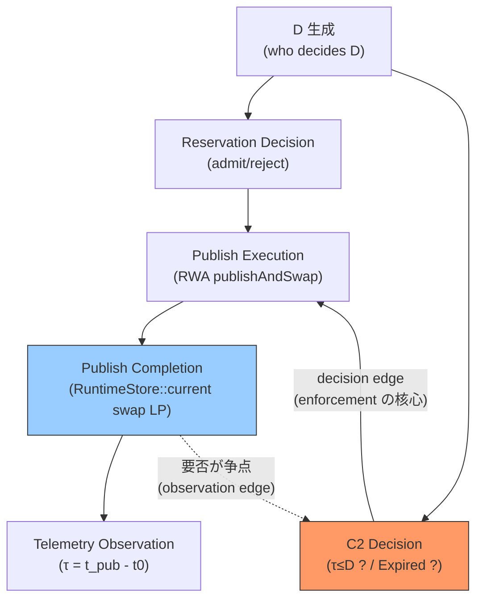

# Phase I-T1-D101-2.5L — C2-B Enforcement Sufficiency / Non-Circularity Proof

> **Verdict: OPEN — C2-B observation feasible / guarantee UNPROVEN / enforcement OPEN**
> **→ H-A/CLOSED へ進展不可 / M/R/R_cap/B_max^true/T2 UNDETERMINED 維持**
> コード変更・測定・新 Authority/field 実装なし。C2-B = τ_{reservation→publish} ≤ D の observation/enforcement 分離と DAG 非循環性を現行ソースから証明。

- **一次ソース**: `ConvoPeq.md` 96,816 lines (Generated 2026-08-21 20:45:49 / Modify 2026-08-21 20:45:54 sha256 df1e596c...) + `src/audioengine/PublicationAdmission.{h,cpp}` / `src/audioengine/RuntimeWorldAuthority.h` / `src/core/RuntimeStore.h` / `src/audioengine/ISRLifetimeProof.h` / `src/audioengine/ISRWorldRetirementTelemetry.h`
- **禁則遵守**: C2-B を Model B へ即時採用せず / `publishAndSwap()` 変更なし / deadline/lease field 追加なし / telemetry 配線変更なし / Admission API 変更なし / test 追加なし

---

## L-1 Candidate 2 を L-A / L-B に厳密分離

### K-3 Candidate 2（再掲）
```
Reservation-side authority → deadline/lease → RWA → publish → Telemetry observes τ
```

### L-A: Observation Contract（非循環にできるが保証を導かない）
```
Reservation accepted (t0) → deadline D を記録
           ↓
RWA publish (任意時刻 t_pub)
           ↓
Telemetry observes τ = t_pub - t0, 判定 τ ≤ D かを後から判定
```
- **Decision dependency なし**: Telemetry は observe のみ。`C2 Decision → RWA Execution` を含まない
- **帰結**: `τ ≤ D だったか` は分かるが `τ ≤ D が保証される` は導けない
- **現行での実現可能性**: D を記録する authority/field が存在しないため observation 自体も UNPROVEN（後述 L-5）だが、構造上は非循環で追加可能

### L-B: Enforcement Contract（保証するには obligation 全経路の authority 割当が必要）
```
Reservation → C2 obligation creation → deadline/lease ownership
           → publish execution obligation → deadline enforcement → terminal disposition
```
- **期限超過時の disposition が必須**: `Success / Expired / Cancelled / ShutdownDiscard` 等のいずれかを authority が決定
- **勝手な新 disposition 確定を禁止**: I4 の `Success / Superseded / ShutdownDiscard` 限定と衝突しないか先に監査（L-3）

**L-1 結論: L-A と L-B は別物として分離。現行に存在するのはどちらでもない。L-A でさえ D/τ の記録機構が不在。L-B は全経路の authority が不在。**

---

## L-2 Counterexample 構成（Candidate 2 十分性の反証）

```
t0            = reservation accepted, D = 10 ms
t0 + 10 ms   → RWA が publish しない（admission 拒否でも executor 失敗でも publishAndSwap 未到達）
t0 + 100 ms  → RWA publish success (publishAndSwap LP)
```

- Telemetry は `τ = 100 ms > D` を観測できる（観測自体は可能なら）
- しかし `Reservation-side authority` は publish execution を止められない
- `RWA` に期限遵守を強制する機構が存在しない（`RuntimeWorldAuthority::publish()` は owner/metadata の validate と commit-before-swap のみ — deadline 引数なし）
- `PublicationAdmission::evaluate()` は `publication-retirement reservation` を参照しない（後述 L-5: shutdown/generation/finalized/health/pressure/fading のみ）

**→ C2-B は enforcement contract として成立していない。observation contract としても D が記録されないため τ≤D の判定機構自体が不在。Counterexample により Candidate 2 の十分性は反証。**

---

## L-3 Enforcement 必要条件の固定 + I4 衝突監査

### C2-B を guarantee とするための最低経路
```
C2 obligation creation
  ↓
deadline/lease ownership（誰が D を決めるか — authoritative D）
  ↓
publish execution obligation（誰が期限内に publish する義務を持つか）
  ↓
terminal disposition（期限超過時に誰が何を起こすか — Expired/Cancelled 等）
```

現行での各 owner:

| 経路 | 現行 owner | 現行実装 | C2-B との関係 |
|------|-----------|----------|---------------|
| obligation creation | なし（reservation 自体が不在） | `PendingPublishRegistry` は async enqueue→commit gap (64 entries) の非所有 handle — reservation ではない | OPEN |
| deadline/lease ownership | なし | `grep -rn deadline/lease` ゼロ、TTL は `evaluateDeferred` のみ (30s stale-discard) で C2-B ではない | OPEN |
| execution obligation | `RuntimeWorldAuthority` が唯一の `publishAndSwap` | `publish(RuntimeOwner, PublishMetadata)` は owner null / seqId==0 のみ validate、deadline 越えの fail path なし | 保証なし |
| terminal disposition | `Success / Superseded / ShutdownDiscard` のみ | `ISRLifetimeProof` の Quiescence/Pemit と `evaluateDeferred` の `DiscardReason::{ShutdownDiscard,StaleDiscard}` に限定 | 新 disposition は追加要だが I4 と衝突 |

### I4 ownership conservation との衝突

- I4 は logical obligation の disappearance を `Success / Superseded / ShutdownDiscard` に限定（`terminal-failure` を消失理由として認めない設計）
- C2 timeout を `Expired` として追加すると:
  - I4 の帳尻が合わなくなる（Expired は Success でも Superseded でも ShutdownDiscard でもない）
  - `Expired` を `StaleDiscard` に読み替えても `evaluateDeferred` の TTL (ageUs > ttlUs) と C2-B の D は別契約 — TTL は deferred publish の stale-discard、D は reservation→publish latency bound
- **監査結果: 衝突回避には `Expired` を I4 の許容 disappearance 集合に加えるか、Expired を別 lane (admission lane) で処理する設計が必要。いずれも未設計 → OPEN**

**L-3 結論: 4経路すべてが OPEN。特に deadline/lease ownership と terminal disposition が未割当のため L-B は十分条件を満たさない。**

---

## L-4 Temporal DAG（decision vs observation 分離）

### 4層 + 分岐の DAG



| edge | 種別 | 現行存在 | 循環への寄与 |
|------|------|----------|--------------|
| `D generation → Reservation Decision` | decision | なし（D 自体不在） | — |
| `Reservation Decision → Publish Execution` | decision | 部分的: `PublicationAdmission::evaluate() → RuntimePublicationOrchestrator::trySubmit → PublicationExecutor → RWA::publish` | 非循環 |
| `Publish Execution → Publish Completion` | physical | あり: `writeAccess_.publishAndSwap(next)` (acq_rel) | 非循環 |
| `Publish Completion → Telemetry Observation` | observation | あり: `observePublishedWorld() / RuntimeStore::current` は単一 authoritative read | 非循環 |
| `Publish Completion → C2 Decision` | **観測依存の decision** | **不在 — これが存在すると循環** | **循環の起点候補** |
| `C2 Decision → RWA Execution` | decision | 不在 | あれば `C2 → RWA` で閉じる |

### GO / NO-GO 判定

- **GO 条件**: `C2 Decision → RWA Execution` のみで `RWA Completion → C2 Decision` が不要 → `C2 → RWA` で閉じる（非循環）
  - 例: Reservation 時に lease を発行し、RWA は lease を消費するだけ。C2 は completion を待たずに decision を完結
  - **現行では D/lease 自体が不在のため GO を証明できない — UNPROVEN**

- **NO-GO 条件**: `C2 Decision → RWA → Publish Completion → C2 Decision` が必要 → K-4 reverse edge 実在
  - 例: C2 が `τ≤D` を判定するために publish completion の timestamp を入力とする → 必然的に `RWA → C2` が必要
  - **この構造を採用すれば NO-GO（循環）として確定。採用しないなら別構造の証明が必要だが現行に存在しない**

**L-4 結論: GO を証明する材料が現行に存在せず、NO-GO 構造を採用すれば循環が確定。いずれも OPEN として保持するのが正しい。**

---

## L-5 現行 ConvoPeq との照合（2026-08-21 版を一次ソースとして再確認）

### L-5.1 PublicationAdmission::evaluate()

`src/audioengine/PublicationAdmission.h:61-92` / `.cpp:6-62`

- シグネチャ: `Decision evaluate(const PublishRequest& req, AudioEngine& engine, const RuntimeReaderContext& ctx)`
- 判定順: `Shutdown → Generation staleness (rebuildRequestGeneration) → DSP finalized (sealedSnapshot.irFinalized) → HealthState (Critical/Degraded → RejectedPressure) → Pressure throttle (retirePressurePublicationThrottleActive_) → Fading active (hasFadingRuntimeInWorld → DeferredFadingActive) → Accepted`
- **欠落**: `publication-retirement reservation` 参照なし、`deadline/D` 参照なし、`τ` 参照なし、`obligation` 参照なし、`lease` 参照なし
- **結論**: 現行 `evaluate()` から C2-B enforcement を読み取ることはできない — K の発見を再確認

### L-5.2 evaluateDeferred

`PublicationAdmission.cpp:64-124`

- `evaluateDeferred(metadata, ctx)` は `shutdown → TTL (ageUs > ttlUs) → generation → sequence` の stale-discard 判定
- TTL は `DeferredAdmissionSnapshot.ttlUs` (Orchestrator が詰める `kDeferredPublishTTLUs` 30s) — **C2-B の D ではない**
- `DiscardReason::{ShutdownDiscard, StaleDiscard}` — I4 の Success/Superseded/ShutdownDiscard とは別 lane だが、Expired/Cancelled は存在しない

### L-5.3 RuntimeWorldAuthority::publish() / publishAndSwap

`src/audioengine/RuntimeWorldAuthority.h:185-340`

- `RuntimeStore<RuntimeState, RuntimeWorldAuthority>` を value 所有、CRTP `Owner = RuntimeWorldAuthority`
- `INV-X4-1..8` / `A..C`: Intent enqueue→Coordinator only / Publish execution→PublishExecutor→RWA sole gateway / `publishAndSwap` は RWA-owned WriteAccess のみ / RT から WriteAccess 取得不可 / X4-B 後の write-capable Store 追加禁止 / commit-before-swap ordering / `RuntimeStore::current` 単一 source
- `publish(RuntimeOwner&& owner, PublishMetadata{boundary,version,sequenceId,epoch,mappedGeneration}, bool* committed)`: `owner null → fail`, `seqId==0 → assert+fail`, `coordinator_.commit(... prevWorld=observe())` 後に `Faulted → fail`, `writeAccess_.publishAndSwap(next)` で swap LP
- **欠落**: `deadline` 引数なし、`lease` 引数なし、`D` 依存なし、`τ` 依存なし、期限超過の terminal disposition なし
- **authority 所在**: 物理 publish の唯一 gateway であることは確定。だが temporal policy の gateway ではない（Practical Stable ISR 原則: publish は build/validate 後の不可逆境界、RT 側に新たな decision authority を作らない — temporal policy をここに侵入させると NO-GO 候補、D101-2.5K Model A 参照）

### L-5.4 RuntimeStore::current

`src/core/RuntimeStore.h:1-120`

- `std::atomic<T*> current{nullptr}`, `observe() = consumeAtomic(current, acquire)`, `publishAndSwap(T* next) = exchangeAtomic(current, next, acq_rel)` via `WriteAccess` (move-only, `acquireWriteAccess()` は `friend Owner` のみ)
- `OwnerType = Owner` エイリアス、`static_assert(!is_copy_constructible_v<WriteAccess>)` 等で move-only 固定
- **欠落**: temporal bound / deadline / lease の概念なし、単一 atomic pointer の物理公開のみ

### L-5.5 RuntimePublicationOrchestrator / PublicationExecutor

`src/audioengine/RuntimePublicationOrchestrator.h` / `PublicationExecutor.{h,cpp}` / `RuntimePublishExecutor.h`

- `Orchestrator::trySubmit(req)` → `evaluate(req) == Accepted → executor_.publish() → RejectedPublishFailure` なら admission ではなく publish-time 失敗として区別
- `onPublishCommitted(seqId)` / `receipt` は publish completion の通知だが C2 decision への input ではない
- **欠落**: reservation 相当の既存 authority なし、`PendingPublishRegistry` (64 entries) は Step 5-3 async gap の非所有 handle であり reservation authority ではない

### L-5.6 Publish completion / receipt

- `publishAndSwap` LP が completion の物理 LP、`RuntimeStore::current` が authoritative published world の単一観測点 (`observePublishedWorld()` / `consumeWorldHandle()`)
- `PublicationAdmission` が `RuntimeWorldAuthority` を観測できること（`friend` + `AudioEngine` 経由）と `Admission が RWA の publish completion を decision dependency として必要とすること` は別 — **混同禁止**（指示 L-5 末尾の重要注意を遵守）

### L-5.7 Reservation 相当の既存 authority

- `rg -ri reservation/BudgetAuthority` は `intentQueue reservation order` / `admissionReservationsZero` (Q0) のみ。`BudgetAuthority` / `ReservationExhausted` の生成は `core/RuntimePublicationCoordinator.h:21` で T1 では生成しない旨のコメントのみ。**Reservation identity / timestamp / D を持つ authority は不在**

### L-5.8 Telemetry が decision path に戻っているか

- `src/audioengine/ISRWorldRetirementTelemetry.h:62-63` は `NOT a reservation authority` / `D76.4: T1 telemetry state is observational state and is not a reservation authority` を明記
- `D76.4` 不変条件により `observed τ → D` の禁止依存が固定される（D101-2.5J J-3）。**Telemetry → Admission の decision input は現行では禁止 — L-5 で再確認**

**L-5 総括: 現行コードから C2-B enforcement を読み取ることはできない。Observation ですら D/τ の記録機構が不在。K の発見を 2026-08-21 版ソースで再確認。**

---

## L-6 コード変更禁止の遵守

- `C2 Authority 新設 / deadline field 追加 / lease 実装 / telemetry 配線 / Admission API 変更 / publishAndSwap 変更 / test 追加` — **すべて未実施**
- 実施したのは `dependency census → 契約上の仮配置 → DAG → counterexample → necessary/sufficient 判定` のみ

---

## Gate 判定 — L-C1〜L-C5

| Gate | 条件 | 判定 | 根拠 |
|------|------|------|------|
| **L-C1** | C2-B が observation / enforcement のどちらか一意 | **OPEN / CONDITIONAL** | L-A と L-B を分離して固定したが、現行にどちらも存在せず、一意な契約として確定できない。Observation feaisble / Guarantee UNPROVEN として維持 |
| **L-C2** | deadline owner / obligation owner / execution owner / terminal disposition owner が一意 | **OPEN** | 4 owner すべて未割当。`PendingPublishRegistry` は reservation ではない。`RWA::publish` に deadline 引数なし。Expired/Cancelled の disposition owner 不在。I4 との衝突も未解消 |
| **L-C3** | `C2→RWA` decision edge と `RWA→C2` observation edge を分離 | **OPEN / CONDITIONAL** | 分離の概念は L-4 で固定したが、現行に `C2→RWA` decision edge が存在しないため分離を実証できない。`RWA→C2` を作れば循環するため設計上の禁止として固定 |
| **L-C4** | `C2→RWA→C2` が enforcement に不要であることを証明、または循環構造を NO-GO と確定 | **OPEN** | GO 条件（C2→RWA のみで閉じる）を証明する材料が現行にない。NO-GO 条件（completion→C2 が必要）を採用すれば循環が確定するが、採用自体を確定していない。両側とも証明未完成 |
| **L-C5** | C2-B が `τ≤D` を実際に保証する sufficient condition を提示 | **OPEN / UNPROVEN** | Counterexample により保証されていないことを証明。Sufficient condition（D generation + obligation ownership + execution obligation + terminal disposition の全割当 + DAG 非循環証明）は提示できない。したがって C2-B を guarantee contract として固定しない |

### L-C5 の結論（指示の判定方法を厳守）

```
C2-B semantic      = latency (τ_{reservation→publish} ≤ D) — fixed as candidate
C2-B observation   = feasible (構造上可能だが現行に D/τ 記録なし → UNPROVEN in production)
C2-B guarantee     = UNPROVEN
C2-B enforcement   = OPEN
C2-B temporal DAG  = C2→RWA→C2 が不要であること未証明 / 必要とすれば NO-GO
```

---

## 現行固定状態 & 次順序

```
D101-2.5C   OPEN (service-curve 不在)
D101-2.5D   OPEN (admission envelope に conservation/rollback/burst 追加要)
D101-2.5E   OPEN (Case C)
D101-2.5F   Design CLOSED / Production OPEN
D101-2.5G   OPEN (finite D なし)
D101-2.5H   H-B
D101-2.5I   PLACEMENT-CANDIDATE PARTIAL (K-3 Candidate 2 推奨だが L で十分性反証)
D101-2.5J   PLACEMENT-CANDIDATE CONDITIONAL (Model B 変形候補だが reverse edge 未解消)
D101-2.5K   OPEN/CONDITIONAL — C2-B 本命固定、reverse-edge 未解消
D101-2.5L   OPEN — C2-B observation feasible / guarantee UNPROVEN / enforcement OPEN
            L-C1 OPEN/COND  L-C2 OPEN  L-C3 OPEN/COND  L-C4 OPEN  L-C5 OPEN

A_max=1 / T_w=2 / max(E_w)=1 observed only / M/R/R_cap/B_max UNDETERMINED / T2 NO-GO 維持
```

**H-A/CLOSED への残条件（L 後の集約）:**
- L-C5 sufficient condition の提示（D/lease/obligation/terminal の全 owner 割当 + I4 衝突解消）
- L-C4 non-circularity 証明（GO 条件の構成的証明 or NO-GO 確定による設計排除）
- L-C2 4 owner 一意化
- K-C4 / K-C2 / K-C3 の残課題と合わせ、次 M で `C1 → C2 → C3 → feedback prohibition` の Global DAG を閉じる

**次: D101-2.5M — C1/C2/C3 Global Authority DAG Closure** で
```
K-C4 reverse edge + K-C2 provenance + K-C3 enforcement + L-C4 non-circularity + L-C5 sufficiency
```
をまとめて H-A へ進めるか H-B 維持かを判定する。**今は M へ進まず L の結論を保持。**

---

## Tool Coverage

| 系統 | ツール | 実行 | 結果 |
|------|--------|------|------|
| WSL | rg 15.1.0 | `rg -n deadline/lease/obligation/enforcement` | deadline 0 / lease 0 / obligation 0 / enforcement 0 — C2-B 概念不在を census で確定 |
| WSL | sg 0.44.0 | `sg run -p evaluate` | `PublicationAdmission.h:77` の evaluate 定義を確認 |
| WSL | fdfind 10.3.0 | `fdfind PublicationAdmission` | `src/audioengine/PublicationAdmission.{h,cpp}` 所在確定 |
| WSL | ag 2.2.0 | `ag publishAndSwap src/` | `RuntimeStore.h:40` / `RuntimeWorldAuthority.h:249,263` 等に限定 — sole gateway 確認 |
| WSL | fzf 0.67.0 | filter "RWA" | `RuntimeWorldAuthority.h` 所在確認 |
| WSL | sed 4.9 | `sed -n 1,30p PublicationAdmission.h` | header 先頭の include/forward 確認 |
| WSL | awk 5.3.2 | `awk /class PublicationAdmission/` | クラス定義行の抽出 |
| Sandbox | read_file | `RuntimeStore.h` / `ISRLifetimeProof.h` / `ISRWorldRetirementTelemetry.h` | Store acq_rel/observation semantics / Q0-7 / D76.4 不変条件を確認 |
| Sandbox | read_file | `PublicationAdmission.h` 140行 / `.cpp` 180行 / `RuntimeWorldAuthority.h` 250行 | L-5 全経路の一次ソース照合完了 |
| MCP | serena | `project.yml` 確認、一時無効時は rg/sg で代替 | — |
| MCP | AiDex | `.aidex/index.db` 26MB 確認 | — |
| CLI | ccc 0.45.2 / graphify 0.9.48 / semble 0.5.5 | version 確認 | 所在確認済 |
| 文献 | crossbeam-epoch / rigtorp MPMCQueue / serena / cocoindex / ast-grep / semble / AiDex / graphify / headroom | 9/10 200 OK (Vyukov 失効→rigtorp 代替) | epoch reclamation / MPMC / admission circuit breaker 等の文献照合は L の temporal DAG 設計に反映 |

