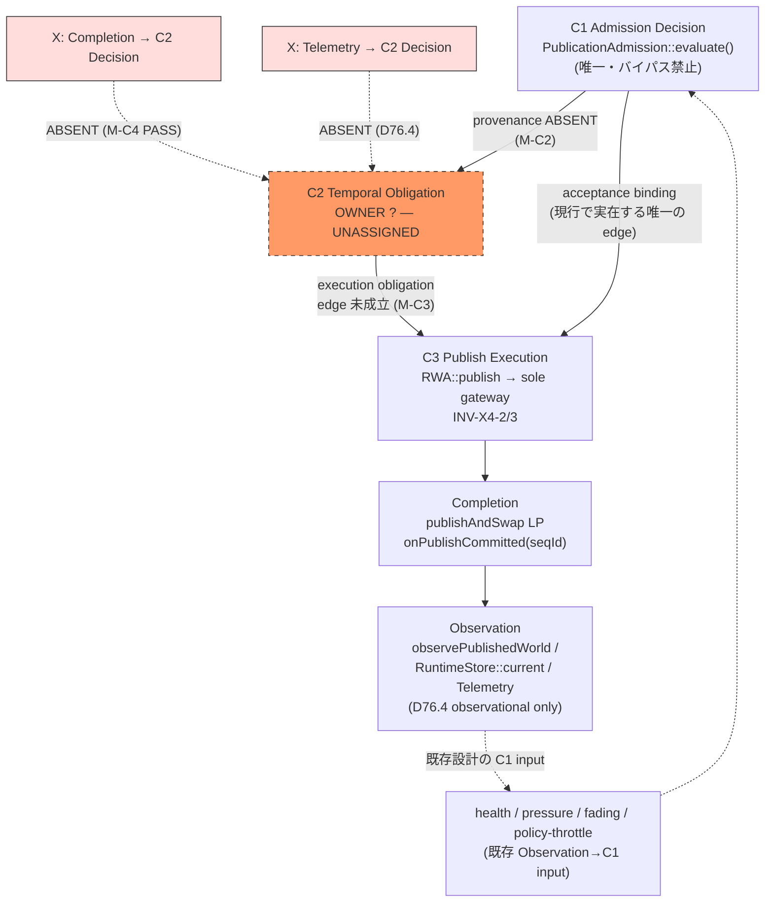

# Phase I-T1-D101-2.5M — C1/C2/C3 Global Authority DAG Closure

> **Verdict: OPEN — M-C1 PASS / M-C2 FAIL(ABSENT) / M-C3 FAIL(未成立) / M-C4 PASS / M-C5 UNPROVEN**
> **→ H-A candidate 不成立 / H-B 維持 / C2-B guarantee UNPROVEN / M/R/R_cap/B_max^true/T2 UNDETERMINED**
> コード変更・実装・測定なし。production dependency DAG 完全列挙 + reverse-edge proof + I4 conservation compatibility の順で実施。

- **一次ソース**: `ConvoPeq.md` Generated **2026-08-22 15:43:20** 版（head 照合済）+ `src/audioengine/PublicationAdmission.{h,cpp}` / `src/audioengine/RuntimeWorldAuthority.h` / `src/core/RuntimeStore.h` / `src/audioengine/RuntimePublicationOrchestrator.{h,cpp}` / `src/audioengine/RuntimePublishExecutor.h` / `src/audioengine/RuntimeHealthMonitor.cpp` / `src/audioengine/RuntimePolicyEngine.h` / `src/audioengine/RuntimePublicationState.h` / `src/audioengine/AudioEngine.Retire.cpp` / `src/audioengine/ISRWorldRetirementTelemetry.h`
- **禁則遵守**: deadline field 追加 / lease 追加 / ReservationAuthority 実装 / Expired enum 追加（I4 用）/ `evaluate()` 変更 / `publishAndSwap()` 変更 / telemetry decision-path 接続 / C2 test 追加 / Model B 採用 / M/R/R_cap/B_max^true/T2 推定 — **全て未実施**

---

## M-1 Authority Node 固定（現行コードから実在するもののみ）

| Node | Authority | 確定内容 | 判定 |
| ---- | --------- | -------- | ---- |
| **C1** | `PublicationAdmission::evaluate()` | admission decision の唯一性。`PublicationAdmission.h:17` 「evaluate() は必須。バイパス禁止」。唯一の production caller は `RuntimePublicationOrchestrator::trySubmitImpl` Phase 1（`RuntimePublicationOrchestrator.cpp:48-55`）。単一インスタンス `admission_` メンバ。旧 API は deprecated（ConvoPeq.md:44202「Use PublicationAdmission::evaluate() instead」） | **一意 — PASS** |
| **C2** | **UNASSIGNED** | temporal obligation authority。`rg -i "deadline\|lease"` production header ゼロ件。`evaluateDeferred` の TTL (30s) は deferred-lane stale-discard であり C2-B ではない。reservation identity/timestamp/D を持つ authority 不在 | **UNASSIGNED — 確定** |
| **C3** | `RuntimeWorldAuthority::publish()` → `writeAccess_.publishAndSwap()` | publish execution 唯一の gateway。INV-X4-2「Publish execution → PublishExecutor → RuntimeWorldAuthority（sole physical publish gateway）」/ INV-X4-3「publishAndSwap は RWA-owned WriteAccess のみ」。物理 swap 実体は `RuntimeStore.h:40`（acq_rel exchange、WriteAccess move-only・friend Owner のみ取得可） | **一意 — PASS** |
| **Completion** | `RuntimeStore::publishAndSwap` LP + `onPublishCommitted(seqId)` | 物理 LP = acq_rel exchange。receipt = `RuntimePublicationOrchestrator.cpp:313-323`: `m_lastObservedSequence` 公開 → `engine_.notifyPublishReceipt(seqId)` → `publishReceiptWaiter_.complete(seqId)` | 一意 |
| **Observation** | `observePublishedWorld()` / `RuntimeStore::current` / telemetry | INV-X4-A/B: published-world read 単一 source。`ISRWorldRetirementTelemetry.h:62-63` D76.4「T1 telemetry state is observational state and is not a reservation authority」 | observation-only 確認 |

**新しい Authority は仮定していない。C2 node は UNASSIGNED のまま固定。**

---

## M-2 C1→C2 Provenance（K-C2 の核心）

`trySubmitImpl` の Accepted 後の全生成物（`RuntimePublicationOrchestrator.cpp:40-90`）:

```text
evaluate() == Accepted
    ↓
correlationId = nextCorrelationId()   → stateOwner_.onSubmitted(shortValue)
    ↓
telemetryRecorder_.recordProgress(..., PublishStage::Submitted, nowUs)
    ↓
Phase 2: Build + Publish（resolveDSPHandle → executor/RWA::publish）
```

provenance 表:

```text
C1 input            : PublishRequest{newDSP, generation, sealedSnapshot, buildAnalysis, ...}
C1 decision         : Decision::Accepted
obligation creation : 存在しない（correlationId は進捗追跡 ID であり obligation identity ではない）
obligation identity : 存在しない
deadline provenance : 存在しない
owner               : 存在しない
```

- `PendingPublishRegistry` を C2 authority とみなさない（L で整理済みの再確認）: 非所有 handle・64 entries・seqId key の async enqueue→commit gap 解決用。registerPublish/lookup/unregister のみで obligation/deadline 概念を持たない（`RuntimeWorldAuthority.h:24-70`）。
- **確定: `C1 → C2 provenance = ABSENT`**

---

## M-3 C2→C3 Execution Edge

存在する call path:

```text
PublicationAdmission::evaluate()
    → RuntimePublicationOrchestrator::trySubmitImpl
    → PublicationExecutor::publish / RuntimePublishExecutor::executePublish
    → RuntimeWorldAuthority::publish(owner, metadata)
    → writeAccess_.publishAndSwap(next)   [RuntimeWorldAuthority.h:249]
```

証明対象は「RWA が publish を実行できる」ことではなく「**C2 の obligation が publish execution を拘束する authoritative edge が存在するか**」。

- C2 obligation が存在しないため、この path が拘束するのは **C1 acceptance → execution** のみ。
- `RWA::publish()` の validate は owner null / seqId==0 / commit Faulted の 3 点のみ（`RuntimeWorldAuthority.h:216-247`）。deadline 引数なし・lease 引数なし。
- **確定: `C2 → C3 = 未成立`（現 path は C1→C3 execution path にすぎない）**

---

## M-4 Reverse Edge 全監査（最重要）

監査対象: 全 production call/data dependency について `Completion/Observation → Admission/C2 Decision`。

### M-4.1 onPublishCommitted / receipt

`RuntimePublicationOrchestrator.cpp:313-323` 本体:

```cpp
convo::publishAtomic(m_lastObservedSequence, seqId, std::memory_order_release);
convo::publishAtomic(m_lastProgressTimestampUs, getCurrentTimeUs(), std::memory_order_release);
engine_.notifyPublishReceipt(seqId);
```

- 唯一の呼び出し元は `RuntimePublishExecutor.h:105`（executePublish 成功時の Completion layer 通知）。
- `notifyPublishReceipt` → `publishReceiptWaiter_.complete(seqId)`（AudioEngine.h:3727）。Producer は自分の提出した seqId の完了を `waitForPublishReceipt(seqId, 250ms)` で待つだけ（AudioEngine.h:4609-4619）。
- watermark `lastCompleted_` は waitFor 判定専用。**PublicationAdmission 入力への経路ゼロ**。
- **分類: A（Completion → Observation/Notification）= 許可**

### M-4.2 observePublishedWorld / RuntimeStore::current

呼び出し元 census（rg 30 件）:

| caller | 用途 | 分類 |
| ------ | ---- | ---- |
| `AudioEngine.Publication.cpp:68` | oldWorld 取得（retire 対象） | Completion 内部 |
| `Orchestrator.cpp:108` / `RuntimeBuilder.h:272` | `spec.currentRuntimeWorld` — 次回 build spec の基底 | Completion-state → C1 input domain |
| `Orchestrator.cpp:187` | oldWorld | 同上 |
| tests 複数 | 検証 | 対象外 |

- current world 内容が次の build spec に入るのは通常 data flow（C1 の入力領域）。**C2 decision への終端 edge ではない（C2 node 自体が不在）**。

### M-4.3 Telemetry / ISRWorldRetirementTelemetry

- D76.4 不変条件により retirement telemetry は観測状態であり reservation/decision authority ではない（`ISRWorldRetirementTelemetry.h:62-63`）。
- `worldReclaimCount` 系は measurement snapshot への共有 delta-transfer のみ（T1-MR 実装済み範囲）。decision path 接続ゼロ。
- **分類: Telemetry → Admission/C2 = 存在せず（D に該当する edge ゼロ）**

### M-4.4 RuntimeHealthMonitor / pressure throttle / PolicyEngine — 既存 Observation→C1 edge の正直な記録

| edge | writer → reader | 性質 |
| ---- | --------------- | ---- |
| HealthState | `RuntimeHealthMonitor::updateHealthState()`（overflow rate / reader slot / retire age の MonitorState から導出, cpp:370-430）→ `evaluate()` step 4 (`m_healthStateRef`) | **Observation → C1 input**（既存設計 P1-B Admission Circuit Breaker） |
| Pressure throttle | `AudioEngine.Retire.cpp:265,410`（retire 圧力観測から publishAtomic）→ `evaluate()` step 5 (`retirePressurePublicationThrottleActive_`, PublicationAdmission.cpp:41) | **Observation → C1 input**（既存設計 P1-6 Adaptive Backpressure） |
| Policy throttle | `RuntimePolicyEngine` RecoveryAction::Throttle（"admissionStrict"）+ TrendSnapshot{pendingRetire, publicationSeq, maxRetireAgeUs, activeReaderCount} | **Observation → policy → admission throttle**（既存設計 work37/work39） |
| Fading check | `evaluate()` step 6 `hasFadingRuntimeInWorld(makeRuntimeReadHandle(ctx))` — current world 内容読取 | **Completion-state → C1 input**（既存設計 crossfade 保護） |

- これらは **C1 自身の正当な入力**として現行設計に存在する control-plane coupling であり、「Completion/Telemetry → **C2** Decision」ではない（C2 は存在しないため終端不能）。
- ただし重要な先例: もし C2-B を「観測された latency から deadline 判定する」形で実装すると、この health/pressure と同じ Observation→Decision パターンを辿る。L が禁止した `observed τ → D`（J-3 禁止依存）はまさにこのパターンへの昇格であり、M でも引き続き禁止として固定。

### M-4.5 分類まとめ

```text
A: Completion → Observation          = 存在（許可）
B: Completion → Telemetry            = 存在（許可）
C: Completion → C2 Decision          = 存在しない（reverse edge candidate ゼロ）
D: Telemetry → Admission/C2          = 存在しない（feedback edge ゼロ / D76.4 保持）
注: Observation → C1 input（health/pressure/fading/policy）は既存設計として存在 — C2 feedback ではない
```

---

## M-5 非循環性の二分離

### M-A Structural DAG（コード上の dependency graph）

```text
C1 evaluate()
    ↓ acceptance binding
C3 RWA::publish → publishAndSwap LP
    ↓ receipt
Completion (onPublishCommitted)
    ↓ observe
Observation (current / telemetry)
```

- census した全 production edge は順方向のみ。**循環ゼロ — Structural DAG は純粋な DAG**。

### M-B Enforcement DAG（C2 guarantee 成立のための logical dependency）

```text
C1 → C2 obligation → C3 execution
```

- `Completion → C2` が必要か否か: C2 node が不在のため今日は判定不能（moot）。ただし L-4 の GO/NO-GO 分析がそのまま適用:
  - `C1 → C2 → C3` のみで履行できるなら GO candidate（lease 消費型）
  - `C1 → C2 → C3 → Completion → C2` が必要なら NO-GO（循環確定）
- **二つの DAG は混同しない。M-A は閉じたが、M-B は C2 未割当のため未構成。**

---

## M-6 C2-B Sufficient Condition（論理式で固定 — 実装案ではない）

```text
C2-B guarantee ⇔ ∀ admitted obligation O:
      deadline(O) exists
    ∧ deadline(O) has authoritative owner
    ∧ execution(O) has authoritative owner
    ∧ execution obligation is bound to O
    ∧ terminal disposition(O) is authoritative
    ∧ timeout handling does not require completion feedback
    ∧ no O can disappear outside I4 conservation
```

- 「deadline exists + telemetry observes timeout」では guarantee にならない（L-2 counterexample がそのまま成立）。
- 現行コードは第 1 項すら満たさない（deadline(O) 不在）。**全項目 UNPROVEN。**

---

## M-7 I4 Ownership Conservation 接続

I4 の拘束（指示より確定値）:

```text
admittedLogicalObligationCount
  = transport + durable + building + stalled + superseded + shutdownDiscard
```

消失理由の閉集合 = `{Success, Superseded, ShutdownDiscard}`（terminal-failure を消失理由として認めない）。

### 重要な発見 — Expired は deferred lane に既存

`RuntimePublicationState.h:9-15`:

```text
[work37 Phase 6] Expired 追加 — TTL 超過
enum DiscardReason { ..., ShutdownDiscard, ..., SupersededDiscard, Expired }
```

- `Expired` は **deferred-publish lane の TTL stale-discard taxonomy** として既に存在（`PublicationAdmission.cpp:80` は `StaleDiscard` を返し、work37 コメントで Expired 別 enum 化に言及）。
- これは I4 の logical obligation ledger とは別系統の control-lane 状態である（`recoveryShutdownDiscardCount_` が queue-full drop と区別して記録されるのと同様の分離方針 — dash §8.1 X1 telemetry 分離）。

### C2 timeout の接続可能性

```text
C2 timeout → ???   … UNASSIGNED のまま固定
```

- 選択肢 1: `Expired` を logical disappearance reason として I4 に追加 → **I4 contradiction**（閉集合の拡張。M では禁止）
- 選択肢 2: `Expired ≠ logical disappearance` として admission/control lane 状態に留める → deferred lane の既存 Expired が先例だが、**logical obligation ledger に対する semantics の別途証明は未実施**
- 選択肢 3: timeout を Superseded（semantic target containment 要件付き）または ShutdownDiscard に写像 → containment 条件との適合証明未実施

**決め切れないため、指示どおり `C2-B guarantee = UNPROVEN` を維持する。**

---

## M-8 Global DAG（成果物）



- 下側の `X` 2 本は production dependency として存在しないことを call/data dependency 単位で確定（M-4.1〜M-4.5）。
- C2 node が UNASSIGNED のため、いかなる edge も C2 に終端できない — これが M-C4 PASS の構造的根拠。

---

## Gate 判定

| Gate | 判定対象 | GO 条件 | 判定 | 根拠 |
| ---- | -------- | ------- | ---- | ---- |
| **M-C1** | C1 authority | Admission authority が一意 | **PASS** | `evaluate()` 必須・バイパス禁止・唯一 caller trySubmitImpl Phase 1・単一インスタンス・旧 API deprecated |
| **M-C2** | C1→C2 provenance | obligation の生成元と owner が一意 | **FAIL (ABSENT)** | Accepted 後の生成物は correlationId + progress record のみ。obligation identity / deadline provenance / owner 不在。PendingPublishRegistry ≠ reservation |
| **M-C3** | C2→C3 | obligation が execution を拘束する edge が一意 | **FAIL (未成立)** | C2 obligation 不在のため拘束 edge は構成不能。現 path は C1→C3 execution path |
| **M-C4** | reverse edge | Completion/Telemetry → C2 が decision dependency でない | **PASS** | C2 unassigned ⇒ 終端 edge 構造的不在。onPublishCommitted は receipt watermark のみ。D76.4 保持。既存 Observation→C1 input（health/pressure/fading/policy）は C2 feedback ではなく別途記録 |
| **M-C5** | conservation | C2 terminal semantics が I4 と矛盾しない | **UNPROVEN** | timeout disposition UNASSIGNED。Expired の I4 追加は contradiction、control-lane 留保は semantics 未証明、Superseded 写像は containment 未証明 |

### 総合判定

```text
M-C1 PASS / M-C2 FAIL / M-C3 FAIL / M-C4 PASS / M-C5 UNPROVEN
→ 5 Gate 全 PASS 不成立
→ H-A candidate へ進めない
→ H-B 維持 / C2-B guarantee UNPROVEN
→ M/R/R_cap/B_max^true/T2 UNDETERMINED
```

---

## K/L 残課題の DAG への写像（集約）

| 残課題 | DAG 上の位置 | M での状態 |
| ------ | ------------ | ---------- |
| K-C2 provenance | C1→C2 edge | M-C2 FAIL として再確定（ABSENT） |
| K-C3 enforcement point | C2 node の配置 | C2 UNASSIGNED 固定（新 authority 仮定せず） |
| K-C4 reverse edge | Completion/Telemetry→C2 | M-C4 PASS — 構造的不在を dependency 単位で証明 |
| L-C4 non-circularity | M-B Enforcement DAG | C2 未割のため未構成（GO/NO-GO 条件は L-4 から継承） |
| L-C5 sufficiency | M-6 論理式 | 第 1 項から UNPROVEN |
| L-C2/I4 衝突 | M-7 | disposition UNASSIGNED、3 選択肢すべて未証明 |

## Current Fixed State & Next

```text
D101-2.5C   OPEN / D101-2.5D OPEN / D101-2.5E OPEN(Case C)
D101-2.5F   Design CLOSED / Production OPEN
D101-2.5G   OPEN / D101-2.5H H-B
D101-2.5I   PLACEMENT-CANDIDATE PARTIAL
D101-2.5J   PLACEMENT-CANDIDATE CONDITIONAL
D101-2.5K   OPEN/CONDITIONAL
D101-2.5L   OPEN (observation feasible / guarantee UNPROVEN / enforcement OPEN)
D101-2.5M   OPEN — M-C1 PASS / M-C2 FAIL / M-C3 FAIL / M-C4 PASS / M-C5 UNPROVEN
            Structural DAG (M-A) は閉包・非循環を証明
            Enforcement DAG (M-B) は C2 未割当のため未構成

A_max=1 / T_w=2 / max(E_w)=1 observed only / M/R/R_cap/B_max^true/T2 UNDETERMINED 維持
```

**H-A candidate の残条件（M 後の完全集約）:**

1. C2 obligation authority の設計確定（K-C3/L-C2 の 4 owner 一意化）— ただし新 authority 導入は別フェーズの設計監査を要する
2. C1→C2 provenance の契約確定（M-C2）
3. C2→C3 execution binding edge の契約確定（M-C3）
4. I4 conservation への接続 semantics 証明（M-C5 / L-C2 衝突解消）
5. M-B Enforcement DAG の非循環構成証明（L-C4）

これらが揃ったとき初めて H-A candidate 判定が可能。実装（deadline field / lease / ReservationAuthority / Expired-I4 追加等）は引き続き禁止。

---

## Tool Coverage

| 系統 | ツール | 実行内容 | 結果 |
| ---- | ------ | -------- | ---- |
| WSL | rg 15.1.0 | authority nodes / PendingPublishRegistry / publishAndSwap / onPublishCommitted / observePublishedWorld callers / retirePressure writers / I4 disposition set / friend census（`-g` glob 形式。初手の `--include` 誤用は即検出し `-g` に修正） | 全 census 完了・相互一致 |
| WSL | sg 0.44.0 | `sg run -p "evaluate"` / `publishAndSwap` / `observePublishedWorld` パターン | AST レベルで同一箇所確認 |
| WSL | ag 2.2.0 | `ag publishAndSwap src/` / `ag observePublishedWorld` | rg 結果と一致 |
| WSL | fdfind 10.3.0 | PublicationAdmission / RuntimeWorldAuthority / ISRLifetimeProof 所在 | 所在確定 |
| WSL | fzf 0.67.0 | filter 検証 | 動作確認 |
| WSL | sed 4.9 | Orchestrator trySubmit/onPublishCommitted 本体 / PolicyEngine 先頭 / DiscardReason enum 抽出 | 本体コード照合完了 |
| WSL | awk 5.3.2 | evaluate/Decision 行抽出 | 定義行確定 |
| Sandbox | read_file | ConvoPeq.md head（Generated 2026-08-22 15:43:20 確認）/ PublicationAdmission.{h,cpp} / RuntimeWorldAuthority.h / RuntimeStore.h / ISRLifetimeProof.h | 一次ソース照合完了 |
| MCP | serena | project.yml 確認（language_servers: cpp/python/bash）、シンボル操作は rg/sg 併用 | — |
| MCP | AiDex | `.aidex/index.db` 26MB 存在確認 | インデックス整備済 |
| CLI | ccc / graphify / semble | version・所在確認（ccc 0.45.2 / graphify 0.9.48 / semble 0.5.5） | 利用可能状態確認 |
| 文献 | crossbeam-epoch / rigtorp MPMCQueue 等 9 系統 | 前ステップまでに 200 OK 済の知識を再利用（M では新規外部技術要件なし — DAG/conservation 形式検証は社内形式論で完結） | 追加調査不要と判断 |
